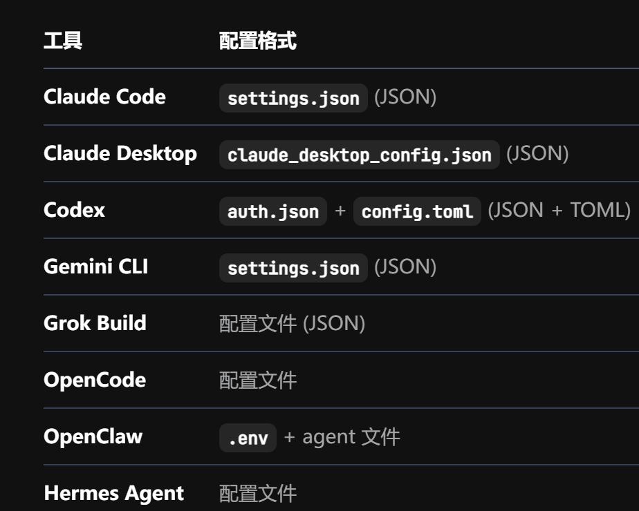
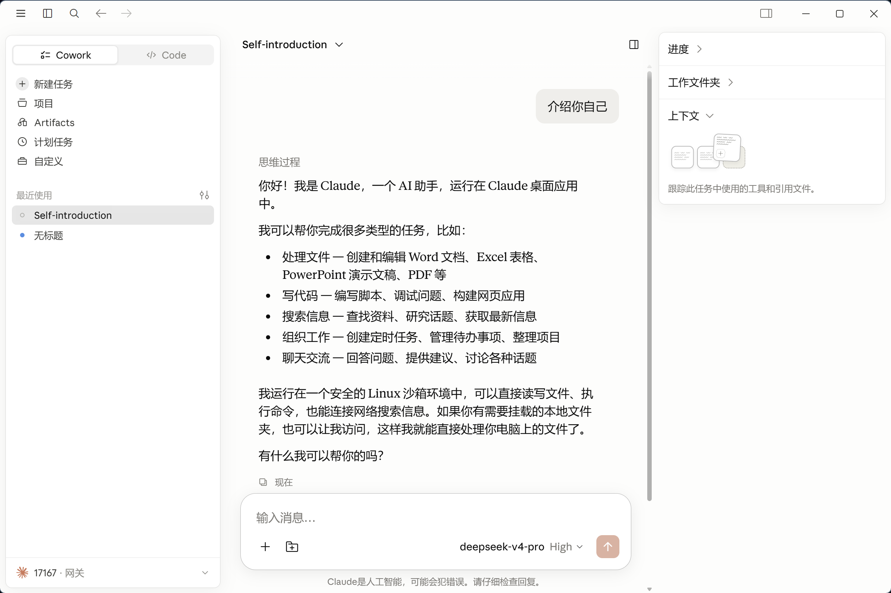
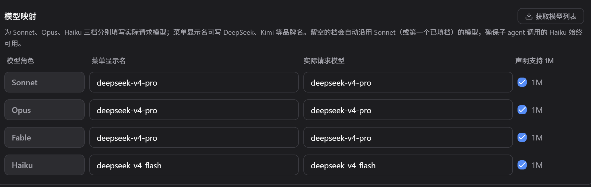
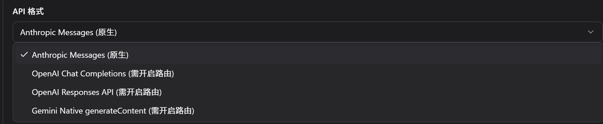

# CC Switch 配置与路由

## CC Switch 是什么
### 定位
CC-switch 是面向多款 ai agent 编程工具的跨平台配置管理与路由工具，提供了统一的可视化管理界面，用于配置和管理 API 提供商、skill、mcp 等

它可以统一管理 Claude Code、Claude Desktop、Codex、Gemini CLI、 OpenCode、OpenClaw、Hermes 等工具中的：

+ API 提供商
+ 模型与接口地址
+ MCP Server、Prompts、Skills
+ 会话记录
+ 用量统计

### 解决的问题
不同 AI 编程工具使用不同格式、不同位置的配置文件；当用户需要切换 API 提供商、添加 MCP 或安装 Skill 时， 往往需要分别修改不同的 `JSON`、`TOML`、`.env`等文件，CC Switch 则将这些繁琐的配置操作集中到一个可视化界面中完成

### 主要功能
+ API 提供商管理与切换
+ 本地代理（让请求经 ccswitch 路由至 API 提供商）与故障转移（自动切换备用线路）
+ MCP、提示词、skill 管理
+ 用量与成本详情追踪
+ 会话记录与工作区（工作区特指 openclaw）管理
+ 云同步（设备切换数据同步）

## CC-switch 的基本工作原理
> 从 API 请求是否实际经过 CC Switch 来看，其工作方式可以概括为配置切换和本地代理两种
>

### 配置切换方式：
> 在本模式下，ccs 只负责帮助用户修改配置，请求不经 ccs
>

这是 ccs 最基础的工作方式

ccs 会将用户添加的 API 提供商、模型、接口地址、API key 等信息存储在其 SQLite 数据库`~/.cc-switch/cc-switch.db`中；当用户在界面中选择时，ccs 会读取相关配置并写入指定 AI 编程工具实际使用的配置文件，用户启动 AI 编程工具可以完成配置，直接请求 API 提供商

这种方式简单快捷，且不需要 ccs 一直启动

### 本地代理方式
> 在本模式下，ccs 会作为中转站，实际接收并转发路由 API 请求
>

开启本地代理并接管 AI 编程工具后，AI 编程工具不再直接连接供应商，而是始终连接 CCS，由 CCS 自动管理每次请求

适用于使用多个 API 供应商，本地代理方式可以实现故障转移与详情的请求统计日志

工作原理：开启并配置后，CCS 会把 AI 编程工具的的 API 请求地址修改为本地路由地址（默认为`127.0.0.1:15721`），CCS 会在本机启动一个 HTTP 服务，默认监听这个地址；AI 编程工具将请求发送给 CCS，CCS 再将请求转发给 API 提供商；提供商返回结果给 CCS，CCS 再把结果返回给 AI 编程工具

## 使用实践：通过 CC Switch 将 DeepSeek 接入 Claude Desktop

本次实践需要启动 CC Switch 本地路由，由 CC Switch 完成：

1. Claude 模型角色与 DeepSeek 模型的映射

2. Claude Desktop 请求与 DeepSeek API 之间的格式适配

3. API 请求转发和响应返回

<!-- learning-journey:update-history:start -->
## 更新记录

| 日期 | 类型 | 说明 |
| --- | --- | --- |
| 2026-07-28 | 首次发布 | 从语雀整理并发布到学习记录仓库 |
<!-- learning-journey:update-history:end -->
