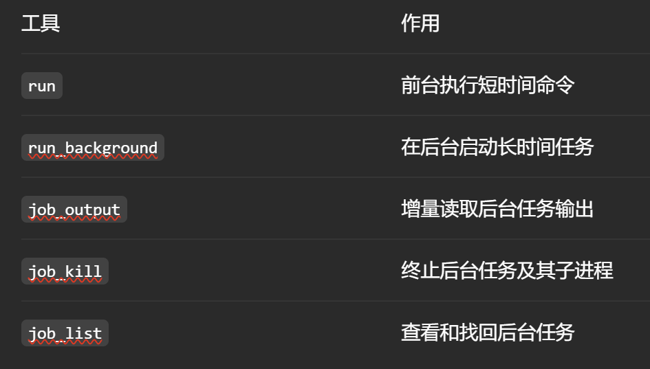

# FastCtx 工具与 Codex 上下文效率

> GitHub 仓库：[https://github.com/yc-duan/fastctx/blob/main/README.zh-CN.md](https://github.com/yc-duan/fastctx/blob/main/README.zh-CN.md)
>
> Linux 帖子：[https://linux.do/t/topic/2612425](https://linux.do/t/topic/2612425)
>

# 背景（问题痛点）
Codex 在本地电脑上执行任务的时候，需要调用终端工具，生成 PowerShell、Bash 等终端命令执行任务中的某些很小的操作，比如读写文件、查找文件等

因此 Codex 不仅要思考如何实现任务，还需要思考终端命令、路径转义、不同终端工具的差异等等，**也就是说，模型的一部分注意力分散在了怎么使用电脑工具（终端命令拼写）上**。尤其是在 Windows 上，Codex 与终端的互搏成为了 Windows 用户不得不体验的一环。

FastCtx 解决的就是这个问题。它通过 MCP 的方式为 Codex 添加五类模型可直接使用的原生工具，显著提高模型完成任务的速度和准确性。对于 Windows 用户，这意味着可以不再频繁处理 PowerShell 命令细节。


# Codex 本身与电脑的交互方式
Codex 原生终端工具通常属于通用工具

模型需要使用电脑工具时，会调用类似`shell(command)`，然后自己生成一整条终端命令交给电脑终端去执行

这种方式的优点是能力非常广泛，Codex 借助这种方式可以完成终端能完成的全部操作。

但因此，模型需要判断系统类型、终端类型、再根据细节生成对应命令，再根据不稳定的工具输出结果判断下一步操作，因此大量的注意力会放在命令拼写上，而不是任务本身

# FastCtx 是什么
> Fast Context——本质上是一个为 AI Agent 提供快速、上下文高效的工具
>

FastCtx 是一个运行在本地电脑上的 MCP Server，它通过 MCP 向 Codex 提供五大结构化的终端工具：

- **`read`**：读取文件能力
- **`glob`**：查找文件能力
- **`grep`**：搜索文件内容能力
- **`replace`**：批量文本替换能力
+ **Bash 终端工具执行能力**（Windows 上使用 Git Bash，Linux 与 MacOS 使用系统 Bash）：



工具操作由常驻进程完成，输入参数和返回结果都有稳定结构。模型可以用更少的步骤取得所需上下文，并把精力留给代码理解、修改决策和结果验证

# FastCtx 工具配置原理：
+ 将 FastCtx MCP 安装进 Codex
+ 写入 Codex 用户配置文件`config.toml`：

```toml
[features.code_mode]
direct_only_tool_namespaces = ["mcp__fastctx"]
```

这段代码的配置可以让 FastCtx 保持顶部直达，其`apply`功能会自动维护

+ 将引导段写入全局 `AGENTS.md` 文件，让模型优先选择 FastCtx 工具

# FastCtx 与 Codex 的交互过程：
Codex 作为 MCP 客户端，FastCtx 作为 MCP 服务器，交互过程如下：

1. 需要工具调用时，由于系统配置 Codex 会选择并询问 FastCtx 工具
2. FastCtx 向 Codex 暴露工具定义

例如，一个简化的`read`工具可以表示为：

```bash
{
  "name": "read",
  "description": "读取本地文件内容",
  "parameters": {
    "file_path": "文件路径",
    "encoding": "文件编码",
    "offset": "起始行",
    "limit": "读取行数"
  }
}
```

3. 于是模型需要读取文件时，不需要再生成 Powershell，而可以直接调用：

```bash
{
  "file_path": "D:/project/docs/legacy.txt",
  "encoding": "gbk",
  "offset": 120,
  "limit": 40
}
```

将这些参数发送给 FastCtx 服务器

4. FastCtx 服务器负责根据参数完成具体的工具操作，然后将结构化结果返回给 Codex 客户端：

```bash
文件文本
(Partial: lines 120-159 of 512 shown. Continue with offset=160.)
```

# FastCtx 特性：
## TUI 控制终端：
FastCtx 通过 TUI 进行安装、配置、更新、查看运行

## 工具输出档位设置：
+ 输出档位：`config.toml`中用于控制全局工具单次输出的最高长度

FastCtx 默认使用 8500 token 的内部输出预算，约为 Codex 默认工具输出上限的 85%。控制终端提供三个档位：

+ `Standard`：默认档
+ `High`：提高 Codex 全局工具输出上限
+ `Extra High`：提供最大的单次工具输出空间

输出档位越高，单次结果越大，上下文消耗也越快。需要按任务实际需要调整

## bash 终端启用：
属于可选的拓展工具，开启后 Codex 执行终端命令时会优先使用 FastCtx 提供的`run`等终端工具，而不是 Codex 自带的终端工具调用。

可以通过 Git Bash 使用更接近 Linux 的 Bash 命令（Windows 强烈建议开启）。

## FastCtx V.S. Codex 调用终端：
### read：读取文件
```bash
{
  "file_path": "V:/repo/docs/legacy.txt",
  "encoding": "gbk",
  "offset": 120,
  "limit": 40
}
```

```bash
$offset = 120
$limit = 40
$line = $offset

$bytes = [IO.File]::ReadAllBytes('V:\repo\docs\legacy.txt')
$text = [Text.Encoding]::GetEncoding(936).GetString($bytes)

$text -split "\r?\n" |
  Select-Object -Skip ($offset - 1) -First $limit |
  ForEach-Object { "{0}`t{1}" -f $line++, $_ }
```

### grep：搜索文件内容
```bash
{
  "pattern": "^TODO$",
  "path": "V:/repo",
  "output_mode": "content",
  "context": 1
}
```

```bash
Get-ChildItem -LiteralPath 'V:\repo' -Recurse -File -Force |
  Where-Object { $_.FullName -notmatch '[\\/]\.git[\\/]' } |
  Select-String -Pattern '^TODO$' -Context 1,1
```

<!-- learning-journey:update-history:start -->
## 更新记录

| 日期 | 类型 | 说明 |
| --- | --- | --- |
| 2026-07-23 | 首次发布 | 从语雀整理 FastCtx 工具原理、配置方式与 Codex 工具调用对比并发布 |
<!-- learning-journey:update-history:end -->
