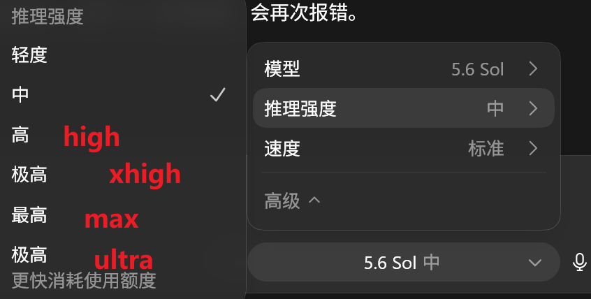
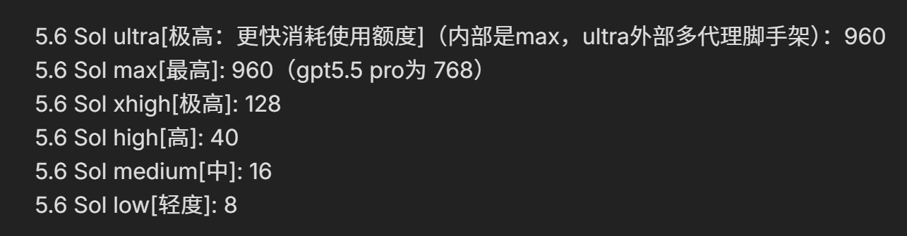
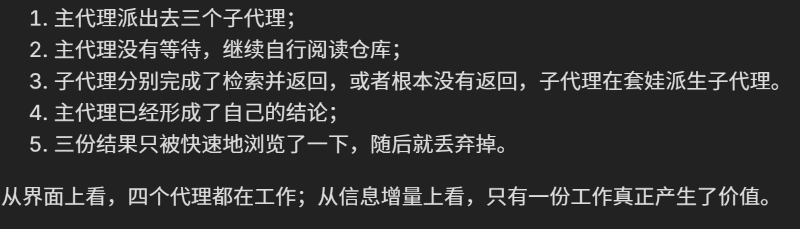

# Subagents 与上下文管理实践

> 原帖：[https://linux.do/t/topic/2578075](https://linux.do/t/topic/2578075)
>

# 问题背景：上下文腐烂（Context rot）
<u>随着会话的不断增长，大量低价值信息（无保留价值的中间工作，比如搜索结果、失败路径、读写日志等）会留存在上下文中，分散大模型的注意力，而重要的信息也没有消失，而是与这些低价值信息竞争注意力</u>，这被称为**“上下文腐烂”**

+ subagents 的核心作用：把无用的污染隔离在一个用完即弃的上下文里，只让蒸馏后的结论回流主上下文；主 agent 不应该亲自执行并保留全部的探索过程，而应该把大量可独立完成的外围任务交给子代理

# 关键概念理解
## Ultra 模式


### ultra 的特点：
+ 最大推理强度，并自动进行任务委派
+ 其他思考强度只有在用户明确使用 subagents 时才会进行委派

### ultra 的实现原理：
+ 不同思考强度的 juice 值设置不同（juice 值为内部参数，用于控制模型的最大思考长度，值越大思考越久）



+ 因此 ultra 模型其实只是 max 模型+可以主动拆分任务、自行委派智能体的提示词：

> 多代理模式已启用。主代理可以主动派生子代理，不必等用户明确要求。但只应在任务可以拆成独立工作流，并且并行处理能明显提升速度或质量时使用。主代理最终负责综合和验证结果
>

+ claude code 中的 ultracode 的实现是两条系统提示词：

> 用户输入了 ultracode 关键词，本轮选择加入多代理编排——请用 Workflow 工具完成
>
> Ultracode is on：优化到最详尽、最正确的答案，而不是最快最省；每个实质性任务都用 Workflow 工具；token 成本不是约束
>

### 为什么 ultra 很慢且废额度
据上面所知，ultra 本身只是一个编排放大器，如果配置不当（默认或更差）的时候，每一个子代理都继承了 Sol，甚至 Ultra 思考强度去套娃委派更多的子子代理，一个任务同时运行多个重量级 Sol，因此会拖慢任务和需求的实现

## MultiAgent V1 与 V2
Codex 的多子代理机制存在 V1 与 V2 两种协议，在`config.toml`中：

+ V1：`[agents]`
+ V2：`[features.multi_agent_v2]`

Codex 目前为不同模型分别指定了多代理协议的版本（260723 仍然是）：

GPT-5.6 Sol → “v2”
GPT-5.6 Terra → “v2”
GPT-5.6 Luna → “v1”

具体的 V1 与 V2 差异及关系将在本系列第三篇中继续整理。

# 本实践配置原理：
## 文件配置结构：
整套配置最终落在下面这三个文件上：

+ `~/.codex/AGENTS.md` 规定主代理何时派发、如何派发、如何验证
+ `~/.codex/config.toml` 规定并发的数量、协议形态以及等待边界
+ `~/.codex/agents/default.toml` 规定子代理选用什么模型、以什么身份来工作

## 具体配置：
具体提示词：

```bash
帮我先备份 codex 相关配置文件，再完成下面的相关配置修改：

~/.codex/config.toml 增加/修改下面的参数：

[features.multi_agent_v2]
# 为未在模型目录中明确指定协议的模型启用 V2 回退
enabled = true

# 本文实践不定义多子代理类别，模型无需传类型参。codex默认值为true
# 这个配置的作用是隐藏主代理可填写的agent_type、service_tier、model、reasoning_effort
hide_spawn_agent_metadata = true

# 避开 GPT-5.6 保留的 collaboration 命名空间。这是codex官方命名冲突问题
tool_namespace = "agents"

# 活跃进程，包含一个对话的主代理和子代理。设置为7即同时允许6个子代理并行
max_concurrent_threads_per_session = 7

# wait_agent 可请求的最短等待。codex默认值为10000
min_wait_timeout_ms = 10000

# codex默认值为30000
default_wait_timeout_ms = 30000

# codex默认值为3600000
max_wait_timeout_ms = 120000

* 特别注意：以下为multi_agent_v1设置，如果存在，可以全部移除，在我们的配置里它的全部功能被v2所取代（整个[agents]块和里面的内容要移除，尤其是agents.max_threads不能和V2共存）
  [agents]
  max_threads = 6
  max_depth = 1
  interrupt_message = true

`~/.codex/AGENTS.md`（用户级系统提示词）新增：
## 子代理使用

子代理在我们的工作里用于探索，他是你的探子。
把子代理当成你手边最顺手的、用于「宽而重」读取的工具。工作的任何时候，只要你觉得需要就可以派。只有在它能减少主线程上下文污染、提高并行度或者提供独立核验的时候才使用。
必须遵守：你需要更激进和更频繁地调用子代理，在任何需要的情况下，而不仅仅只是在对话的开头。我们需要更频繁的子代理调用来避免上下文腐烂，你承担子代理编排者的角色。

### 何时直接处理

直接读取以及处理以下内容，不派子代理：

* 已知位置的小文件、少量代码或者单一事实；
* 即将修改的具体代码；
* 派发、等待以及复核的成本不低于自己读取的任务。
* 奠基性文档，无论多长都自己读：架构文档、设计文档、交接备忘录（在别的工作流里可能是别的名字）等用来让你建立全局视角、充当后续判断地基的文件——它们的价值全在细节与脉络，一经子代理转译即失真，长度不构成外包的理由。

### 何时适合派发

适合交给子代理的：

* 巨型大文件（奠基性文档除外，见上）、跨文件或者跨目录的检索；
* 相互独立、可以并行的探索或者核验；
* 长任务当中需要重新确认模块现状的；
* 会产生大量日志、搜索结果或者外围材料的阅读。

多个独立的任务应当并发派发。

### 委派与验证

给子代理的任务必须是自包含的，说明检索范围、具体问题以及期望的输出。精度重要的时候，要求返回 `file:line`、符号名以及必要的关键原文——这些出处就是你之后廉价复核的抓手。

子代理的结果只是线索，可能遗漏或者出错。但复核不是把它读过的东西重读一遍，那样这次派发就白费了——你买的是「压缩」，重读会把压缩当场退光。复核 = 顺着它给的 `file:line` 以及关键原文来。抽查真的需要主代理亲自阅读的那几小部分，别去重新通读整份材料；既然把「读」外包了出去，就靠它压缩之后的结论来干活，只在结论要紧或者可疑的时候回去点验出处。

唯二需要你亲自完整读原文的是：① 即将修改的确切代码，② 奠基性文档——这两类本就不外包（见「何时直接处理」）。对它们，子代理至多帮你定位，读由你亲自来：定位与阅读是分工，并非重复劳动。

子代理默认只做探索、检索以及核验。代码修改、方案取舍以及最终验证由主代理来负责。

### 派发机制

* 是否派、派几个由主代理自主决定，无需用户明确要求；较重的探索应当拆成多个独立的轻任务来并发派发。
* 我们系统允许最大并行7个会话进程。所以你最多可以并行分派 6 个子代理；子代理模型的成本较低，无需去顾虑并行派发的成本，只要任务需要就积极使用。
* 子代理一律使用默认配置：工具支持角色参数的时候显式指定 `agent_role = "default"` 或者 `agent_type = "default"`；不支持的时候省略角色、由泛型派生加载 `default.toml`。禁用 `explorer`、`worker` 或者其他角色。
* 派生的时候**必须**显式 `fork_turns = "none"`，不复制主代理的历史，让每个探子都保持干净、快、不背主代理正在腐烂的上下文（代价即上文「任务必须自包含」）。
* 需要多个子代理的时候在同一轮并发派发；派发之后主代理立即 `wait_agent`，停止其余的分析、检索、命令执行以及文件修改，直至全部返回。
* 收到某个子代理结果之后，如果提供了 `close_agent` 就必须立即关闭；每个子代理只用一轮，不复用、不追派。
* 特别注意：子代理自派生起累计运行 10 分钟仍未完成：视为异常，主代理必须介入、不得继续盲等；检查代理状态或运行记录，已有可用 MESSAGE 时采用其部分结果，然后停止这个子代理。并自行判断是否需要再派生或拆分更小任务重新分派。

该文件如果存在，备份后覆写为如下内容；如不存在则新建：`~/.codex/agents/default.toml`。

name = "default"

description = "General-purpose subagent locked to gpt-5.6-luna with low reasoning."

model = "gpt-5.6-luna"

model_reasoning_effort = "low"

developer_instructions = """
你是通用子代理，是主代理派出去的探子。你只做探索、检索、核验：不改动任何东西，不做方案取舍或者最终判断——那些是主代理的事。
不要派生、调用或者请求新的子代理；任务若是需要进一步拆分，把拆分的建议返回给主代理。

你交回给主代理的东西：
- 你的产出直接喂给主代理、是它据以行动的数据，并非给人看的。密而不水，不寒暄、不复述过程、不下客套结论。
- 给证据，不给包装：关键处附上 `file:line`、符号名、必要的逐字原文。主代理会靠这些出处来抽查你、省去重读原文，所以出处必须准、且足以让它核验。
- 把「看到的事实」以及「你的推断」分开，存疑的明确标注——别把猜测写成事实。
- 压缩体量，但承重的精确信息（确切的名字、签名、取值、路径）一字不改地留住，别在转述里磨没了。

你怎么工作：
- 你只有一轮、任务是自包含的：没有追问的机会，别反问；用这一轮把任务范围查到位、尽力答全。
- 答不全就如实交代「查到了什么、还有什么没覆盖、哪里存疑或者矛盾」。宁可显式报「没查到 / 没覆盖」，也别用含糊的话糊弄过去——你悄悄漏掉的，主代理无从复核。
"""

[features]
image_generation = false
```

### 主代理如何使用子代理？
见上文 `AGENTS.md` 中的提示词与子代理接收到的提示词。

### 控制并发与等待控制
+ `max_concurrent_threads_per_session = 7`：允许当前的会话树里同时存在7个活跃的线程：一个主代理，加上最多6个子代理，根据个人使用情况可以酌情更改，但要在 `AGENTS.md` 中同步修改给主代理的提示词
+ `wait_timeout` 参数所控制的，是一次 `wait_agent` 调用能够请求的等待区间，并非子代理的生存期限。等待超时意味着控制权返回给主代理，并不代表子代理会自动被终止

### 子代理可见参数减少
通过`hide_spawn_agent_metadata = true`来控制

当前 V2 协议中为`true`时，主代理只能看到并指定：

+ `task_name`：子任务名称
+ `message`：任务说明
+ `fork_turns`：传递多少主对话的上下文

若设置为`false`，主代理还可以额外看到并指定：

+ `agent_type`：角色类型，如`explorer`、`worker`等
+ `model`：可选模型
+ `reasoning_effort`：推理强度
+ `service_tier`：服务等级

---

因此，设置为`true`后，主代理无法自行控制子代理的模型和思考强度（也就是`~/.codex/agents/default.toml`），用户可以自行设置子代理模板，在本实践中予以开启

### 将子代理固定为 luna low
+ luna 模型：提供更好的快速定位、准确引用等代码性能
+ low 思考等级：子代理无需进行设计和规划，只需要在既定的边界内完成任务并返回，过高的思考等级容易把“查到了什么”扩展成“我可能认为应该怎么改”，从而越过了职责的边界

因此，子 agent 的能力便从通用的代理收缩为了一个进行只读操作的“探子”，不修改，不决策，不管理，唯一的产出是主代理可以直接使用的证据报告

5.6-luna low有极快极准确的运行速度。大部分子代理都在两三分钟返回。强烈建议不要使用更高思考深度的模型

### `fork_turns = none` 设置
V2 中的 `fork_turns` 代表子代理能看到的父级会话上下文。若设置为 `all`，则会复制父代理完整的会话历史，继承上下文，同时继承父代理的模型和思考强度。

会造成：无谓的 Token 成本、白白拖慢子代理的首轮响应速度、子代理不再真正独立，很有可能沿用父代理的思维与思路

因此，本实践中，该参数设置为 none，子代理新线程的第一条消息，就是主代理提供的任务要求

### 主代理必须等待
多代理最经典常见的浪费流程：



因此在本实践中，完成一轮并行派发后，要求主代理立刻调用 `wait_agent`，停止其操作直至全部子代理返回

<!-- learning-journey:update-history:start -->
## 更新记录

| 日期 | 类型 | 说明 |
| --- | --- | --- |
| 2026-07-23 | 首次发布 | 从语雀整理 Subagents 的上下文隔离思路、配置结构与委派实践并发布 |
<!-- learning-journey:update-history:end -->
