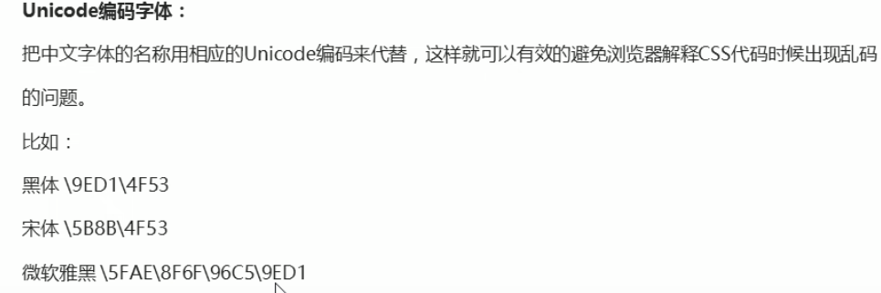

# CSS 基础与层叠规则

## CSS 书写顺序

为了让样式代码更清晰，可以按照以下顺序书写 CSS 属性：

1. 布局定位属性。
2. 自身属性。
3. 文本属性。
4. 其他属性。

## CSS 三大特性

### 层叠性

样式重复或冲突时，采取就近原则。

### 继承性

子标签会继承父标签的某些 CSS 属性，例如文本属性。

设置 `line-height` 时：

- 有单位表示具体行高。
- 无单位表示相对于当前字体大小的倍数。

在父元素中设置无单位行高，可以让子元素继承后根据自己的文字大小自动调整。例如 `line-height: 1.5` 表示行高为字体大小的 1.5 倍。

### 优先性与选择器权重

原笔记使用以下数值帮助记忆优先顺序：

1. `!important`：优先级最高。
2. 行内 `style`：权重为 1000。
3. `id` 选择器：权重为 100。
4. 类选择器：权重为 10。
5. 元素选择器：权重为 1。
6. 继承和通配符 `*` 选择器：权重记为 0。

复合选择器会进行权重叠加。

## CSS 初始化

CSS 初始化是对浏览器的默认样式进行重新设置。

不同浏览器对部分 HTML 标签的默认样式设置不同。为了减小网页在不同浏览器中的显示差异、提高兼容性，可以在项目开始时统一初始化这些样式。

### Unicode 编码字体

<!-- learning-journey:update-history:start -->
## 更新记录

| 日期 | 类型 | 说明 |
| --- | --- | --- |
| 2026-07-22 | 首次发布 | 合并整理 CSS 书写顺序、层叠性、继承性和选择器权重笔记 |
| 2026-07-22 | 内容更新 | 补充 CSS 初始化的作用、浏览器默认样式差异和 Unicode 编码字体示例 |
<!-- learning-journey:update-history:end -->
