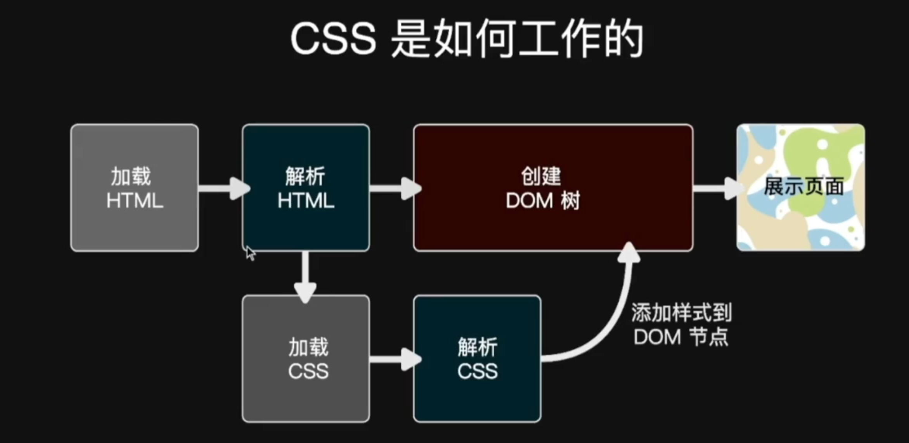
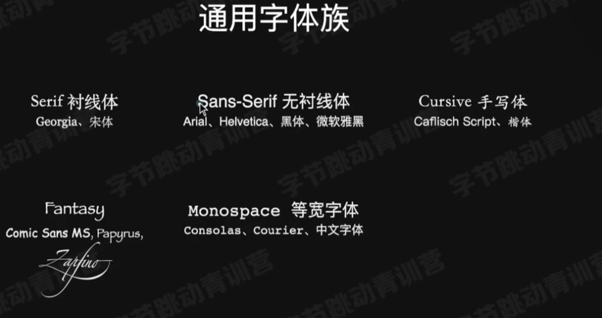
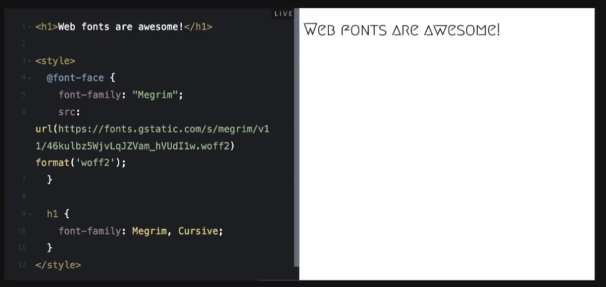
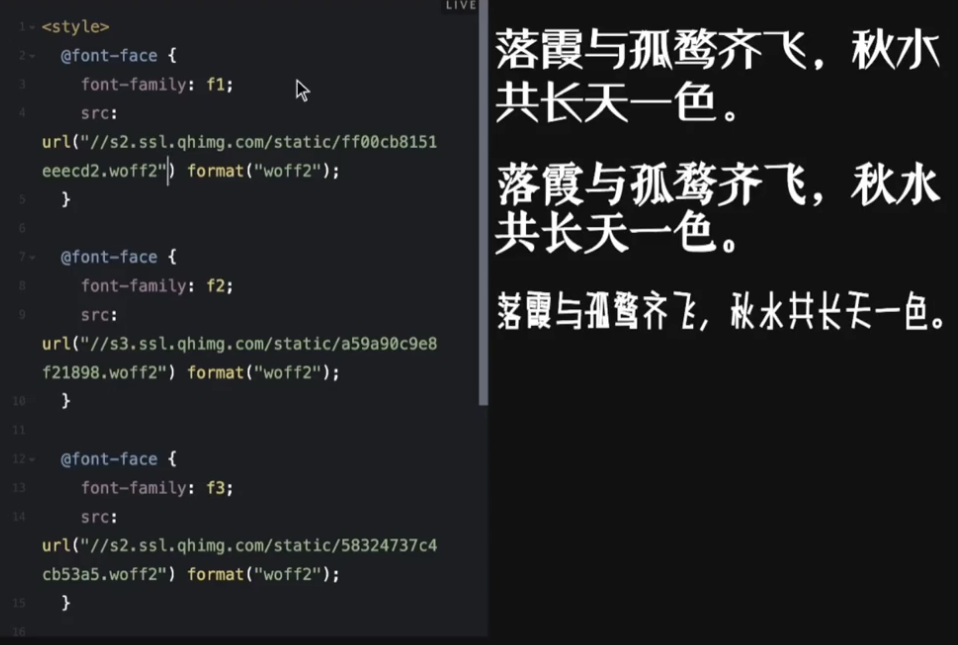
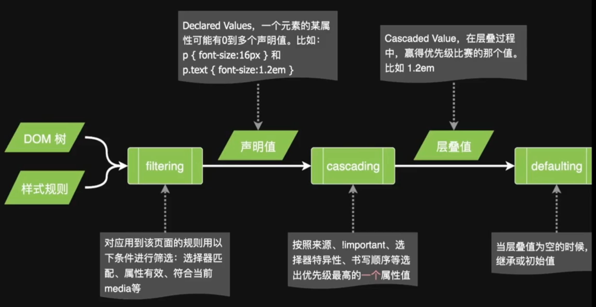
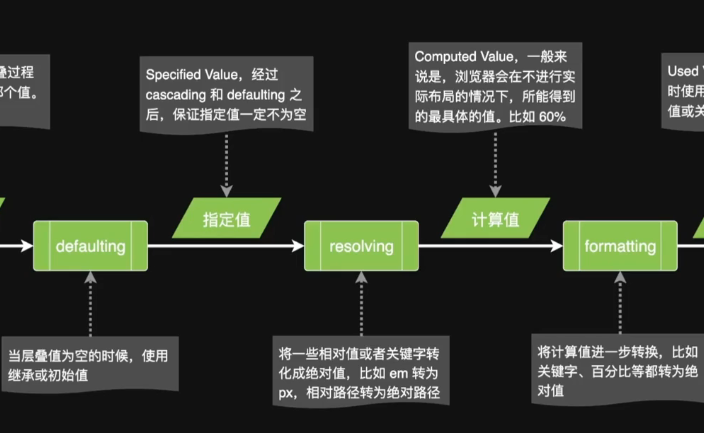
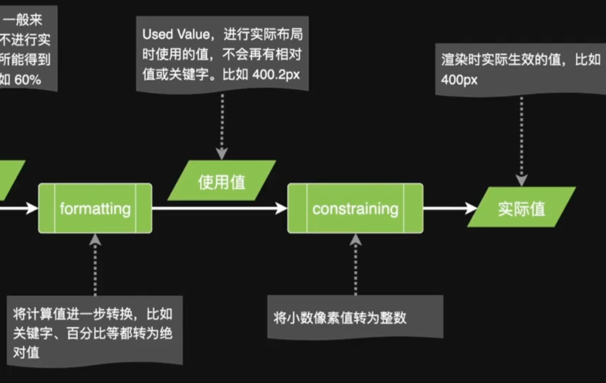
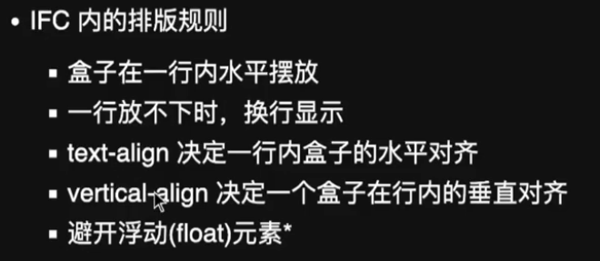
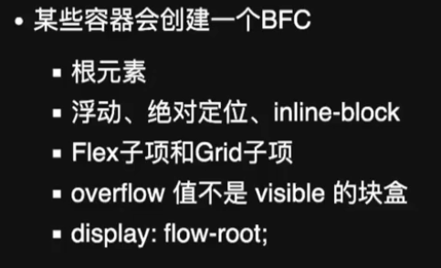
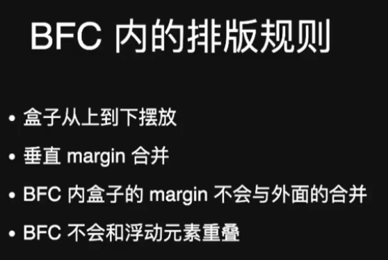

# CSS 工作原理与格式化上下文

## CSS 的工作原理



## 使用 `font-family` 设置字体

- 定义字体后，要在最后添加一个通用字体族，为缺少指定字体的浏览器提供兜底。

### 常见通用字体族



- 中英文混合时，要把定义的英文字体写在中文字体前面。

### Web Fonts



- **原理**：把字体文件放在服务器上，浏览器渲染时先从服务器下载字体，再使用该字体渲染指定文字。
- **优点**：想用什么字体就一定会呈现出什么字体。
- **缺点**：性能开销大，渲染效率慢。
- **中文字体包**：中文字体包通常较大，使用前需要裁切，提前保留需要用到的字符。



## CSS 对空白符的控制

HTML 中多个连续的空格和换行默认会合并成一个空格；CSS 的 `white-space` 属性可以控制空白符的处理方式。

## CSS 调试

- 右键单击页面并选择“检查”。
- 快捷键：`Ctrl + Shift + I`。

## 初始值

CSS 中每个属性都有初始值，例如：

- `background-color` 的初始值为 `transparent`。
- `margin-left` 的初始值为 `0`。

可以使用 `initial` 关键字将属性重置为初始值：

```css
background-color: initial;
```

## CSS 的求值过程

元素的最终样式需要经过一系列计算过程。







## IFC 与 BFC

### IFC：Inline Formatting Context

IFC 即行级排版上下文。只包含行级盒子的容器会创建一个 IFC。



### BFC：Block Formatting Context

BFC 即块级排版上下文。





<!-- learning-journey:update-history:start -->
## 更新记录

| 日期 | 类型 | 说明 |
| --- | --- | --- |
| 2026-07-22 | 首次发布 | 从语雀整理 CSS 字体、空白符、求值过程以及 IFC/BFC 笔记 |
<!-- learning-journey:update-history:end -->
