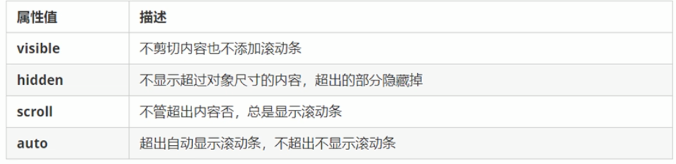
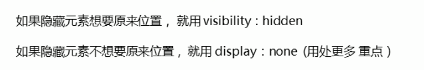
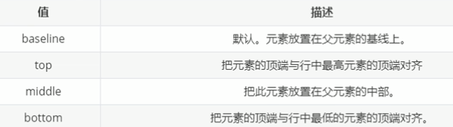
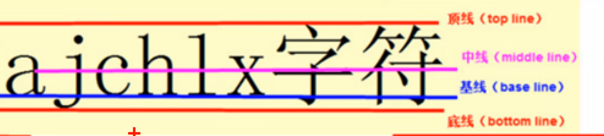
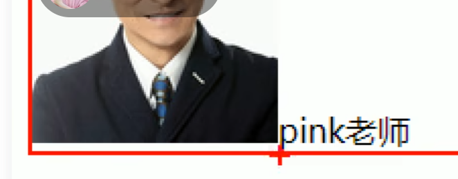
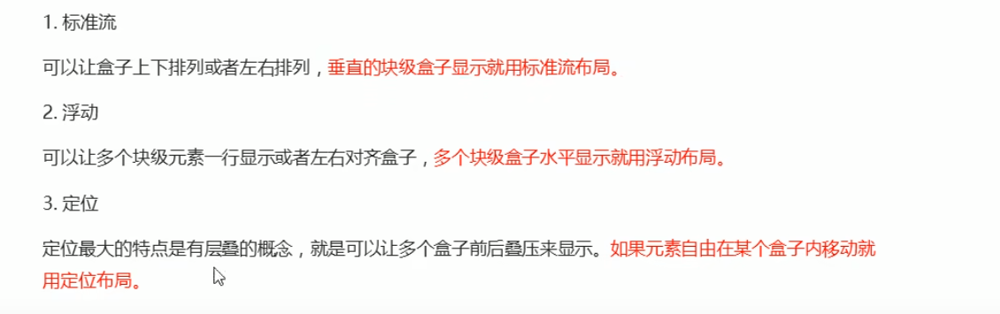

# CSS 显示、对齐与布局准则

## 元素的显示与隐藏

常见场景包括关闭广告、鼠标悬停时显示以及移开后隐藏。

### `display`

`display` 用于设置元素如何显示。

```css
display: none;
```

隐藏元素，并且不保留原来的位置。

```css
display: block;
```

除了把元素转换为块级元素，也可以用于重新显示元素。该属性常与 JavaScript 搭配形成网页效果。

### `visibility`

`visibility` 用于设置元素是否可见。

```css
visibility: hidden;
```

隐藏元素，但保留原来的位置。

```css
visibility: visible;
```

让元素可见。

### `overflow`

`overflow` 用于指定内容超出元素规定宽高时的处理方式。



有定位的盒子要谨慎使用 `overflow: hidden`，因为溢出的部分会被直接隐藏。


### `display` 与 `visibility` 对比



## `vertical-align` 属性

### 使用场景

1. 设置图片、表单等行内块元素与文字的垂直对齐方式。
2. 解决图片底部出现白色缝隙的问题。

该属性主要对行内元素和行内块元素有效。

```css
vertical-align: baseline | top | middle | bottom;
```





图片和文字默认使用基线对齐。图片底部出现白色缝隙，是因为行内块元素默认与文字基线对齐。



解决方法：

1. 给图片设置 `vertical-align: middle`、`top` 或 `bottom`。
2. 把图片转换为块级元素：`display: block`。

## 网页布局准则

原学习阶段记录的网页布局准则：

- 多个块级元素纵向排列时使用标准流。
- 多个块级元素横向排列时使用浮动。



<!-- learning-journey:update-history:start -->
## 更新记录

| 日期 | 类型 | 说明 |
| --- | --- | --- |
| 2026-07-22 | 首次发布 | 合并整理元素显示与隐藏、vertical-align 对齐和原学习阶段的网页布局准则 |
<!-- learning-journey:update-history:end -->
