# Flex 与 Grid 布局

## Flex 弹性布局

### 特点

- 操作方便，布局简单，在移动端应用广泛。
- 原笔记记录其兼容性相对较差。

Flex 又称伸缩布局、伸缩盒布局、弹性盒布局，用于为盒状模型提供灵活的排列方式。给父盒子设置 `display: flex` 后，可以控制子盒子的位置和排列方式。

- 设置 Flex 的元素称为 Flex 容器。
- 容器的所有子元素自动成为 Flex 项目。
- Flex 容器内项目的 `float`、`clear`、`vertical-align` 属性会失效。

```css
.container {
  display: flex;
}
```

### 主轴和侧轴

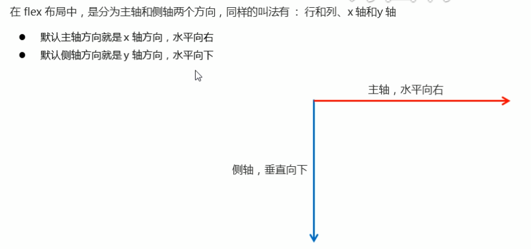

元素沿主轴排列，默认主轴方向为 `row`，也就是水平方向。

### Flex 容器常见属性

#### `flex-direction`

设置主轴方向。

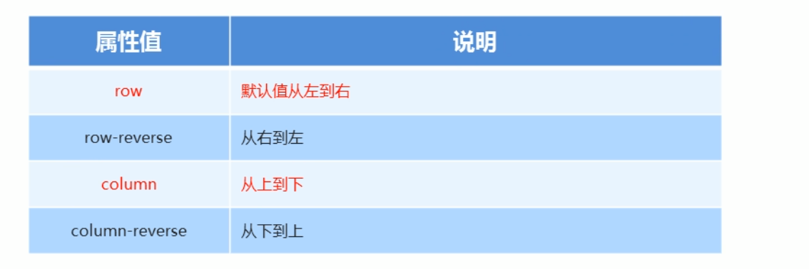

#### `justify-content`

设置主轴上的子元素排列方式，使用前先确认主轴方向。

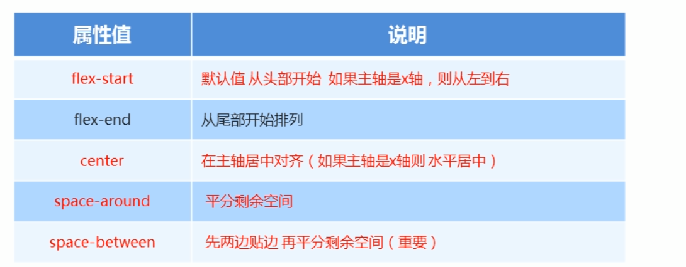

#### `flex-wrap`

设置子元素是否换行。默认不换行；一行内空间不足时，会压缩项目。

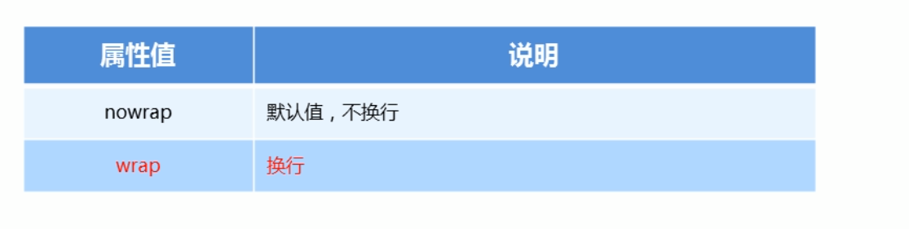

#### `align-items`

设置单行项目在侧轴上的排列方式。使用 `stretch` 拉伸时，子盒子不要设置固定高度。

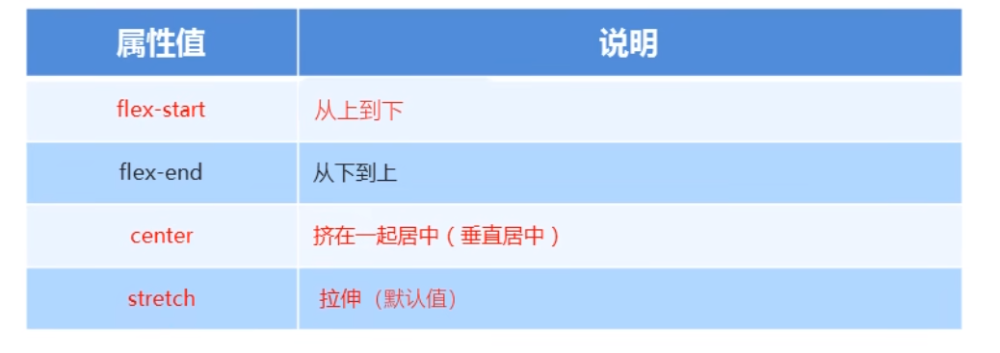

#### `align-content`

设置多行项目在侧轴上的排列方式。

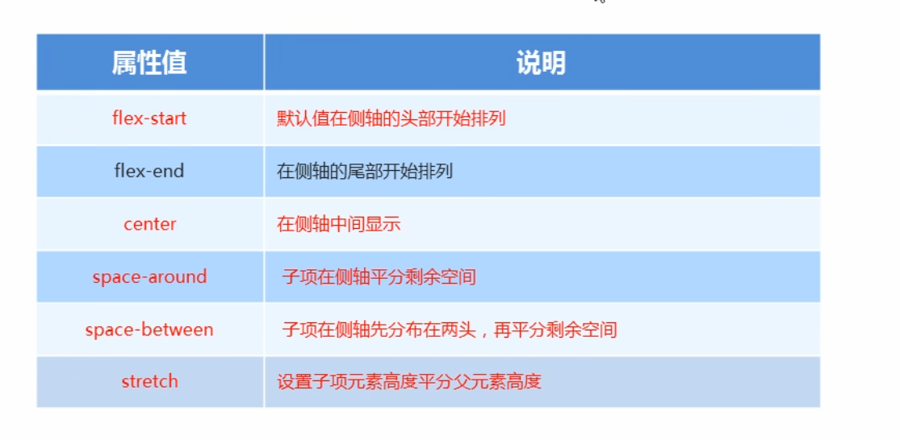

#### `flex-flow`

`flex-flow` 是 `flex-direction` 和 `flex-wrap` 的复合属性。

### Flex 项目常见属性

#### `flex`

用于分配剩余空间份数，默认值为 `0`。

```css
.item {
  flex: 1;
}
```

#### `align-self`

控制单个项目在侧轴上的排列方式，可以覆盖容器的 `align-items`。默认值为 `auto`，表示继承父元素的 `align-items`；没有父元素时等同于 `stretch`。

#### `order`

定义项目的排列顺序。数值越小越靠前，默认值为 `0`，也可以设置为负数。

## Grid 网格布局

### 特点与原理

- 像格子一样排列，布局更加灵活、强大。
- 代码相对复杂，原笔记记录其兼容性较差。
- Grid 是由行（row）和列（column）组成的二维布局，可以划分区域，并通过网格线帮助定位。
- 设置 Grid 的元素称为 Grid 容器，所有子元素自动成为 Grid 项目。

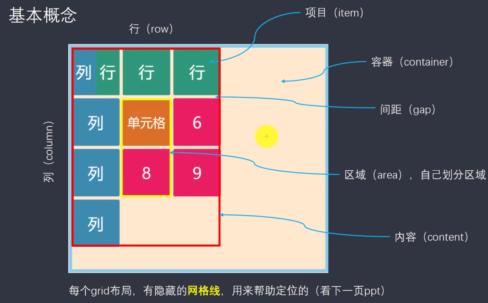

### Grid 容器属性

#### `grid-template-rows` 与 `grid-template-columns`

根据需要填写行和列的轨道大小：

```css
grid-template-rows: 100px 100px 100px;
```

使用 `repeat()` 函数重复定义轨道：

```css
grid-template-rows: repeat(3, 100px);
```

容器大小不确定时，可以使用 `auto-fill` 自动填充：

```css
grid-template-columns: repeat(auto-fill, 100px);
```

`fr` 是 fraction 的缩写，用于按比例分配可用空间：

```css
grid-template-rows: repeat(3, 1fr);
grid-template-rows: 1fr 2fr 3fr;
```

`minmax()` 产生一个长度范围，轨道大小位于最小值和最大值之间：

```css
grid-template-rows: 1fr minmax(150px, 1fr);
```

`auto` 根据可用空间自动调整大小：

```css
grid-template-rows: 1fr auto 3fr;
```

可以给网格线命名，便于后续引用：

```css
grid-template-rows: [r1] 100px [r2] 100px [r3] 100px [r4];
```

#### 间距

`row-gap` 和 `column-gap` 分别设置行间距和列间距，`gap` 是两者的复合写法。

#### `grid-template-areas`

用于划分区域，一个区域可以由一个或多个单元格组成。

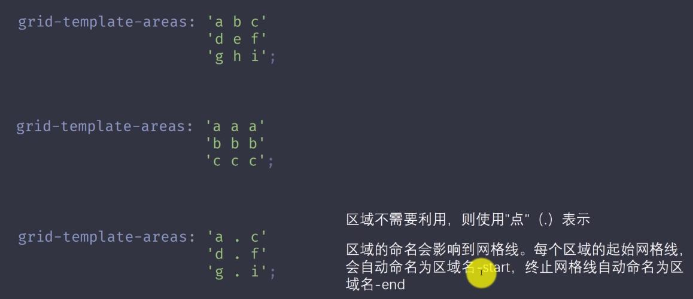

#### `grid-auto-flow`

`row` 和 `column` 用于控制自动放置项目时按行还是按列排列，`dense` 会尝试填补网格中的空位。

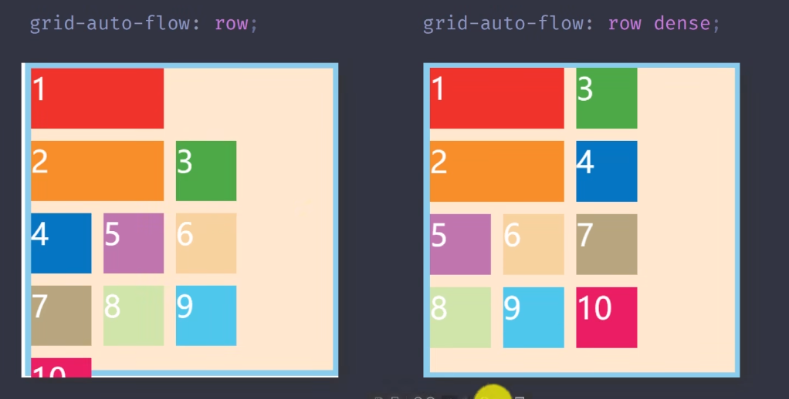

#### 对齐属性

- `justify-items`、`align-items`：设置单元格内容的水平和垂直对齐方式，可用值包括 `start`、`end`、`center`、`stretch`。
- `place-items`：以上两个属性的复合写法。
- `justify-content`、`align-content`：设置整个网格内容的水平和垂直对齐方式。

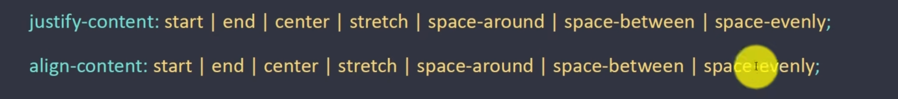

#### 隐式轨道

`grid-auto-columns` 和 `grid-auto-rows` 用于设置多出来的项目所形成轨道的宽度和高度。

### Grid 项目属性

#### 网格线定位

`grid-column-start`、`grid-column-end`、`grid-row-start`、`grid-row-end` 用于指定项目的起止网格线。

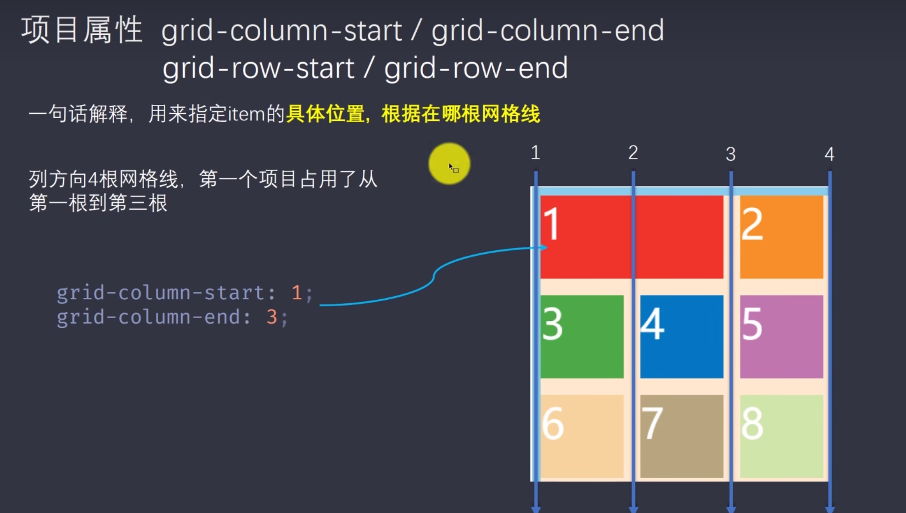

可以使用合并写法：

```css
grid-column: 1 / 3;
```

也可以使用 `span` 表示跨越若干单元格：

```css
grid-column-start: 2;
grid-column-end: span 3;
```

网格线编号可以使用负值，例如 `-1` 表示最右侧或最下侧的最后一条网格线。

#### `grid-area`

用于指定项目放入 `grid-template-areas` 规划好的区域。

```html
<style>
  .fatherbox {
    display: grid;
    grid-template-areas:
      "a a a"
      "b b b"
      "c c c";
  }

  .item-1 {
    grid-area: a;
  }
</style>
```

#### 单个项目对齐

`justify-self`、`align-self` 和 `place-self` 用于设置单个项目的对齐方式，可用值包括 `start`、`end`、`center`、`stretch`。

<!-- learning-journey:update-history:start -->
## 更新记录

| 日期 | 类型 | 说明 |
| --- | --- | --- |
| 2026-07-22 | 首次发布 | 合并整理 Flex 与 Grid 的容器、项目、轴线、轨道、区域和对齐属性，并修正 CSS 示例语法 |
<!-- learning-journey:update-history:end -->
