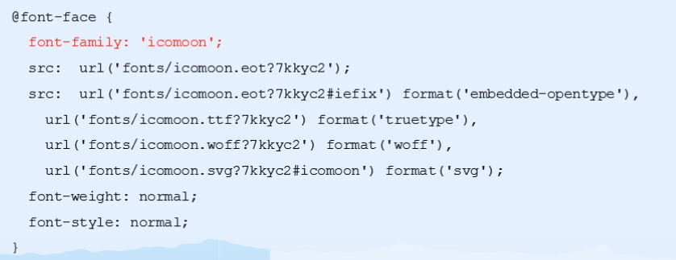
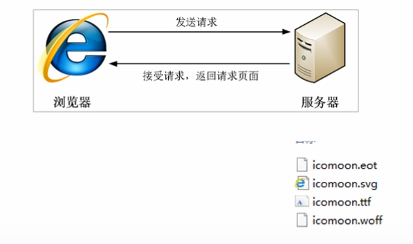

# CSS 图形与图标

## CSS 精灵图

CSS 精灵技术又称 CSS Sprites、CSS 雪碧图。它把多个小图片、小图标放在一张大图中，从而减少服务器请求次数，提高页面加载速度。

### 核心原理

将网页中的小背景图像整合到一张大图中，服务器只需要请求一次。使用时通过 `background-position` 移动背景位置，显示需要的区域。

背景位置通常使用负值：x 轴向左为负，y 轴向上为负。

```css
.icon {
  background: url("sprite.png") no-repeat -10px -20px;
}
```

## 字体图标

### 使用场景

字体图标主要用于显示网页中常见的小图标，例如搜索放大镜、下拉小三角等。显示的是图标，本质上是字体。

### 与精灵图对比

精灵图的局限：

1. 图片文件本身较大。
2. 放大、缩小可能失真。
3. 图片制作完成后，更换比较复杂。

字体图标的优点：

1. 轻量级，渲染速度快并减少服务器请求。
2. 本质是文字，可以调整颜色、阴影、透明度和旋转效果。
3. 兼容性较好。

字体图标适合结构简单的小图标，复杂背景或图标仍然可以使用精灵图。

### 使用流程

1. 从 IcoMoon、阿里 Iconfont 等平台下载字体图标。
2. 把下载包中的 `fonts` 文件夹放入页面根目录。
3. 在 CSS 中全局声明字体，并根据项目目录调整 `url` 路径。



4. 在下载包的 `demo.html` 中找到要使用的图标，把对应字符复制到 `span` 标签中。
5. 为 `span` 声明对应的 `font-family`。

### 追加字体图标

把原文件夹中的 `selection.json` 重新上传，追加新图标并生成新的图标文件包，再覆盖原文件。

### 加载原理



## CSS 三角

网页中的简单三角形可以使用 CSS 边框绘制，不必使用精灵图或字体图标。

### 方法

1. 新建一个宽高都为 `0` 的盒子。
2. 把所有边框设置为 `solid transparent`。
3. 根据三角形方向，为对应的边框设置颜色。

```html
<style>
  .triangle {
    width: 0;
    height: 0;
    border: 50px solid transparent;
    border-left-color: pink;
  }
</style>

<div class="triangle"></div>
```

<!-- learning-journey:update-history:start -->
## 更新记录

| 日期 | 类型 | 说明 |
| --- | --- | --- |
| 2026-07-22 | 首次发布 | 合并整理 CSS 精灵图、字体图标和边框三角形的原理与使用方法 |
<!-- learning-journey:update-history:end -->
