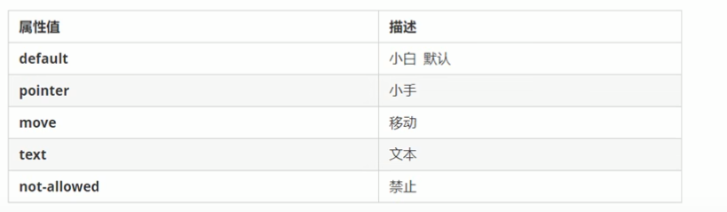
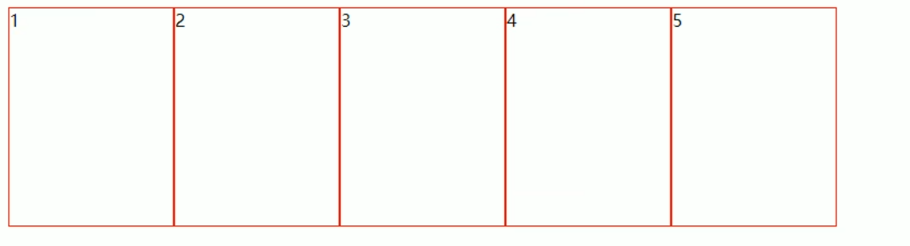
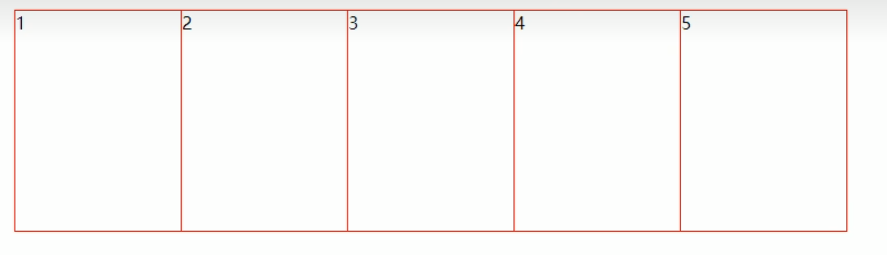
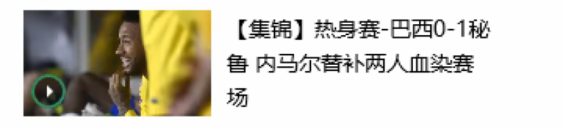
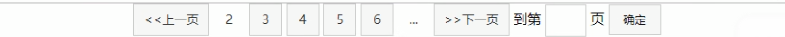
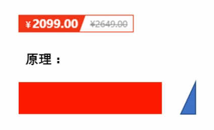
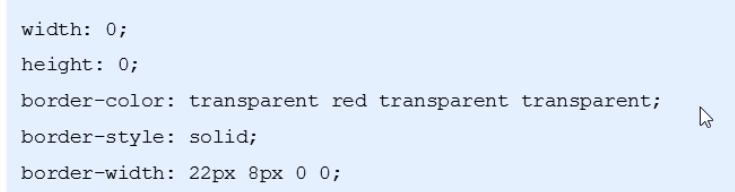

# CSS 界面与布局技巧

## 用户界面样式

通过调整用户操作相关样式，可以改善页面使用体验。

### 鼠标样式 `cursor`

```css
.box {
  cursor: pointer;
}
```



### 表单轮廓

给表单控件设置 `outline: 0` 或 `outline: none`，可以去掉默认轮廓线。

### 防止文本域拖拽

给 `textarea` 设置：

```css
textarea {
  resize: none;
}
```

文本域也可以删除轮廓线。双标签尽量写在同一行，避免光标位于其中时出现由换行和缩进产生的大段空白。

## 溢出文字显示省略号

### 单行文本

1. 强制文本在一行内显示。
2. 隐藏超出的部分。
3. 用省略号替代超出的文字。

```css
.text {
  white-space: nowrap;
  overflow: hidden;
  text-overflow: ellipsis;
}
```

`white-space` 默认值为 `normal`，文字会自动换行。

### 多行文本

原笔记提示该效果存在兼容性问题，开发中也可以由后端截取文本。

```css
.box {
  overflow: hidden;
  text-overflow: ellipsis;
  display: -webkit-box;
  -webkit-line-clamp: 2;
  -webkit-box-orient: vertical;
}
```

实现多行省略效果时，需要控制盒子大小。

## 常见布局技巧

### `margin` 负值



给浮动盒子设置 `margin-left: -1px` 后，相邻边框会叠加成一条。



添加悬停效果后，如果当前盒子的左边框被右侧盒子压住，可以在鼠标经过时提高当前盒子的层级：

- 没有定位时添加相对定位。
- 已有定位时提高 `z-index`。

### 文字环绕浮动元素

浮动最初就用于文字环绕。要实现图片周围的文字环绕效果，可以直接设置图片左浮动。



### 行内块居中

父盒子设置 `text-align: center` 后，其中的行内块元素可以整体水平居中。



### 直角三角形



制作方法：

1. 只保留右边框有颜色，其他边框使用 `transparent`。
2. 边框样式都使用 `solid`。
3. 上边框宽度大于右边框，左边框和下边框宽度都设为 `0`。



<!-- learning-journey:update-history:start -->
## 更新记录

| 日期 | 类型 | 说明 |
| --- | --- | --- |
| 2026-07-22 | 首次发布 | 合并整理用户界面样式、文本省略号以及负边距、文字环绕、行内块和三角形布局技巧 |
<!-- learning-journey:update-history:end -->
