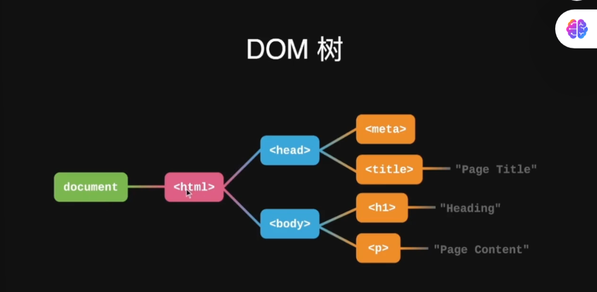
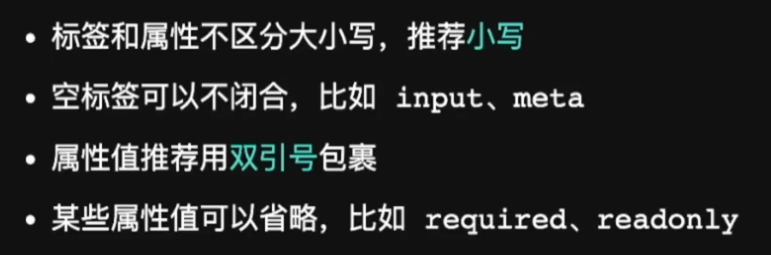
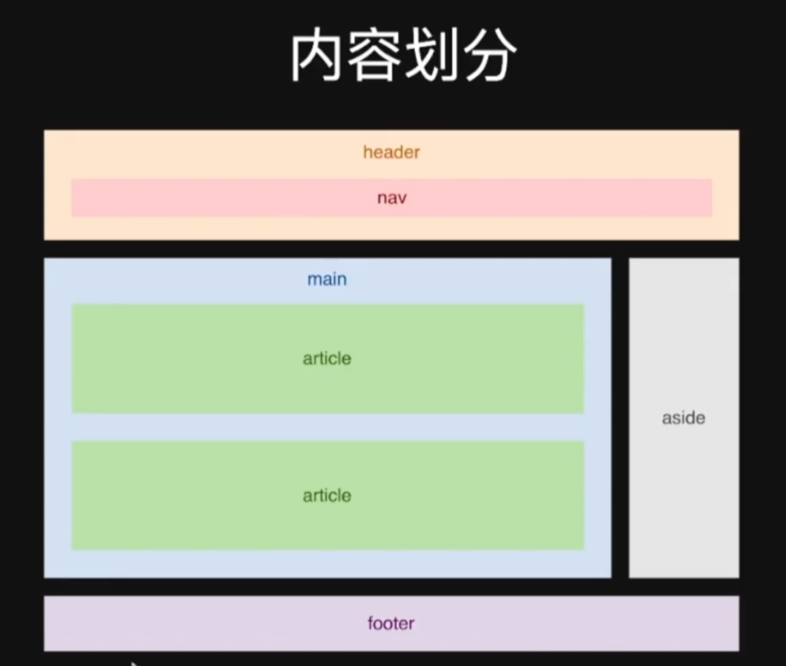

# 前端基础与 HTML 语义化

## 前端工程师是什么

> 使用 Web 技术栈解决多端图形用户交互界面问题的工程师。

## 前端技术栈

- HTML：内容。
- CSS：样式。
- JavaScript：行为。
- 浏览器通过 HTTP 协议与服务器通信，从服务器获取代码并渲染页面，也可以把用户行为和信息提交到服务器。

## 前端应该关注的方面

- 产品功能与用户需求的对接。
- 界面美观。
- 面向所有用户的无障碍能力。
- 数据安全。
- 网页性能与用户体验。
- 网页兼容性。

## 前端的边界

- Node.js：服务器端应用开发。
- Electron：客户端应用开发。
- WebRTC：P2P 在线传输，例如多人会议。
- WebGL：3D 游戏开发。
- WebAssembly：将其他语言代码转换为直接在浏览器中呈现。

> 前端发展更新极快，技术更迭也很快。

## 开发环境

编辑器加浏览器。

## HTML 是什么

HTML 是 HyperText Markup Language（超文本标记语言）。

- **超文本**：图片、链接、表格、标题等。
- **标记语言**：用成对标签表示格式。

## HTML 文档的基本结构

- `<!DOCTYPE html>`：标记当前 HTML 文件的版本信息，决定浏览器的渲染模式。
- `<html>`：双标签，根标签。
- `<head>`：双标签，用于放置页面的元数据，如页面标题、编码格式等。
- `<body>`：双标签，用于放置呈现给用户的内容。

## DOM 树

浏览器会把 HTML 代码解析为包含文档根节点的树形结构。

## HTML 语法

## 页面划分

- `header` 标签可以放置 Logo、导航等内容，导航可以放在 `nav` 标签中。
- `main` 标签表示主体部分。
- `aside` 标签表示与内容相关的补充区域，如热点推荐、广告推送等。
- `article` 标签表示正文部分。
- `footer` 标签表示页尾部分，如版权备案、参考链接和引用来源等。

## HTML 语义化

HTML 中的元素、属性和属性值都有各自的含义，开发者应遵循 HTML 的语义进行编写。

### 意义

- 提升代码的可读性和可维护性，有利于其他开发者修改、维护页面，体现团队规范意识。
- 帮助浏览器读取并展示页面。
- 搜索引擎会抓取 HTML 代码，提取关键词并根据标签权重进行排序，有利于搜索引擎优化。
- 提升无障碍性，考虑用户面临的各种情况，确保准确传达页面信息。

### HTML 原则

**传达语义和内容，而不是传达样式。**

### 如何做到语义化

- 了解每个标签和属性的含义。
- 思考什么标签最适合当前内容。
- 不使用可视化工具生成代码。

<!-- learning-journey:update-history:start -->
## 更新记录

| 日期 | 类型 | 说明 |
| --- | --- | --- |
| 2026-07-22 | 首次发布 | 从语雀整理前端职责、技术边界、HTML 文档结构和语义化笔记 |
<!-- learning-journey:update-history:end -->
