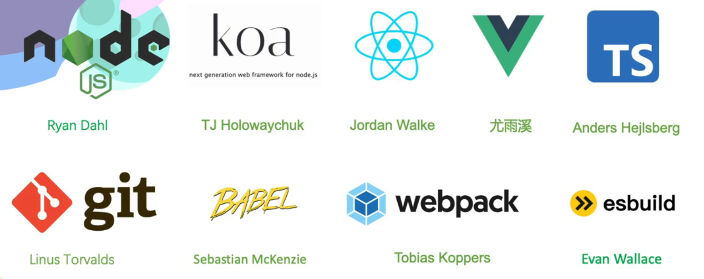

# Web 标准与前端开发概览

## 前端技术的变迁

### Web 的只读时代

- **技术构成**：最初的 Web 仅支持简单的内容发布，主要技术包括 HTML、HTTP 和 URL。
- **特点**：
  - 只有静态内容，用户只能查看内容，不能与之交互。
  - 页面内容固定，缺乏动态更新和实时交互。
  - 常见技术包括 HTML、CSS、JavaScript 和 CGI。
  - CGI 是 Web 与外部程序交互的标准接口，但性能较低，因为每次请求都会启动一个新进程，处理效率较差。

### Web 的体验时代

- **技术演进**：AJAX（Asynchronous JavaScript and XML）使页面可以局部更新，Web API 和 jQuery 进一步改善了开发效率和用户体验。
- **特点**：
  - 支持页面局部刷新和异步请求，提升动态交互性。
  - Web 页面不再只是静态内容，可以实现动态内容和社交互动。
  - 用户生成内容（UGC）开始流行，Web 2.0 时代到来。
  - 开发重心从静态页面转向用户交互和动态内容。
  - 单页应用（SPA）开始流行，网页无需整体刷新即可动态加载内容。

### Web 的敏捷时代

- **技术演进**：React、Vue、Webpack 等技术被广泛应用，前端开发变得更加复杂和高效。
- **特点**：
  - **组件化、模板化**：应用开发趋向模块化，代码复用性和开发效率提高。
  - **转译与打包**：Babel 将现代 JavaScript 转换成兼容性更强的版本；Webpack 将 JavaScript、CSS、图片等资源打包并进行优化。
  - 开发者可以使用 React、Vue 等框架和 Webpack 等工具管理复杂应用。

## 前端应用的领域

### 浏览器

- 桌面浏览器。
- 移动浏览器。

### 服务器

- Node.js。
- Express.js。
- Koa。

### 终端与跨端

- **终端与命令行**：Webpack CLI、Babel CLI、Vue CLI、React CLI。
- **桌面跨端**：Electron、NW.js。
- **移动跨端**：React Native、Flutter。

## 前端开发的语言、框架和工具

### 语言

- 三大基础技术：HTML、CSS、JavaScript。
- WebAssembly 的出现让前端能够在浏览器中运行更多编程语言，例如 C、C++ 和 Rust；它类似一种汇编语言。

### 框架

> 在了解框架之前，可以先了解作者、创作初衷和框架希望解决的问题。

### 工具与学习资料

- **浏览器**：[深入理解现代浏览器](https://github.com/75team/w3c/blob/master/articles/20190603_cncuckoo_%E6%B7%B1%E5%85%A5%E7%90%86%E8%A7%A3%E7%8E%B0%E4%BB%A3%E6%B5%8F%E8%A7%88%E5%99%A8.md)
- **网络**：[An overview of HTTP](https://developer.mozilla.org/en-US/docs/Web/HTTP/Overview)
- **学习路线**：[前端学习路线](https://roadmap.sh/frontend)

## Web 标准

### Web 标准组织

- **W3C（World Wide Web Consortium，万维网联盟）**：主要负责制定 HTML、CSS 等 Web 标准。[规范查询网站](https://www.w3.org/TR/clreq-gap/#contributors)
- **Ecma（Ecma International）**：负责 JavaScript 语言的标准化，例如 ECMAScript。
- **WHATWG（Web Hypertext Application Technology Working Group）**：专注于 HTML 和相关技术的标准化。
- **IETF（Internet Engineering Task Force）**：负责互联网协议的制定，包括 HTTP 等网络协议。

<!-- learning-journey:update-history:start -->
## 更新记录

| 日期 | 类型 | 说明 |
| --- | --- | --- |
| 2026-07-22 | 首次发布 | 从语雀整理 Web 技术变迁、应用领域、开发工具和标准组织 |
<!-- learning-journey:update-history:end -->
