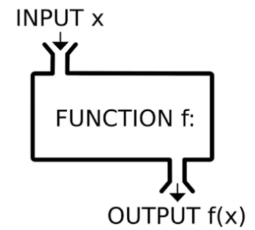

# JavaScript 开发原则与过程抽象

## 各司其责

> HTML、CSS、JavaScript 职能分离。

- HTML：结构（Structural）。
- CSS：表现（Presentational）。
- JavaScript：行为（Behavioral）。
- 避免不必要地使用 JavaScript 直接操作样式。
- 可以使用 `class` 表示状态。
- 纯展示类交互可以尝试寻找 zero-JS 方案。
- 以职责分离原则优化代码，寻找更合适的实现方案。

## 组件封装

> 好的 UI 组件具备正确性、扩展性和复用性。

### 什么是组件

组件是从 Web 页面中抽取出来的单元，包含模板（HTML）、样式（CSS）和功能（JavaScript）。好的组件具备封装性、正确性、扩展性和复用性。

### 组件封装的基本方法

- 结构设计。
- 展现效果。
- 行为设计：
  - API（功能）。
  - Event（控制流）。

### 优化方法

- **重构与解耦**：
  - 把组件插件化。
  - 将控制元素抽取成插件。
  - 插件与组件之间通过依赖注入建立联系。
- **HTML 模板化**：让组件更容易扩展。
- **通用模型抽象化**：抽象出组件框架。

## 过程抽象

> 应用函数式编程思想。

过程抽象是把一段具体实现过程从代码中抽取出来，通过函数封装或外部调用隐藏细节。它可以让代码更加简洁、可复用，减少重复，并提升可读性和可维护性。

- 用于处理局部细节控制。
- 是函数式编程思想的基础应用。
- 为了让“只进行一次”等需求覆盖不同的事件处理，可以把这一过程单独剥离出来。

### JavaScript 中的过程抽象

过程抽象可以通过高阶函数（Higher-Order Function，HOF）实现：

- 以函数作为参数。
- 以函数作为返回值。
- 常用于函数装饰器。

### 常用的高阶函数

#### `once`

确保一个函数只被调用一次。即使多次调用，也只使用第一次的返回值，常用于只需执行一次的初始化操作。

#### `throttle`（节流）

限制某个函数在一定时间内只能执行一次。常用于滚动、窗口缩放等频繁触发的事件，避免函数过度执行。

#### `debounce`（防抖）

事件发生后延迟一定时间再执行函数；如果在这段时间内继续触发，则重新计算延迟。常用于输入框实时搜索、按钮点击等场景。

#### `consumer/2`

`consumer` 是一种接受两个参数并返回一个新函数的函数，新函数使用这两个参数进行操作，通常用于处理基于两个值的组合逻辑，如映射或归约。

#### `iterative`

接受一个函数和一个初始值，反复应用该函数直到满足某个条件，通常用于处理需要迭代的逻辑。

### 为什么使用高阶函数

- **函数复用**：抽取公共逻辑，在不同位置复用，避免重复实现。例如 `throttle` 和 `debounce` 可以处理多种事件。
- **增强可组合性**：将功能分解为独立、可组合的小函数。例如装饰器可以在不修改原函数的情况下增强功能。
- **函数式编程**：通过函数组合解决问题，减少对命令式变量和状态变化的依赖，让代码更加简洁和声明式。

## 编程范式

### 命令式

命令式编程强调“如何做”，指示程序执行一系列操作，每一步都描述程序的状态变化，通常依赖变量、条件语句和循环。

### 声明式

声明式编程强调“做什么”，描述期望结果而不关注实现细节。函数式编程（包括高阶函数）是一种声明式编程范式。

<!-- learning-journey:update-history:start -->
## 更新记录

| 日期 | 类型 | 说明 |
| --- | --- | --- |
| 2026-07-22 | 首次发布 | 从语雀整理 JavaScript 职责分离、组件封装、过程抽象和编程范式 |
<!-- learning-journey:update-history:end -->
