# Vue 3 与 UniApp 开发基础

**UniApp 核心：基于 Vue 的多端平台适配系统**


> Web基础知识点回顾：
>

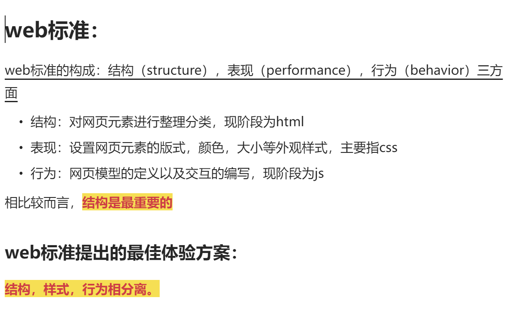

## Vue 页面基本组成
+ 结构部分`template`：

```vue
<template>
  <view class="content">	<!--相当于div盒子-->
    <view class="box1">box1</view>
    <view class="box2">box2</view>
  </view>

</template>
```

+ 行为部分`script`：

```vue
<script>

</script>
```

+ 表现部分`style`：


## 组件基础（Vue 与 UniApp）
### 何为组件？
组件是一个单独且可复用的功能模块的封装

### 如何创建组件？
1. 在根目录下创建一个新目录，命名为`components`
2. 在components内新建组件，进行组件定义即可
3. 自定义组件的使用：
        * Uniapp 中直接在页面中按`<自定义组件名>   </自定义组件名>`使用即可
        * Vue 中则需要先在`script`中引入：`import 自定义组件名 from 路径`，再实现使用

### 如何复用组件？（使用组件时填充不同的内容）
#### 使用`defineProps()`进行数据传递
+ 示例

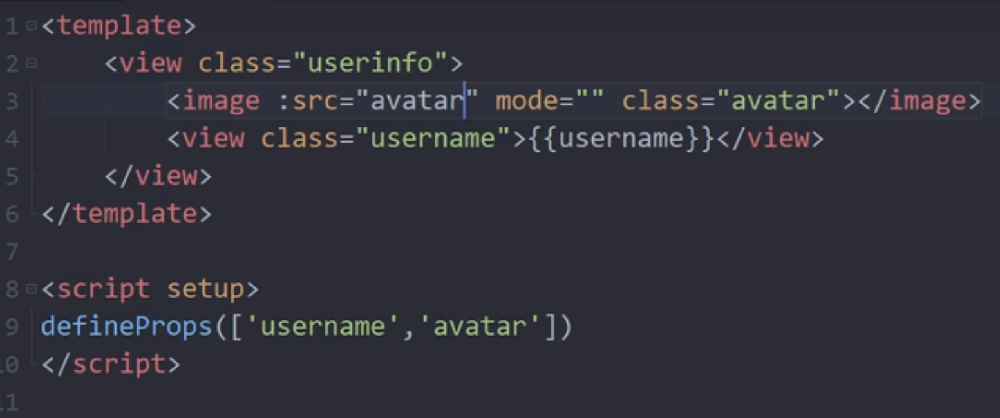


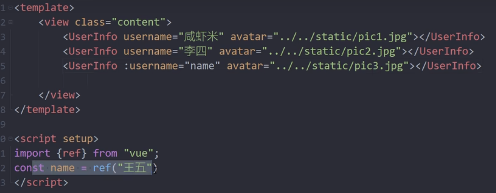


+ 可以用一个变量接受`defineProps()`的传值，以便进行修改操作
——>要用`computed`计算属性进行修改，不能直接修改数据源！！！！


## UniApp 内置封装组件
> 组件文档：[https://uniapp.dcloud.net.cn/component/](https://uniapp.dcloud.net.cn/component/)
>

### 视图容器`<view>  </view>`：
        * 类似于传统html里的盒子`<div>`标签，用于包裹元素
        * 快捷生成：`view.box1`+回车——>`<view class="box1"> </view>`
        * 属性：
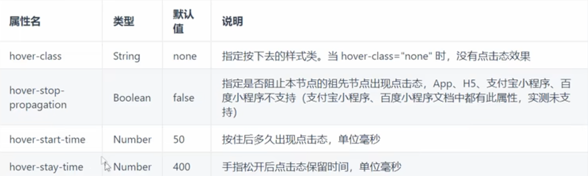

### 事件传播
+ 对于具有不同点击效果或悬浮效果的子容器和父容器，光标点击或悬浮在子容器上，也可能触发包裹子容器的父容器效果。
+ `hover-stop-propagation="true"` 用于阻止 `hover` 状态向父节点传播；点击事件应使用事件修饰符等方式单独阻止传播。
+ **局限**：APP、支付宝小程序、百度小程序不支持。


### 文本组件`<text>  </text>`：
        * 类似于`<span>`，用于包裹文本内容
        * 属性：
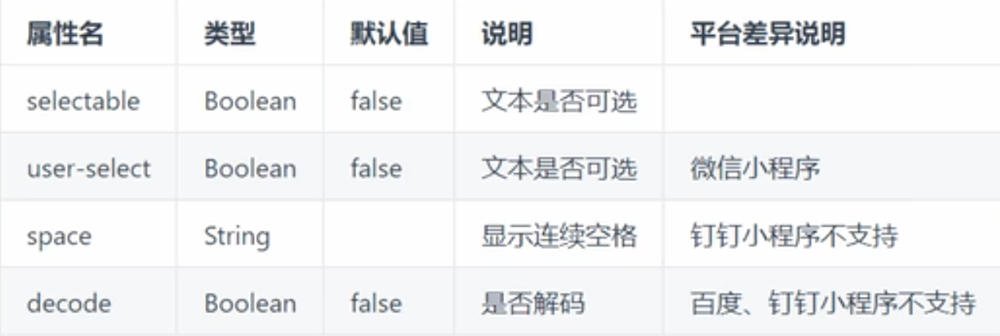

### 可滚动视图区域 `<scroll-view> </scroll-view>`
        * 用于在固定的区域内实现内容滚动

+ <font style="color:rgb(44, 62, 80);">使用竖向滚动时，需要给 </font>`<font style="color:rgb(233, 105, 0);background-color:rgba(27, 31, 35, 0.05);"><scroll-view></font>`<font style="color:rgb(44, 62, 80);"> 一个固定高度，通过 css 设置 height；</font>
+ <font style="color:rgb(44, 62, 80);">使用横向滚动时，需要给</font>`<font style="color:rgb(233, 105, 0);background-color:rgba(27, 31, 35, 0.05);"><scroll-view></font>`<font style="color:rgb(44, 62, 80);">添加</font>`<font style="color:rgb(233, 105, 0);background-color:rgba(27, 31, 35, 0.05);">white-space: nowrap;</font>`<font style="color:rgb(44, 62, 80);">样式。</font>


        * 属性可自行查阅文档

###  滑块视图容器`<swiper>  </swiper>`（轮播图）:
        * 基本结构：

```vue
<template>
  <view>
    <swiper class="sw1" indicator-dots >
      <swiper-item>
        <view>轮播图1</view>
      </swiper-item>
      <swiper-item>
        <view>轮播图2</view>
      </swiper-item>
    </swiper>
  </view>
</template>
```

### 媒体——图像组件`<image>  </image>`：
        * 照片文件放置于`static`文件夹中
        * 路径：
            + 相对路径：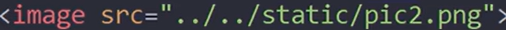
            + 项目绝对路径：`/static/pic2.png`
            + 网络路径：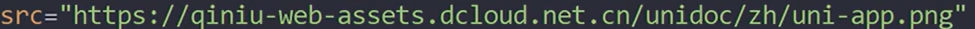

### 页面跳转组件`<navigator>`
[Uniapp页面路由与跳转官方文档](https://uniapp.dcloud.net.cn/component/navigator.html)

        * 类似于`<a>`超链接标签，但只能跳转本地页面
        * 基本结构：

```vue
<template>
  <view>
    <navigator url="" open-type="reLaunch">返回主页面</navigator>
    <!--open-type：跳转方式-->

  </view>
</template>
```

        * 包裹起来的元素即为可以跳转的元素

### 表单组件：
#### 按钮组件`<button>`
#### 输入框组件`<input/>`
#### 复选框组件`<checkbox>`
## Vue 3 概览
> [vue官方文档](https://cn.vuejs.org/guide/introduction#vue-js-%E6%98%AF%E4%BB%80%E4%B9%88)
>

**Vue 的核心机制：响应式系统 + 组件式开发**


### 插值表达式：
+ 使得`template`里的内容具备变量运算等能力，而不是直接输出，和`script`中的表现语句相配合
+ 语法：`{{2 + 3}}`——>在屏幕上输出结果为`5`

###  `setup`语法糖：
+ 通过加上`setup`，省略一些繁琐的组件行为的写法，使得`<script>`中行为代码编写更为简易明了
+ 格式：`<script setup>  </script>`

### 响应式基础
> [vue响应式基础官方文档](https://cn.vuejs.org/guide/essentials/reactivity-fundamentals.html)
>

+ 在 **Vue** 中，当用 `ref` 或 `reactive` 在 `<script setup>` 中定义变量后，这些变量会和 `<template>` 中的内容自动绑定。当变量因`<script>`中的修改行为发生变化时，页面会自动更新，无需手动操作。
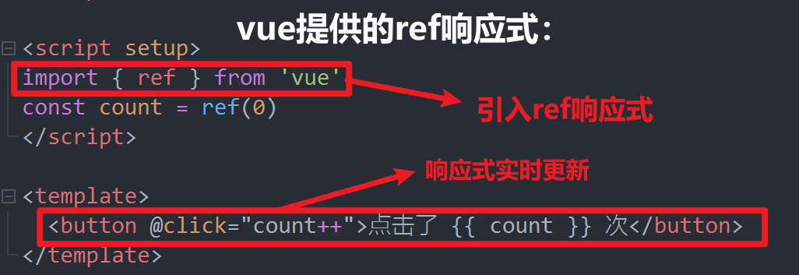
+ 普通**JS**操作不光需要修改数据变量，还需要手动修改DOM，使`<body>`中的数据也作出修改
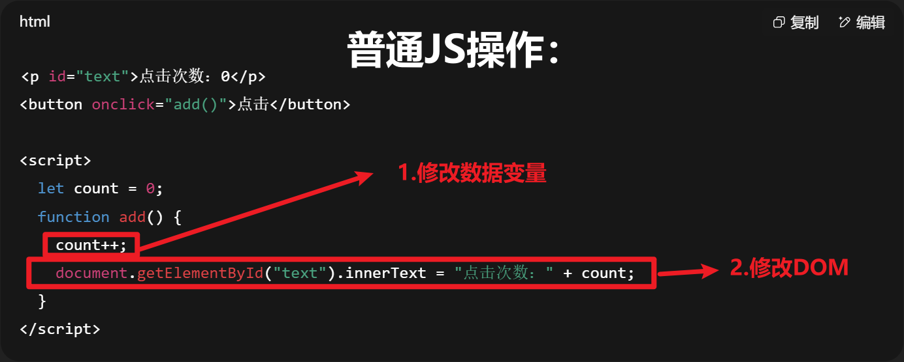
+ **操作步骤：**
        1. 在`<script setup>`中引入`ref`：

`import { ref } from "vue";`

        2. 初始化变量时用`ref()`包裹其值：

`let num1 = ref(0);`

        3. 后续在`<script>`中更新的是`变量.value`：

`num1.value++;`

在模板中使用 `ref` 时会自动解包；在 `script` 中修改 `ref` 仍需使用 `.value`。

### `v-bind`指令：
+ 作用：在<u>属性</u>中也可以绑定变量或表达式，是插值表达式的补充（<u>插值表达式</u>`{{ }}`只能使变量能在<u>文本</u>中使用）
+ 使用方法示例：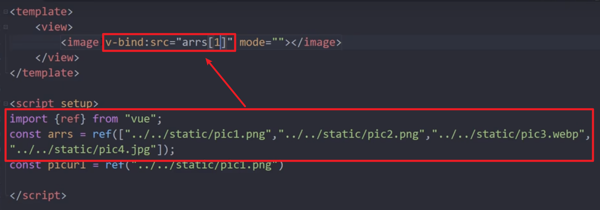
+ 语法：`v-bind:属性名="变量"`，可简写为 `:属性名="变量"`

### `v-bind`的`class`变量绑定：
+ 固定语法1：`<view :class="{ 类名: 条件 }"> </view>`
+ 固定语法2：`<view :class="条件?'类名':''"> </view>`
        * ——>若`条件`为`true`，该`view`具有类名`类名`，否则莫得

### `v-bind`的内联`style`变量绑定：
+ 固定语法：`<view :style="{属性1:变量1,属性2:变量2}">`
+ 案例：

```vue
<!--实现效果：test盒子的宽度为可修改的变量的值，字体大小每秒钟+1px-->

<template>
  <view class="test" :style="{width:wd + 'px', 'font-size':fs + 'px'}">
    这是测试容器块
  </view>
</template>

<script setup>
  import {ref} from "vue";
  const wd = ref(200);
  const fs = ref(30);

  setInterval(()=>{
    fs.value++;
  },1000)
</script>

<style lang="scss">
.test {
  background-color: #f0f0f0;
  padding: 10px;
  text-align: center;
}
</style>

```

### `v-on`事件监听&处理
+ 语法：`<button v-on:事件名="处理方法名">`
可简写为：`<button @事件名="处理方法名">`
+ 一旦用户对该组件进行了`事件名`，就会被监听到并执行`处理方法名`的相应操作
+ 处理方法在`<script>`中作为函数进行编写
+ 案例：

```vue
<template>
  <button @click="sayHello">点我一下</button>
</template>

<script setup>
function sayHello() {
  console.log('你好，Vue!')
}
</script>

```

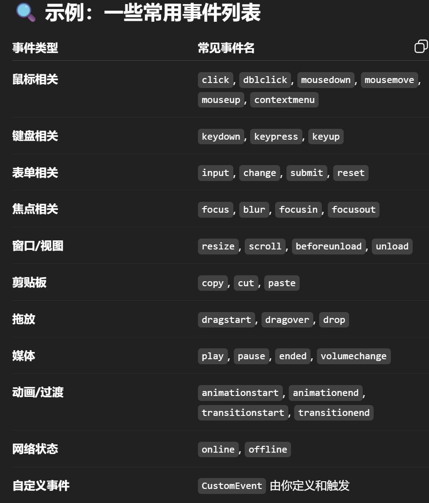

### 表单事件：
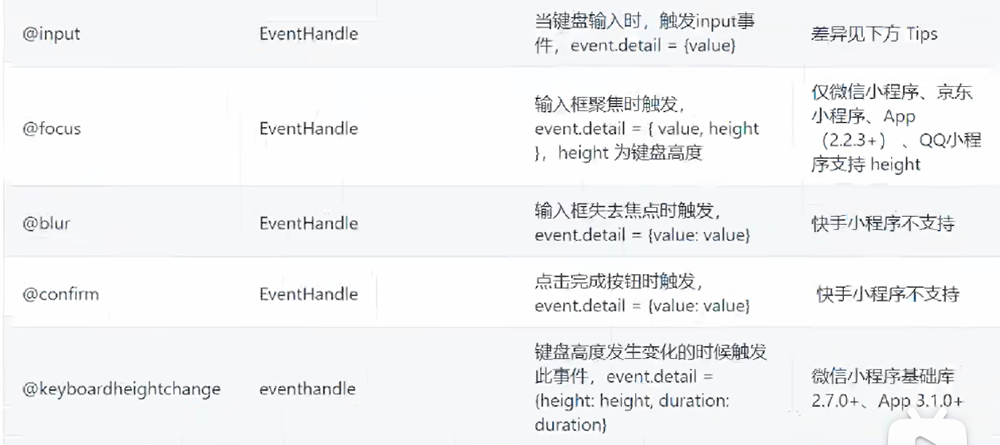

+ 案例：跳跃的坤坤

```vue
<template>
	<view class="out">
		<input type="text" :value="iptValue"
		@focus="onFocus" @blur="onBlur" />
		<image src="/static/蔡徐坤-copy.png" class="pic pic1"
		:class="isActive?'active':''"></image>
		<image src="/static/蔡徐坤.png" class="pic pic2"
		:class="isActive?'active':''"></image>
		<image src="/static/蔡徐坤-copy (1).png" class="pic pic3"
		:class="isActive?'active':''"></image>
	</view>
</template>

<script setup>
	import {ref} from "vue";
	const iptValue = ref("");
	const isActive = ref(false);
	function onFocus(){
		isActive.value=true;
	}
	function onBlur(){
		isActive.value=false;
	}
</script>

<style lang="scss" scoped>
	.out{
		padding: 0 20px;
		margin-top: 40px;
		position: relative;
		input{
			border:1px solid #ccc;
			height: 40px;
			position: relative;
			z-index: 2;
			background-color: white;
		}
		.pic{
			width:30px;
			height:30px;
			position: absolute;
			top:10px;
			left:18px;
			transition:top 0.3s;
		}
		.pic.active{
			top:-30px;
		}
		.pic2{
			left:calc(50% - 15px);
		}
		.pic3{
			left:calc(100% - 48px);
		}
	}
</style>

```

### `v-if`条件渲染
+ 作用：用于在特定条件下渲染一块内容，当`v-if`表达式为真，该块内容才会被渲染到页面上
+ 语法：
        * `<view v-if="表达式变量等语句">为真呈现这一条内容</view>`
`<view v-else>为假则呈现这一条</view>`
+ 案例：【按星期几显示日期】

```vue
<template>
  <view v-if="day===1">星期一</view>
  <view v-else-if="day===2">星期二</view>
  <view v-else-if="day===3">星期三</view>
  <view v-else-if="day===4">星期四</view>
  <view v-else-if="day===5">星期五</view>
  <view v-else>周末</view>
</template>

<script setup>
  import {ref} from "vue";
  const day = ref(3);
</script>
```

+ 补充`v-show`：使用方法与单独的`v-if`一致，但条件为假时`v-if`会直接销毁内容，而`v-show`会保留，仅仅把`display`属性变为`none`
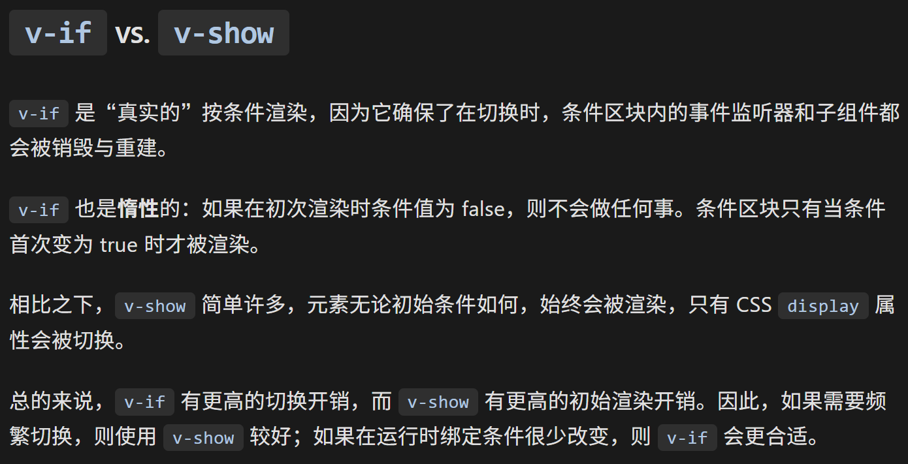

### `v-for`列表渲染
+ **<u>作用</u>**：根据数组或对象数据，自动生成一组结构属性等相同的HTML元素，提高开发效率，避免重复代码
+ 基础用法案例：

```vue
<template>
  <view class="box" v-for="(item,index) in 10">box-{{index + 1}} </view>
</template>
```

渲染效果：
                   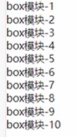

+ **<u>基本语法</u>**：`<view v-for="item in items" :key="唯一标识"> </view>`
        * `item`：要循环元素的别名
        * `items`：数组变量名或对象变量名
        * `key`：类似于主键的作用，vue要求具备
+ **<u>案例</u>**：

```vue
<template>
  <view v-for="item in kamenrider" :key="item.id">
    骑士:{{item.name}}-年份:{{item.year}}
  </view>
</template>

<script setup>
  import {ref} from "vue";
  const kamenrider = ref([
    {id:1,name:"Geats", year:2024},
    {id:2,name:"Revice", year:2023},
    {id:3,name:"Saber", year:2022}
  ])
</script>
<style>

</style>
```

渲染效果：

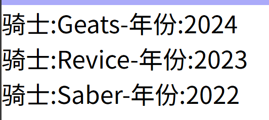

+ **<u>注意</u>**：不要在同一个组件上同时出现`v-if`&`v-for`！！

### `v-model`双向绑定（表单输入绑定）
+ **响应式**：`<script>`中的数据变了，页面也会发生改变
+ **双向绑定**：页面中的数据变了，`<script>`中的数据也会同步变化
+ **基本语法：**`<input v-model="textValue">`
+ **效果：**随着页面输入框中的数据改变，`textValue`变量的值也会同步变化
+ **底层原理：**先监听`input`事件，再绑定到事件处理函数，在函数中通过接收到的值实现变量的修改
+ **案例：**

```vue
<template>
	<view class="test4">
		<text>The message is : {{textValue}} </text>
		<input placeholder="请输入~" v-model="textValue"/>
	</view>
</template>

<script setup>
	import {ref} from "vue";
	const textValue = ref("");
</script>

<style lang="scss" scoped>

</style>

```

### `computed`计算属性
+ 作用：把`<template>`中比较臃肿的响应式语句部分放到`<script>`层中，增加代码可读性
        * 计算属性会缓存计算结果；只有响应式依赖发生变化时才重新计算
+ 使用步骤：
        1. 引入计算属性：`import {ref,computed} from "vue";`
        2. 声明计算属性的匿名函数：

```vue
const 变量 = computed(
  ()=>{
  return 表达式;
  }
)
```

+ 案例：外国姓名加法器

```vue
<template>
	<view class="out">
		<input type="text" class="box1" v-model="firstName" placeholder="请输入名"/>
		<input type="text" class="box2" v-model="lastName" placeholder="请输入姓"/>
	</view>
	<view class='res'>全称:{{fullName}}</view>
</template>

<script setup>
import {ref, computed} from "vue";
const firstName = ref("")
const lastName = ref("")
const fullName = computed(
	()=>{
		return lastName.value + '-' + firstName.value;
	}
)

</script>

<style lang="scss" scoped>
	.out{
		margin:20px 50px;
		background-color: #eee;
		input{
			border: 1px solid #ccc;
			margin: 10px 0;
			height:40px;
		}
	}
	.res{
		margin:20px 50px;
	}
</style>

```


效果：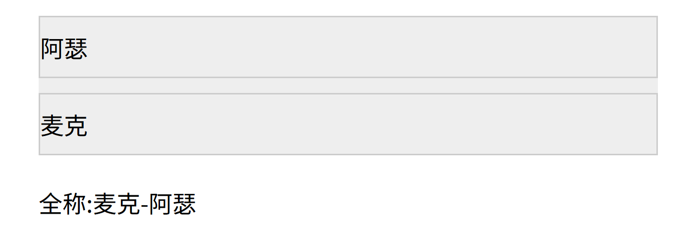

+ 注意：
        * 计算属性与响应式同理，值是`变量.value`
        * 尽量把计算属性当作只读的数据，要改去改其计算源

### `watch`监听属性
+ 作用：监听某个变量的变化，一旦发生改变就立即执行某个操作
+ 使用步骤：
        * 引入`watch`:

`import {watch} from 'vue';`

        * 使用语法：

`watch(被监听的变量,(newVal【改变后的值】,oldVal【前】)=>{ 操作函数体 })`

+ 使用案例：自动转大写输入框

```vue
<template>
	<view class="main">
		<view class="sub">
			这是一个自动转大写的输入程序
		</view>
		<input placeholder="请输入英文字符~" v-model="input"/>{{val}}
		<view class="res">转换结果：{{output}}</view>
	</view>
</template>

<script setup>
	import {ref,watch} from "vue";
	const input = ref("");
	const output = ref("");
	watch(input,(newVal)=>{
		output.value = newVal.toUpperCase();
	});
</script>

<style lang="scss" scoped>
	.main{
		padding: 40px;
		input{
			margin:10px 0;
			border: 1px solid #ccc;
			height: 40px;
			padding: 0 10px;
		}
		.res{
			border:1px solid #7bcf92;
		}
	}
</style>
```


效果：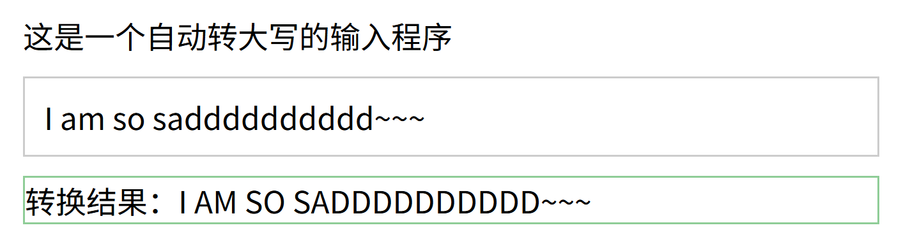

## 生命周期钩子函数
+ 钩子函数的实质是：**对生命周期的事件监听与处理**


### Vue 组件生命周期&钩子函数
[vue组件生命周期官方文档](https://cn.vuejs.org/api/composition-api-lifecycle.html)

+ **组件的生命周期**：被创建——>被挂载（渲染到页面上）——>被更新——>被销毁
+ Vue在组件生命周期的各个节点会提供相应的钩子函数，以便通过调用实现在特定节点执行特定行为

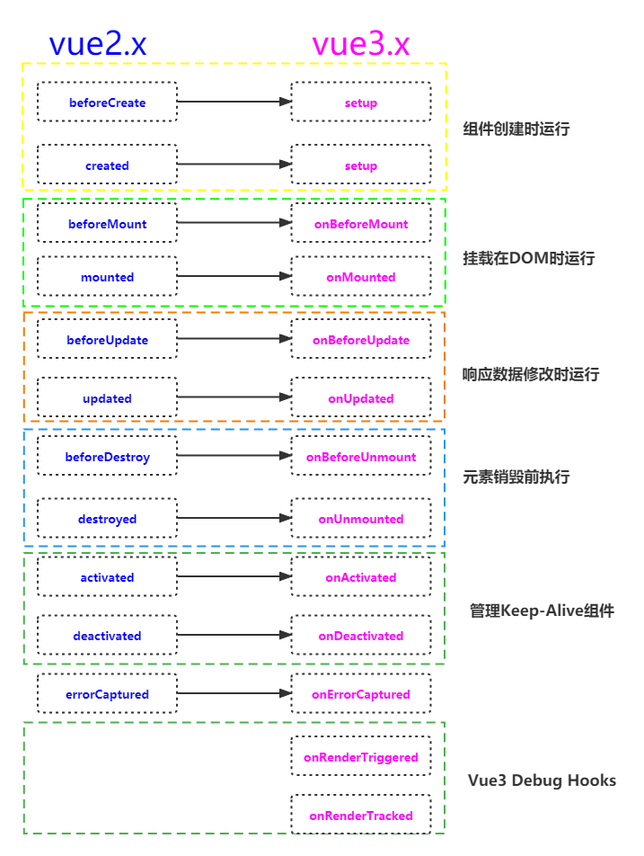

+ **使用步骤（在**`**script**`**中）：**
        1. 先从vue中引入：

`import {钩子函数名} from "vue";`

        1. 定义钩子函数：

`钩子函数名(()=>{操作函数体})`

+ 示例：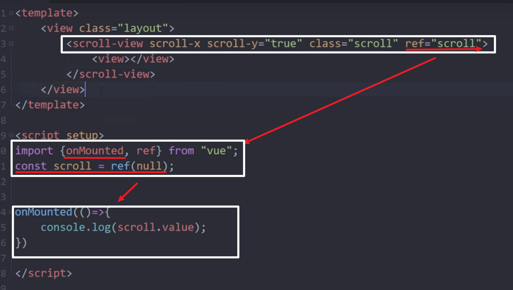

### Uniapp页面生命周期&钩子函数
[UniApp 页面生命周期官方文档](https://uniapp.dcloud.net.cn/tutorial/page.html#lifecycle)

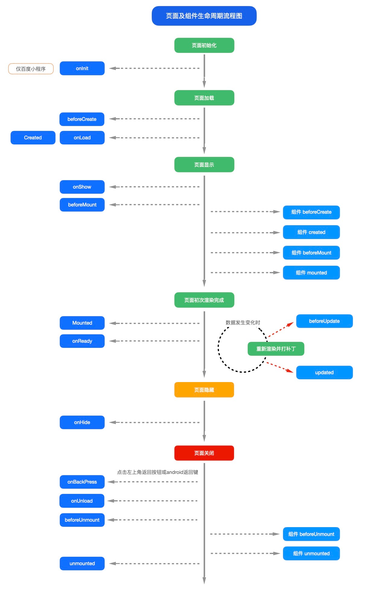

+ **使用步骤：**
        1. 从 `@dcloudio/uni-app` 中引入

`import {钩子函数名} from "@dcloudio/uni-app";`

        2. 定义钩子函数：

`钩子函数名(()=>{操作函数体});`

### Uniapp应用生命周期&钩子函数
+ 只能定义在`APP.vue`中

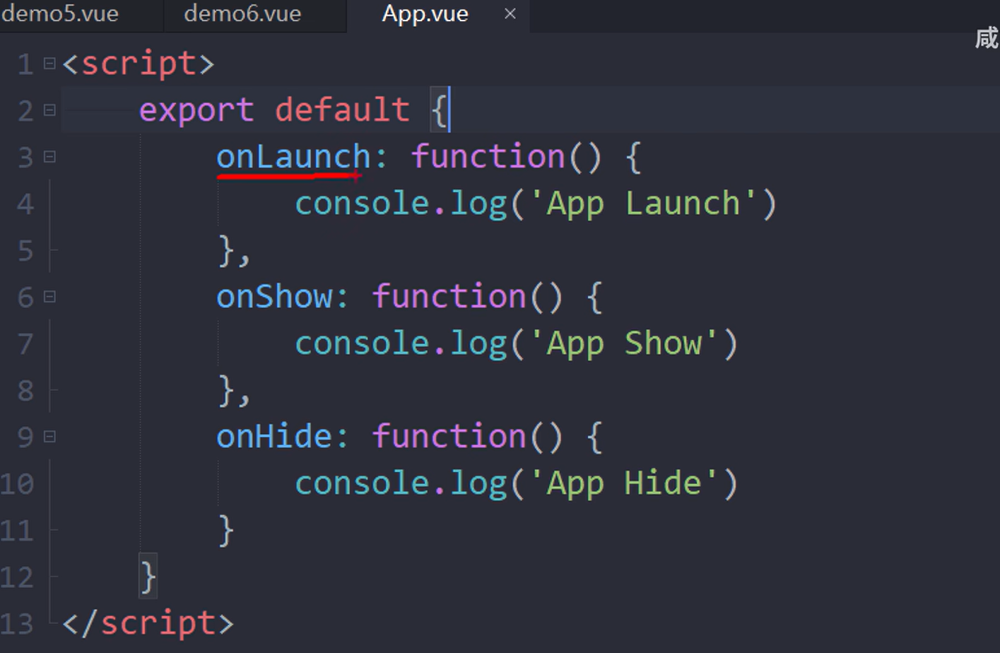

## Uniapp响应式像素单位`rpx`
+ <u>responsive pixel</u>（响应式像素）
+ `rpx`是一种自动适应屏幕的响应式单位，会根据所用屏幕自动缩放
+ **默认基准宽度**：750px（按照这个填写即可，系统会自动做出适应）

## Uniapp css样式导入&全局scss样式变量文件
**SCSS介绍：**

+ 是功能更强大的CSS预处理语言，支持嵌套语法、CSS变量等高级功能，适合开发使用
+ 构建时会先编译成标准CSS，再渲染到页面上


+ 全局scss样式变量文件`uni.scss`
        * 该文件中存储着一些定义好的样式，可以直接把css变量拿来在`<style>`中使用
        * 是全局样式，任何页面无需引入即可使用
        * 修改其中变量值，可实现全局换肤效果
        * 可以在该文件中自定义样式变量`$CSS变量名 :具体样式`
+ 外部CSS/SCSS文件应该写在**自建的**`common`目录下
+ 导入语法（在`<style>`中引入）：

`@import "@/css文件路径"`
<u>【说明：</u>`<u>@</u>`<u> 是项目根目录</u>`<u>src/</u>`<u>的别名，已在 UniApp 中配置好】</u>

## Uniapp `pages.json`全局路由配置文件
[Uniapp pages.json官方文档](https://uniapp.dcloud.net.cn/collocation/pages.html)

`pages.json` 是 UniApp 的路由+全局样式控制中心
页面路径、标题、导航栏TabBar、默认窗口设置——都在这里配置


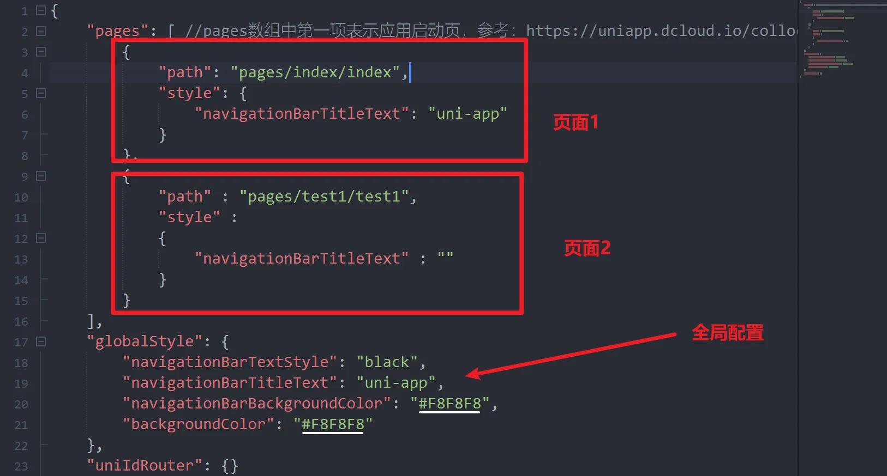

### `"globalStyle"`全局样式配置：
> 用于设置应用的状态栏、导航条、标题、窗口背景色、下拉刷新、上拉触底等等
>

### `"pages"`页面配置：
> 用于单独设置某页面的状态栏、导航条、标题、窗口背景色、下拉刷新、上拉触底等等，优先级大于`"globalStyle"`全局样式配置
>

+ 整体是一个对象数组，每一张页面都是一个对象，每一个对象包含属性：
        * `path`页面路径
        * `style`页面样式
+ 数组中的第一个对象即是启动页面
+ 创建新的页面都需要在`pages.json-"pages"`中进行注册

### `"tabBar"`导航栏配置：
> 用于设置导航栏的图标，颜色，位置等相关属性
>

+ `list`属性：**必填项**，为一个对象数组，即导航栏中的页面数量，最少2个，最多5个；`pagePath`和`text`是每一对象中的必填项

## Uniapp `manifest.json` 全局应用配置
用于在系统层面为各种平台进行项目配置，告诉系统项目是什么，干什么，怎么运行等等


## UniApp API
### UniApp 交互反馈 API
[UniApp 交互反馈官方文档](https://uniapp.dcloud.net.cn/api/ui/prompt.html)

   直接通过调用api接口并进行定义提示信息，来反馈用户的操作，告知用户“操作成功”、“操作失败”、“加载中”等等信息


+ 可以在事件监听的函数中放置交互反馈的api，以实现用户执行了某个操作后便会得到一定的页面反馈
+ 交互函数体部分是一个包含各个属性的对象，用来定义反馈信息的样式
+ **调用交互函数api语法：**`uni.交互函数({对象体})`
+ **交互函数：**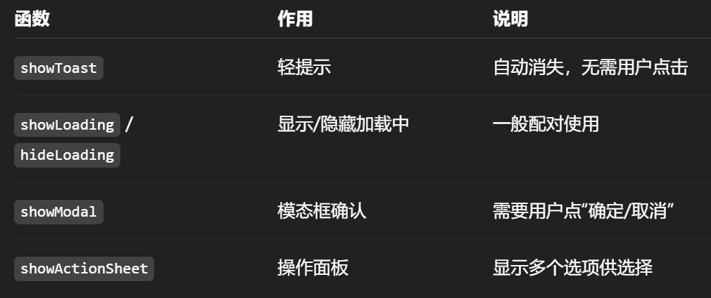
+ **示例：**

```vue
<template>
<button @click="saveData">保存</button>
</template>

<script>
function saveData() {
  uni.showToast({
    title: '保存成功',
    icon: 'success'
  });
}
</script>
```

## UniApp 网络请求
[UniApp 网络请求官方文档](https://uniapp.dcloud.net.cn/api/request/request.html)

### UniApp 原生网络请求 API
`uni.request({  })`

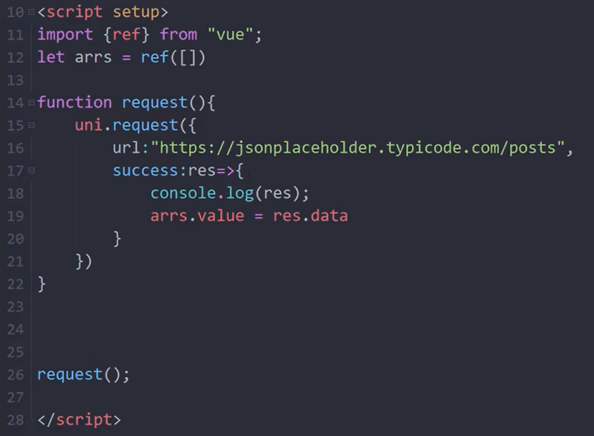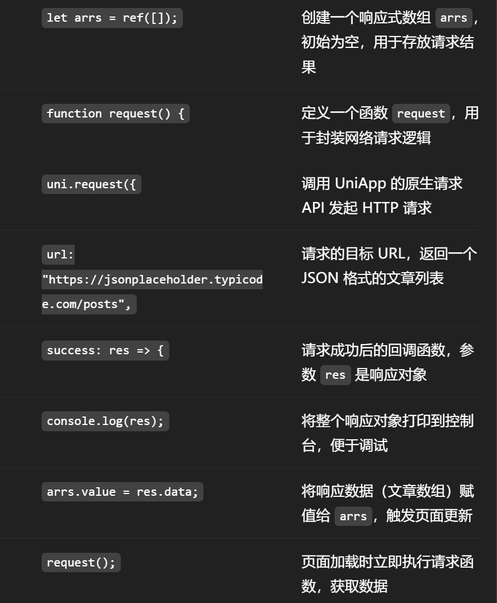

### 基于 Promise 的 `.then()` 写法
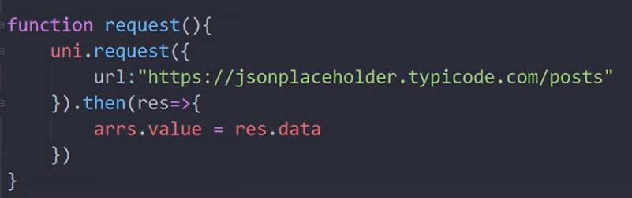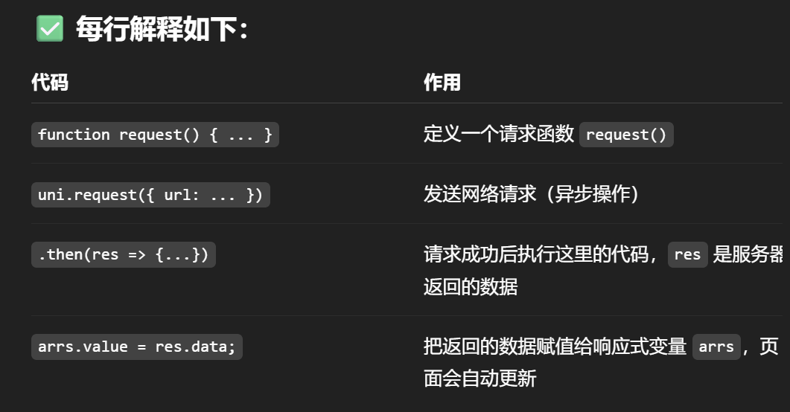

### `async/await` 写法
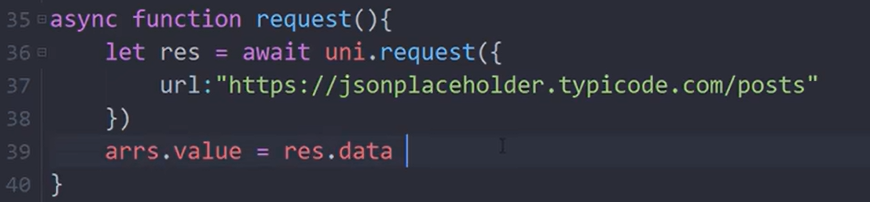

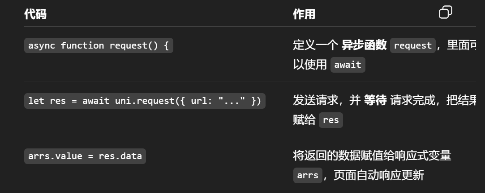

<!-- learning-journey:update-history:start -->
## 更新记录

| 日期 | 类型 | 说明 |
| --- | --- | --- |
| 2026-07-28 | 首次发布 | 从语雀整理 Vue 3、UniApp 组件、生命周期、配置与常用 API 笔记 |
<!-- learning-journey:update-history:end -->
