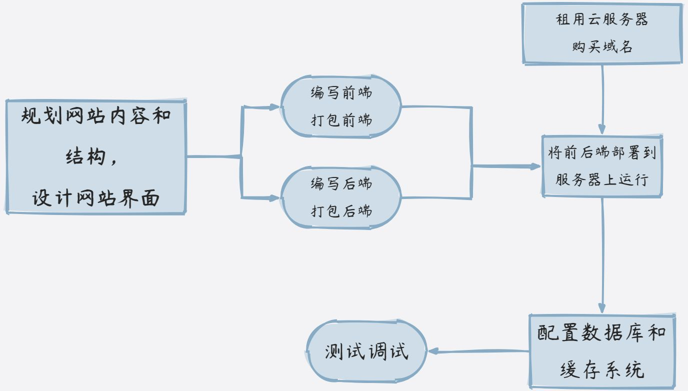
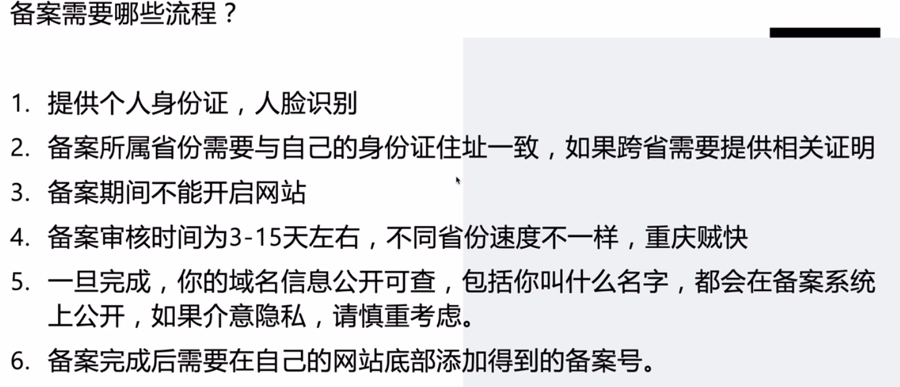
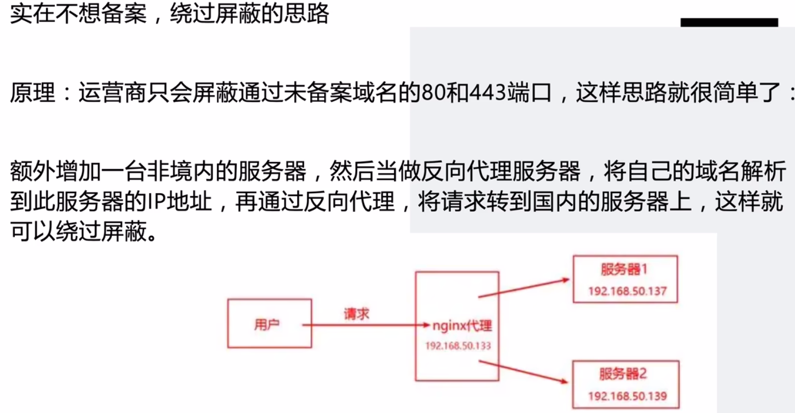

# 个人网站与博客搭建基础

## 搭建网站的简要过程

## 个人博客的组成

### 博客生成框架

- 前端三件套
- **Hexo** 框架
  - 用 **YAML** 配置博客
  - 用 **Markdown** 书写博客内容

### 文件托管平台

- 作用：把文件存储在云端，并提供访问和修改的接口
- 平台：**GitHub**
- 修改：**Git**

### 站点部署服务

- 作用：将网站内容部署到互联网上，让网络中的其他主机能够正常访问
- 服务提供商：**Netlify**

### 访问加速服务

- 原理：**CDN**（Content Delivery Network）加速，利用网页访问的局部性，通过多节点缓存提高网络内容的访问和解析速度
- 服务提供商：**Cloudflare**

## 服务器与网站空间

### 服务器是什么

- 由各大云服务商提供的、24 小时运行并处理和管理请求的服务系统，可以为部署到服务器上的网站提供公网 IP。网站域名通过 DNS 解析指向对应 IP 地址，供其他人访问。
- 本质：服务器本身就是一台 24 小时不间断运行的高性能电脑。

### 服务器的选择

- 需求决定配置。
- **服务器的 CPU 和内存**决定网站的运行速度：
  - 大量动态交互的网站（论坛等）：2 核 2G 以上
  - 单纯静态展示页面（个人博客等）：1 核 1G 完全够用（性能溢出）
- **服务器的网络带宽**决定数据传输的速度和容量，推荐 5M 以上。
- **服务器的地域选择**：
  - 国内：访问延迟很低，速度很快，但必须备案
  - 香港：延迟较低，速度较快，无需备案，但防御很贵
  - 美日韩等国外：延迟高、速度慢，在不科学上网的前提下有概率被防火墙屏蔽

> **参考截图**

- 租用云服务器适合前后端结合、需要大量处理数据的项目和网站。
- 如果只想做一个单纯由前端驱动的静态网页，建议选择网站空间。
- **警惕流量计费产品，超过每月流量包后可能产生较高费用。**

### 网站空间是什么

网站空间类似于服务器，也可以提供公共访问，但有所不同：

- 缺点：
  - 网站空间只能挂静态页面，无法运行 Java 等后端环境
  - 网站空间的网络带宽可能共享使用
  - 网站空间的服务器资源也可能共享使用
- 优点：
  - 性价比高，价格远低于租用一台云服务器

如果是前后端分离的项目，可以使用网站空间挂前端，同时租用带宽较小的云服务器运行后端。

### 图床是什么

图床是专门用于存储和管理图片的服务器系统，帮助用户更方便地分享、存储和展示图片。

- 如果没有图床：若图片未随网站部署，或文章仍引用本机路径，线上文章将无法加载图片；正确部署后的图片不受本机文件删除影响。
- 使用图床：图床会为每张图片生成链接，会一直保存、不会丢失且加载速度快。

## 域名

### 域名是什么

- 域名是绑定网站 IP 地址的名称，相当于给网站的 IP 地址设置一个简单好记的别名。
- 域名通过 DNS（域名系统）解析为 IP 地址，浏览器再通过 IP 地址加载网站。
- 域名购买完成后，添加域名并解析到服务器 IP 地址即可完成绑定。

### 域名的组成

以 `www.example.com` 为例：

- 顶级域名（TLD）：`.com`
  - 其他例子还有 `.cn`、`.org`、`.net` 等
  - 表示该域名的类别或所属地区
- 二级域名：`example`
  - 通常是具有代表性和身份识别功能的网站名称、公司或品牌名称
- 子域名：`www`
  - 可根据需要创建多个子域名，指向不同的服务或内容，如 `blog.example.com`、`shop.example.com`

### 域名的注册

- 到各大云服务商站点注册。
- 顶级域名无法自定义。
- 注册的是二级域名；一旦注册成功且未到期，其他人无法重复注册重名的二级域名。

### 域名是否需要备案

如果服务器位于境内，域名也必须备案，否则会被拦截而无法继续访问。

<!-- learning-journey:update-history:start -->
## 更新记录

| 日期 | 类型 | 说明 |
| --- | --- | --- |
| 2026-07-22 | 首次发布 | 合并整理《搭建网站相关知识》和《个人博客搭建》并发布 |
<!-- learning-journey:update-history:end -->
