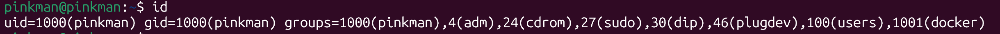
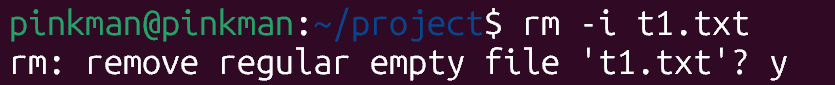
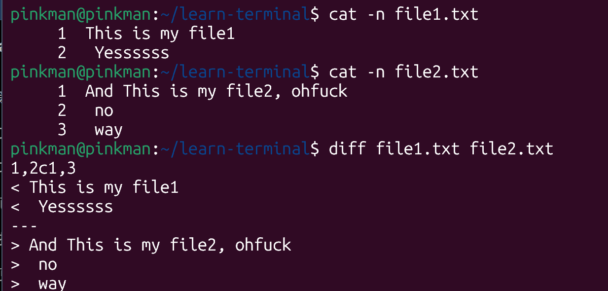
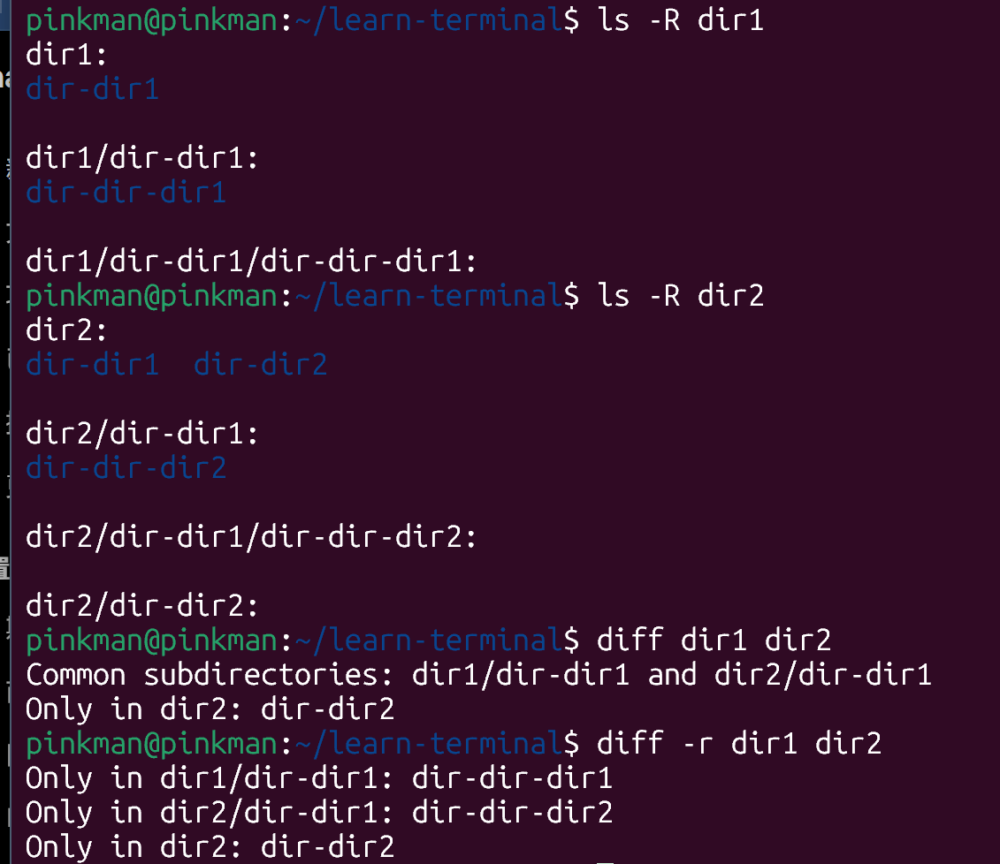

# Linux 终端

> 学习网站：
>
> [https://labex.io/zh/labs/linux-basic-files-operations-270248?course=quick-start-with-linux](https://labex.io/zh/labs/linux-basic-files-operations-270248?course=quick-start-with-linux)
>
> [https://labex.io/zh/labs/linux-linux-ls-command-content-listing-219205?course=linux-basic-commands-practice-online](https://labex.io/zh/labs/linux-linux-ls-command-content-listing-219205?course=linux-basic-commands-practice-online)
>

# 基础内容
+ Linux 区分大小写
+ `~`：用户的家目录

# 常见命令
## 基础系统命令
+ `echo`：打印后续内容
    - `echo "打印的文本字符串"`
    - `echo ~`：打印用户的主目录
+ `whoami`：获取当前用户名
+ `id`：获取用户的详情信息
    - `id`：获取当前用户的详情信息
    - `id <其他用户名>`：获取其他用户的详情信息 / `id root`：系统管理员的详情信息
    - 
        * uid：用户 ID
        * gid：主 组 ID
        * goups：所属所有组与 ID
    - `id -un`：请求用户的特定信息；`-u`为只显示 uid，`-un`为显示 uid 的名称
+ `man <命令名称>`（manual）：显示命令的官方手册

## 文件系统操作
+ `pwd`（print working directory）：打印当前的工作目录，即显示在文件系统中的当前位置

---

+ `ls`：查看当前目录的内容
    - `ls ~`：查看主目录内容
    - `ls <目录名>`：查看当前目录下的某个目录的内容
    - `ls -l`：查看当前目录内容的长格式列表（详细信息——文件权限、所有者、大小、修改日期、文件名）  

    - `ls -a`：查看当前目录的全部内容（隐藏文件也会显示）
    - `ls -al <目录名>`：查看某个目录的全部长格式列表
    - `ls -R`：递归地列出当前目录全部内容（全部子目录内容都会被列出）  

---

+ `cd`：进入某个目录
    - 可跟相对路径或绝对路径：`cd project`/`cd /home/pinkman/project`
    - `cd ..`：向上移动一级到父目录
    - `cd ~`：进入主目录
+ `touch <文件名.拓展名>`：创建空文件，若文件已存在，会更新时间戳而不更新内容
+ `touch .<文件名.拓展名>`：创建隐藏文件，在 linux 中，以`.`开头的文件或文件夹被视为隐藏
+ `echo "文本内容" > 文件名.拓展名`：`>` 符号将 `echo` 的输出重定向到一个文件中。如果文件不存在，则会创建它；如果文件已存在，其内容会被替换
+ `mkdir <目录名>`：创建目录
+ `cp`：复制操作
    - 当前目录下复制粘贴文件：`cp <文件名> <新文件名>`
    - 复制文件到某个目录：`cp <文件名> <目录名>/`
    - 当前目录下复制粘贴目录：`cp -r <目录名> <新目录名>`；`-r`表示递归地，复制目录时必须带此选项
+ `mv`：移动和重命名操作
    - `mv <文件名/目录名> <新文件名/目录名>`：重命名文件/目录
    - `mv <文件名> <目录名>/`：将文件移动到某个目录下
    - `mv 目录名/文件名 ./新文件名`：将文件从目录中移出并完成重命名；  
`mv testdir/newname.txt ./original_file1.txt`
+ `rm`：删除操作
    - `rm <文件名>`：删除文件
    - `rm -i <文件名>`：交互式删除文件（更安全），系统会询问是否确定删除，输入`y`确认，其他均不删除
    - `rmdir <空目录名>`：删除空目录，非空无法删除
    - `rm -r <目录名>`：删除非空目录（使用递归的方式）
    - `rm -f <文件名>`：强制删除
    - `rm -rf <目录名>`：递归强制删除某个目录，极其危险！！`rm -rf /`：删除整个系统

## 文件内容操作
+ `cat <文件名>`：打印文件内容
    - `cat -n <文件名>`：带编号地打印文件内容
+ `head -n1 <文件名>`：打印文件的前 1 行，`-n`后面是几就打印前几行，没有`-n`默认打印前十行
+ `head -c1 <文件名>`：打印文件的前 1 个字节
+ `tail -n1 <文件名>`&`tail -c1 <文件名>`：打印文件最后几行或几个字节，同上；但文件最后一个字节通常是换行符
+ `diff <文件 1> <文件 2>`：比较并查看两个文件内容的差异
    -   

        * `1,2 c 1,3`： 第一个文件的第 1～2 行，需要修改（change）成第二个文件的第 1～3 行  
+ `diff <目录 1> <目录 2>`：比较两个目录的第一层的区别
+ `diff -r <目录 1> <目录 2>`：比较两个目录第一层的区别，且递归地比较两个目录名称相同的子目录中的区别
    - 
