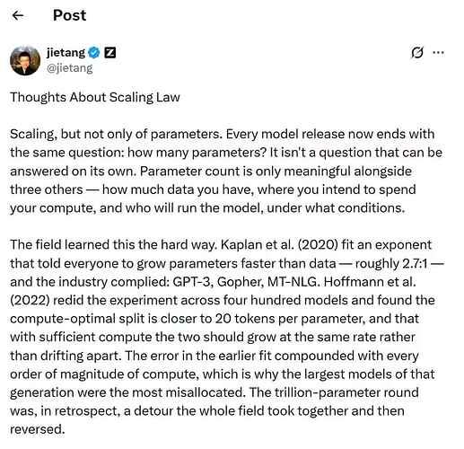
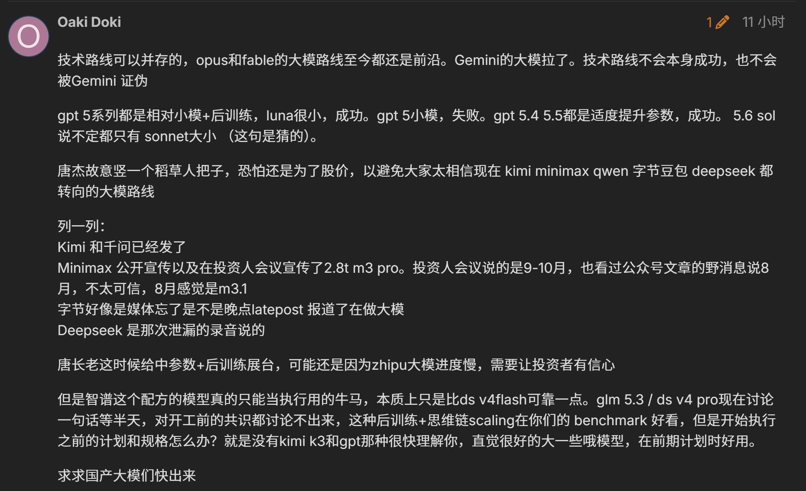

# AI 领域热知识

## GLM-5.2 到 GLM-5.3：唐杰团队对于 Scaling Law 的看法

智谱人工智能创始人唐杰指出【以下为唐杰团队立场】：**GLM-5.3 与上一代 GLM-5.2 共用相同基座、相同架构、相同的 744B 总参数与 40B 激活参数，差异仅在于增加了一个月的长时域环境训练与强化学习（RL）后训练；但模型能力的提升是比较明显的（AA 评测的 53 分到 60 分）。**

Z.ai 的[官方说明](https://z.ai/blog/glm-5.3)也提到，GLM-5.3 使用与 GLM-5.2 相同的基础模型，本轮能力提升来自后训练阶段对环境、任务与计算规模的扩展。

因此，其佐证了唐杰团队对 Scaling Law 的最新理解：

**参数量从来不是评估模型能力的唯一维度；当基座模型参数规模已足以承载足够的知识，额外的能力提升往往来自“拨动其他旋钮”——尤其是后训练阶段，而非继续堆砌参数。这一判断对当前整个 AI 行业如何分配训练资源，具有直接的参考价值。**

btw，理性对待，如下：

## Hy3 Preview 总参数小于上一代：混元团队对于 Scaling Law 的看法

混元团队方面表示，在训练新模型时，团队思路是不盲目 Scale Up（即通过堆更多参数来提升模型能力），而是将更多核心资源投入**数据质量**。

**Hy3 Preview 的总参数小于前一版本，但更“实际”。**

理论上，**300B 是能力与效率的最优平衡带。复杂推理、长上下文理解、指令遵循等能力在这个量级已经可以得到释放。**

<!-- learning-journey:update-history:start -->
## 更新记录

| 日期 | 类型 | 说明 |
| --- | --- | --- |
| 2026-08-20 | 首次发布 | 从语雀整理并发布到学习记录仓库 |
<!-- learning-journey:update-history:end -->
