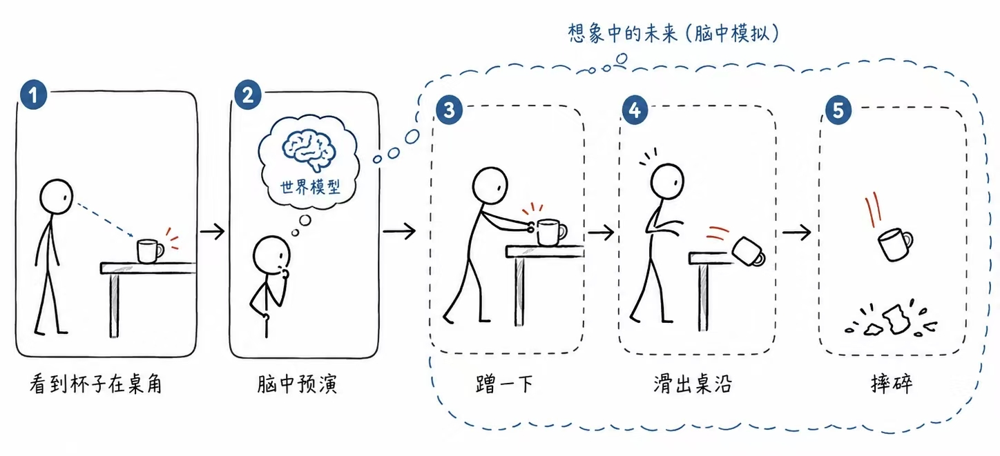
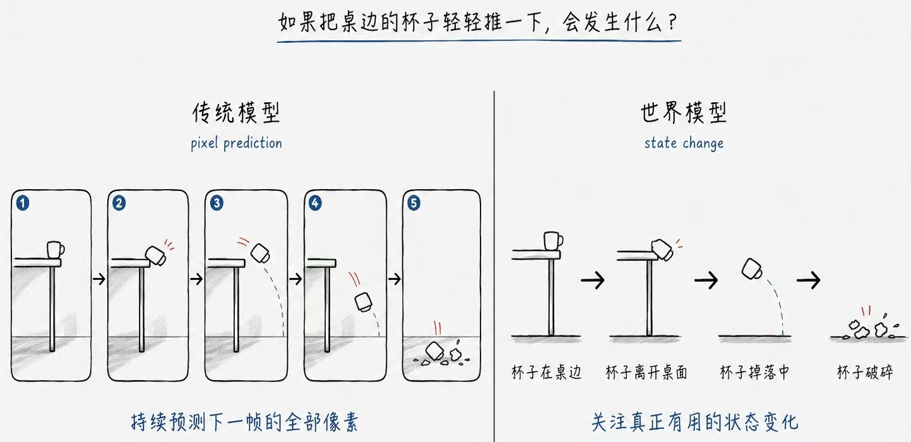
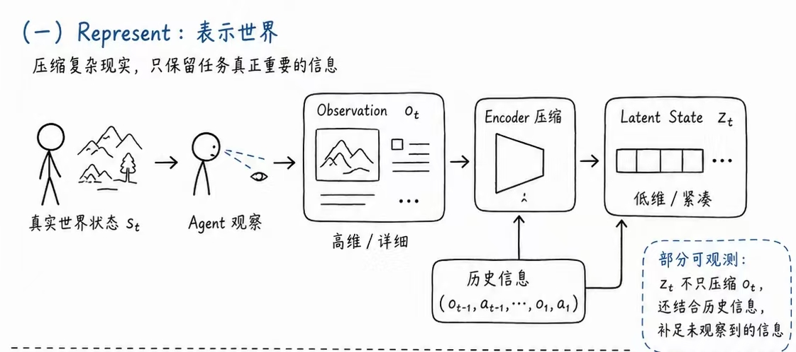
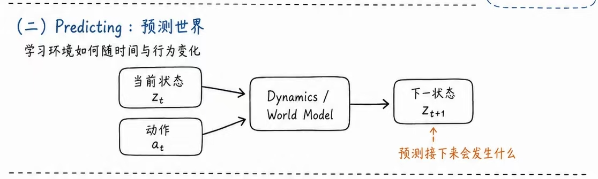
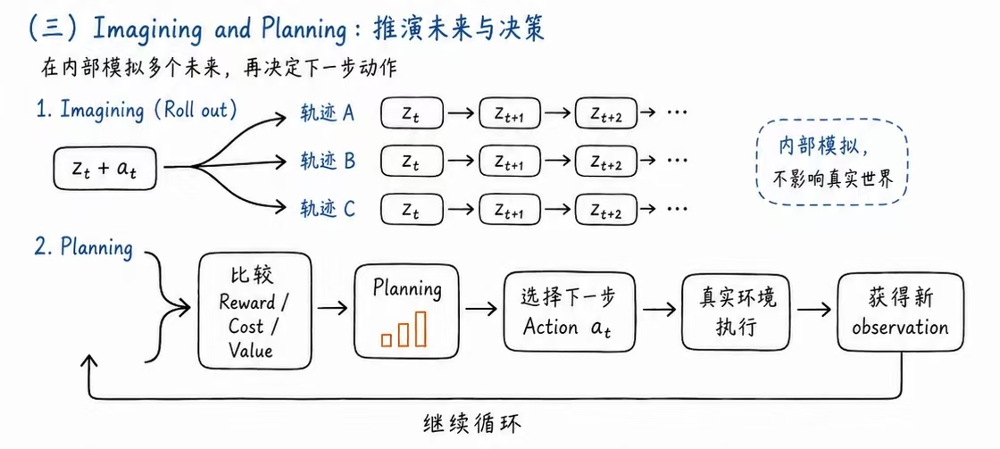
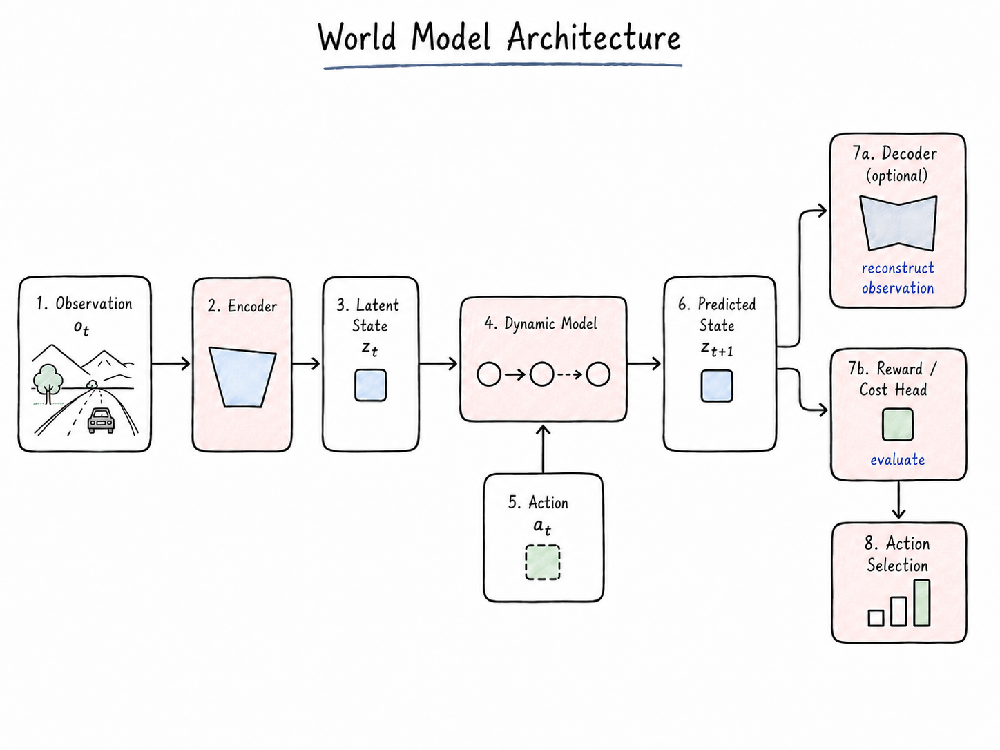

> 备用 Linux 帖名：科普向 | 一文讲解“世界模型”——World Model
>
> 学习资料：
>
> - [x] [这是一篇把“世界模型”讲明白的科普级综述！](https://www.sohu.com/a/1030274198_122105141)
> - [x] [当 AI 学会做白日梦：世界模型如何让机器拥有预知未来的能力](https://cloud.tencent.com/developer/article/2669271)
> - [x] [什么是世界模型（World Model）](https://aws.amazon.com/cn/what-is/world-model/)
> - [x] [关于世界模型的二三思考](https://linux.do/t/topic/2682547)
> - [x] [Understanding AI World Models](https://fenxi.fr/en/blog/understanding-ai-world-models/)
> - [x] [What Is a World Model? AI That Simulates Reality](https://ai-tldr.dev/learn/multimodal-ai/video-and-beyond/what-is-a-world-model/)
> - [x] [World Models](https://arxiv.org/abs/1803.10122)

# 什么是世界模型 World Model

## 世界模型的概念起源

世界模型的概念最早来源于心理与神经科学，一种直观的说法是，每个人的大脑都相当于拥有一个现实世界的小尺寸模型，大脑的本质就是预测世界并进行信息处理的预测机。换句话说，任何人的人脑都是一个内部的“世界模型”。

举个例子：

当我们看到一个杯子在桌角咔咔时，我们可以在没有产生实际动作的基础上，也能很自然地联想到：当前杯子在桌面边缘，假如我经过不小心蹭了一下——>杯子移动出桌沿——>杯子摔下桌子——>杯子摔碎（可能）。

这就是大脑利用世界模型进行预演的完整实例。

## 世界模型概念的理论解释

世界模型的**本质**是一个 AI 系统。

- 其输入是当前“世界”的状态 + 一个动作；
- 而输出是预测这个“世界”在经历这个动作之后的一系列状态（直至达到规定时域）。

因此，世界模型的核心能力即为：在给定的“现在 + 动作”基础上，预测“未来”。

## 世界模型的目标

世界模型期望让 AI 具备像人一样：在采取行动前先在脑内推演一遍后果的能力，这是该领域的最终目标、也是 AI 发展的重要方向。

世界模型是迈向通用 AI（AGI）的关键一步，代表了从“数据拟合”向“物理理解”的根本转变。

## 世界模型与语言模型的异同点

目前对于世界模型的定义与应用较为混乱：

- **广义上**，能够预测“下一刻会发生什么”的系统都属于世界模型，因此在这种意义下，语言模型、视频生成模型、乃至天气预报，都宽泛地属于世界模型；
- 但我们通常讨论的是**狭义上**的世界模型：即学习环境的动态规律，**以当前观测与动作为条件**，**预测采取动作后环境未来可能处于什么状态**；因此，语言模型预测下一个词，而世界模型预测“下一个场景状态”。

---

再使用一开始的例子做类比：假设模型想知道蹭了一下杯子会怎么样。

- 传统的视频预测类模型会持续地预测下一帧的全部像素；
- 而世界模型实际上不需要完整重建物理光照、3D 遮挡、物理运动等预测每一帧需要关注的细节；而是只专注于：杯子移动出桌面——>掉下去——>摔碎的真正有用的状态变化。

# 世界模型的三种核心能力

## Represent：表示世界

Represent 是世界模型的第一项基本能力。

由于真实的现实世界状态 $s_t$ 极其复杂，难以完全表达并完整存储全部细节；因此世界模型引入一种“压缩表示”，只保留当前任务真正重要的信息，以供模型的训练与学习。

世界模型通常会借助编码器 Encoder，把高维的 Observation $o_t$ 压缩为一种 Latent State（潜在状态）$z_t$。

具体链路：

$$
s_t \xrightarrow{\text{Agent 观察}} o_t \xrightarrow{\text{Encoder 压缩}} z_t
$$

> 注：由于现实环境是部分可观测的，因此 $z_t$ 除了压缩 $o_t$ 外，还需要结合历史信息，推断观测到的 $o_t$ 所不包含的信息。

## Predicting：预测世界

世界模型的第二项能力为学习世界如何随着时间和行为发生变化，即学习环境的动态规律：

基于当前状态 $z_t$ 和所采取的动作 $a_t$，模型应当能够判断接下来会发生什么。

具体链路为：

$$
(z_t + a_t) \xrightarrow{\text{动态预测}} z_{t + 1}
$$

## Imagining and Planning：推演未来与决策

世界模型最重要的是具备推演多种可能未来，即进行“if……，then……”的情景模拟；最终根据模拟出的多个未来，比较并决策下一步在真实世界中执行的 Action。

### Imagining：Rollout（轨迹展开）

很好理解，即基于第一步推演的 $z_{t+1}$ 和 $a_{t+1}$ 作为新的输入，继续推演未来状态直至达到规定时域。

$$
(z_{t + 1} + a_{t+1}) \xrightarrow{} (z_{t + 2} + a_{t+2}) \xrightarrow{\text{达到规定时域}} (z_{t + n})
$$

世界模型的核心价值在于，Imagining 在自己内部模拟，而不会影响真实的世界状态。

### Planning

世界模型可以同时模拟多条想象轨迹（$\tau_A, \tau_B, \tau_C, \ldots$）；最终决策便在多条轨迹的比较中决定，进而选择下一步 Action，实现最终决策并执行，获得新的 Observation 后继续循环。

$$
\{\tau_A, \tau_B, \tau_C, \ldots\} \xrightarrow{\text{Evaluate}} \tau^{*} \xrightarrow{\text{FirstAction()}} a_t
$$

# 世界模型的架构组成

世界模型目前没有一个公认的统一架构，但可以抽象为几个关键版块：

1. **Encoder 编码器**：负责将高维的 Observation 压缩为模型内部紧凑的 Latent State，即 $o_t \xrightarrow{\text{Encoder}} z_t$，是实现 **Represent** 功能的核心组件；
2. **Dynamic Model 动态模型**：是世界模型最核心的组成部分，负责学习环境状态如何随着 Action 和时间变化，是形成 **Rollout** 的核心组件；
3. **Decoder 解码器（可选）**：Latent State 通常是人类不可读的向量表示，Decoder 可以把内部预测重新转换成现实世界中的可观察形式，即 $z_{t+1} \xrightarrow{\text{Decoder}} \hat{o}_{t+1}$；
4. **Reward/Cost Head 奖励 / 代价预测头**：根据预测状态，输出相应的评价；负责评估预测结果的好坏；
5. 最佳行为选择的决策过程。

---

世界模型运行的全流程抽象：

$$
\boxed{\text{Represent} \rightarrow \text{Predict} \rightarrow \text{Imagine} \rightarrow \text{Evaluate} \rightarrow \text{Plan} \rightarrow \text{Act}}
$$

# 世界模型的价值

## 世界模型改变了 AI 的学习方式

多数机器学习系统需要巨量且高质的训练数据才能构建，而掌握了世界模型的 Agent 则可以通过想象推演自行生成训练数据，从而用少得多的真实经验习得有用的行为，进而提升样本效率，减少了训练数据需求。

## 通过模拟实现更好的规划

具备了世界模型的 AI Agent 可以通过实际的推演测试各种 Action，比较未来的可能场景并选择最优方案。

## 因果推理具有更好的泛化潜力

世界模型学习捕捉的是环境的规律性模式：场景的动态变化、约束条件、因果关系；对于事物理解更加透彻，在一个环境中学到的物理规律也可以迁移到新环境，因而对于新情境有着更好的泛化性，也有能力预测它从未精确见过的情境。

# 世界模型的现有缺陷

- 一旦模型出现幻觉，规划行为将处在一个与现实不符的充满风险的虚拟环境中，而累积误差则限制了模型在长期规划任务中的使用；
- 在相关性的基础上更进一步，学习应用真正的因果关系困难得多，亟需更好的训练和数据；
- 现实世界充满噪音和难以预测性，世界模型的鲁棒性是一个重要挑战，在模拟环境中学习的世界模型应用到现实时，往往因为细微差异（光线、材料特性、传感器噪声）而性能下降，这是真实与模拟难以逾越的鸿沟。

---

总之来说，想法是美好的，现实是骨感的。构建世界模型所需的目标函数、计算规模、数据量都还远远不够，有关世界模型三种路线的现状大家感兴趣也可以去看这位佬的[分析帖子](https://linux.do/t/topic/2682547)，佬对于世界模型理解的深刻程度已经达到了另一个高度，看完真的得到了很深的启发；当然对于“世界模型是否是正确答案”，业内也有着很激烈的讨论；Google DeepMind 公开说明 Gemini 的演进方向就是“成为世界模型”，但实现方式是在大型多模态 LLM 上叠加具身推理能力，而不是推翻生成式范式另起炉灶。未来会怎么样，我们人脑的“世界模型”都尚且未知。

# 结语

其实我们每天都在做这样的事——凌晨刚合上电脑，又会立刻想到几个小时后还要响起的闹钟；月底看一眼余额，脑子里已经开始盘算接下来几天该怎么过；失意时想到远在故乡的亲人，也总会忍不住设想：万一有一天，自己还没来得及赚到钱、好好孝敬他们，就失去了机会，那该有多遗憾。

人类似乎总是这样。很多事情明明还没有发生，却已经先在脑海里经历过一次，甚至有些悲观主义者（没错就是本人）早就在还没有发生的可能坏结果上心碎徘徊了几十遍。如果未来真的有一天，AI 真的能像人类一样权衡利弊地想象决策，甚至说是幻想也不为过，AI 的行为能够真正触发人类的共情的那一刻，我想这才是世界模型最值得令人期待的瞬间。

<!-- learning-journey:update-history:start -->
## 更新记录

| 日期 | 类型 | 说明 |
| --- | --- | --- |
| 2026-08-26 | 首次发布 | 从语雀整理并发布到学习记录仓库 |
<!-- learning-journey:update-history:end -->
