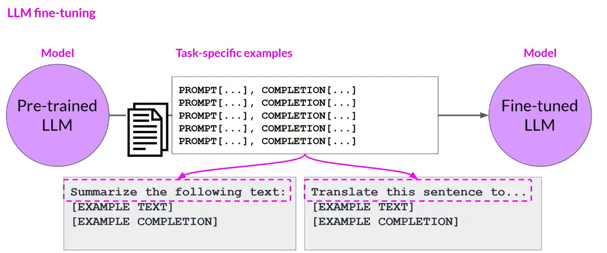
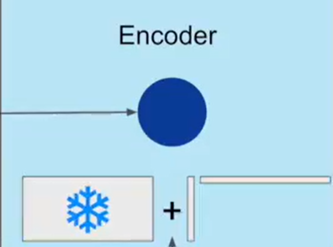
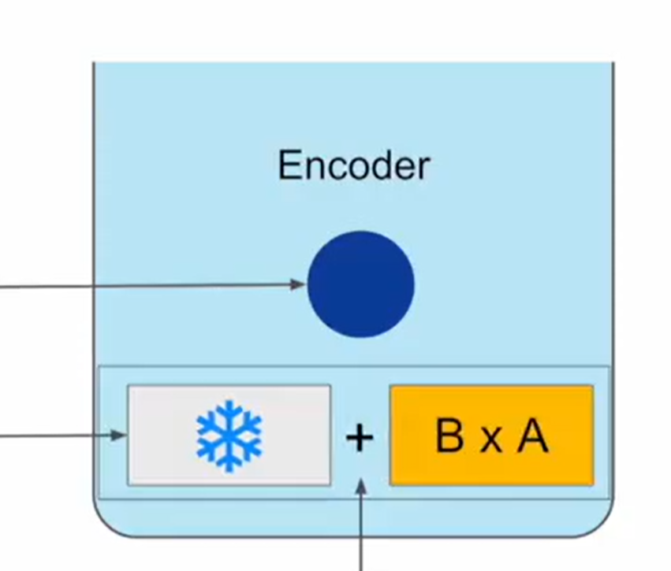
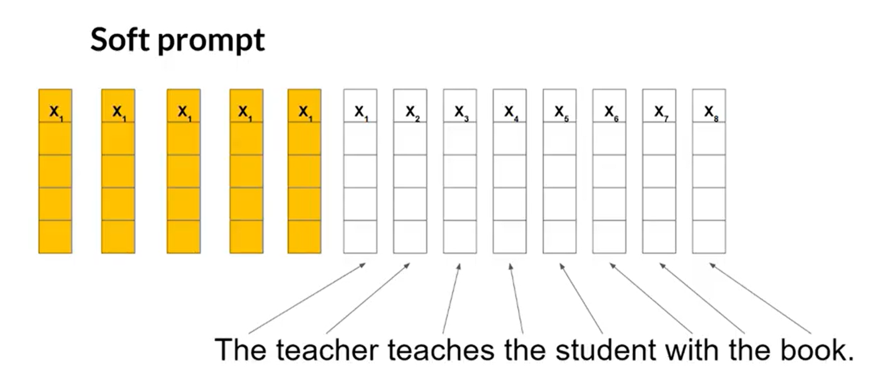

# LLM 微调（Fine-tuning）

> 进一步训练基础模型，以提高其对于特定任务输出结果的性能表现。

## 预训练与微调

- **预训练**：使用大量非结构化文本数据，通过自监督学习训练 LLM。
- **微调（一般指指令微调）**：使用带有标签的数据集（Prompt + Completion），通过有监督学习更新 LLM 的权重。

## 指令微调（Instruction Fine-tuning）

### 定义

- 通过**指令**和**示例（Prompt + Completion）**来训练模型，示例展示了模型如何响应特定的指令。
- 想要提高 LLM 的什么能力，就用对应行为指令的示例微调。
- 指令微调得到的新模型叫作**指令模型（Instruct Model）**。

- **全面微调（Full Fine-tuning）**：模型的所有权重都被更新的指令微调。

### Prompt Template Libraries（提示词模板库）

#### 作用

- 将已有的**公开数据集**转化为用于**微调**的**指令提示数据集**。

#### 形式

### 微调步骤

1. 将指令数据集分为**训练集（Training Set）、验证集（Validation Set）、测试集（Test Set）**。
2. 从**训练集**中选择 Prompt 提供给 LLM，生成 Completion。
3. 将 **LLM 生成的 Completion** 与**训练集中指定的 Completion** 进行比较，使用标准交叉熵函数计算 **LLM 生成的概率分布**与**数据标签中指定的概率分布**之间的损失。
4. 使用计算的损失，通过**反向传播（Backpropagation）**更新模型权重。
5. 定义评估步骤：使用**验证集**评估模型性能，获得验证准确性（Validation Accuracy）。
6. 完成微调后，使用**测试集**进行最后的性能评估，获得测试准确性（Test Accuracy）。

## 单任务指令微调与灾难性遗忘

灾难性遗忘是对模型进行单一任务微调时可能导致的结果。

### 表现

模型只在微调过的单一任务上表现优异，但极大降低了其他任务的性能，甚至表现出与微调过的单一任务相关的行为。

### 原因

全面微调过程会改变原始 LLM 的全部权重。

### 处理方式

- 若希望 LLM 只专注于单一任务，则无所谓。
- 若希望 LLM 保持多任务泛化能力，可以同时在多个任务上进行微调，或执行**参数高效微调（PEFT）**。

## 多任务指令微调（Multi-task Instruction Fine-tuning）

- 训练数据集由多个任务的示例输入和输出组成。
- 缺点：需要大量的数据支持。

## 参数高效微调（Parameter-Efficient Fine-tuning，PEFT）

### 作用

- 指令微调对内存和计算资源花销过大，全面微调会更新模型的全部权重。
- PEFT 专注于微调现有模型参数的子集，通过技术手段冻结大部分模型权重，只更新一小部分模型参数，使得模型性能表现更优异。
- PEFT 对原模型的修改较小，使得灾难性遗忘不易发生。

### PEFT 方法

#### Selective Method（选择性方法）

只选择模型的某个组件、某个层，甚至某个参数进行微调。

#### Reparameterization Method（重参数化方法）

- 在原模型参数网络的基础上进行低秩转换，减少要微调训练的参数数量。
- 常用技术：**LoRA**。

#### Additive Method（加法方法）

- 在保留所有原模型参数的基础上，引入新的组件进行微调。
- 主要方法：
  - **Adapters**：在模型架构中添加新的可训练层，通常放在 Encoder 或 Decoder 组件的注意力层或前馈层之后。
  - **Soft Prompts**：保持模型架构固定，专注于优化 Prompt 输入。

## LoRA（Low-rank Adaptation，低秩适应）

- 属于 PEFT 中的 Reparameterization Method。
- LoRA 方法在不改变参数数量和减少微调参数数量的基础上进行微调，开销小。

### 在自注意力层应用 LoRA 的原理过程

> 也可以在其他组件（如前馈层）中应用 LoRA，但 LLM 大部分参数都集中在自注意力层中。
>
> [具体案例见视频第 18 分集](https://www.bilibili.com/video/BV1zasyziEqF?p=19)

1. 冻结整个原模型的所有参数。

2. 在原始参数矩阵旁注入一对秩分解矩阵，进而减少所要微调的参数数量；这对矩阵维度相乘后与原矩阵维度相同。

3. 微调秩分解矩阵中的参数。
4. 两个低秩矩阵相乘，得到一个与冻结原矩阵维度相同的矩阵。

5. 将新的矩阵加到原始参数矩阵上进行更新。

## Prompt Tuning（提示词调整）

- 属于 PEFT 中 Additive Method 的 Soft Prompt。

### Prompt Tuning 与 Prompt Engineering

- **提示词工程**：
  - 通过手动修改、编写 Prompt，帮助模型理解所要执行的任务和期望结果。
  - 缺点：需要大量修改 Prompt，受上下文窗口限制，性能提高有限。
- **提示词调整**：
  - 向提示词中添加额外的可训练 Token（Soft Prompt），使模型通过具体任务的训练目标更新它们的最优值。
  - 可以为每个任务训练一组不同的 Soft Prompt，在推理时根据任务需要进行替换。
  - 优点：只有极少的新添加参数被训练，效率高。

### 原理过程

1. 冻结 LLM 的全部权重参数，保证底层模型不会更新。
2. 将可训练的 Token（Soft Prompt）添加到输入文本的嵌入向量之前。Soft Prompt 与 Token Embedding 的向量维度一致，但提示 Token 的数量可以独立设置。

3. Soft Prompt 在多维嵌入向量中被初始化为任意值。
4. 模型通过具体任务的训练目标，不断更新 Soft Prompt 的嵌入向量，以优化 Completion 生成。

<!-- learning-journey:update-history:start -->
## 更新记录

| 日期 | 类型 | 说明 |
| --- | --- | --- |
| 2026-07-25 | 首次发布 | 从语雀整理并发布到学习记录仓库 |
<!-- learning-journey:update-history:end -->
