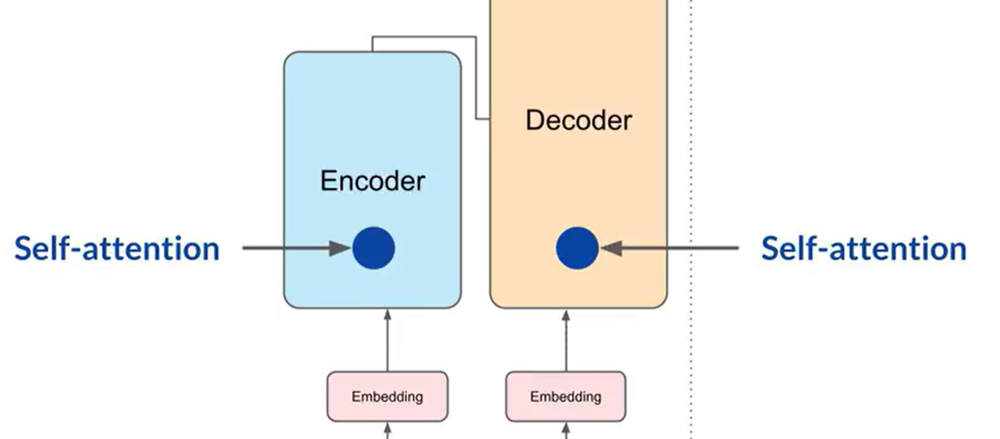
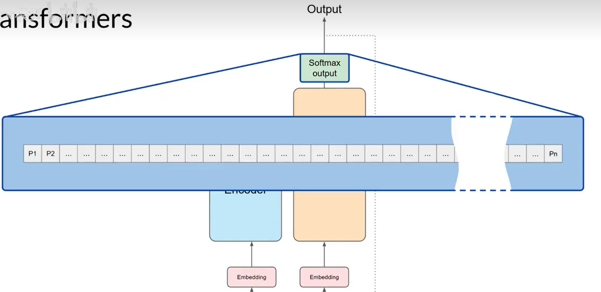

# Transformer 架构

## RNN（循环神经网络）

- **RNN 架构**是 **Transformer 架构**到来之前被广泛应用于语言模型的架构。
- **缺陷：**随着上下文窗口的增长，RNN 的计算和内存需求呈现指数型增长，导致模型可能没有能力看到足够的 Prompt 来做出好的预测。

## Transformer 架构

### 产生标志

2017 年，Google 与 University of Toronto 发表《*Attention Is All You Need*》。

### 特点

- 可以借助多核 GPU，**并行处理**输入数据。
- **注意力机制**：具有学会关注正在处理的词的含义的能力。

## 关键属性：自注意力机制（Self-Attention）

模型学习句子中所有单词的相关性和上下文的能力，不再局限于相邻单词，而是包括每一个单词和句子中其他全部单词的关系。

## 工作原理

[架构具体运行全流程案例见第七节](https://www.bilibili.com/video/BV1zasyziEqF?p=7)

Transformer 架构被分成两个独立的部分：**编码器、解码器**。

> 单独用编码器或解码器也可作为架构的变体，应用于具体场景。

- 离开编码器的数据是**输入序列的结构和含义的深层表达**，会进入解码器中间，以影响**解码器的自注意力机制**。
- 解码器会根据一个输入的**序列开始 Token** 依次循环输出，每次输出一个**预测 Token**，然后将输出 Token 再反馈到解码器输入中，开始新的下一个 Token 的预测，直到模型预测到**序列结束 Token**，完成全部输出。

## Tokenization（分词）

### 原因

- 模型是大规模的**统计计算模型**，实质真正处理的是**数字**。

### 作用原理

- 将单词转化为**数字（Token ID）**，每个数字代表字典中所有可能单词的位置。

### 分词器（Tokenizer）

- 不同的分词器具有不同的分词方法，如用一个 Token ID 只表示单词的一部分（见下图）。但一旦使用了一种分词器来训练模型，在生成文本时必须使用相同的分词器。

## Embedding Space（嵌入层）

嵌入层是一个可训练的向量嵌入空间，在这里每个 Token 都会根据**嵌入矩阵**被映射为一个多维向量，并在该空间中占据特定的位置。

### 嵌入矩阵

- 包含 **Token ID** 与其在多维空间中对应的**具体多维向量**。
- 嵌入矩阵是在模型训练时确定的。开始训练时，嵌入矩阵中的向量值为**随机初始化**；在训练过程中，随着**反向传播算法**的执行而不断调整。

模型会根据 Token 对应向量之间的**距离、角度**等数据来确定 Token 之间关系的紧密程度，并以此从数学角度实现对自然语言的理解。

## Positional Encoding（位置编码）

- 将 Token 向量添加到编码器和解码器之前，需要给其添加位置编码。

### 作用

- 通过添加位置编码，保留单词在句子中的**位置顺序关系**。

### 步骤原理

- 为 Token 向量添加位置编码，其形式也是**向量**，维度与 Token 向量一致。
- 将**位置编码向量**与 **Token 向量**求和，作为**自注意力层**的输入。

$$
\text{Input} = \text{Token Embedding} + \text{Positional Encoding}
$$

## Self-Attention Layer（自注意力层）

### 作用

模型训练得到用于计算注意力的参数；具体的注意力权重会根据每次输入动态计算。注意力权重反映了**任何一个 Token 对于其他 Token 的重要性**。通过计算输入序列中 Token 之间的注意力权重，模型能够更好地关注各个 Token 之间的依赖关系。

### Multi-Head Self-Attention（多头自注意力机制）

- 对输入序列中 Token 之间注意力权重的学习不止一次，多组自注意力权重被**并行且独立**地学习，每个注意力头对于输入语言学到的关系方面都是不一样且随机的。
- 自注意力层中**注意力头的数量**因模型而异，一般在 **12～100** 之间。
- **自注意力层的输出**是融合了注意力权重学习的 Token 向量更新值，作为输入传递给 FFN 层。

## Feed-Forward Network（前馈神经网络，FFN）

### 作用

对 Token 向量进行进一步的**非线性变换**，得到新的隐藏表示；之后通过输出投影得到 logits，再由 Softmax 转换为概率。

## Softmax Layer

### 作用

- Softmax Layer 是架构的**输出层**。

### 原理

- 将 logits 归一化为词汇表中每个 Token 的概率分数。
- 输出中包括词汇表中所有单词的概率分数，大部分模型选择最大概率的词作为预测结果进行输出（**greedy decoding，贪婪解码**）。

<!-- learning-journey:update-history:start -->
## 更新记录

| 日期 | 类型 | 说明 |
| --- | --- | --- |
| 2026-07-24 | 首次发布 | 从语雀整理并发布到学习记录仓库 |
<!-- learning-journey:update-history:end -->
