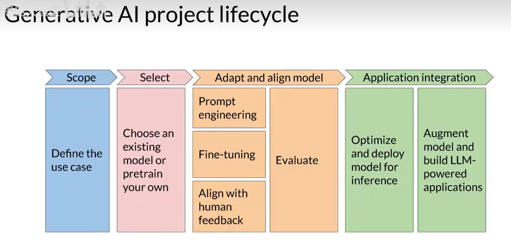

# 生成式 AI 项目开发生命周期

## 定义项目范围

建设用例：LLM 在项目中起到的作用。

## 选择模型

选择现有的基础模型，或从头训练自己的模型。

## 改善模型

- 提示词工程
- 微调技术
- 带有人类反馈的强化学习
- 模型评估

## 模型部署与集成

- 优化模型与部署。
- 使用其他额外设施实现应用集成。

<!-- learning-journey:update-history:start -->
## 更新记录

| 日期 | 类型 | 说明 |
| --- | --- | --- |
| 2026-07-25 | 首次发布 | 从语雀整理并发布到学习记录仓库 |
<!-- learning-journey:update-history:end -->
