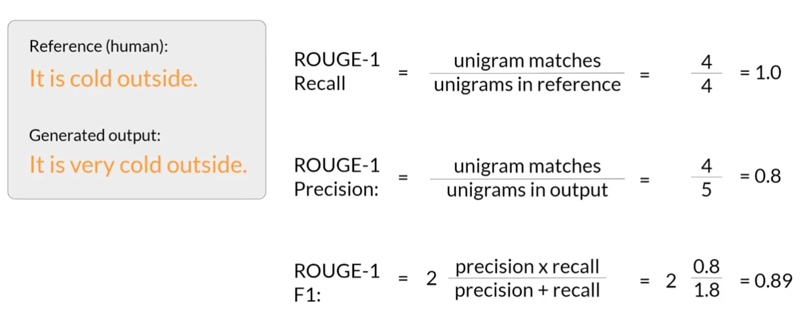
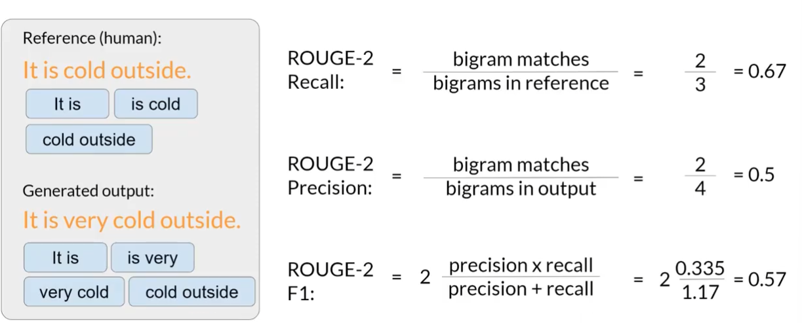
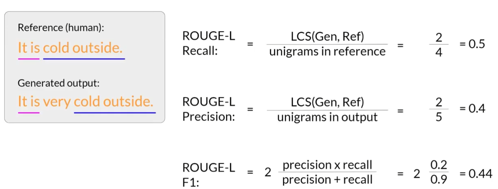
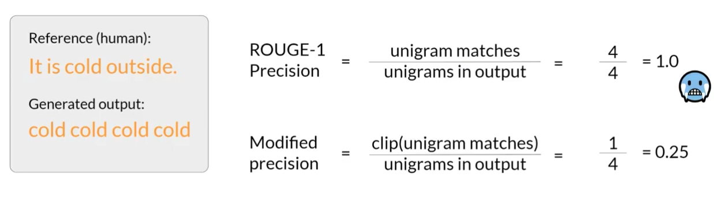

# LLM 性能评估指标

> 原则：尽量使用 LLM 在训练中没见过的数据进行评估。

## ROUGE（召回率导向的摘要评估）

- <u>Recall-Oriented Understudy for Gisting Evaluation</u>
- 通过将自动生成的内容与人工生成的内容进行比较，来评估生成内容的质量。
- ROUGE 只能评估单一任务，常用于提取摘要。

- unigram：一个词
- bigram：两个词
- n-gram：n 个词

### ROUGE-1 Metrics（用 unigram 作为单位）

$ ROUGE-1 \ \ Recall = \frac{unigram\ matches\ （生成的匹配词数）}{unigrams\ in\ reference（人工生成的参考词数）} $

$ ROUGE-1 \ \ Precision = \frac{unigram\ matches\ （生成的匹配词数）}{unigrams\ in\ output（生成的总词数）} $

$ ROUGE-1 \ \ F1 = 2 \ \frac{precision \times recall}{precision + recall} $

### ROUGE-2 Metrics（用 bigram 作为单位）

规则同上。

### ROUGE-L Metrics（用最长公共子序列作为单位）

<u>LCS：Longest Common Subsequence</u>

$ ROUGE-L \ \ Recall = \frac{LCS（最长公共子序列的长度）}{unigrams\ in\ reference（人工生成的参考词数）} $

$ ROUGE-L \ \ Precision = \frac{LCS（最长公共子序列的长度）}{unigrams\ in\ output（生成的总词数）} $

$ ROUGE-L \ \ F1 = 2 \ \frac{precision \times recall}{precision + recall} $

### ROUGE Clipping

## BLEU（双语评估）

- <u>Bilingual Evaluation Understudy</u>
- 一种用来与人工翻译文本对比，评估机器翻译文本质量的算法。
- 原理：综合不同阶数的修正 n-gram 精确率，并加入长度惩罚。

## Benchmark（基准测试）

- 已经集成好的、覆盖广泛任务和场景的测试评估方法。
- 常用于多任务、通用的大模型评估。
- 常见 Benchmark：
  - **<u>GLUE</u>**（General Language Understanding Evaluation）
  - **<u>SuperGLUE</u>**
  - **<u>MMLU</u>**（Massive Multitask Language Understanding）
  - **<u>BIG-bench</u>**
  - **<u>HELM</u>**（Holistic Evaluation of Language Models）

<!-- learning-journey:update-history:start -->
## 更新记录

| 日期 | 类型 | 说明 |
| --- | --- | --- |
| 2026-07-26 | 首次发布 | 从语雀整理并发布到学习记录仓库 |
<!-- learning-journey:update-history:end -->
