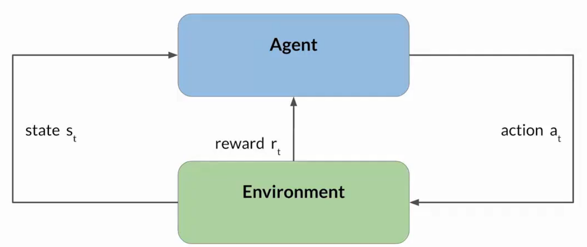
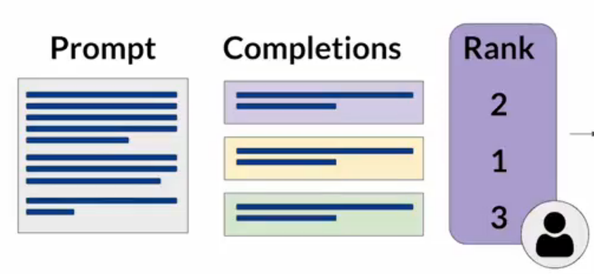
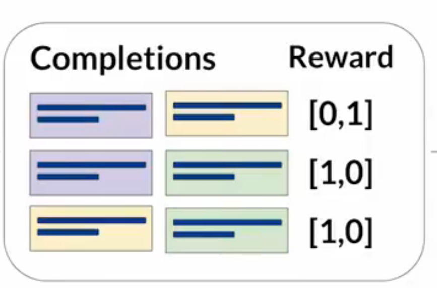
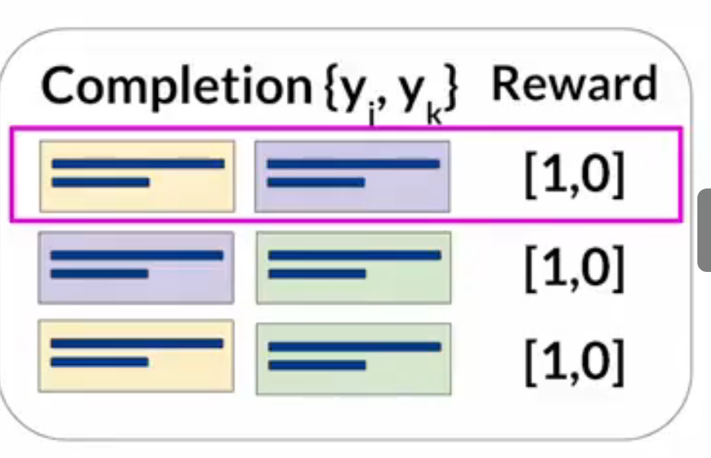
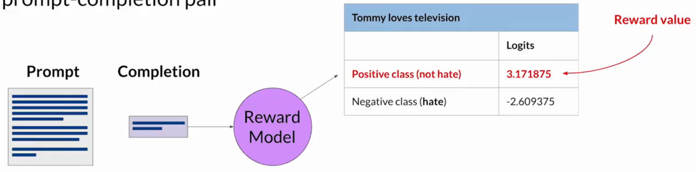

# RLHF：基于人类反馈的强化学习

## 前戏

LLM 经过训练后具有以下问题：毒性语言、语气激进、危险话题、给出误导性或完全错误的答案等不符合人类价值观的问题，这些问题全是用于训练的数据导致的。

### HHH

Helpful？Honest？Harmless？——对于 LLM 的三问。

这是指导开发者负责任地使用 AI 的一组原则。

## 定义

RLHF 是 RL 的一种变体。RLHF 的本质是通过人类反馈对 LLM 进行额外的微调，从而：

- 最大化模型输出的有用性和相关性，减少有害性内容的输出。
- 或使模型通过持续的反馈过程学习并贴近每个用户的偏好，使得模型更加个性化、助手化。

## 强化学习

- 强化学习是一种机器学习。
- 使智能体在特定环境中采取行动，并根据行动结果接受奖励或惩罚，不断通过迭代从经验中学习，做出更好的决策。

### 基本概念

- **state 状态（$s_t$）**：环境在某一时刻 $t$ 的情形描述。
- **action 动作（$a_t$）**：智能体在某一时刻 $t$ 的操作，该操作会改变环境的状态。
- **reward 奖励（$r_t$）**：智能体在某一时刻 $t$ 执行操作后得到的反馈，奖励通常是一个布尔值，强化学习的目标就是通过策略最大化长期累积奖励。
- **objective 目标**：智能体的动作能否获得奖励的依据。
- **policy 策略**：一种行为准则，定义了智能体在某一状态下选择动作的方式。
- **playout 展开**：指智能体在环境中的一连串动作和相应状态组成的过程，如下棋智能体从棋盘的初始化状态开始，根据 RL 策略选择下棋位置，直至棋局结束（在语言类模型中，通常使用 rollout）。

## 获得奖励的方式

### 通过人类进行反馈

通过数据标注员，按照一定的指示规则，人工对 LLM 的多个输出结果进行优异度排序；同一条输出通常需要参考多个数据标注员的意见。

### 奖励模型

- 奖励模型的实质是一个二元分类模型，能够分类 LLM 的输出，评估与人类价值观的对齐程度。
- 奖励模型是通过传统监督学习的方法，使用人类反馈的数据进行训练的。

#### 奖励模型的训练和使用过程

以人类数据标注员的排名意见为例：

1. 将同一条 prompt 获得的多条 completion 的排名列出。

   

2. 两两组合，并根据排名高低生成 0 或 1 的奖励值。

   

3. 将每个组合进行排序，把奖励值为 1 的 completion 都放在前面。

   

4. 经过整理，获得一个适合奖励模型训练的人类反馈数据集格式。
5. 后续即可使用奖励模型，自动选择 RLHF 过程中的最佳 completion。
6. 奖励模型会对每条 completion 返回一个正类 not hate 的输出值和负类 hate 的输出值（称为 logit 值），正类的输出值会在 RLHF 中作为奖励值使用，负类的输出值则是惩罚值。

   

7. 正类和负类的 logit 值经过激活函数后会变成概率（和为 1），最终决定此条 completion 属于哪一类，并决定具体的奖励值或惩罚值。

<!-- learning-journey:update-history:start -->
## 更新记录

| 日期 | 类型 | 说明 |
| --- | --- | --- |
| 2026-07-26 | 首次发布 | 从语雀整理并发布到学习记录仓库 |
<!-- learning-journey:update-history:end -->
