# MoE 架构与负载均衡

> 当前为阶段性整理版本，后续继续补充。
>
> 学习资料：
>
> - [ ] [图解 MoE](https://www.maartengrootendorst.com/blog/moe/)
> - [x] [腾讯云：一文读懂 MoE](https://cloud.tencent.com/developer/article/2630190)
> - [x] [L 站：【模型训练】MoE 相关知识点汇总与讲解（上）](https://linux.do/t/topic/2684588)
> - [ ] [L 站：【模型训练】MoE 相关知识点汇总与讲解（下）](https://linux.do/t/topic/2687837)
>

## 基本概念
+ MoE 架构下，不让模型的所有参数每次都工作，把模型分成很多**专家**，每次输入只激活其中一小部分专家
+ MoE 位于 Transformer 架构的**前馈神经网络 FFN** 位置，可以认为是更高级的 FFN 层
    - 传统 FFN 层部分叫做**密集模型（Dense Model）**，因为所有参数都会被激活
    - 而 MoE 架构中，该部分被称为**稀疏模型（Sparse Model）**，只按情况激活部分参数

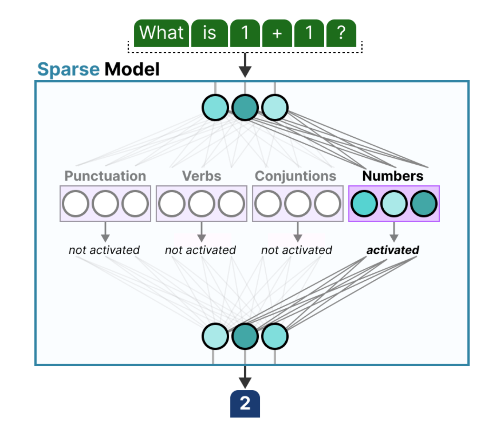

> FFN 对每个 Token 的表示进行独立的非线性特征变换，其主要作用如下：
>
> - 增加非线性表达能力：注意力层主要做 Token 之间的信息混合；FFN 通过激活函数学习更复杂的特征关系
> - 加工每个 Token 聚合后的信息：自注意力让一个 Token 读取上下文，FFN 则把读到的信息进一步“理解”和重编码

+ MoE 将 FFN 替换为多个**专家** $Expert_{1}(x)$、$Expert_{2}(x)$ 等；每个 **Expert** 本身就是一个 FFN，由 **Router/Gate** 来判断当前输入送给哪个专家

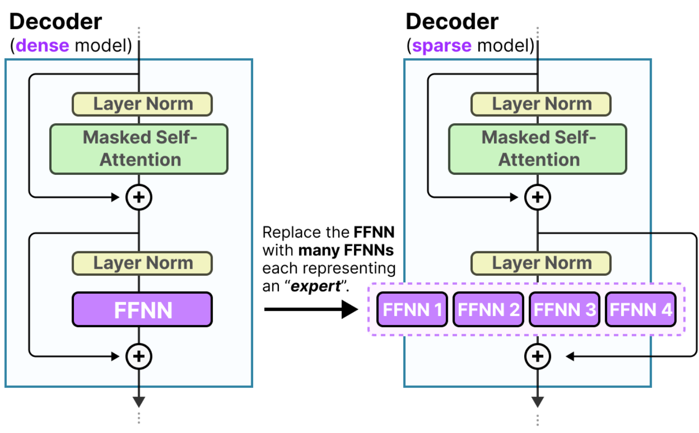

## 稀疏激活机制 Sparse Activation
Top-k 选择专家：

+ Top-k，即为每个新 Token 的加入选择 k 个专家
+ 只有 k 个专家会被激活

这意味着可以拥有一个名义上很大的模型（总参数量大），但实际上运行成本相对较低（激活参数量小）

## MoE 两大核心组件
### 专家 Expert
专家并不指精通于某一特定领域（计算机、生物学等），MoE 中的专家只是在单词层面上学习不同的句法信息，故 MoE 专家的专长在于处理特定上下文中的特定 Token

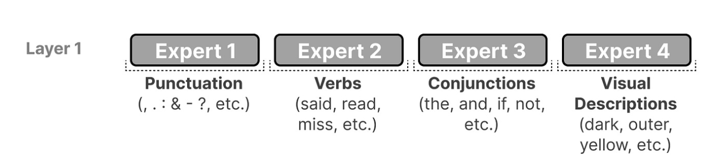

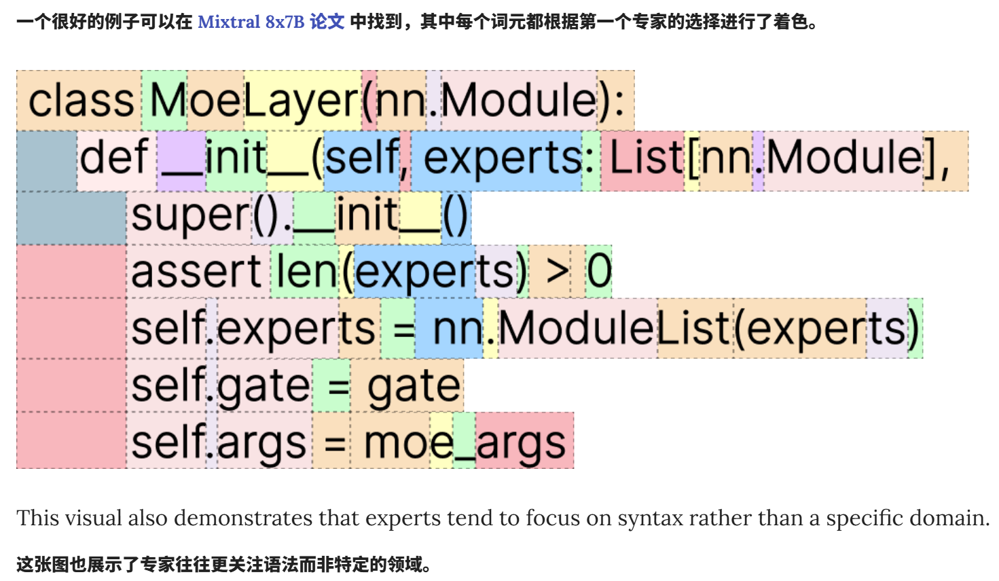

### 路由器 Router
Router 也被称为门控网络 Gate Network，当前输入由 Router 来决定依次路由给哪些专家

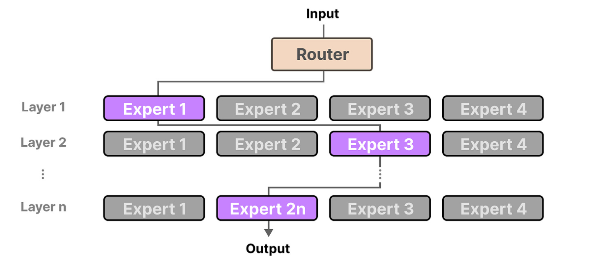

Router 的本质也是一个 FNN，其输出概率，并决定最佳匹配的 Expert，与 Expert 共同构成 MoE 层

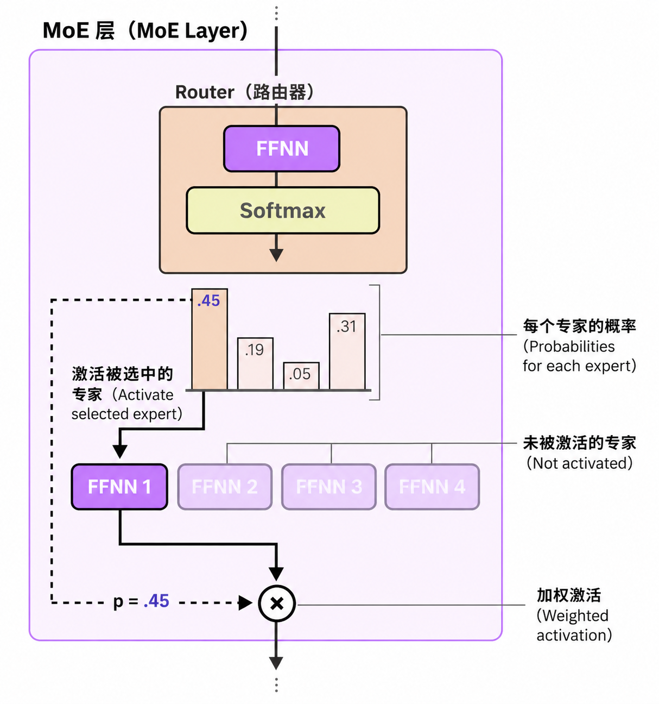

## 专家选择流程
1. 输入经过之前组件处理，得到包含上下文信息的向量（隐藏向量），进入 MoE 层
2. 输入与 Router 内部可训练的权重矩阵相乘，得到输出

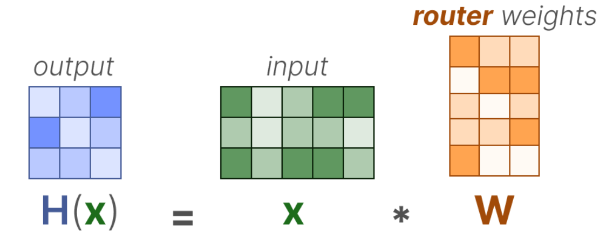

3. 在输出上应用 Softmax，得到每个 Expert 的概率分布

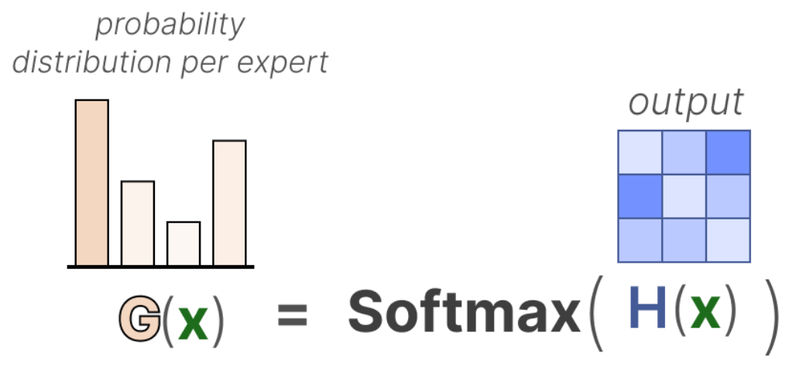

4. Router 根据概率分布和选择策略，选择最佳匹配的 $n$ 个 Expert，分别进入处理
5. 对 $n$ 个专家的输出进行加权求和，合并专家结果

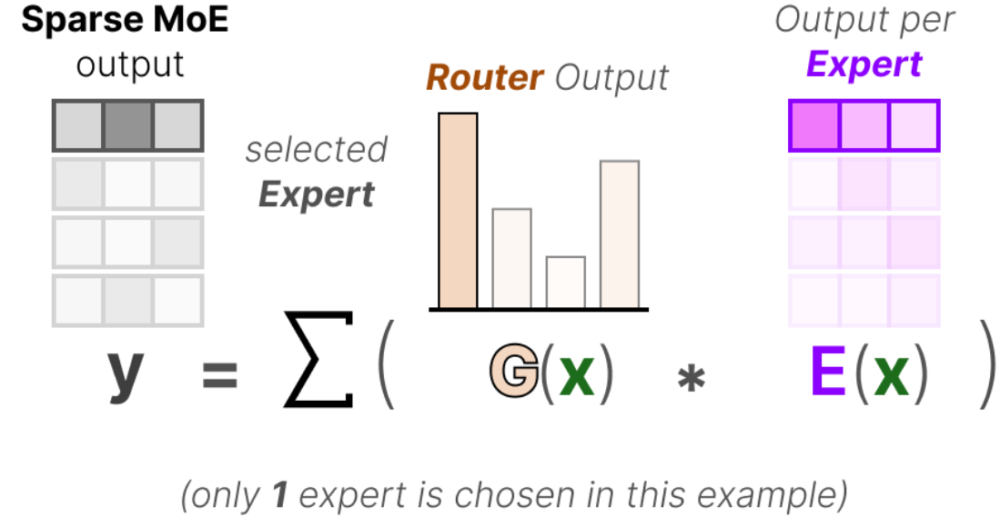

## 负载均衡机制 Load Balancing
选择专家的过程简单，会导致训练时某些专家学得比其他专家快，于是更容易选择这些专家，最终会导致某些专家根本得不到训练和选择，从而产生饥饿（Starving）。这会导致在训练和推理期间出现问题，这种现象称为 **Expert Collapse**。

因此需要辅助手段（路由加入噪声、加入负载均衡损失）来实现负载均衡，防止对相同的专家形成过拟合

### 加噪声的 KeepTopK 策略
#### 特殊机制：引入噪声
在 Router 计算路由中，引入可训练的噪声来鼓励探索，防止 Router 从训练初期开始就永远固定选择同样的几个专家

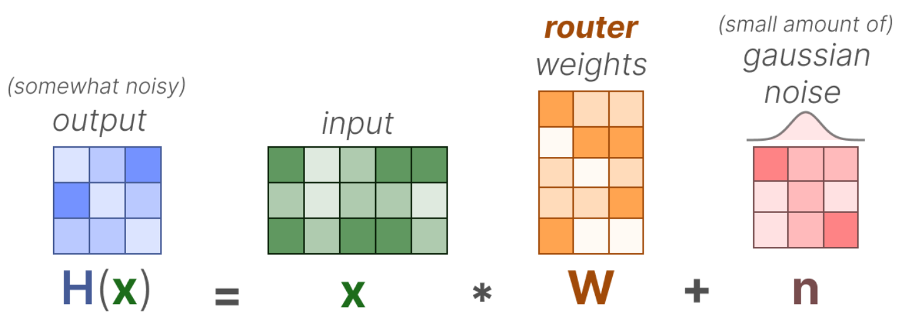

#### 核心思想：只保留 Top-k
除了根据 Top-k 选择激活的前 k 个专家之外，其他专家的权重都会被设置为 $-\infty$

这样 Softmax 之后的输出概率就会变成 0

KeepTopK 也可以在不引入噪声的情况下使用

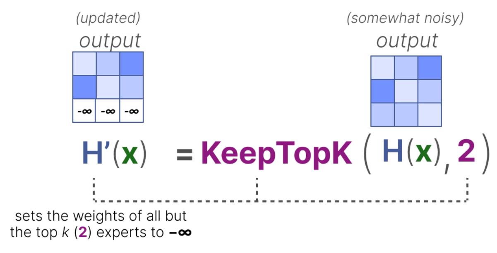 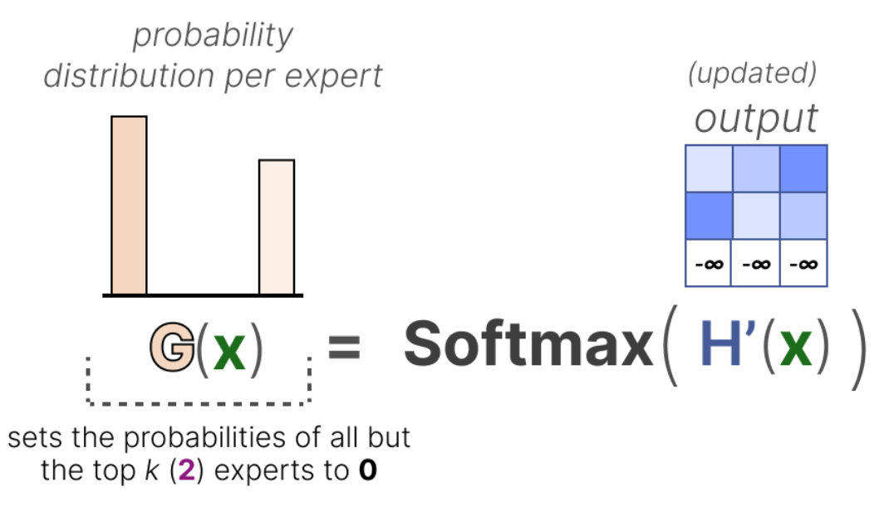

### Token Choice
MoE 的原始路由思想：让新加入的 Token 选择一个或多个最匹配的专家

### Auxiliary Loss（辅助负载均衡损失）
#### 核心思想
普通语言模型训练时有一个主损失 Main Loss，其作用是衡量下一个 Token 预测得是否正确；而这里需要加入一个新的损失，即辅助负载均衡损失 Auxiliary Loss，作用是衡量是否不把所有工作只路由给固定专家，过高会受惩罚

#### Importance Score 重要性分数
+ 在一个输入批次中，对每个专家的路由值求和；表示一个专家的被偏爱程度

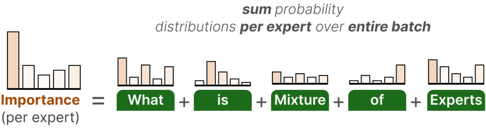

#### CV（Coefficient of Variation，变异系数）
+ 用于表示不同专家之间重要性分数有多大差异，是 Auxiliary Loss 的重要组成部分

$$
CV = \frac{\sigma（标准差）}{\mu（平均值）}
$$

+ CV 值越大，代表不同专家之间重要性分数差异越大

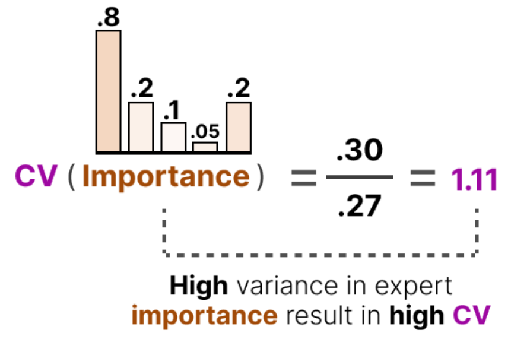

+ 在训练中不断更新优化 Auxiliary Loss，使得 CV 值尽可能地降低，从而赋予每位专家同等的重要性，缓解饥饿问题

## Expert Capacity 专家容量机制
### 基本概念
在一次 Forward 前向传播中，限制每一个专家最多可以处理的 Token 数量

处理的是 GPU 并行计算需要等待的问题

### Token Overflow
当某个专家达到容量时，Token 会被路由给下一个专家；如果候选专家都达到容量，则会发生 Token Overflow，该 Token 会通过残差连接路径直接进入下一层

> 这不是统一规则，普通 MoE 这样做。

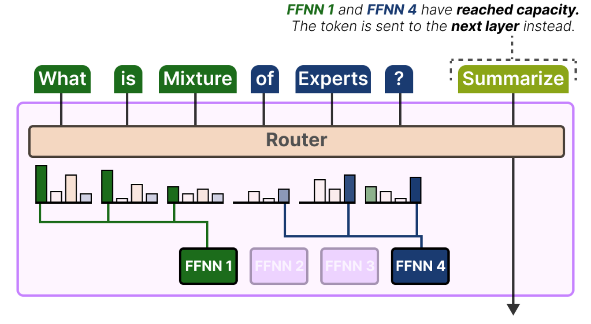

### Switch Transformer
Switch Transformer 是一种改进的 MoE 模型，解决的是传统 MoE 由于负载均衡等问题产生的训练不稳定性

其使用 Top-1，引入了容量因子、简化的辅助损失

#### 构成
Switch Transformer 是一个 Encoder-Decoder 模型，其用 Switching Layer 替换了传统的 FFN 层

Switching Layer 是一个稀疏的 MoE 层，且使用 Top-1 Routing，为每个 Token 只固定选择一个专家

#### Capacity Factor 容量因子
Switch Transformer 引入了直接影响专家容量的容量因子，决定了专家可以处理多少个 Token

$$
\text{Expert Capacity}= \left\lceil \text{Capacity Factor} \times \frac{T}{N}\right\rceil
$$

+ T 为当前批次总 Token 数
+ N 为专家总数

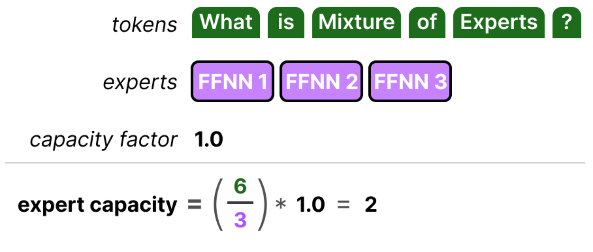

增加容量因子，每个专家就能处理更多的 Token

但容量因子过大会导致浪费计算资源，过小则会因为 Token Overflow 而降低模型性能

#### 简化版本的 Auxiliary Loss
Switch Transformer 架构的辅助损失不再计算 CV（变异系数），而是将分发给每个专家的 Token 比例与路由概率比例进行加权比较

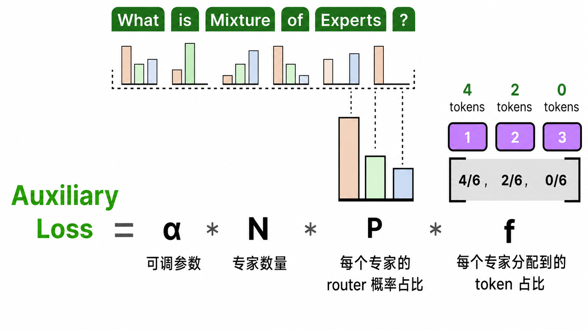

+ 由于目标是在 N 个专家之间获得 Token 的均匀路由，期望 $P$ 和 $f$ 的值为 $\frac{1}{N}$
+ $\alpha$ 为超参数，最终的损失函数大致是：$L_{\text{total}} = L_{\text{main}} + \alpha L_{\text{aux}}$；$\alpha$ 控制的是负载均衡在训练目标中的重要程度
    - 若 $\alpha$ 过大，会导致模型过度追求平均分配，损失 LLM 的能力；而太小则会导致负载均衡训练不足

<!-- learning-journey:update-history:start -->
## 更新记录

| 日期 | 类型 | 说明 |
| --- | --- | --- |
| 2026-08-05 | 首次发布 | 发布尚在整理中的阶段性版本，记录 MoE 架构、路由与负载均衡机制 |
<!-- learning-journey:update-history:end -->
