# 模型量化压缩 Quantization

> 学习资料：
>
> - [ ] [A Visual Guide to Quantization - Maarten Grootendorst](https://www.maartengrootendorst.com/blog/quantization/#symmetric-quantization)
> - [ ] [大模型太大跑不动？聊聊量化技术如何“瘦身” - 腾讯云开发者社区-腾讯云](https://cloud.tencent.com/developer/news/4342756)

## 概念

LLMs 自身权重与激活值巨大，本地部署运行对于硬件要求极高。

$$
\text{权重存储大小} \approx \text{参数量} \times \frac{\text{位宽}}{8}
$$

$$
\text{70B 的 FP32 权重存储} \approx 700\text{ 亿} \times \frac{32}{8} \approx 280\,\text{GB}
$$

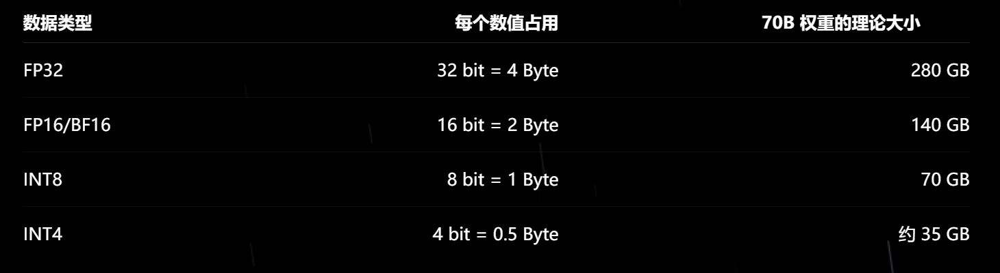

模型量化是一种有效的模型压缩技术，可以在保持模型性能的同时大大降低本地计算和存储的开销。

- **量化的核心目标：** <u>减少表示权重或激活值所需的 bit，同时尽可能维持模型效果</u>

## 数据的表示方式

### 数据组成

数值通常表示为浮点数，由三部分组成：

- **sign 符号位**：1 位，用于表示正负
- **exponent 指数部分：** 决定数值的动态范围（dynamic range）
- **fraction 分数（mantissa 尾数）部分：** 决定数值精度（precision）

---

以 FP16（Float 16-bit）为例：

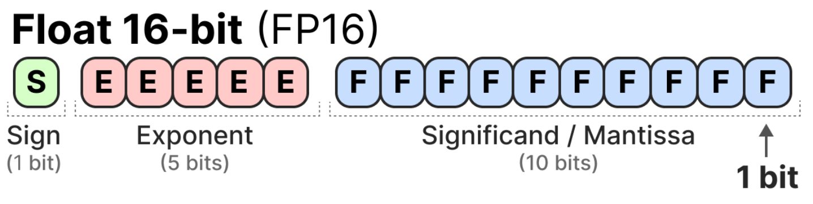

### 数值计算

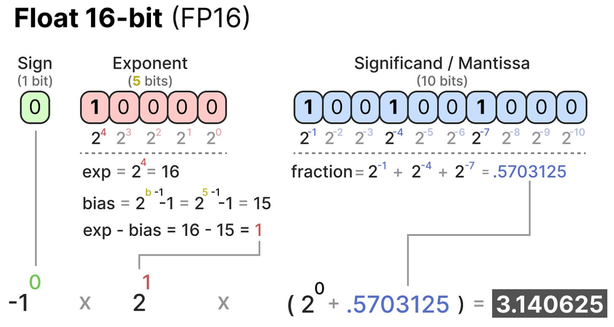

### 常见数据类型

#### FP32 全精度

每个数值使用 32 bit，也就是 4 Byte。

它能够提供较大的数值范围和较细的数值精度，但占用空间大。

#### FP16 半精度

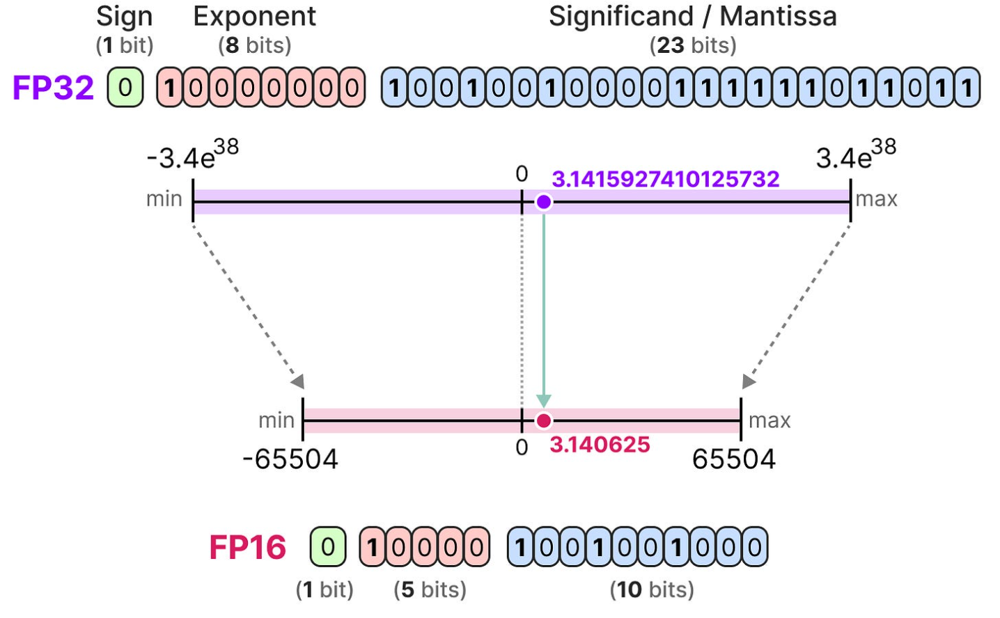

每个数值使用 16 bit，即 2 Byte。

存储空间减半，精度降低，**且**数值范围比 FP32 小得多。若量化后表示不了原来的数值，则会造成 **Overflow 数值溢出**，对模型造成极大损害。

#### BF16 截断全精度

为了获得与原始 FP32 相似的数值范围，bfloat 16 被引入。

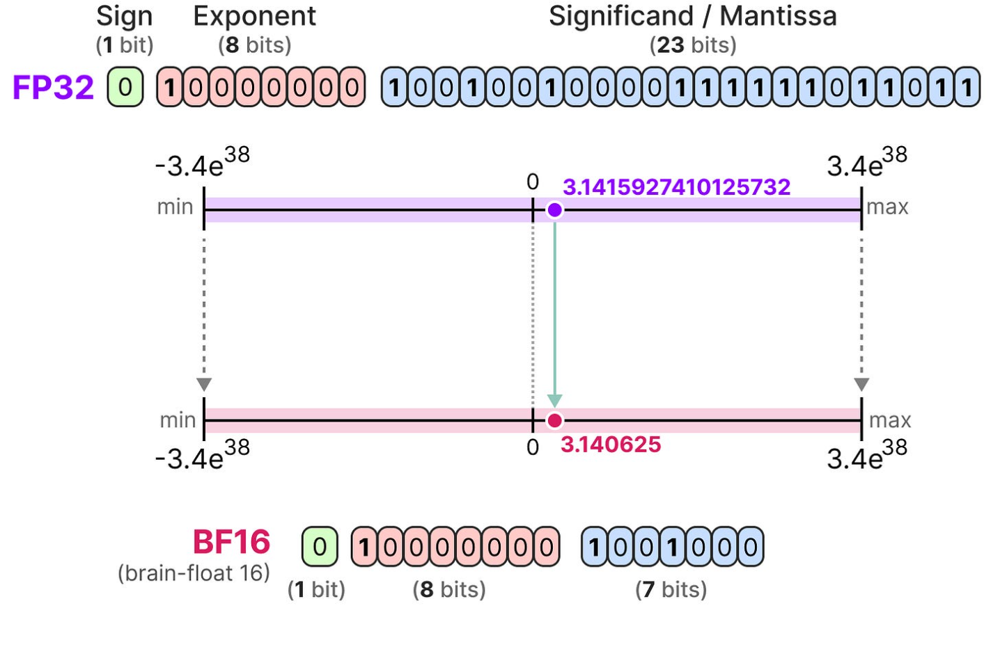

BF16 虽然精度损失更大，但保留了与 FP32 相同大小的指数部分，动态范围与 FP32 一致，因此在深度学习中很常见。

#### INT8 整数

INT8 只有 8 bit，共有 256 个整数位置。

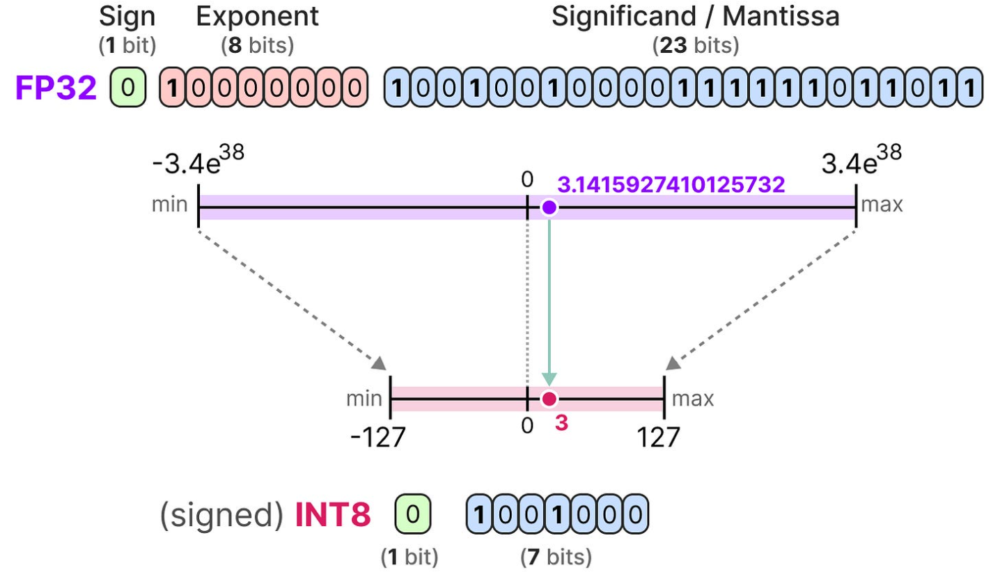

### 不同 bit 数值的存储比较

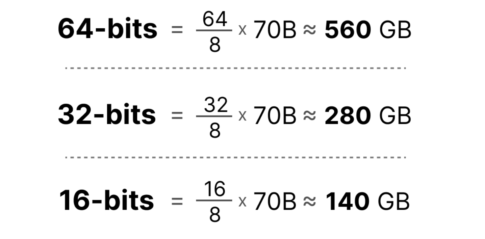

因此，尽量减少用于表示模型参数的比特数对于存储要求的减少是很大的，但随着精度的降低，模型的准确率也会下降。

量化就是考虑在尽量保持精度的同时减少数值表示的比特数。

## 量化的原理

量化的核心思想：将模型参数的数值表示从较高的位宽降低到较低的位宽；然后将多个不同的原始数值压到同一个量化值以降低存储需求。

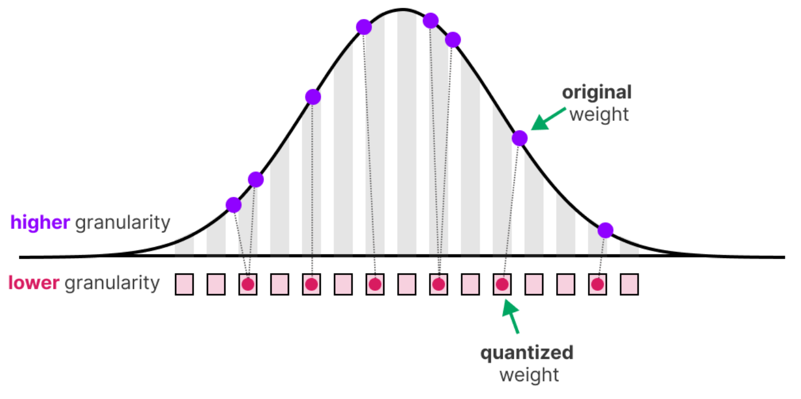

减少位数也会带来模型精度的损失↑

### 缩放因子 scaling factor（$`s`$）

在实践中，不需要将整个 FP32 范围映射到 INT8；只需要将浮点数空间中的数据范围（即模型的参数）映射到 INT8 即可。

作用：描述浮点数空间中的区间，在量化空间中对应多大一个步长。

举例：

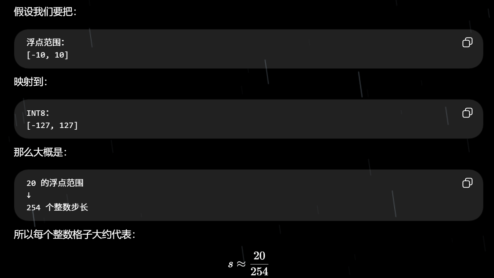

### 零点值 zero point（$`z`$）

作用：表示非对称量化中，原浮点空间中的 0 映射到量化空间中的哪个位置。

> - 缩放因子管缩放
> - 零点值管平移

### 量化误差 quantization error

应用量化后，再进行反量化以检索原始值，会发现有些原始值（例如下图中原来的 3.08 和 3.02）已经因损失了一部分精度而变得无法区分（都变成了 3.06）。

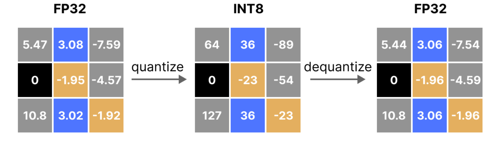

通过计算原始值与反量化值之间的差值，可以得出量化误差。

量化位数越小，量化误差越大。

## 量化的类型

### Symmetric Quantization 对称量化

在对称量化中，原始浮点值的范围被映射到量化空间中以零为中心的区间。

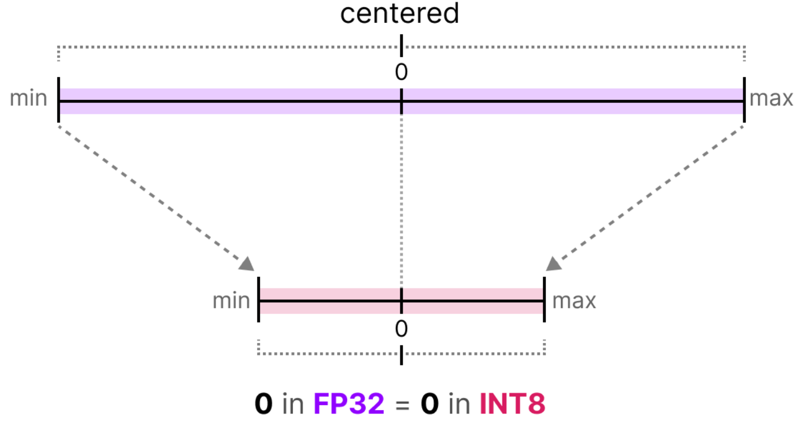

整个量化过程完全是以 0 为中心对称的。

#### 绝对最大值量化 absmax quantization

绝对最大值量化是一种常见的对称量化。

核心思想：使用给定数值中的绝对最大值来决定原始浮点值的对称区间，计算比例因子 $s$，进行对称的线性映射。

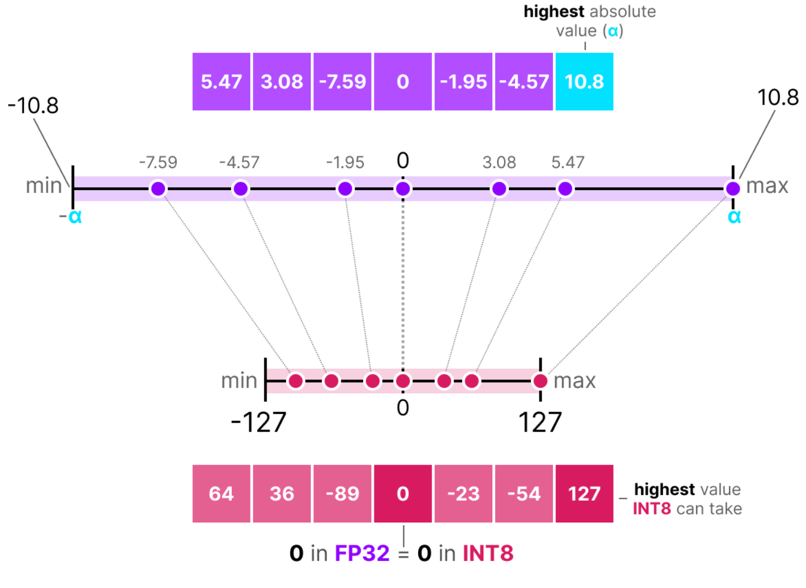

### Asymmetric Quantization 非对称量化

非对称量化不以 0 为中心对称，其直接将浮点数范围的最小值和最大值作为原始区间，映射到量化范围的最大值最小值区间。

这种量化的映射方法会造成零点值偏移，数值计算过程中需要进行缩放 + 平移。

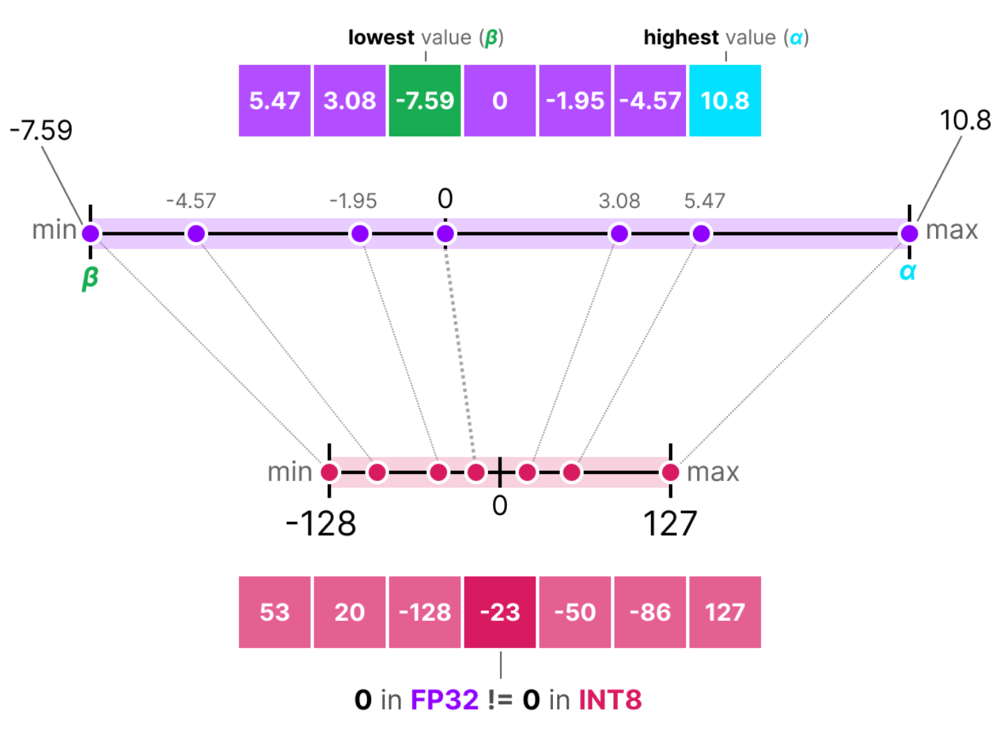

## 量化范围选择与误差控制

### Outliers 异常值

若原始值中有个别值远远区别于其他值，如果继续映射原始值的整个范围，其他值都会被映射到相似的端位置，区分度进一步降低。

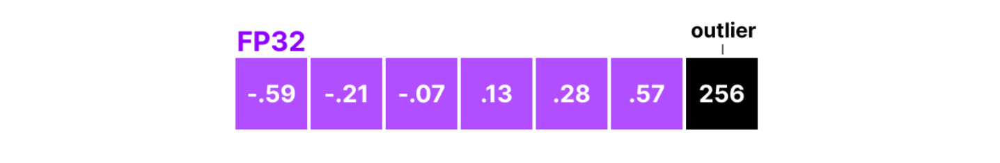

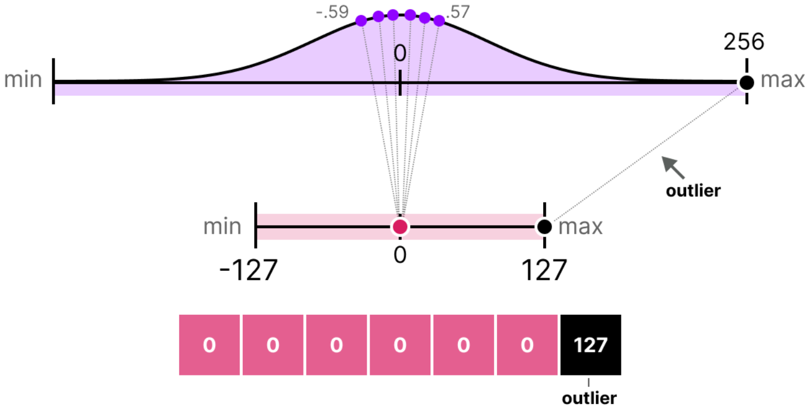

### 解决方法：Clip 截断

Clip 即为：为原始值手动设定一个固定的动态范围，那么超出该范围的所有值都将被映射为 -127 或 127，而不管它们的实际值是多少。

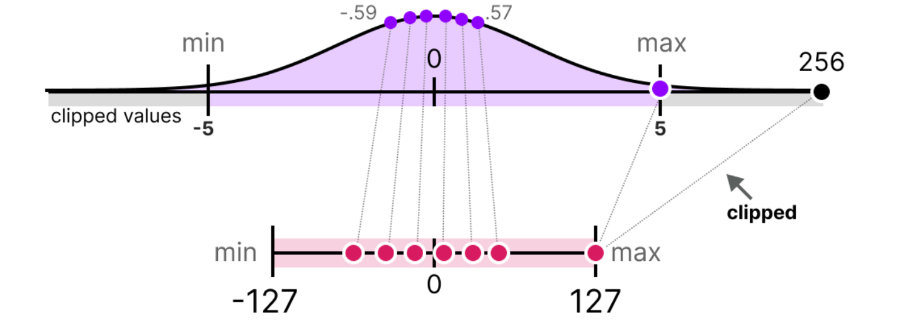

Clip 过后非离群值的量化误差显著降低，但是也造成了离群值的极大量化误差。

### 寻找平衡：Calibration 校准技术

> 选择一个合适的范围区间，以实现在保留正常数值和处理离群值之间取得平衡。

常见校准技术：

- **Percentile（百分位）：** clip 掉覆盖值在百分之多少之外的原始数据
- **MSE（Mean Squared Error）：** 尝试不同范围，量化后再反量化，比较原始值和恢复值之间的平方误差，选 MSE 较小的范围
- **KL Divergence（KL 散度）：** 尽量让量化前后的整体分布接近的校准方法

## 静态量化与动态量化

> 量化对象有三个：权重 weights、偏置 bias、激活值 activations。

### 静态参数：权重与偏置 weights & bias

将 LLM 的权重和偏置（bias）视为静态值，这些值在运行前就已经确定。

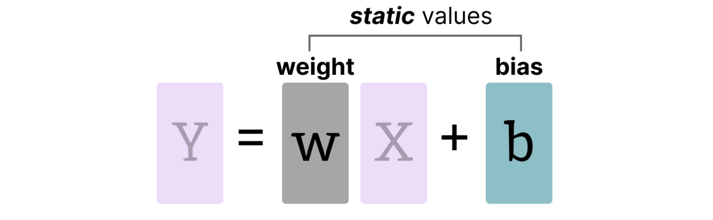

偏置参数数量远小于权重参数，量化工作主要集中在权重参数上。

### 动态参数：激活值 activations

激活值 activations 为在 LLM 内部不断变化更新的输入，它们通常会经过一些激活函数，因此被称为激活值。

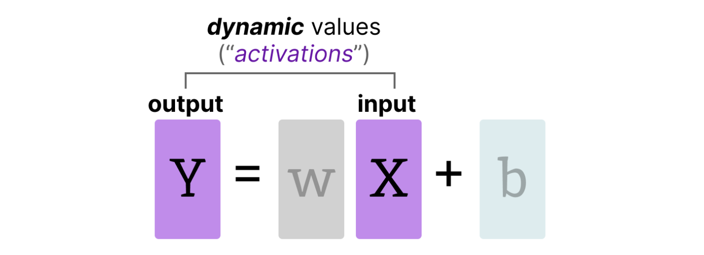

与权重不同，激活值在推理过程中是动态更新的，难以对其进行精确量化。

### PTQ（Post-Training Quantization，训练后量化）

### QAT（Quantization Aware Training，量化感知训练）

<!-- learning-journey:update-history:start -->
## 更新记录

| 日期 | 类型 | 说明 |
| --- | --- | --- |
| 2026-08-07 | 首次发布 | 从语雀整理并阶段性发布，后续继续补充量化方法相关内容 |
<!-- learning-journey:update-history:end -->
