# 机器学习基础与回归模型

## 人工智能概览

### 人工智能的定义

人工智能是研究、延伸和扩展人的智能的理论、方法、技术及其应用的一门技术科学。

它研究如何让机器拥有人的智能。

- 强人工智能：有知觉、有自我意识，真正能够推理并独立解决问题的智能机器。
- 人工智能四要素：数据、算法、算力、场景。

### 人工智能的发展历史

- 人工智能三阶段：计算智能 → 感知智能 → 认知智能。计算智能和感知智能属于弱人工智能，认知智能为强人工智能，目前正处于感知智能向认知智能的过渡阶段。
- 1956 年达特茅斯会议首次提出人工智能，此后经历三次浪潮、两次低谷。
- 第三次浪潮：生成式 AI。

## 机器学习概述

### 什么是机器学习

机器学习让计算机在没有被显式编程的情况下具备学习能力。

机器学习算法主要包括：

- Supervised Learning（监督学习）
- Unsupervised Learning（无监督学习）

### 监督学习

监督学习通过提供数据集和标签训练模型，使其对于新的数据也能做出合理预测。

- 数据集：输入数据和标签的集合。
- 标签：每个输入数据的正确答案。
- 训练过程：让模型从数据集中学习并找出数据映射关系，选择一个尽可能合适的映射函数，再使用该函数预测新的输入数据。
- 常见任务：回归和分类。

#### 回归（Regression）

- 模型输出一个连续数值。
- 模型需要从连续的输出空间中预测一个数值。

#### 分类（Classification）

- 模型输出离散的某个类别。
- 模型需要对数据进行类别预测。

### 无监督学习

无监督学习不依赖带标签的数据，让模型从输入数据中自动发现规律、模式或结构。

#### 聚类（Clustering）

- 根据大量数据之间的相似性与相异性，将目标划分到不同的簇中。
- 可以从大量无标签数据中发现潜在的模式和结构。

#### 异常检测（Anomaly Detection）

用于检测异常事件。

#### 降维（Dimensionality Reduction）

减少数据的特征维度，在尽量保留重要信息的同时压缩数据表示。

## 线性回归模型

Linear Regression Model。

### 术语

- **训练集**（Training Set）：用于训练模型的数据集。
- **单变量线性回归**（Univariate Linear Regression）：只有一个输入变量（特征）的线性回归方程。
- **多元线性回归**（Multiple Linear Regression）
- **代价函数**（Cost Function）
- **均方误差**（Mean Squared Error，MSE）
- **梯度下降**（Gradient Descent）
- **批量梯度下降**（Batch Gradient Descent）
- **学习率**（Learning Rate）
- **收敛**（Convergence）
- **迭代**（Iteration）
- **学习曲线**（Learning Curve）
- **自动收敛测试**（Automatic Convergence Test）
- **局部最小值**（Local Minimum）
- **全局最小值**（Global Minimum）
- **凸函数**（Convex Function）
- **行向量**（Row Vector）
- **向量化**（Vectorization）
- **正规方程法**（Normal Equation Method）
- **特征缩放**（Feature Scaling）
- **特征工程**（Feature Engineering）
- **多项式回归**（Polynomial Regression）
- **过拟合**（Overfitting）
- **高方差**（High Variance）
- **欠拟合**（Underfitting）
- **高偏差**（High Bias）
- **噪声**（Noise）
- **正则化**（Regularization）
- **正则化惩罚**（Penalty）

### 符号

- 输入变量（Input Variable）或特征（Feature）：$x$
- 特征列表中的第 $j$ 个特征：$x_j$
- 特征总数：$n$
- 输出变量（Output Variable）或目标变量（Target Variable）的真实值：$y$
- 训练示例总数：$m$
- 单个训练示例：$(x,y)$
- 第 $i$ 个训练示例：$(x^{(i)},y^{(i)})$
- 第 $i$ 个训练示例中的全部特征：

$$
\vec{x}^{(i)}=[x_1^{(i)},x_2^{(i)},\dots,x_n^{(i)}]
$$

- 算法模型产生的函数：$f$
- 模型预测结果的估计值：$\hat{y}$
- 模型参数、系数或权重：$w,b,\dots$
- 学习率：$\alpha$
- 均值：$\mu$
- 标准差：$\sigma$
- 阈值：$\epsilon$
- 正则化参数：$\lambda$

### 线性回归的基本形式

$$
\hat{y}^{(i)}=f_{w,b}(x^{(i)})=wx^{(i)}+b
$$

### 代价函数

代价函数用于计算误差、衡量所选模型在训练集上的表现，其选取取决于具体任务。

#### 均方误差与平方误差代价函数

均方误差（MSE）常用于回归问题：

$$
\operatorname{MSE}=\frac{1}{m}\sum_{i=1}^{m}
\left(f_{w,b}(x^{(i)})-y^{(i)}\right)^2
$$

线性回归中常使用带有 $\frac{1}{2}$ 系数的平方误差代价函数，以便求导：

$$
J(w,b)=\frac{1}{2m}\sum_{i=1}^{m}
\left(f_{w,b}(x^{(i)})-y^{(i)}\right)^2
$$

降低代价值可以使用梯度下降算法。

### 梯度下降

梯度下降是一种尝试最小化函数的算法，在机器学习中用于尝试最小化损失函数，从而找到更优的模型参数。

#### 基本原理

1. 选择参数的初始值。
2. 选择下降梯度最大的方向，走很小的步长（$|\text{学习率}\times\text{导数}|$）。
3. 不断重复步骤二，直到找到局部最小值。
4. 修改初始参数，继续进行梯度下降。

#### 局部最小值

局部最小值是指在某个局部区域内，比周围点的函数值都低的点，但它不一定是全局范围内最低的点。

#### 全局最小值

全局最小值是在整个取值范围内使代价函数 $J$ 达到最低的点。

#### 具体实现

$$
w=w-\alpha\frac{\partial}{\partial w}J(w,b)
$$

$$
b=b-\alpha\frac{\partial}{\partial b}J(w,b)
$$

- $\alpha>0$：学习率。
  - 学习率太小会导致计算步骤过多、学习速度缓慢。
  - 学习率太大可能错过局部最小值，无法收敛甚至发散。
- 越靠近局部最小值，导数的绝对值越小，整体更新步长也越小。
- $w$、$b$ 等所有参数需要同步更新，而不是依次更新。

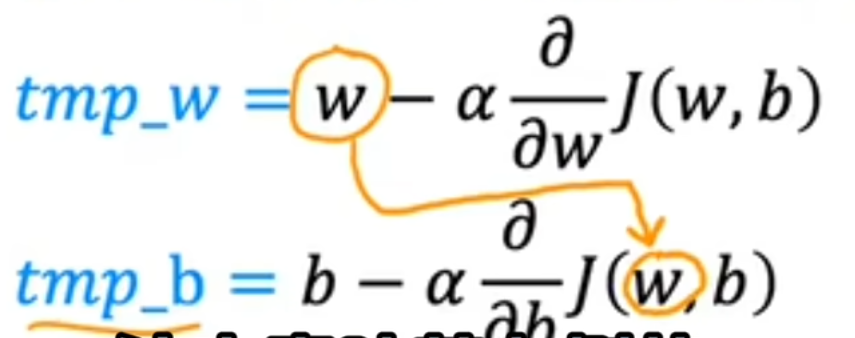

#### 批量梯度下降

- 通过计算整个训练集的梯度来更新模型参数。
- 计算量较大但收敛稳定，适用于小型数据集。

#### 梯度下降的收敛性

梯度下降收敛是指随着迭代次数增加，代价函数 $J$ 逐渐减小，并趋向稳定的最小值或接近最小值的状态。可以使用学习曲线或自动收敛测试判断是否收敛。

##### 使用学习曲线判断

绘制 $J-i$ 图像：

- $J$：代价函数。
- $i$：梯度下降的迭代次数。

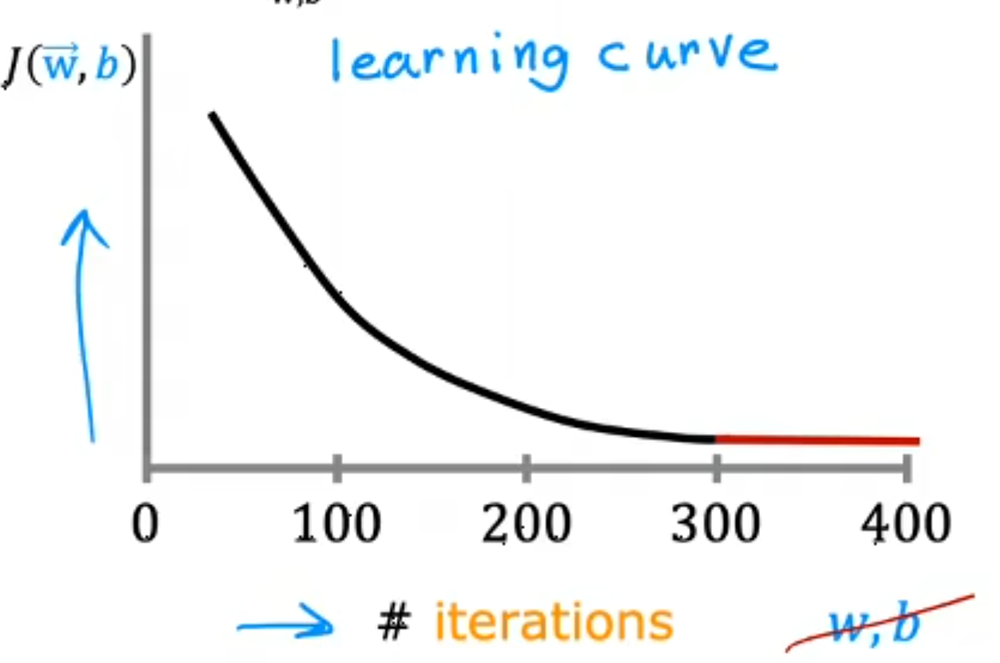

##### 学习率的选择

1. 从一个很小的 $\alpha$ 开始，此时学习曲线应缓慢下降。
2. 依次将 $\alpha$ 成倍增大，观察学习曲线是否平滑且下降更快。
3. 若学习曲线开始上下波动，说明 $\alpha$ 可能过大，需要微调。

##### 自动收敛测试

自动收敛测试通过监控代价函数值的变化，判断训练算法是否已经收敛，并决定是否停止训练。

1. 人为设置收敛阈值；某次迭代后代价函数变化小于阈值时，认为算法已经收敛。
2. 设置最大迭代次数 $i_{\max}$，防止异常训练无限迭代。
3. 判断是否满足：

$$
|J(t)-J(t-1)|\leq\epsilon
$$

### 对线性回归使用梯度下降

凸函数只有一个局部最小值，因此局部最小值也是全局最小值。其几何形状类似碗状，碗底就是全局最小值。

线性回归的平方误差代价函数关于参数是凸函数。选择适当的学习率时，梯度下降可以收敛到全局最小值。

将偏导数和代价函数代入：

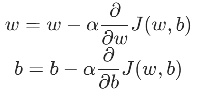

$$
w=w-\alpha\frac{1}{m}\sum_{i=1}^{m}
\left(f_{w,b}(x^{(i)})-y^{(i)}\right)x^{(i)}
$$

$$
b=b-\alpha\frac{1}{m}\sum_{i=1}^{m}
\left(f_{w,b}(x^{(i)})-y^{(i)}\right)
$$

### 多元线性回归

#### 数学模型

$$
f_{\vec{w},b}(\vec{x})=w_1x_1+w_2x_2+\dots+w_nx_n+b
$$

#### 向量化

$$
f_{\vec{w},b}(\vec{x})=\vec{w}\cdot\vec{x}+b
$$

使用 NumPy 数组存储向量，并使用点积函数运算：

```python
w = np.array([1, 2, 3, 4])
b = 2
x = np.array([10, 20, 30, 40])
f = np.dot(w, x) + b
```

向量化可以简化模型和代码，并提高运行速度。

#### 多元线性回归的梯度下降

$$
w_j=w_j-\alpha\frac{1}{m}\sum_{i=1}^{m}
\left(f_{\vec{w},b}(\vec{x}^{(i)})-y^{(i)}\right)x_j^{(i)}
$$

$$
b=b-\alpha\frac{1}{m}\sum_{i=1}^{m}
\left(f_{\vec{w},b}(\vec{x}^{(i)})-y^{(i)}\right)
$$

$w_j$ 和 $b$ 需要同步更新。

### 正规方程法

正规方程法是一种求解使代价函数最小的特征参数的算法。

- 不需要像梯度下降那样进行多次迭代，可以直接求解最优参数。
- 只适用于特征数量 $n$ 较小的情况；$n$ 变大后计算量会激增。
- 只能用于线性回归模型，不能推广到其他模型。
- 通常不需要人工实现；一些机器学习库调用线性回归时，后台可能使用正规方程法求解参数。

### 特征缩放

特征缩放可以让梯度下降运行得更快。当不同特征的数值范围差异很大时，同一个学习率可能在某些特征上更新过快，在另一些特征上更新过慢。

其作用是标准化特征尺度，使所有特征具有相似的数值范围，让各个特征的梯度更新步伐更加一致。

#### 最大绝对值缩放

将特征值除以所有样本中特征绝对值的最大值：

$$
X_{\text{scaled}}=\frac{X}{\max_i|X_i|}
$$

#### 均值归一化

将特征值减去均值，再除以特征值范围：

$$
X_{\text{scaled}}=\frac{X-\mu}{X_{\max}-X_{\min}}
$$

#### Z-score 标准化

将特征值减去均值，再除以标准差：

$$
X_{\text{scaled}}=\frac{X-\mu}{\sigma}
$$

主要效果是将数据转换为均值为 0、标准差为 1 的分布，从而调整数据尺度。

### 特征工程

特征工程是对原始数据进行处理、转换、选择和构造，创造有助于模型训练的特征，以提高模型的预测性能、训练效率和准确性。

基本步骤：

- **数据清洗**：处理缺失值、异常值和重复数据。
- **特征构造**：基于现有数据创建新的特征。
- **特征选择**：选择对模型最有用的特征，剔除冗余和无关特征。
- **特征缩放**：标准化或归一化特征。
- **类别特征处理**：编码分类数据，使模型能够理解非数值型输入。
- **降维**：减少特征维度，去除冗余信息并保留有用信息。

### 多项式回归

多项式回归是线性回归的拓展方法，通过引入特征的多项式来优化原始回归模型，从而拟合非线性关系。

例如，房屋面积与房价的关系最初写作：

$$
y=wx+b
$$

为了更好地拟合实际情况，可以转换为：

$$
y=w_1x+w_2x^2+w_3x^3+b
$$

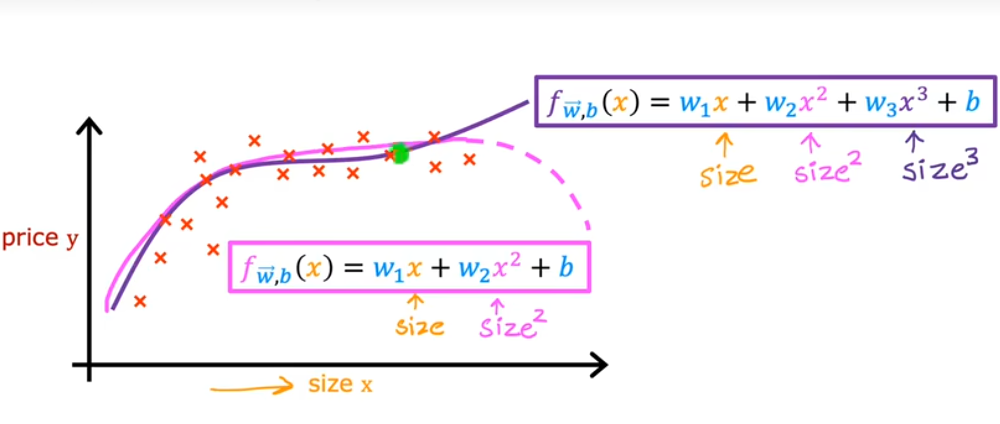

### 过拟合与欠拟合

#### 泛化能力

- 泛化能力指模型在训练集以外的数据上的表现。
- 过拟合和欠拟合都属于较差的泛化。
- 机器学习的目标是找到既不欠拟合也不过拟合、泛化能力较强的稳定模型。

#### 欠拟合

- 模型在训练数据上的学习能力不足，不能很好地拟合训练集。
- 也称为模型高偏差（High Bias）。

#### 过拟合

- 模型过于完美地拟合训练集，难以推广到新数据。
- 模型学习到了训练集中的噪声而非规律，泛化能力不强。
- 也称为模型高方差（High Variance）。
- 模型对异常数据过于敏感。

噪声是数据中的无关信息或随机波动，会影响模型训练，导致过拟合或降低泛化能力。

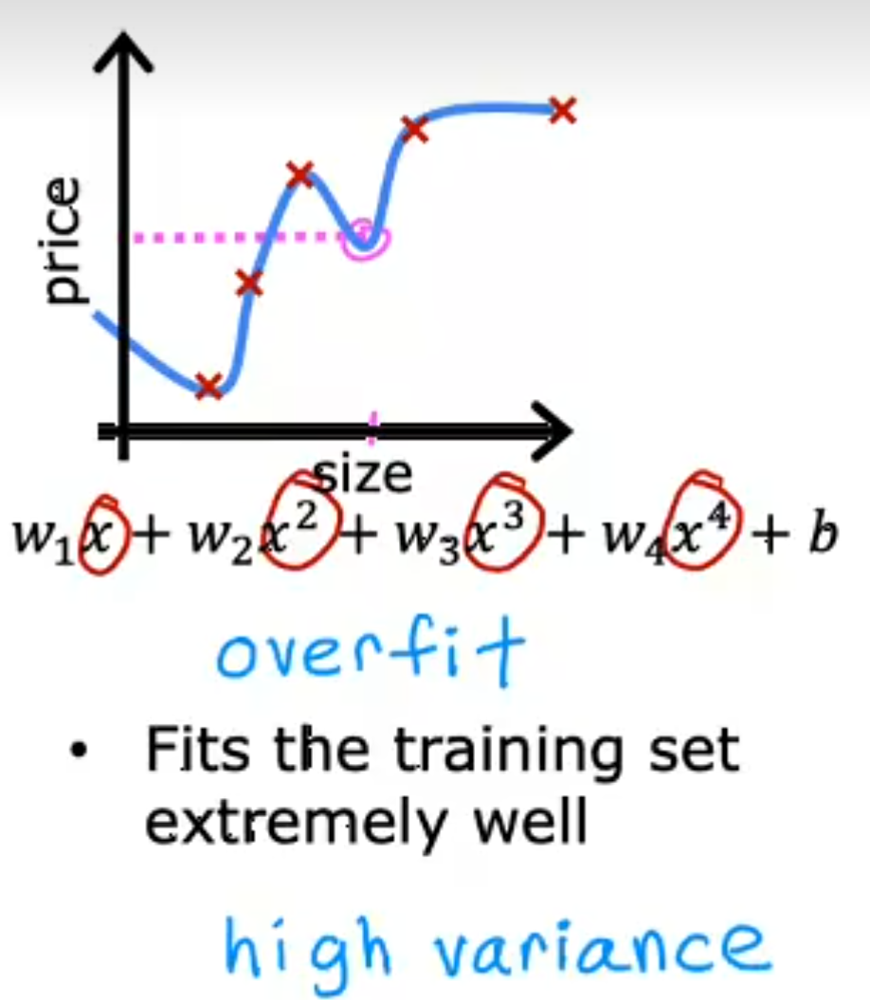

#### 解决过拟合

##### 收集更多训练数据

缺点是需要有足够多的数据样本。

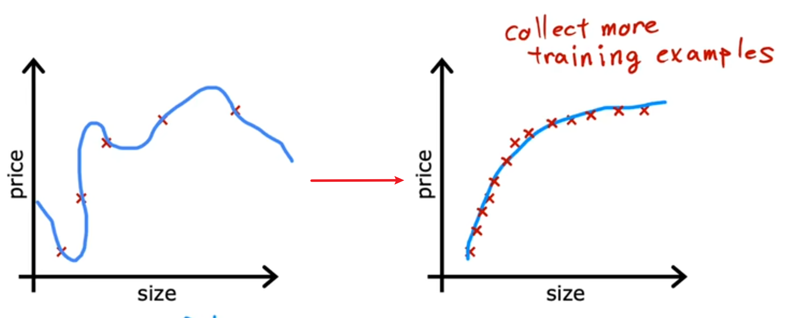

##### 特征选择

从原特征集中筛选更合适的特征子集，但可能丢弃对预测有帮助的特征。

##### 正则化

相对于直接丢弃特征，正则化是一种更温和地减少某些特征影响的方法。

### 正则化

- 核心是鼓励算法缩小参数值。
- 一般只对参数 $w_j$ 正则化，对参数 $b$ 正则化的意义较小。

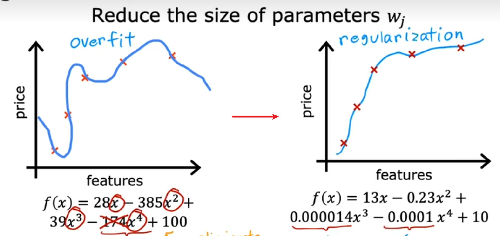

正则化惩罚是在损失函数中添加额外项，以约束模型参数、避免模型过拟合并增强泛化能力。

- $\lambda$ 是正则化参数，且 $\lambda>0$。
- $\lambda=0$ 表示不使用正则化，模型可能更容易过拟合。
- $\lambda$ 过大可能导致欠拟合：参数被惩罚到接近 0，最终模型接近于仅保留 $b$。
- 也可以加上对 $b$ 的正则化：$\frac{\lambda}{2m}b^2$。

正则化线性回归的梯度下降：

$$
w_j=w_j-\alpha\left[
\frac{1}{m}\sum_{i=1}^{m}
\left(f_{\vec{w},b}(\vec{x}^{(i)})-y^{(i)}\right)x_j^{(i)}
+\frac{\lambda}{m}w_j
\right]
$$

$$
b=b-\alpha\frac{1}{m}\sum_{i=1}^{m}
\left(f_{\vec{w},b}(\vec{x}^{(i)})-y^{(i)}\right)
$$

所有参数同步更新，并不断迭代。

正则化会使参数 $w_j$ 在每次迭代中乘以一个略小于 1 的数，具体程度由 $\lambda$ 调整，从而减小参数并降低过拟合程度。

## 逻辑回归模型

Logistic Regression 不用于回归问题，而是用于解决输出结果为 0 和 1 的二元分类问题。

### 术语

- **二元分类**（Binary Classification）
- **决策边界**（Decision Boundary）
- **Sigmoid 函数或逻辑函数**（Sigmoid Function / Logistic Function）
- **损失函数**（Loss Function）
- **非凸函数**（Non-convex Function）

单个样本的损失函数：

$$
L(f_{\vec{w},b}(\vec{x}^{(i)}),y^{(i)})
$$

### 二元分类

- 将输入数据分类，且输出只有两个特定结果。
- 输出通常是 `1`（true）和 `0`（false）。
- `1` 为正类，`0` 为负类。

### 为什么不使用线性回归解决分类问题

如果数据中出现极端离群点，线性回归模型会为了拟合该点而大幅调整斜率，导致其他正常样本的预测值 $\hat{y}$ 被下压，决策边界大幅偏移，最终分类结果不准确。

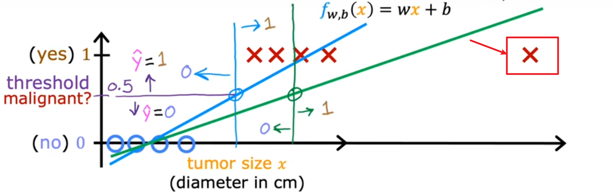

### Sigmoid 函数

Sigmoid 函数将实数映射到 0 和 1 之间，通常用于表示概率：

$$
g(z)=\frac{1}{1+e^{-z}},\qquad g(z)\in(0,1)
$$

令：

$$
z=w_1x_1+w_2x_2+\dots+w_nx_n+b
$$

则逻辑回归模型为：

$$
f_{\vec{w},b}(\vec{x})
=\frac{1}{1+e^{-(\vec{w}\cdot\vec{x}+b)}}
$$

对于给定输入样本，预测结果可以表示为 $y=1$ 的概率：

$$
f_{\vec{w},b}(\vec{x})
=P(y=1\mid\vec{x};\vec{w},b)
$$

### 决策边界

- 决策边界是模型做出分类决策时的分界线，将输入特征空间划分为不同区域，每个区域对应一个类别。
- 对于不同的模型和数据集，决策边界的形状和位置不同。
- 决策边界可以是直线、曲线、闭合线或平面。

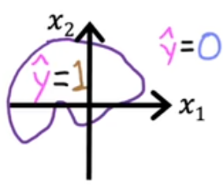
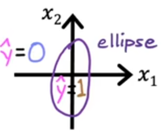
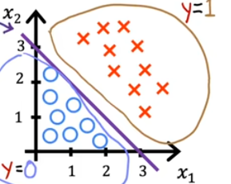
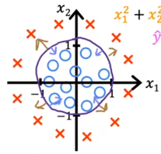

决策边界是所有能使 Sigmoid 函数值等于 0.5 的点的集合：

$$
g(z)=\frac{1}{1+e^{-z}}=0.5
\Longrightarrow z=0
$$

即：

$$
w_1x_1+w_2x_2+\dots+w_nx_n+b=0
$$

决策边界一侧的样本被预测为 0，另一侧被预测为 1。

### 损失函数与代价函数

- 损失函数衡量模型对于单个训练样本的表现。
- 代价函数衡量模型对于整个训练集的表现：

$$
J(\vec{w},b)=\frac{1}{m}\sum_{i=1}^{m}L_i
$$

#### 为什么平方误差代价函数不适用于逻辑回归

若将逻辑回归模型代入平方误差代价函数，图像可能成为非凸函数：

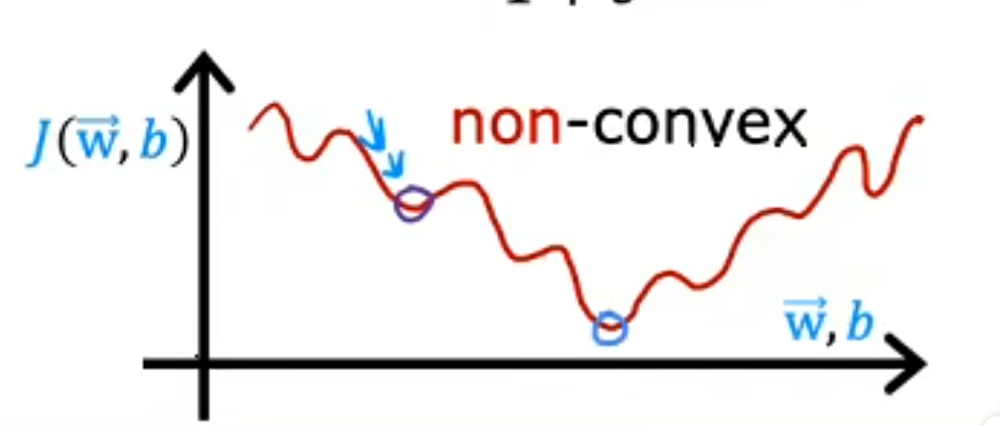

使用梯度下降时容易陷入局部最低点，而不是全局最低点。

#### 逻辑回归的损失函数

$$
L(f_{\vec{w},b}(\vec{x}^{(i)}),y^{(i)})
=
\begin{cases}
-\log(f_{\vec{w},b}(\vec{x}^{(i)})), & y^{(i)}=1 \\
-\log(1-f_{\vec{w},b}(\vec{x}^{(i)})), & y^{(i)}=0
\end{cases}
$$

机器学习中的 $\log$ 通常指自然对数 $\ln$。

将分段形式合并：

$$
L(f_{\vec{w},b}(\vec{x}^{(i)}),y^{(i)})
=-y^{(i)}\log(f_{\vec{w},b}(\vec{x}^{(i)}))
-(1-y^{(i)})\log(1-f_{\vec{w},b}(\vec{x}^{(i)}))
$$

代价函数：

$$
J(\vec{w},b)
=-\frac{1}{m}\sum_{i=1}^{m}
\left[
y^{(i)}\log(f_{\vec{w},b}(\vec{x}^{(i)}))
+(1-y^{(i)})\log(1-f_{\vec{w},b}(\vec{x}^{(i)}))
\right]
$$

该代价函数是凸函数，只有一个局部最低点，即全局最低点，有利于使用梯度下降。

### 逻辑回归的梯度下降

$$
w_j=w_j-\alpha\frac{1}{m}\sum_{i=1}^{m}
\left(f_{\vec{w},b}(\vec{x}^{(i)})-y^{(i)}\right)x_j^{(i)}
$$

$$
b=b-\alpha\frac{1}{m}\sum_{i=1}^{m}
\left(f_{\vec{w},b}(\vec{x}^{(i)})-y^{(i)}\right)
$$

### 欠拟合与过拟合

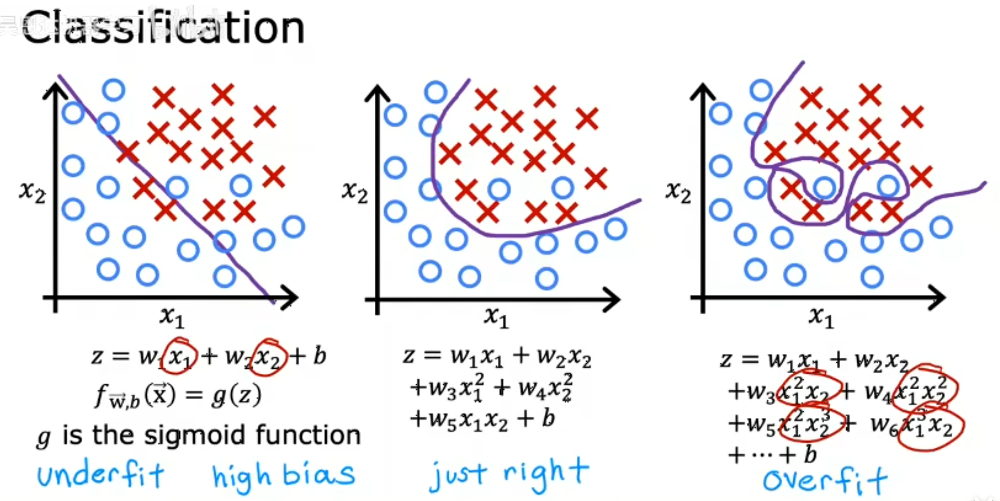

### 正则化逻辑回归

$$
J(\vec{w},b)
=-\frac{1}{m}\sum_{i=1}^{m}
\left[
y^{(i)}\log(f_{\vec{w},b}(\vec{x}^{(i)}))
+(1-y^{(i)})\log(1-f_{\vec{w},b}(\vec{x}^{(i)}))
\right]
+\frac{\lambda}{2m}\sum_{j=1}^{n}w_j^2
$$

## 神经网络模型

### 深度学习

深度学习是机器学习的一种，是以神经网络（Neural Networks）结构为依赖，进行特征学习与数据表达的一种技术。

### 神经网络概述

- **起源**：尝试模拟人类大脑的结构和运作方式。
- **灵感来源**：人脑结构及其运行的生理基础。
- **应用**：
  - 语音识别
  - 计算机视觉，如手写数字识别
  - 文本识别与自然语言处理（Natural Language Processing，NLP）
- **与传统机器学习方法的比较**：对于大规模数据，深度学习通常能表现出更强的性能，但对计算硬件的要求也更高。

### 人脑结构与相关术语


- **neuron**：神经元。
- **electrical impulse**：电脉冲，信息在人脑中的传播形式。
- **nucleus**：细胞核，神经元中处理和整合电脉冲的场所。
- **dendrite**：树突，神经元细胞的输入线。
- **axon**：轴突，神经元细胞的输出线。

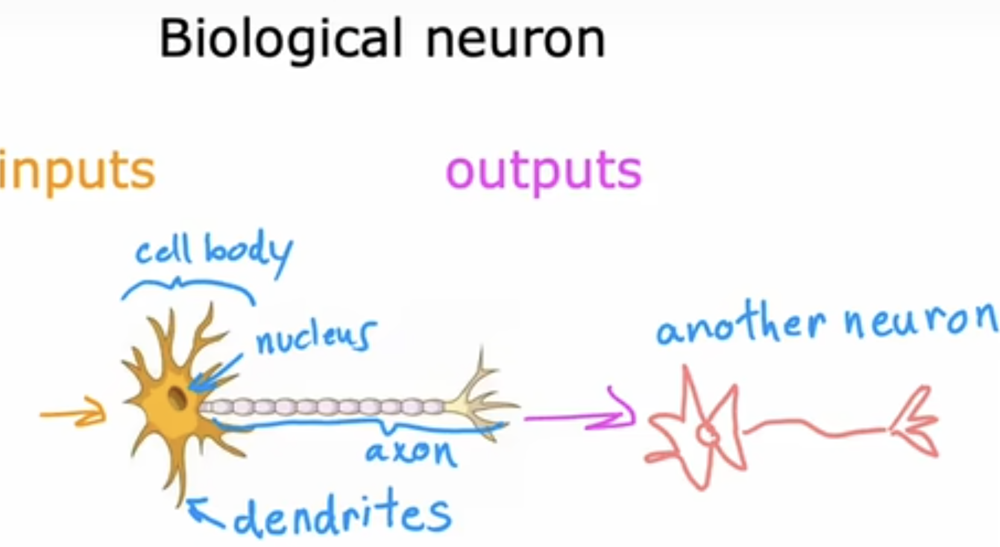

神经网络模仿大脑神经元的信息传递方式。输入信号经过加权处理后生成输出，再将结果传递到下一个神经元或输出层。

### 神经网络基本术语

- **neuron（神经元）**：神经网络中的基本计算单元。神经元先对输入按权重加权并加上偏置，再通过激活函数生成激活值，作为下一层的输入。
- **layer（层）**：神经元的集合。层接收相同或相似的特征，经过计算输出数值，供下一层继续处理；层的结构和深度会影响神经网络的性能与训练难度。
- **input layer（输入层）**：神经网络的第一层，由最初的特征组成，包含所有原始输入数据。
- **hidden layer（隐藏层）**：输入层与输出层之间的层，负责从输入数据中提取复杂特征。
- **output layer（输出层）**：神经网络的最后一层，包含一个或多个神经元，其输出可以表示最终结果或各类别的概率。
- **activation function（激活函数）**：对神经元的计算结果进行非线性变换，生成输出数据（激活值）。
- **weight（权重）**：连接神经元的参数，决定上一层输出对下一个神经元的影响程度。
- **Multi-layer Perceptron，MLP（多层感知器）**：具有一个或多个隐藏层的前馈神经网络结构。

<!-- learning-journey:update-history:start -->
## 更新记录

| 日期 | 类型 | 说明 |
| --- | --- | --- |
| 2026-07-23 | 首次发布 | 合并整理语雀中的机器学习概述、线性回归与逻辑回归笔记并发布 |
| 2026-07-23 | 内容更新 | 补充深度学习概述、神经元结构与神经网络基本术语 |
| 2026-07-28 | 内容更新 | 补充人工智能定义、四要素与发展历史概览 |
<!-- learning-journey:update-history:end -->
