# scikit-learn 机器学习
## 定义：
+ 机器学习（ML）是人工智能的核心，是一门涉及统计学、算法复杂度等多领域的交叉学科，旨在让计算机具有智能

## 主要分类：
+ **监督学习**：具有先验知识（人工标注类别）。包括**分类**（识别类别）和**回归**（预测连续值，如股价）
        * 线性回归
        * Logistic 回归
        * 贝叶斯分类器
        * 支持向量机
        * KNN
        * 决策树
+ **无监督学习**：无先验知识，旨在推断数据的内在结构。典型应用包括**聚类**（分组）和**关联规则**
        * K-means
        * DBSCAN
        * Apriori
        * FP-growth
+ 此外还包括半监督学习和自监督学习

## 关键任务：
+ **分类**：识别对象所属类别
+ **回归**：预测连续值属性
+ **聚类**：自动识别具有相似属性的对象并分组
+ **数据降维**：减少随机变量个数（如PCA），用于可视化和提升效率

## Scikit-learn 库简介
Scikit-learn 是基于 NumPy、SciPy 和 Matplotlib 构建的 Python 机器学习库，提供了一整套简单高效的数据挖掘和数据分析工具，集成了大量成熟的机器学习算法

# sklearn数据处理
## sklearn 数据集的加载：
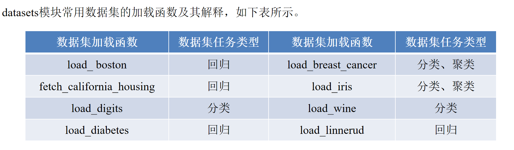

如果需要加载某个数据集，将对应的函数赋值给变量即可

`from sklearn.datasets import load_diabetes  # 加载diabetes数据集
 diabetes = load_diabetes()  # 将数据集赋值给diabetes变量`

### 数据集结构：
加载后的数据集类似字典，包含以下属性 ：

+ `data`: 数据（特征矩阵）
+ `target`: 标签
+ `feature_names`: 特征名称
+ `DESCR`: 数据集描述信息

### 案例：
```python
from sklearn.datasets import load_diabetes  # 加载diabetes数据集
diabetes = load_diabetes()  # 将数据集赋值给diabetes变量
print('diabetes数据集的长度为：', len(diabetes))  # 使用len函数查看数据集长度
print('diabetes数据集的类型为：', type(diabetes))  # 使用type函数查看数据集类型


diabetes_data = diabetes['data']
print('diabetes数据集的数据为：','\n', diabetes_data)
diabetes_target = diabetes['target']  # 取出数据集的标签
print('diabetes数据集的标签为：\n', diabetes_target)
diabetes_names = diabetes['feature_names']  # 取出数据集的特征名
print('diabetes数据集的特征名为：\n', diabetes_names)
diabetes_desc = diabetes['DESCR']  # 取出数据集的描述信息
print('diabetes数据集的描述信息为：\n', diabetes_desc)

```

## sklearn 数据集的划分：
为了验证模型的泛化能力，通常将数据划分为训练集（用于训练模型）、验证集（用于调整模型的超参）和测试集（用于检验模型的泛化能力）

典型比例 50%:25%:25%

### 交叉验证法：
当总样本数据较少时，使用上面的方法将样本数据划分为3部分会不合适。常用的方法是留少部分样本数据做测试集，然后对其余N个样本采用K折交叉验证法

+ 将样本打乱，均匀分成K份
+ 轮流选择其中K-1份做训练，剩余的一份做验证
+ 计算预测误差平方和
+ 将K次的预测误差平方和的均值作为最优模型结构的依据

### train_test_split函数
+ train_test_split函数可将传入的数据集划分为训练集和测试集
+ 常用参数：`*arrays`（接受要划分的数据集）、`test_size`（测试集占比）、`train_size`（训练集占比）、`random_state`（随机种子）、`shuffle`（是否打乱）

### 案例：
```python
from sklearn.datasets import load_diabetes  # 加载diabetes数据集
diabetes = load_diabetes()  # 将数据集赋值给diabetes变量

print('原始数据集数据的形状为：', diabetes_data.shape)
print('原始数据集标签的形状为：', diabetes_target.shape)

from sklearn.model_selection import train_test_split

diabetes_data_train, diabetes_data_test, \
diabetes_target_train, diabetes_target_test = \
train_test_split(diabetes_data, diabetes_target, \
                 test_size=0.2, random_state=42)
print('训练集数据的形状为：', diabetes_data_train.shape)
print('训练集标签的形状为：', diabetes_target_train.shape)
print('测试集数据的形状为：', diabetes_data_test.shape)
print('测试集标签的形状为：', diabetes_target_test.shape)

```

+ `diabetes_data_train`：**训练集特征**（数据）
+ `diabetes_data_test`：**测试集特征**（数据）
+ `diabetes_target_train`：**训练集标签**
+ `diabetes_target_test`：**测试集标签**

## sklearn 数据预处理
Scikit-learn 使用**转换器 (Transformer)** 进行数据预处理，主要有以下三个操作：

+ `fit()`：分析特征，提取有价值信息
+ `transform()`：对特征进行转换
+ `fit_transform()`：先 fit 再 transform

目前，使用sklearn转换器能够实现对传入的NumPy数组进行如下处理：

+ 标准化处理
+ 归一化处理
+ 二值化处理
+ PCA降维等操作

### sklearn 提供的具体预处理方法：
+ `MinMaxScaler`: 离差标准化
+ `StandardScaler`: 标准差标准化
+ `Normalizer`: 归一化
+ `Binarizer`：二值化
+ `OneHotEncoder`：独热编码

### 步骤：
1. 先将特定的预处理方法应用在训练集上`fit()`
2. 再将第一步的结果应用到测试集上`transform()`

### 案例：
```python
import numpy as np
from sklearn.preprocessing import MinMaxScaler
Scaler = MinMaxScaler().fit(diabetes_data_train)  # 生成规则
# 将规则应用于训练集
diabetes_trainScaler = Scaler.transform(diabetes_data_train)
# 将规则应用于测试集
diabetes_testScaler = Scaler.transform(diabetes_data_test)
print('离差标准化前训练集数据的最小值为：',
      np.min(diabetes_data_train))
print('离差标准化后训练集数据的最小值为：',
      np.min(diabetes_trainScaler))
print('离差标准化前训练集数据的最大值为：',
      np.max(diabetes_data_train))
print('离差标准化后训练集数据的最大值为：',
      np.max(diabetes_trainScaler))
print('离差标准化前测试集数据的最小值为：',
      np.min(diabetes_data_test))
print('离差标准化后测试集数据的最小值为：',
      np.min(diabetes_testScaler))
print('离差标准化前测试集数据的最大值为：',
      np.max(diabetes_data_test))
print('离差标准化后测试集数据的最大值为：',
      np.max(diabetes_testScaler))

```

## sklearn 数据降维：
sklearn的decomposition模块中提供了PCA类，可实现对数据集进行PCA降维

### 案例：
```python
from sklearn.decomposition import PCA
pca_model = PCA(n_components=8).fit(diabetes_trainScaler)
# 将规则应用于训练集
diabetes_trainPca = pca_model.transform(diabetes_trainScaler)
# 将规则应用于测试集
diabetes_testPca = pca_model.transform(diabetes_testScaler)
print('PCA降维前训练集数据的形状为：', diabetes_trainScaler.shape)
print('PCA降维后训练集数据的形状为：', diabetes_trainPca.shape)
print('PCA降维前测试集数据的形状为：', diabetes_testScaler.shape)
print('PCA降维后测试集数据的形状为：', diabetes_testPca.shape)

```

# 聚类模型的构建与评价
聚类的输入是一组未被标记的样本，聚类根据数据自身的距离或相似度将它们划分为若干组

划分的原则是**组内距离最小化，组间距离最大化**

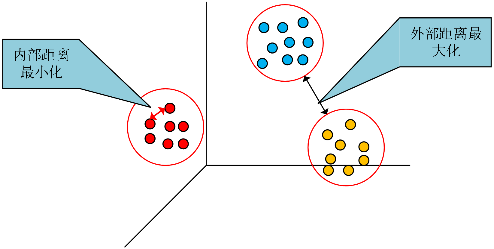

## 常见的聚类类别与算法：
+ 划分（分裂）方法：
        * K-Means (K-平均)算法
        * K-MEDOIDS（K-中心点）算法
        * CLARANS（基于选择的）算法
+ 层次分析方法：
        * BIRCH （平衡迭代规约和聚类）算法
        * CURE （代表点聚类）算法
        * CHAMELEON（动态模型）算法
+ 基于密度的方法：
        * DBSCAN算法（基于高密度连接区域）
        * DENCLUE算法（密度分布函数）
        * OPTICS算法（对象排序识别）
+ 基于网络的方法：
        * STING算法（统计信息网络）
        * CLIQUE 算法（聚类高维空间）
        * WAVE-CLUSTER算法（小波变换）

## sklearn 聚类模型的构建：
### 步骤：
1. 读取数据集，划分数据和标签
2. 应用聚类
3. 使用 TSNE 进行数据降维，便于可视化
4. 将原始数据转换为 DataFrame，将聚类结果一并存入
5. 提取不同标签的数据，绘制图形

### 案例：
```python
import pandas as pd
from sklearn.manifold import TSNE
import matplotlib.pyplot as plt
from sklearn.cluster import KMeans

# 1. 加载数据
# 使用 pandas 读取 CSV 文件，encoding='gbk' 是为了防止中文乱码
# 注意：你需要确保 '../data/customer.csv' 这个路径下真的有这个文件
customer = pd.read_csv('../data/customer.csv', encoding='gbk')

# 2. 数据切分
# iloc[:, :-1] 取所有行，除了最后一列之外的所有列（特征数据，用于聚类）
customer_data = customer.iloc[:, :-1]
# iloc[:, -1] 取所有行，只取最后一列（原始标签，用于对比或后续验证，但在KMeans训练中不使用）
customer_target = customer.iloc[:, -1]

# 3. 构建并训练 K-Means 聚类模型
# n_clusters=4: 告诉模型我们要把数据分成 4 类
# random_state=6: 设置随机种子，保证每次运行聚类结果一致
kmeans = KMeans(n_clusters=4, random_state=6).fit(customer_data)

# 4. 使用 t-SNE 进行降维（为了可视化）
# 因为 customer_data 可能有很多列（高维），无法直接在平面上画图
# 所以用 t-SNE 把它“压”扁成 2 维 (n_components=2)
# init='random': 初始化方式
# random_state=2: 固定随机种子
tsne = TSNE(n_components=2, init='random', random_state=2).fit(customer_data)

# 5. 整理绘图数据
# 将 t-SNE 降维后的坐标 (embedding_) 转换成 DataFrame 方便操作
df = pd.DataFrame(tsne.embedding_)

# 关键步骤：将 K-Means 算出来的聚类标签 (labels_) 拼接到这个表中
# 这样我们就知道每个坐标点属于哪一类了
df['labels'] = kmeans.labels_

# 6. 分组提取数据
# 根据 labels 列的值，把 4 类数据分别提取出来，方便后面用不同样式绘制
df1 = df[df['labels'] == 0] # 第0类
df2 = df[df['labels'] == 1] # 第1类
df3 = df[df['labels'] == 2] # 第2类
df4 = df[df['labels'] == 3] # 第3类

# 7. 绘制可视化图形
fig = plt.figure(figsize=(9, 6)) # 创建一个 9x6 英寸的空白画布

# 绘制散点图，不同的类使用不同的颜色和形状
# 'bo': blue circle (蓝色圆点) 表示第0类
# 'r*': red star (红色星星) 表示第1类
# 'gD': green Diamond (绿色菱形) 表示第2类
# 'kD': black Diamond (黑色菱形) 表示第3类
plt.plot(df1[0], df1[1], 'bo',
         df2[0], df2[1], 'r*',
         df3[0], df3[1], 'gD',
         df4[0], df4[1], 'kD')

# 8. 保存与显示
# 保存图片到指定路径，dpi=1080 保证清晰度
plt.savefig('../tmp/聚类结果.jpg', dpi=1080)
# 在屏幕上显示图片
plt.show()
```

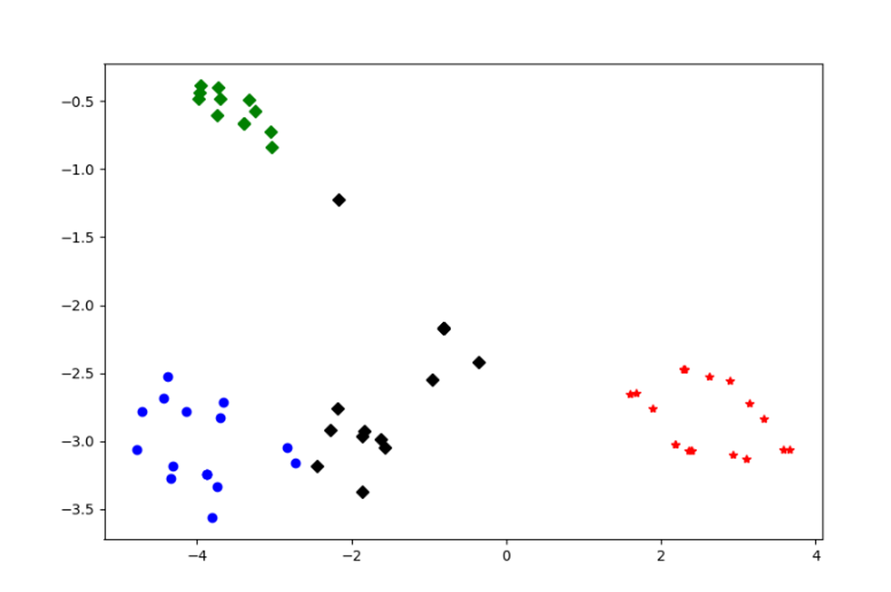

## sklearn 聚类模型的评价：
### 评价标准：
组内的相似性越大，组间差别越大，聚类效果就越好

具体评价方法分为有真实值参考和无真实值参考两大类

### 评价指标：
+ 有真实值参考：
    - 指标：**ARI** (兰德系数), **AMI** (互信息), **FMI**, **V-measure**
    - 最佳值均为 **1.0**
+ 无真实值参考：
    -  轮廓系数 (Silhouette Score)  ：数值最大的效果好
    -  Calinski-Harabasz 指数  ：数值最大的效果好

### 案例：
```python
import pandas as pd
import matplotlib.pyplot as plt
from sklearn.cluster import KMeans
# 导入三种不同的评价指标
from sklearn.metrics import fowlkes_mallows_score   # FMI (有真实标签时用)
from sklearn.metrics import silhouette_score        # 轮廓系数 (无标签时用)
from sklearn.metrics import calinski_harabasz_score # CH指数 (无标签时用)

# ==========================================
# 第一步：准备数据
# ==========================================
# 读取数据，确保路径正确
# encoding='gbk' 是为了防止中文乱码
try:
    customer = pd.read_csv('../data/customer.csv', encoding='gbk')
    print("数据加载成功！")
except FileNotFoundError:
    print("错误：找不到文件，请检查路径 '../data/customer.csv'")
    # 为了演示代码逻辑，这里可以模拟数据（实际运行时请忽略这几行）
    # import numpy as np
    # customer_data = np.random.rand(100, 5)
    # customer_target = np.random.randint(0, 4, 100)
    exit()

# 切分特征和标签
# iloc[:, :-1]：取除了最后一列的所有列（特征），用于聚类训练
customer_data = customer.iloc[:, :-1]
# iloc[:, -1]：只取最后一列（真实标签），仅用于 FMI 评估，训练时不给模型看
customer_target = customer.iloc[:, -1]


# ==========================================
# 第二步：FMI 评价法 (有参考答案)
# ==========================================
print("\n--- 1. FMI 评价 (需要真实标签) ---")
# FMI 衡量聚类结果与真实标签的相似度，范围 0~1，越接近 1 越好
for i in range(1, 7):
    # 构建并训练模型：尝试把数据分成 i 类
    kmeans = KMeans(n_clusters=i, random_state=6).fit(customer_data)

    # 计算分数：传入(真实标签, 预测标签)
    score = fowlkes_mallows_score(customer_target, kmeans.labels_)

    print('聚成 %d 类时，FMI 分值为：%f' % (i, score))


# ==========================================
# 第三步：轮廓系数评价法 (无参考答案)
# ==========================================
print("\n--- 2. 轮廓系数评价 (不需要真实标签) ---")
# 轮廓系数衡量“组内紧凑度”和“组间分离度”，越接近 1 越好
silhouettteScore = [] # 用于存储每次的结果，方便画图

# 注意：轮廓系数至少需要 2 个簇才能计算，所以从 2 开始循环
for i in range(2, 10):
    # 训练模型
    kmeans = KMeans(n_clusters=i, random_state=6).fit(customer_data)

    # 计算分数：传入(原始数据, 预测标签)
    score = silhouette_score(customer_data, kmeans.labels_)
    silhouettteScore.append(score)
    print('聚成 %d 类时，轮廓系数为：%f' % (i, score))

# 可视化：画折线图找最高点
plt.figure(figsize=(10, 6))
plt.plot(range(2, 10), silhouettteScore, linewidth=1.5, linestyle='-', marker='o')
plt.title('轮廓系数走势图 (越高越好)')
plt.xlabel('聚类数量 (K)')
plt.ylabel('轮廓系数')
plt.grid(True) # 加网格方便看
plt.savefig('../tmp/轮廓系数.jpg', dpi=1080)
print("轮廓系数折线图已保存。")
# plt.show() # 如果在 Jupyter Notebook 中可以取消注释直接显示


# ==========================================
# 第四步：Calinski-Harabasz 指数 (无参考答案)
# ==========================================
print("\n--- 3. CH 指数评价 (不需要真实标签) ---")
# CH 指数计算类间方差与类内方差的比值，分数越高越好
for i in range(2, 5):
    # 训练模型
    kmeans = KMeans(n_clusters=i, random_state=2).fit(customer_data)

    # 计算分数：传入(原始数据, 预测标签)
    score = calinski_harabasz_score(customer_data, kmeans.labels_)

    print('聚成 %d 类时，CH 指数为：%f' % (i, score))
```

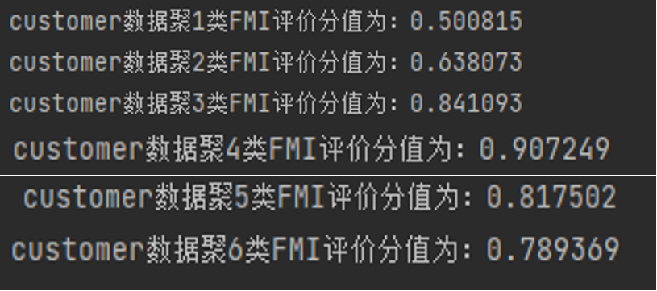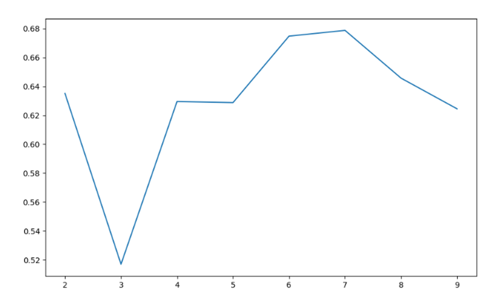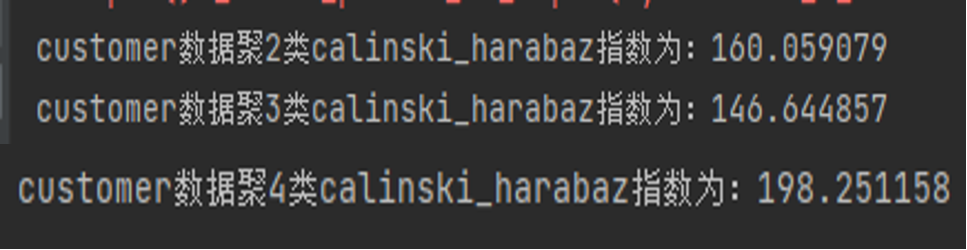


# 分类模型的构建与评价
## 常见的分类类别与算法
+ 基于样本距离的最近邻算法KNN（K最近邻分类）
+ 逻辑斯蒂回归
+ 支持向量机
+ 高斯朴素贝叶斯
+ 分类决策树
+ 梯度提升分类树
+ 随机森林

## 分类模型的评价指标：
+ Accuracy 准确率

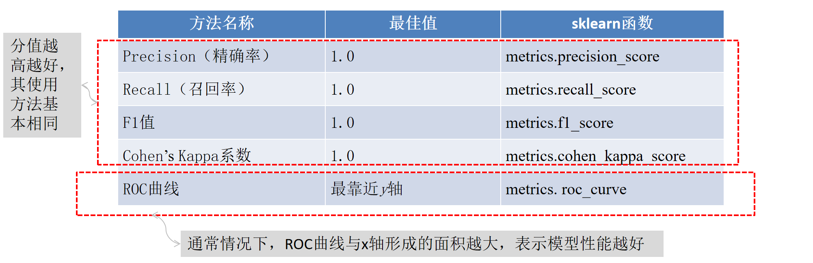

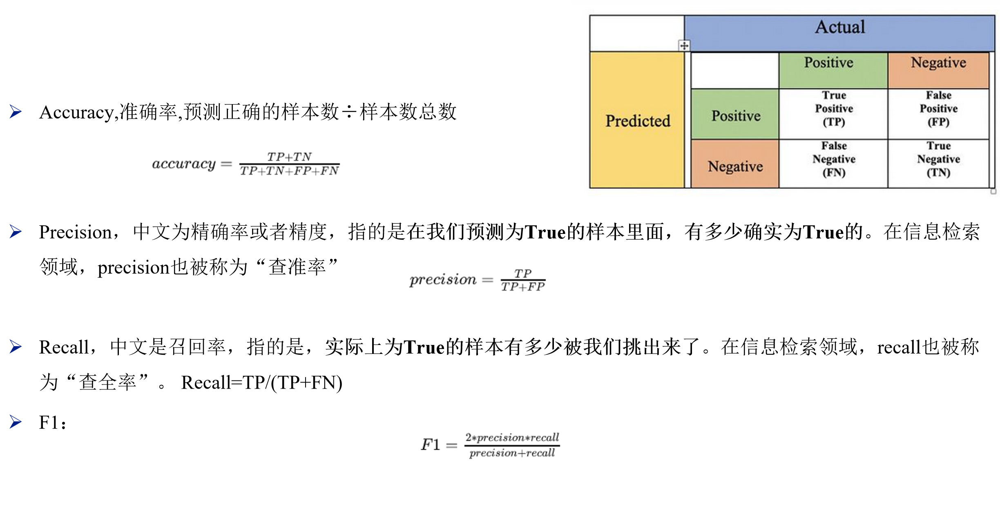

## 案例：
```python
import pandas as pd
# 读取数据集
quit_job = pd.read_csv('../data/quit_job.csv', encoding='gbk')
# 拆分数据和标签
quit_job_data = quit_job.iloc[:, :-1]
quit_job_target = quit_job.iloc[:, -1]
# 划分训练集和测试集
from sklearn.model_selection import train_test_split
quit_job_data_train, quit_job_data_test, \
quit_job_target_train, quit_job_target_test = \
train_test_split(quit_job_data, quit_job_target,
                 test_size=0.2, random_state=66)
# 标准化数据集
from sklearn.preprocessing import StandardScaler
stdScale = StandardScaler().fit(quit_job_data_train)
quit_job_trainScaler = stdScale.transform(quit_job_data_train)
quit_job_testScaler = stdScale.transform(quit_job_data_test)


# 构建SVM模型,并预测测试集结果
from sklearn.svm import SVC
svm = SVC().fit(quit_job_trainScaler, quit_job_target_train)
# 预测训练集结果
quit_job_target_pred = svm.predict(quit_job_testScaler)
print('预测前20个结果为：\n', quit_job_target_pred[: 20])


import numpy as np
# 求出预测和真实一样的数目
true = np.sum(quit_job_target_pred == quit_job_target_test )
print('预测对的结果数目为：', true)
print('预测错的结果数目为：', quit_job_target_test.shape[0] - true)
print('预测结果准确率为：', true / quit_job_target_test.shape[0])


from sklearn.metrics import accuracy_score,precision_score, \
recall_score,f1_score,cohen_kappa_score
print('使用SVM预测quit_job数据的准确率为：',
      accuracy_score(quit_job_target_test, quit_job_target_pred))
print('使用SVM预测quit_job数据的精确率为：',
      precision_score(quit_job_target_test, quit_job_target_pred))
print('使用SVM预测quit_job数据的召回率为：',
      recall_score(quit_job_target_test, quit_job_target_pred))
print('使用SVM预测quit_job数据的F1值为：',
      f1_score(quit_job_target_test, quit_job_target_pred))
print('使用SVM预测quit_job数据的Cohen’s Kappa系数为：',
      cohen_kappa_score(quit_job_target_test,
                        quit_job_target_pred))


from sklearn.metrics import classification_report
print('使用SVM预测quit_job数据的分类报告为：', '\n',
      classification_report(quit_job_target_test,
                            quit_job_target_pred))


from sklearn.metrics import roc_curve
import matplotlib.pyplot as plt
# 使用连续决策分数绘制 ROC 曲线
quit_job_target_score = svm.decision_function(quit_job_testScaler)
fpr, tpr, thresholds = roc_curve(
    quit_job_target_test,
    quit_job_target_score,
)
plt.figure(figsize=(10, 6))
plt.xlim(0, 1)  # 设定x轴的范围
plt.ylim(0.0, 1.1)  # 设定y轴的范围
plt.xlabel('False Positive Rate')
plt.ylabel('True Positive Rate')
plt.plot(fpr, tpr, linewidth=2, linestyle='-', color='red')
plt.plot([0, 1], [0, 1], linestyle='-.', color='blue')
plt.savefig('../tmp/ROC曲线.jpg', dpi=1080)
plt.show()

```

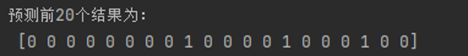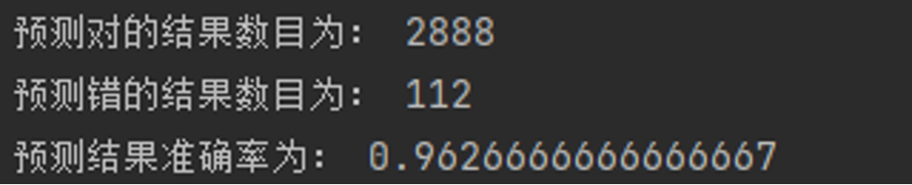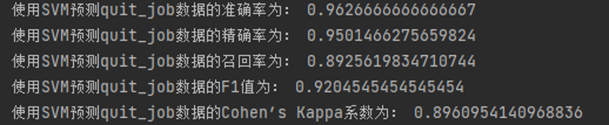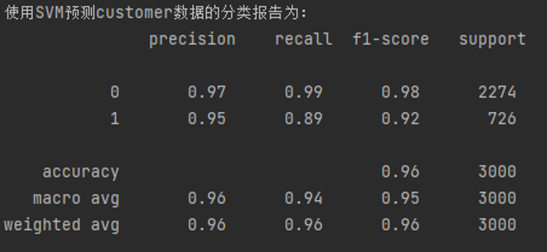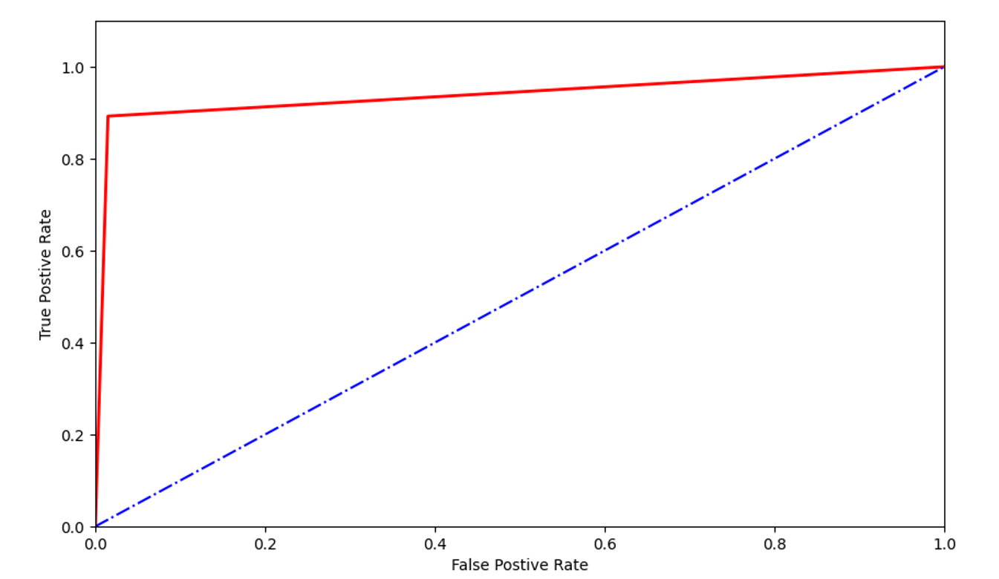

# 回归模型的构建与评价
## 常见的回归类别与算法
+ 线性回归
+ 非线性回归
+ 支持向量回归
+ 最近邻回归
+ 回归决策树
+ 随机森林回归
+ 梯度提升回归树
+ 主成分回归

## 回归模型的评价指标：
由于回归模型的预测结果和真实值都是连续的，所以不能够求取Precision、Recall和F1值等评价指标：

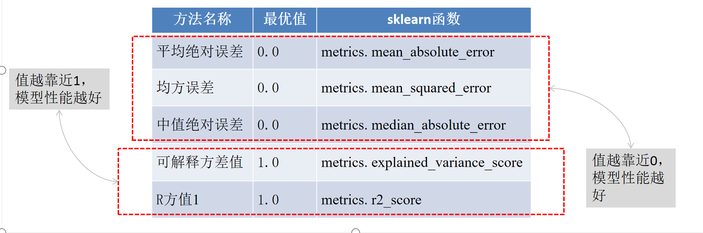

## 案例：
```python
import pandas as pd
# 读取数据集
concrete = pd.read_csv('../data/concrete.csv', encoding='gbk')
# 拆分数据和标签
concrete_data = concrete.iloc[:, :-1]
concrete_target = concrete.iloc[:, -1]
# 划分训练集和测试集
from sklearn.model_selection import train_test_split
concrete_data_train, concrete_data_test, \
concrete_target_train, concrete_target_test = \
train_test_split(concrete_data, concrete_target,
                 test_size=0.2, random_state=20)
from sklearn.linear_model import LinearRegression
concrete_linear = LinearRegression().fit(concrete_data_train,
                                       concrete_target_train)
# 预测测试集结果
y_pred = concrete_linear.predict(concrete_data_test)
print('预测前20个结果为：','\n', y_pred[: 20])


import matplotlib.pyplot as plt
from matplotlib import rcParams
rcParams['font.sans-serif'] = 'SimHei'
fig = plt.figure(figsize=(12, 6))  # 设定空白画布，并制定大小
plt.plot(range(concrete_target_test.shape[0]),
         list(concrete_target_test), color='blue')
plt.plot(range(concrete_target_test.shape[0]),
         y_pred, color='red', linewidth=1.5, linestyle='-.')
plt.legend(['真实值', '预测值'])
plt.savefig('../tmp/回归结果.jpg', dpi=1080)
plt.show()  # 显示图片


from sklearn.metrics import explained_variance_score,\
mean_absolute_error, mean_squared_error,\
median_absolute_error, r2_score
print('concrete数据线性回归模型的平均绝对误差为：',
      mean_absolute_error(concrete_target_test, y_pred))
print('concrete数据线性回归模型的均方误差为：',
      mean_squared_error(concrete_target_test, y_pred))
print('concrete数据线性回归模型的中值绝对误差为：',
      median_absolute_error(concrete_target_test, y_pred))
print('concrete数据线性回归模型的可解释方差值为：',
      explained_variance_score(concrete_target_test, y_pred))
print('concrete数据线性回归模型的R方值为：',
      r2_score(concrete_target_test, y_pred))

```

<!-- learning-journey:update-history:start -->
## 更新记录

| 日期 | 类型 | 说明 |
| --- | --- | --- |
| 2026-07-28 | 首次发布 | 从语雀整理并发布到学习记录仓库 |
<!-- learning-journey:update-history:end -->
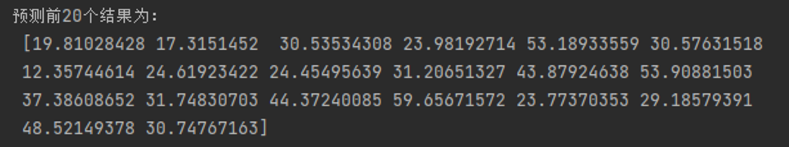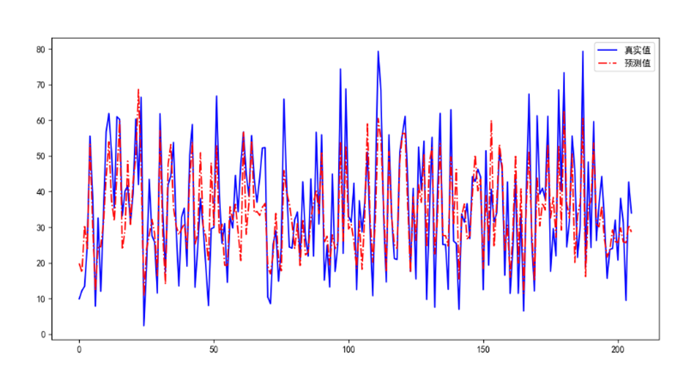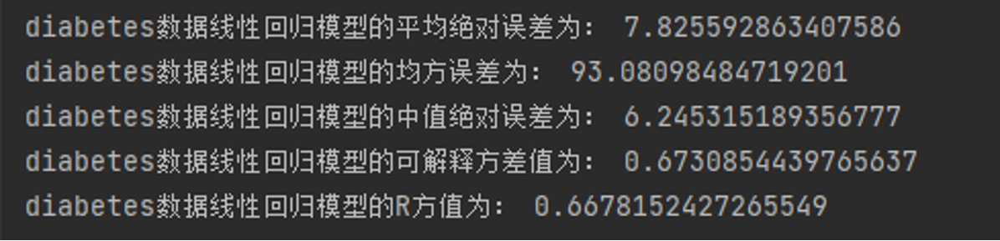
