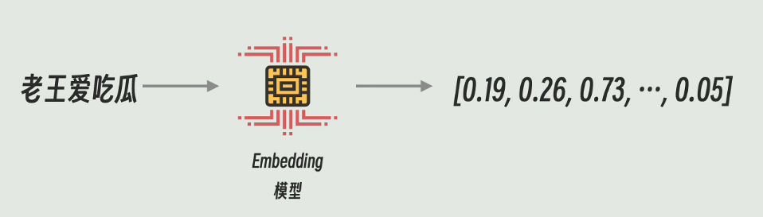
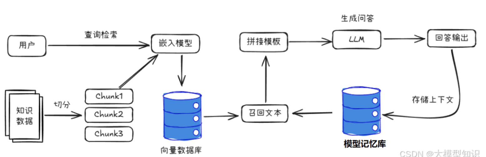
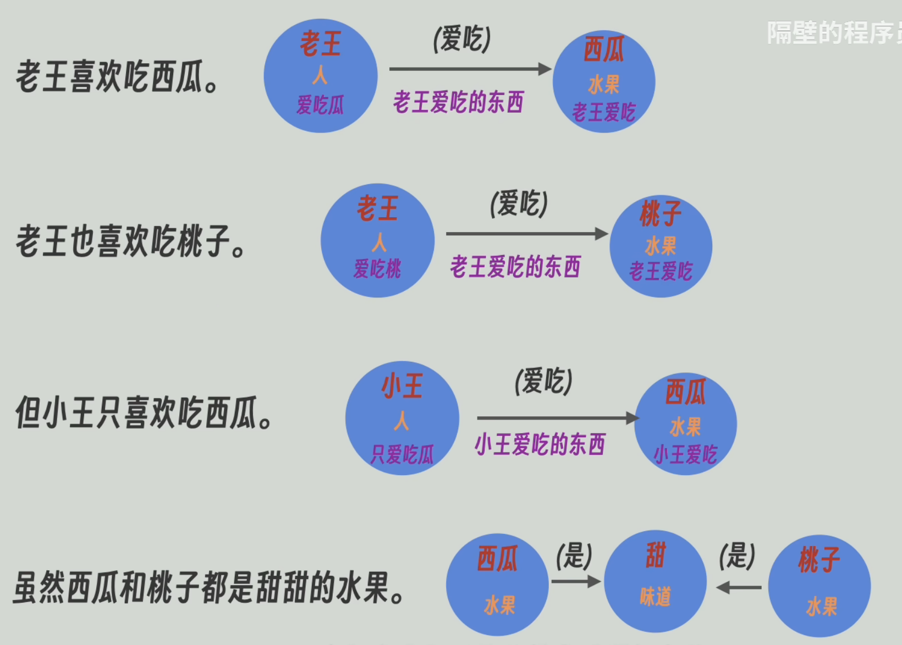
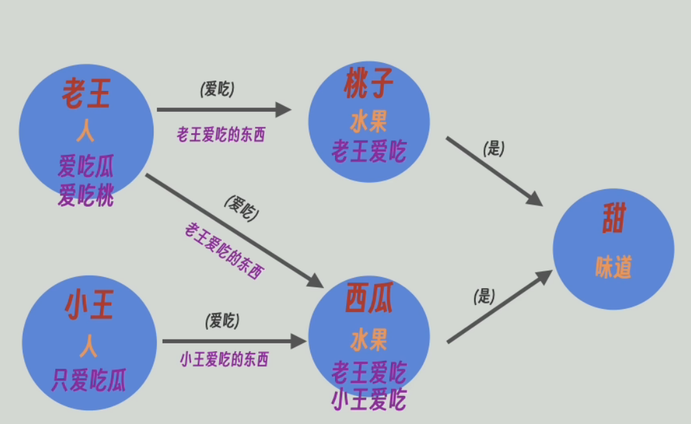
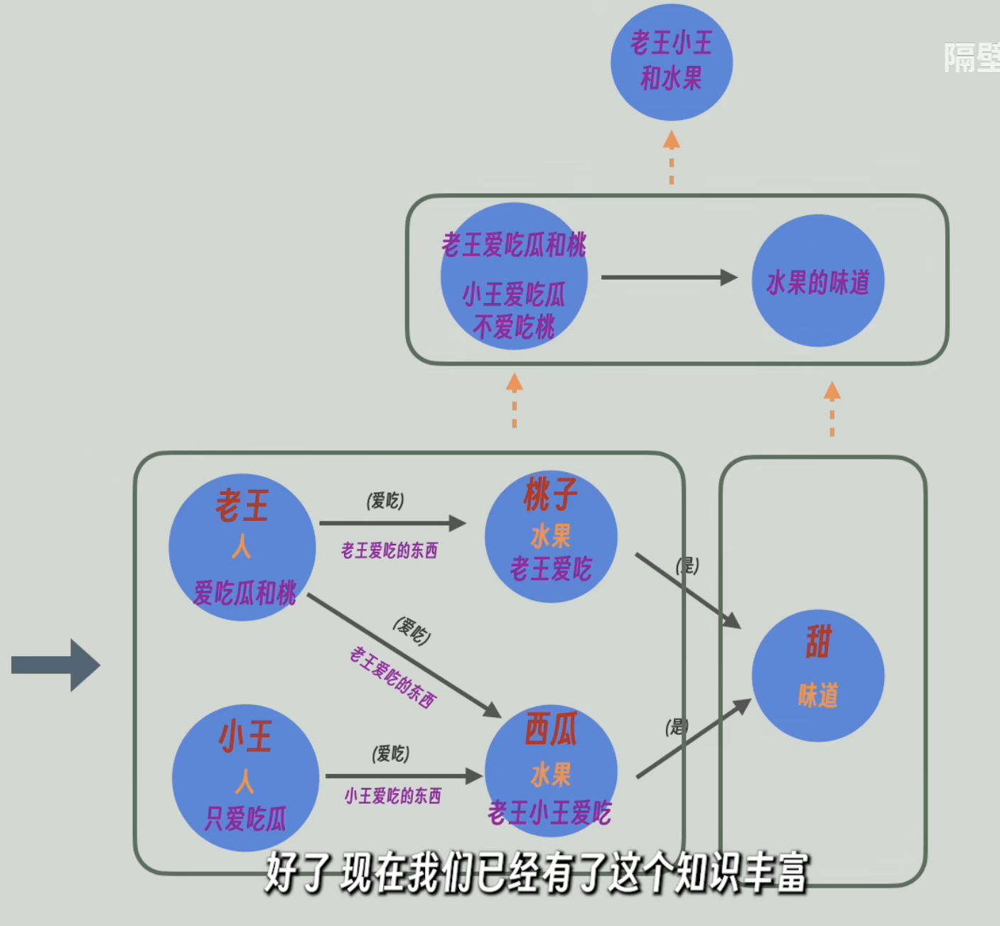

# RAG 与 GraphRAG

## RAG（检索增强生成）

> + Retrieval-Augmented Generation
>

### 定义
+ 是一种旨在解决大模型知识局限、缓解幻觉问题，将大语言模型与外部知识源检索相结合的技术框架。
+ 通过从外部数据源检索相关信息来增强LLM的输出，从而生成更准确、更具有丰富上下文的模型响应

$ RAG = 检索技术 + LLM提示 $

### 基本概念
#### Chunking（切块）
+ 将长段文本按照固定规则切分成小块的技术
+ 有很多Chunking规则，包括按字数切分、按段落切分、按句子切分，以及其他更为复杂的切块规则

#### Embedding模型（嵌入模型）
+ 输入一段文本，输出规定维度向量的模型

+ 在RAG架构中，Embedding模型接收Chunk数据，捕捉其核心含义，并转换成固定维度的向量

#### Vector Database（向量数据库）
+ 将每一条数据与对应的向量绑定存储的数据库
+ 本质上是近似查找，输入一个向量，就会返回与之在多维空间中与输入向量距离最近的向量对应的数据
+ 向量数据库被用来存储Embedding的结果

### 基本流程

1. 按照特定规则，将提供的外部数据源进行Chunking
2. 将Chunk通过Embedding模型生成相应的向量，存储到向量数据库中等待被检索
3. 将用户提出的问题通过Embedding模型也转化为向量
4. 从向量数据库中检索出与问题向量距离最近的几段内容，把这些内容作为新的数据源重新打包提供给LLM，让其依据与问题密切相关的新的数据源作出回答

### 缺点：
+ 片段切的太大——>导致全局问题和局部片段之间的匹配度太低
+ 片段切的太小——>信息之间的关系容易被打断
+ 矛盾：切的太大漏掉细节，切的太小失去语义之间的联系；最终导致RAG难以准确

## GraphRAG（图增强 RAG）

### 定义
GraphRAG是微软在2024年提出的，结构化、分层式的RAG方法，使用知识图谱解决传统RAG矛盾，提供更加系统和智能的检索方式

### 概念
#### LPG（带标签属性图）
> Labelled Property Graph
>

一种以节点、边、标签和属性构成的图数据模型

广泛用于表示实体及其复杂关系

#### Data gleaning（数据拾遗）
+ 在GraphRAG中，Data gleaning是将大模型基于原文生成的知识图谱连同原文再次发送给大模型，并询问是否有补充部分，循环进行直至大模型无内容补充

#### Leiden algorithm（莱顿社区检测）
+ 将复杂知识图谱中边较为密集的节点合并为一个整体，不断向上抽象精炼，构成知识图谱的层级结构

#### Local search
查询时从最底层（最详细，最具体）的图谱开始查询，擅长处理细节丰富，定位准确的问题

#### Global search
从最高层（最笼统，最抽象）的图谱开始查询，适合回答更抽象、全局性更强的问题

### 基本流程
1. 按照特定规则，将提供的外部数据源进行Chunking
2. 结合专用Prompt，将Chunk提供给LLM，一一对应生成LPG样式的知识图谱

3. 一一将生成的知识图谱和原文发送给LLM，进行Data gleaning
4. 把所有知识图谱中名字相同的实体以及描述信息进行合并

5. 通过莱顿社区检测，将复杂知识图谱中边较为密集的节点合并为一个整体，不断向上抽象精炼，构成知识图谱层级结构

6. 将知识图谱中的每个节点、每条边的实体信息和总结性描述都当作文字片段进入Embedding模型并存入向量数据库
7. 将最开始知识源原文的每一个Chunk也进入Embedding模型并存入向量数据库，构成最终形态
8. 将用户的问题Chunking，进入Embedding，在向量数据库查询；查询时较为灵活：可以选择知识图谱的某一或某几抽象层进行查询，以此解决传统RAG的矛盾点
9. 将查询结果和用户问题打包发送给LLM，获得LLM生成

<!-- learning-journey:update-history:start -->
## 更新记录

| 日期 | 类型 | 说明 |
| --- | --- | --- |
| 2026-07-24 | 首次发布 | 合并整理 RAG 与 GraphRAG 两篇语雀笔记并发布 |
<!-- learning-journey:update-history:end -->
