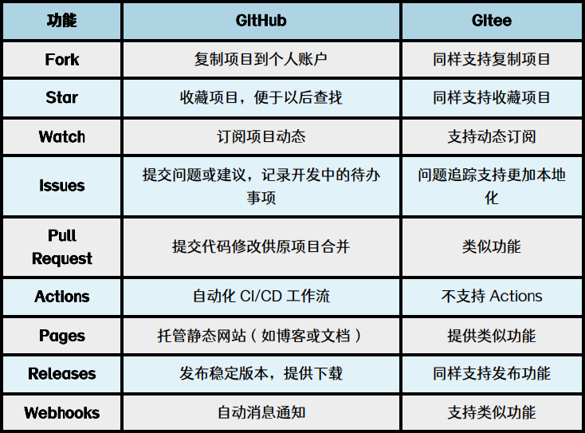
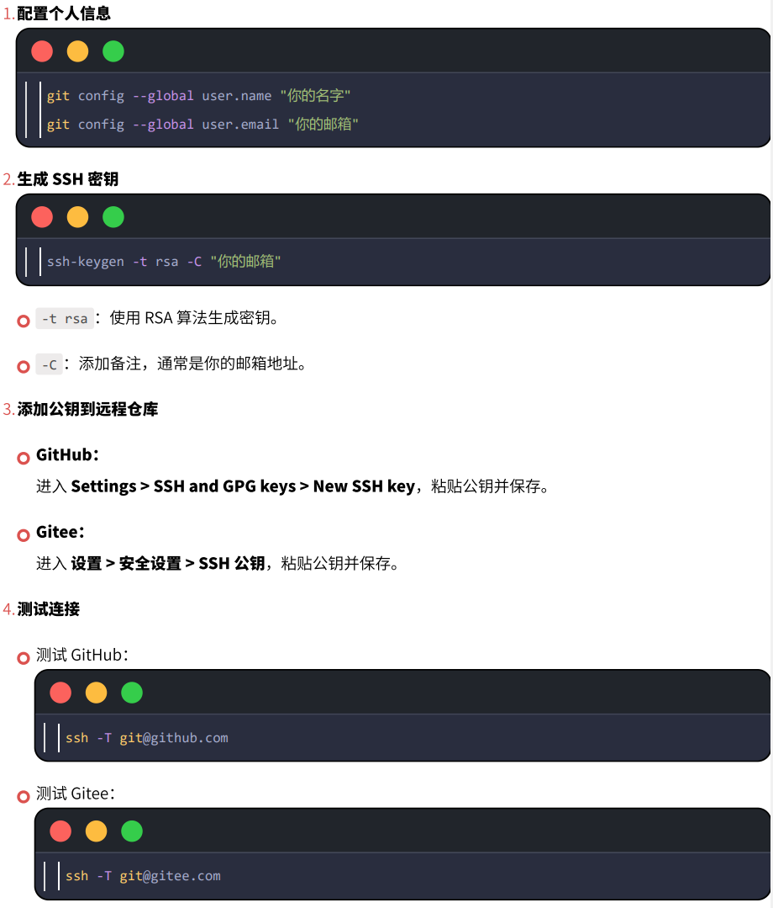
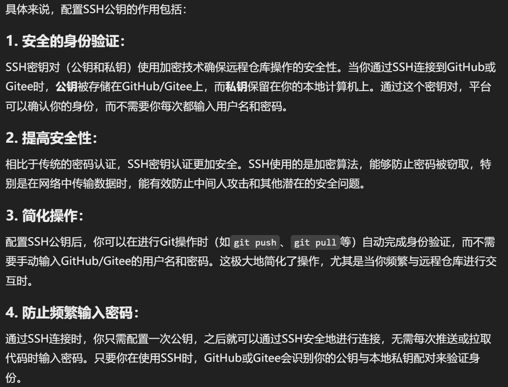
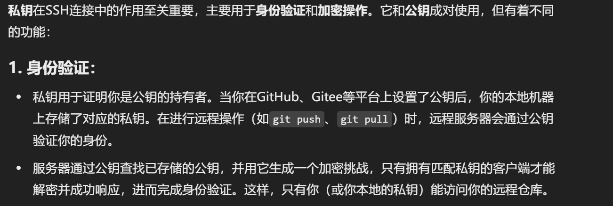
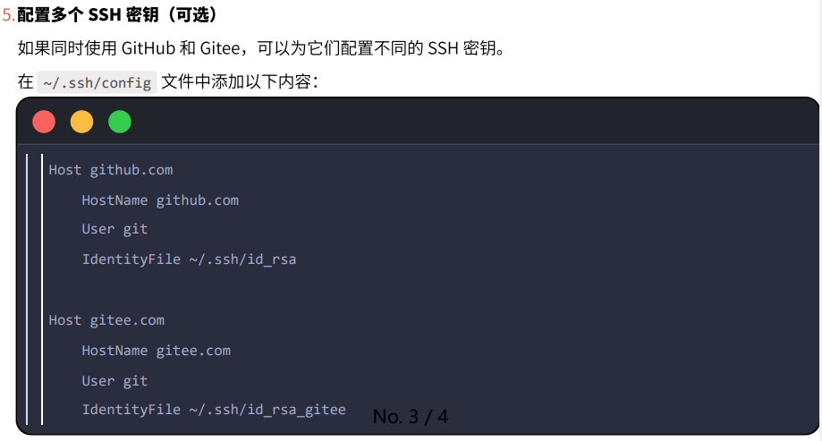

# Git 与代码托管基础

## Git 是什么

通俗来讲：

- 代码日记本：记录代码的改动
- 时光回溯机：保存代码的历史记录，方便回溯和合并修改
- Git 广泛应用于软件开发，特别是开源项目和团队合作

### 特点

- **版本控制**：保存开发过程和历次更新成果，可以进行版本管理。
- **分支管理**：开发者可以在不影响主干的前提下，在不同分支上并行开发，之后通过合并操作将修改集成到主干。
- **分布式**：每个开发者的本地计算机上都有完整的版本库，没有网络也可以工作。
- **存储方式**：Git 在逻辑上记录每次提交的文件快照，底层存储时会通过增量压缩等方式减少空间占用。

## GitHub 是什么

- “全球化的代码社交云平台”“全球代码共享图书馆”。
- 可以把代码仓库上传到 GitHub，进行分享、访问和协作开发。
- 拥有庞大的开源社区，是学习和参加开源项目的重要平台。

## Gitee 是什么

- 中国本土化的代码托管平台。
- 对国内开发者友好，能够与钉钉等本地工具集成。
- 常用于国内企业内部项目开发。

## GitHub 与 Gitee 核心功能



## SSH 与 Git

### SSH 是什么

SSH（Secure Shell）是一种用于安全远程访问计算机的通信协议。它定义了如何通过网络安全地远程访问服务器并进行操作，通过加密保证数据的保密性和完整性，防止数据在不安全的网络中被窃取或篡改。

### SSH 在 Git 中的作用

SSH 用于安全认证与便捷连接，使本地仓库和远程仓库能够安全通信，并省去每次推送或拉取代码时输入密码的麻烦。

### SSH 配置步骤



### SSH 公钥和私钥的作用





### 密钥存储位置

生成的密钥通常保存在用户目录下的 `.ssh` 文件夹中：

- 私钥：`C:\Users\pinkman\.ssh\id_rsa`
- 公钥：`C:\Users\pinkman\.ssh\id_rsa.pub`

生成密钥时可以使用通用示例邮箱：

```bash
ssh-keygen -t rsa -C "pinkman@example.com"
```

### 配置多个 SSH 密钥

如果同时使用 GitHub 和 Gitee，可以为它们配置不同的 SSH 密钥：



## SourceTree

SourceTree 是用于管理 Git 仓库的可视化软件，可以简化部分 Git 操作。

## 参考课程

- [Git、GitHub 和 Gitee 完整讲解：从基础到进阶功能](https://www.bilibili.com/video/BV1G8CFYvEjt/)

## 总结

- **Git**：代码版本管理的核心工具
- **GitHub 与 Gitee**：用于代码分享、交流与协作的平台
- **SourceTree**：简化 Git 操作的可视化软件

<!-- learning-journey:update-history:start -->
## 更新记录

| 日期 | 类型 | 说明 |
| --- | --- | --- |
| 2026-07-22 | 首次发布 | 从语雀整理并发布到学习记录仓库 |
<!-- learning-journey:update-history:end -->
