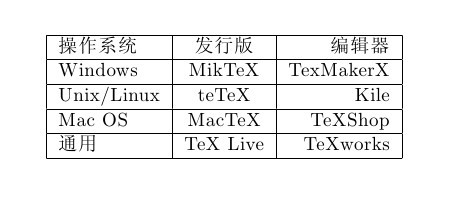

# LaTeX 基本结构与语法

## 基本语法

- 输出空格：<code>\quad</code>（一个空格）、<code>\qquad</code>（两个空格）。
- 单行注释：<code>% xxxxxx</code>。
- 输出百分号：<code>\%</code>。
- 定义新命令：<code>\newcommand\degree{^\circ}</code>，把 <code>\degree</code> 定义为输出度数上标 °。
- 切换中文字体：在中文前加 <code>\字体名称</code>，例如 <code>\title{\heiti 这个标题是黑体}</code>。

## 基本结构

一个标准的 LaTeX 文件分为两部分：

- 导言区；
- 正文区（文稿区）。

## 导言区

### 输出标题相关内容

~~~latex
% 导言区
% 文档类型
\documentclass{article}
% 还可以使用 book、report、letter

% 设置标题
\title{XXXXX}
% 设置作者
\author{XXX}
% 设置日期
\date{\today}
~~~

### 输出中文

- 把编译器改为 XeLaTeX。
- 在导言区导入宏包：<code>\usepackage{ctex}</code>。
- 把文档类型改为 <code>\documentclass[UTF8]{ctexart}</code>，还可以使用 <code>ctexbook</code>、<code>ctexrep</code>。

### 设置页眉页脚

引入 <code>fancyhdr</code> 宏包，并在导言区写入：

~~~latex
\pagestyle{fancy}
\lhead{\author}               % 页眉左方写作者
\chead{\date}                 % 页眉中间写日期
\rhead{152xxxxxxxx}           % 页眉右方写电话
\lfoot{}                      % 页脚左方不写内容
\cfoot{\thepage}              % 页脚中间写页数
\rfoot{}                      % 页脚右方不写内容
\renewcommand{\headrulewidth}{0.4pt}
% 页眉和正文之间有一道宽为 0.4pt 的横线
\renewcommand{\headwidth}{\textwidth}
\renewcommand{\footrulewidth}{0pt}
% 页脚和正文之间无横线
~~~

### 设置行间距和段间距

行距：

- 引入 <code>setspace</code> 宏包。
- 在导言区写入 <code>\onehalfspacing</code>。
- 设置为字号的 1.5 倍行距。

段距：

- 在导言区写入 <code>\addtolength{\parskip}{.4em}</code>。
- 在原有基础上增加段间距 0.4em。
- 如果需要减小段间距，将该数值改为负值。

## 正文区

### 正文结构

整个正文区使用 <code>\begin{document} ... \end{document}</code> 包裹。

### 输出标题

使用 <code>\maketitle</code> 输出标题、作者和日期。

### 输出文本

直接输入文字即可。

### 输出数学内容

使用 AMS-LaTeX 提供的数学功能时，需要在导言区加载 <code>amsmath</code> 宏包：

~~~latex
\usepackage{amsmath}
~~~

#### 数学公式中的常用空格

使用 <code>\ </code>。

#### 行内数学公式

<code>$f(x)=2x+1$</code>

#### 无编号的单行数学公式

<code>\[f(x)=2x+1\]</code>

#### 带编号的行间数学公式

~~~latex
\begin{equation}
f(x) = 2x + 1
\end{equation}
~~~

#### 多行长公式

不对齐：

~~~latex
\begin{multline}
x = a + b + c + \\
d + e + f + g
\end{multline}
~~~

如果不需要编号，可以在 <code>multline</code> 后加 <code>*</code>。

对齐：

~~~latex
\[
\begin{aligned}
x = & a + b + c + \\
    & d + e + f + g
\end{aligned}
\]
~~~

#### 公式组

不对齐：

~~~latex
\begin{gather}
a = b+c+d \\
x = y+z
\end{gather}
~~~

对齐：

~~~latex
\begin{align}
a &= b+c+d \\
x &= y+z
\end{align}
~~~

#### 上标和下标

- 上标：<code>^x</code>、<code>^{xxxx}</code>。
- 下标：<code>_x</code>、<code>_{xxxx}</code>。

#### 根号式

<code>\sqrt{}</code>

#### 分数式

<code>\frac{分子}{分母}</code>

- 引入 <code>xfrac</code> 宏包。
- 行内分式使用 <code>\sfrac</code>。
- 繁分式（分式套分式）使用 <code>\cfrac</code>。

#### 分段函数

~~~latex
\[
y =
\begin{cases}
-x, \quad x \leq 0 \\
x, \quad x > 0
\end{cases}
\]
~~~

#### 运算符

小型运算符：

- <code>\pm</code>
- <code>\times</code>
- <code>\div</code>
- <code>\cdot</code>
- <code>\cap</code>
- <code>\cup</code>
- <code>\geq</code>
- <code>\leq</code>
- <code>\neq</code>
- <code>\approx</code>
- <code>\equiv</code>

大型运算符：

- <code>\sum</code>
- <code>\prod</code>
- <code>\lim</code>
- <code>\int</code>
- <code>\iint</code>
- <code>\iiint</code>
- <code>\idotsint</code>

大型运算符在行内时，其上下标会被压缩导致格式变动，可以使用 <code>\limits</code> 和 <code>\nolimits</code> 自主选择：

- <code>\sum\limits_{i=1}^n</code>
- <code>\sum\nolimits_{i=1}^n</code>

#### 省略号

- <code>x_1,x_2,\dots,x_n</code>
- <code>1,2,\cdots,n</code>
- <code>\vdots</code>
- <code>\ddots</code>

#### 矩阵

行内小矩阵：

~~~latex
Marry( \begin{smallmatrix} a&b\\c&d \end{smallmatrix} )
~~~

大矩阵：

~~~latex
\[
\begin{pmatrix} a&b\\c&d \end{pmatrix}
\quad
\begin{bmatrix} a&b\\c&d \end{bmatrix}
\quad
\begin{Bmatrix} a&b\\c&d \end{Bmatrix}
\quad
\begin{vmatrix} a&b\\c&d \end{vmatrix}
\quad
\begin{Vmatrix} a&b\\c&d \end{Vmatrix}
\]
~~~

### 输出换行

- 源文件中的单次回车通常只会被视为空格。
- 空一行用于开始新段落。
- 需要强制换行时使用 <code>\\</code>。

### 输出章节

- 父章节：<code>\section{}</code>。
- 子章节：<code>\subsection{}</code>。
- 子子章节：<code>\subsubsection{}</code>。

### 输出段落

- 父段落：<code>\paragraph{}</code>。
- 子段落：<code>\subparagraph{}</code>。

在 <code>report</code> / <code>ctexrep</code> 中还有 <code>\chapter{}</code>；在 <code>book</code> / <code>ctexbook</code> 中还定义了 <code>\part{}</code>。

### 输出目录

使用 <code>\tableofcontents</code> 自动根据章节内容生成目录。

### 插入图片

- 引入 <code>graphicx</code> 宏包。
- 使用 <code>\includegraphics{图片名称.jpg}</code> 插入图片。
- 可以使用 <code>\includegraphics[width=.8\textwidth]{a.jpg}</code> 设置缩放，使图片宽度为页面宽度的 80%，高度按比例缩放。

### 插入表格

<code>tabular</code> 环境提供了最简单的表格功能：

- 用 <code>\hline</code> 表示横线。
- 在列格式中用 <code>|</code> 表示竖线。
- 用 <code>&</code> 分列。
- 用 <code>\\</code> 换行。
- 每列可用 <code>l</code>、<code>c</code>、<code>r</code> 表示居左、居中、居右。

~~~latex
\begin{tabular}{|l|c|r|}
  \hline
  操作系统 & 发行版 & 编辑器 \\
  \hline
  Windows & MikTeX & TexMakerX \\
  \hline
  Unix/Linux & teTeX & Kile \\
  \hline
  Mac OS & MacTeX & TeXShop \\
  \hline
  通用 & TeX Live & TeXworks \\
  \hline
\end{tabular}
~~~

### 设置图片与表格的位置

- 图片使用 <code>figure</code> 环境。
- 表格使用 <code>table</code> 环境。

~~~latex
\begin{figure}[htbp]
\centering
\includegraphics{a.jpg}
\caption{有图有真相}
\label{fig:myphoto}
\end{figure}
~~~

- <code>htbp</code> 用来指定插图的理想位置，分别代表 here、top、bottom、float page，即当前位置、页顶、页尾和浮动页。
- <code>\centering</code> 用来使插图居中。
- <code>\caption</code> 设置插图标题，LaTeX 会自动为浮动体标题编号。
- <code>\label</code> 为图片设置标签，用于交叉引用。
  - 在正文中可使用 <code>\ref{fig:myphoto}</code> 引用图片。
  - <code>\label</code> 应放在标题命令之后。

<!-- learning-journey:update-history:start -->
## 更新记录

| 日期 | 类型 | 说明 |
| --- | --- | --- |
| 2026-07-22 | 首次发布 | 从语雀整理 LaTeX 文档结构、数学公式、图表与排版语法 |
<!-- learning-journey:update-history:end -->
