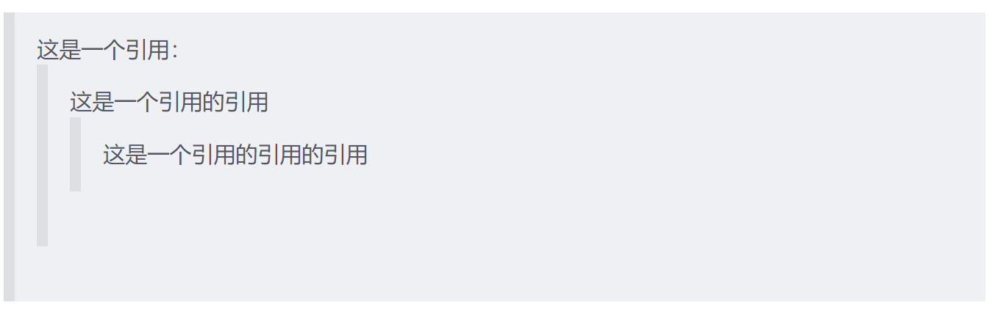
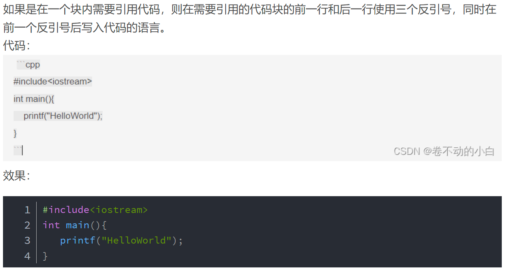
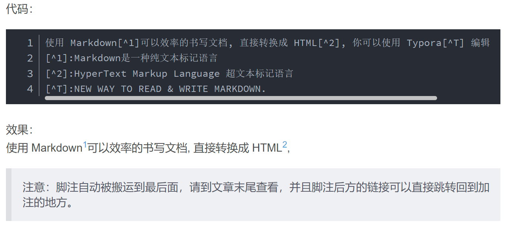

# Markdown 基础语法

## Markdown 是什么

- Markdown 是一种轻量级标记语言。
- Markdown 允许人们使用易读、易写的纯文本格式编写文档，然后转换成有效的 HTML 文档。
- Markdown 支持在正文中使用原生 HTML 语法。

## 标题

```markdown
# 一级标题
## 二级标题
### 三级标题
#### 四级标题
##### 五级标题
###### 六级标题
```

## 字体样式

| 代码 | 效果 |
| :---: | :---: |
| `*这是斜体*` | *这是斜体* |
| `_这是斜体_` | _这是斜体_ |
| `**这是粗体**` | **这是粗体** |
| `__这是粗体__` | __这是粗体__ |
| `***这是粗斜体***` | ***这是粗斜体*** |
| `___这是粗斜体___` | ___这是粗斜体___ |
| `~~这是要被删除的文字~~` | ~~这是要被删除的文字~~ |
| `<u>这行文字已被添加下划线</u>` | <u>这行文字已被添加下划线</u> |
| `` `这是行内代码` `` | `这是行内代码` |
| `E = mc^2` | $E = mc^2$ |

以下写法属于部分编辑器支持的扩展语法，GitHub 不一定能够直接渲染：

| 扩展写法 | 含义 |
| --- | --- |
| `==这是高亮体==` | 高亮 |
| `E^这是上标^` | 上标 |
| `E~这是下标~` | 下标 |

需要在 GitHub 中稳定显示时，可以使用 HTML：

```html
<mark>这是高亮体</mark>
E<sup>这是上标</sup>
E<sub>这是下标</sub>
```

## 换行

在行末添加两个空格，或使用 `<br>`，可以强制换行。

## 引用

```markdown
> 这是引用的文字
>> 这是引用下的引用
```



## 插入链接

```markdown
[链接名称](链接地址 "标题提示")
```

示例：

```markdown
[这是 pinkman 的主页](https://example.com)
```

[这是 pinkman 的主页](https://example.com)

## 插入图片

使用标准 Markdown 图片语法：

```markdown

```

图片地址可以是相对路径或 URL。图片尺寸、居中等功能通常需要 HTML 或特定编辑器的扩展语法。

## 列表

### 有序列表

```markdown
1. 第一条
2. 第二条
```

1. 第一条
2. 第二条

### 无序列表

```markdown
* 无序列表项
+ 无序列表项
- 无序列表项
```

- 无序一
- 无序二
- 无序三

如果想控制列表层级，需要在列表符号前缩进。

## 分隔线

分隔线上方应保留空行：

```markdown
---
```

---

## 表格

表格使用 `|` 分隔不同的单元格，使用 `-` 分隔表头和其他行：

- `:-`：表头及单元格内容左对齐
- `-:`：表头及单元格内容右对齐
- `:-:`：表头及单元格内容居中

```markdown
| 项目 | 价格 | 数量 |
| :--- | ---: | :---: |
| 计算机 | $1600 | 5 |
| 手机 | $12 | 12 |
| 管线 | $1 | 234 |
```

| 项目 | 价格 | 数量 |
| :--- | ---: | :---: |
| 计算机 | $1600 | 5 |
| 手机 | $12 | 12 |
| 管线 | $1 | 234 |

## 插入代码块



## 脚注



## 显示特殊语法符号

对于 Markdown 中的语法符号，在前面添加反斜线 `\`，即可显示符号本身。

## 待办事项

```markdown
- [ ] 吃饭
- [x] 睡觉
```

- [ ] 吃饭
- [x] 睡觉

## 其他图形样式

思维导图、流程图、饼图等语法可参考：[Markdown 语法手册](https://www.zybuluo.com/mdeditor?url=https://www.zybuluo.com/static/editor/md-help.markdown#cmd-markdown-%E9%AB%98%E9%98%B6%E8%AF%AD%E6%B3%95%E6%89%8B%E5%86%8C)

<!-- learning-journey:update-history:start -->
## 更新记录

| 日期 | 类型 | 说明 |
| --- | --- | --- |
| 2026-07-22 | 首次发布 | 从语雀整理并发布到学习记录仓库 |
<!-- learning-journey:update-history:end -->
