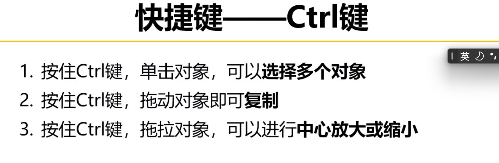
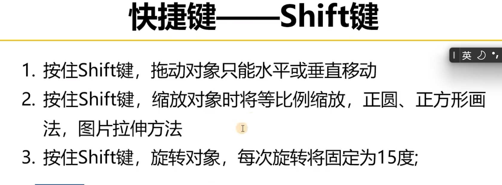
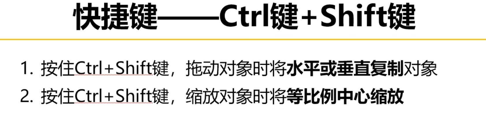
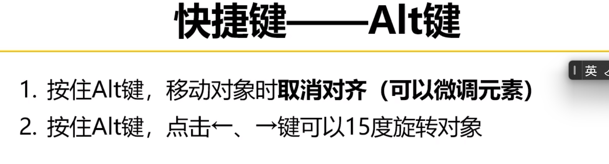
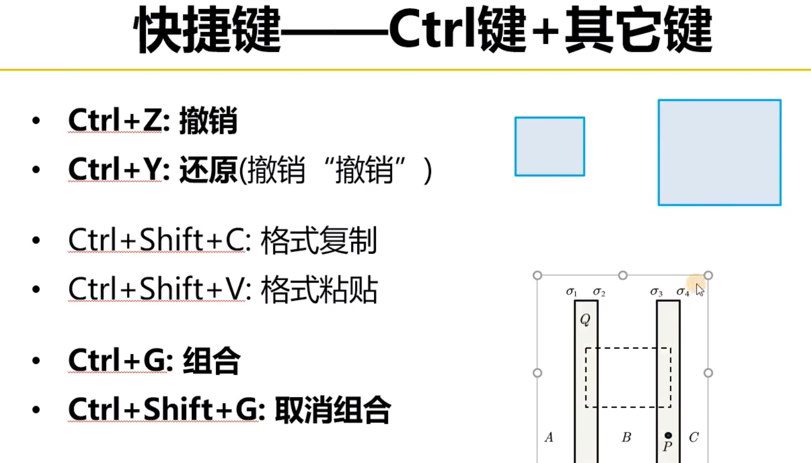
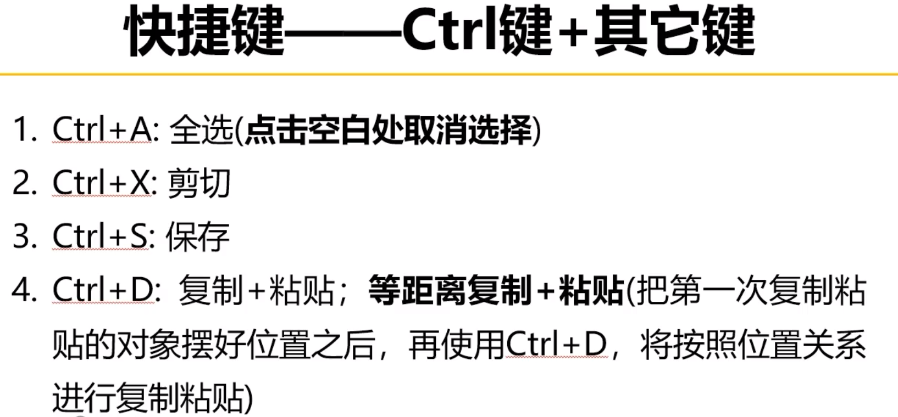
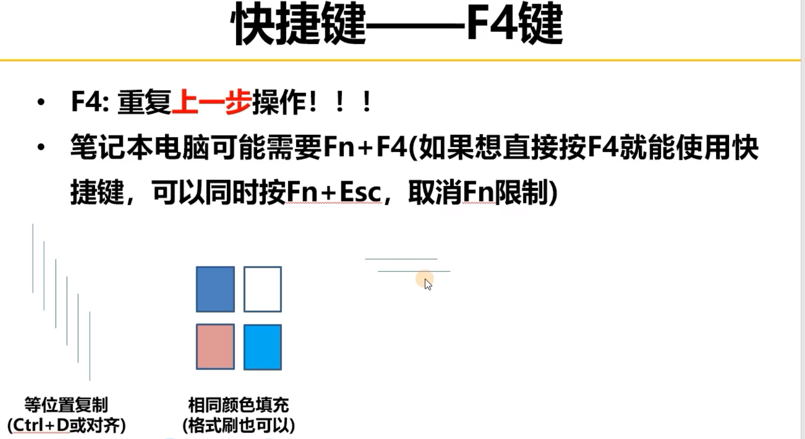
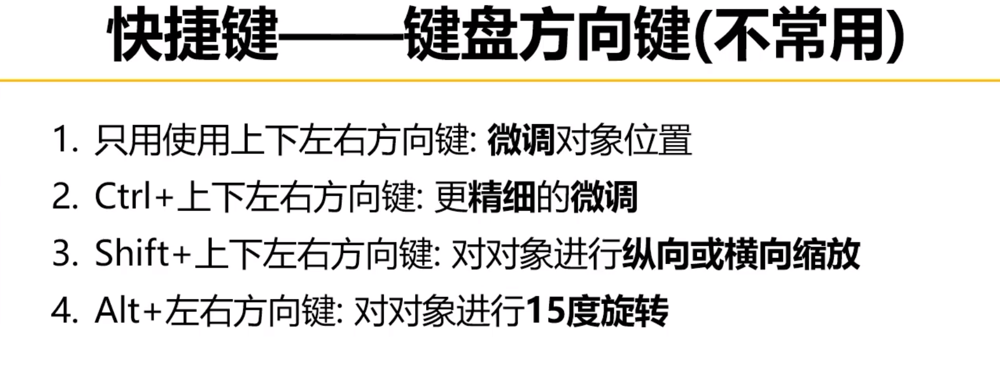
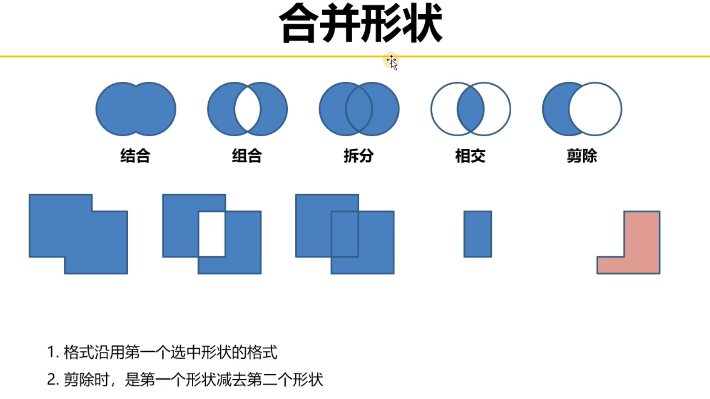

# PPT 绘图快捷键与形状

## PPT 绘图快捷键

### Ctrl 键

### Shift 键

### Ctrl + Shift 键

### Alt 键

### Ctrl 与其他按键

### F4 键

### 键盘方向键

## 特殊形状的绘制

### 多个形状的合并组合

组合多个形状时，为了保证粗细一致，可以以一个形状为基准画几条细横线作为参考线。

### 编辑顶点

<!-- learning-journey:update-history:start -->
## 更新记录

| 日期 | 类型 | 说明 |
| --- | --- | --- |
| 2026-07-22 | 首次发布 | 合并整理 PPT 绘图快捷键与特殊形状绘制方法 |
<!-- learning-journey:update-history:end -->
