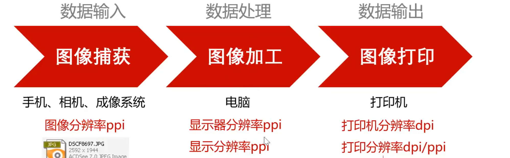

# 图片基础与绘图技巧

## 图片的分类

### 矢量图

- 矢量图根据几何特性，用线段和曲线来描绘图形。
- 图形（Graphic）。
- 矢量图只能通过软件生成。

常见矢量图格式后缀：`.ai`、`.eps`、`.cdr`、`.dwg`、`.dxf`、`.wmf`。

### 位图

- 用排列的像素来描绘图像。
- 图像（Image）。

常见位图格式后缀：`.tif`、`.jpg`、`.bmp`、`.pcx`、`.gif`、`.pcd`、`.psd`、`.cpt`。

### 二者的特性区别

#### 缩放特性

矢量图放大不失真，位图放大后像素点暴露而失真。

#### 精细度特性

矢量图的精细程度难以达到比较高，而位图像素点越多，图像越精细。

#### 大小特性

矢量图占用空间小，位图占用空间大，且像素点越多越大。

#### 转换特性

矢量图转换成位图比较轻松，位图很难转换成矢量图，即使转换成功也会有较大的信息损失。

## 分辨率

## 绘图技巧

### 局部放大

<!-- learning-journey:update-history:start -->
## 更新记录

| 日期 | 类型 | 说明 |
| --- | --- | --- |
| 2026-07-22 | 首次发布 | 合并整理图片格式、分辨率与局部放大绘图技巧 |
<!-- learning-journey:update-history:end -->
