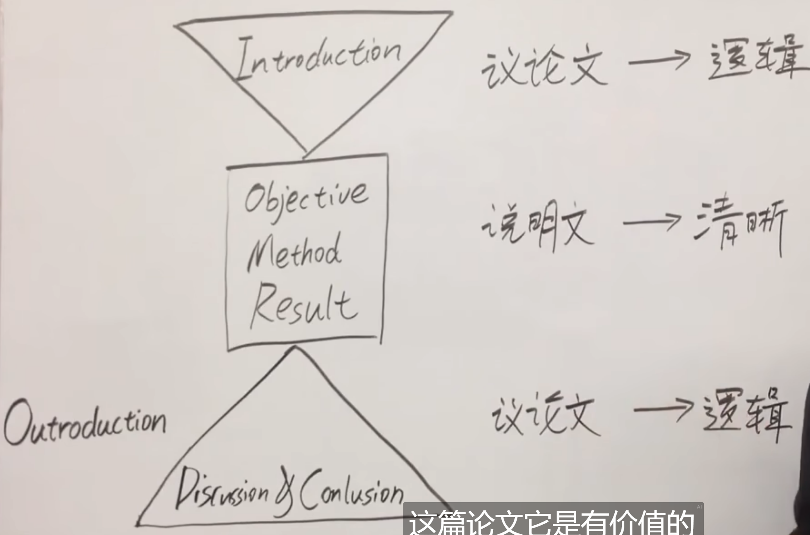
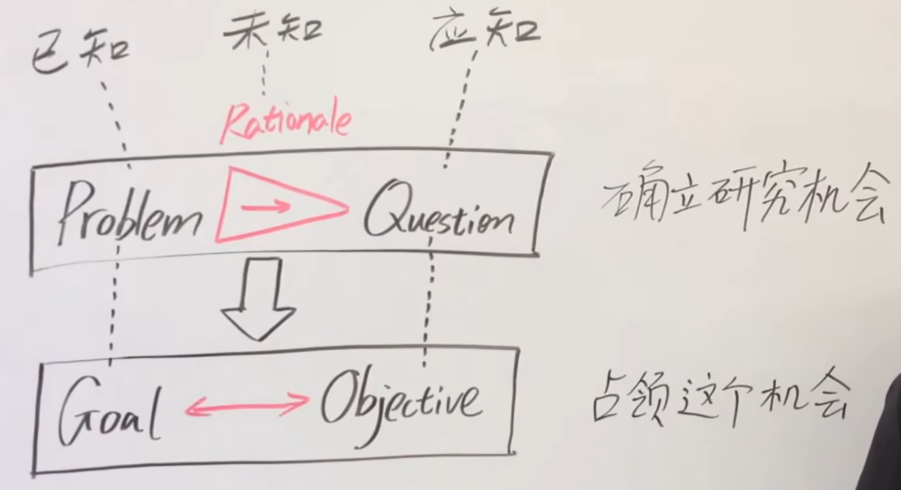
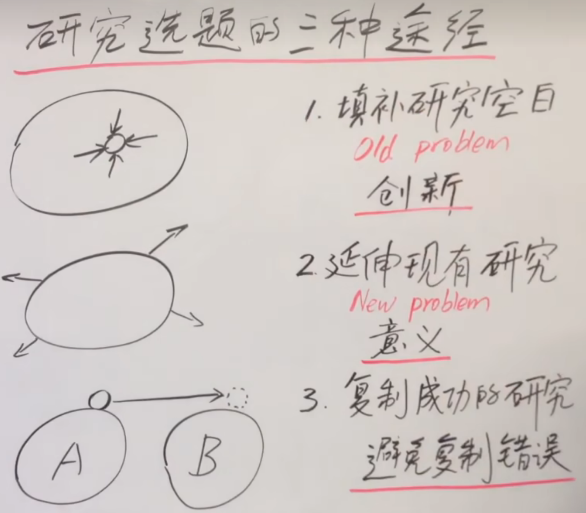
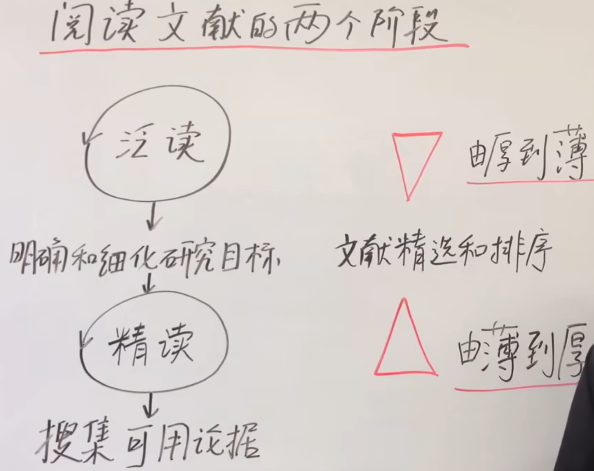
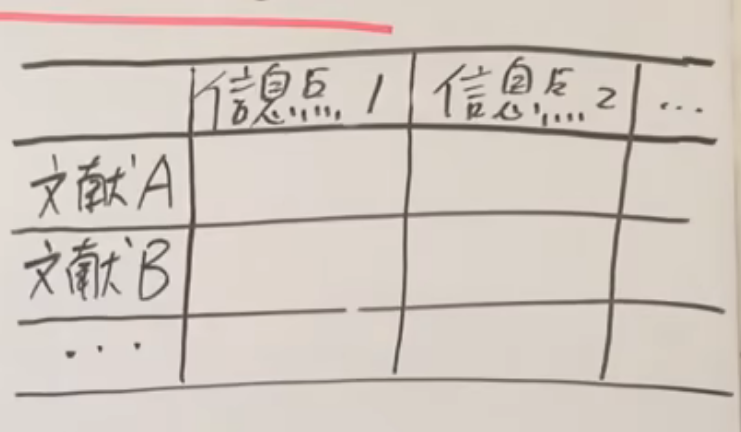
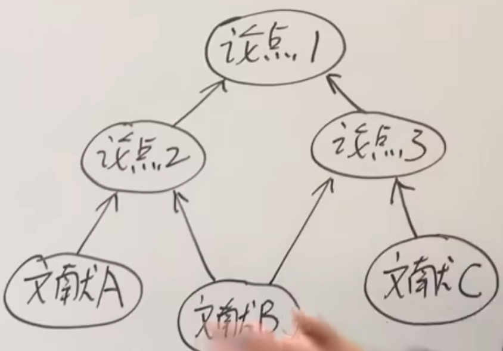
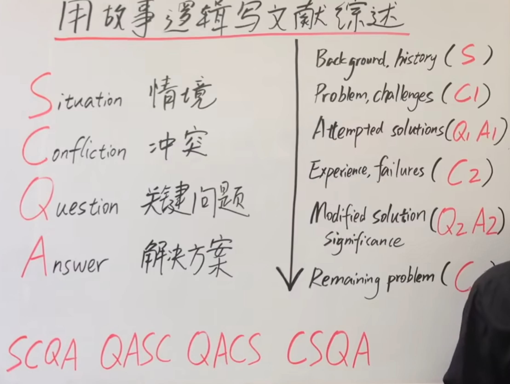
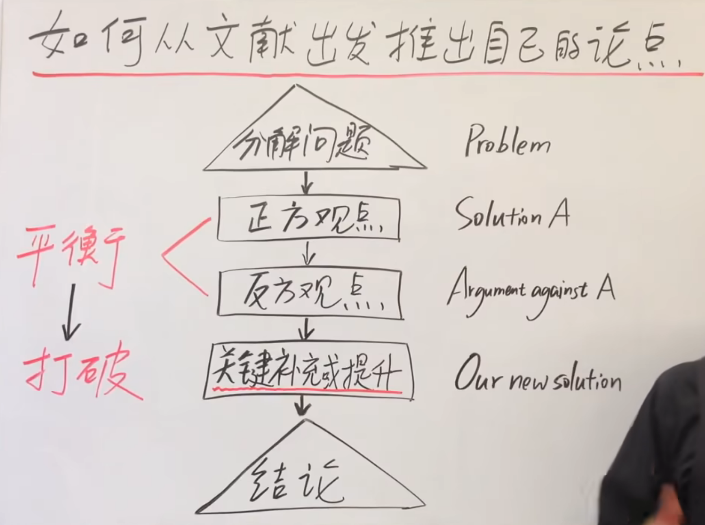

# 科研论文写作方法

> 学习来源：[如何写好一篇论文？](https://www.bilibili.com/video/BV1Th41187Xr?p=3)

## 论文三段式结构

> 论文整体结构是一个洞，引言是进洞口，结论是出洞口。两个洞口的作用就是尽量说服读者进洞看看。

### Introduction：议论文

> 写作时间：确定选题后、开始实验前。

重要程度：⭐⭐⭐⭐⭐

- **目的**：给整篇论文定位，告诉读者在所研究的领域中，论文处于什么位置。
- **论点**：该论文的研究目标是合理的。
- **论据**：从相关文献中搜集的资料。
- **论证特点**：从普遍到特殊，从公众已经普遍接受的问题或观念入手，引导读者逐步深入，最终说服读者接受一个特定的研究目标。

### Discussion & Conclusion：议论文

重要程度：⭐⭐⭐

- **论点**：这篇论文是有价值的。
- **论据**：本论文的研究结果和相关文献资料。
- **论证特点**：从特殊到普遍，从特定研究结果开始，引导读者逐步接受该结果可能带来的普遍意义。

### Objective、Method & Result：说明文

重要程度：⭐⭐⭐⭐

使用科学的语言，把本论文的研究方法和研究结果阐述清楚。

## Introduction：引言概览

> 引言部分就像一座桥。我们要引导读者从桥的一端（读者的世界）走进另一端（我们的世界），为此需要与读者现有的知识体系和知识框架建立足够的联系。

### 第一段：确立研究机会

从描述一个普遍的大问题（**Problem**）开始，到确立一个特定的研究问题或研究空白（**Question**）结束。

- **整体思路**：为了解决某一个普遍的大问题，需要回答某一个具体的研究问题。

### 第二段：占领研究机会

清晰地描述当前研究目标（短期 **Objective** 和长期 **Goal**），填补第一段中的研究空白（**Question**），从而占领研究机会。

- 长期目标 Goal 与大问题 Problem 相呼应。
- 当前研究目标 Objective 与具体研究问题 Question 相呼应。
- **整体思路**：为了实现长期目标，首先需要实现当前研究的特定目标。

### 启示

最好从读者现在比较关切的问题，或读者已经接受、认同的观念入手，逐渐加入读者可能未知的文献资料，说服读者存在一个具体且值得研究的问题，而这个研究问题对应着研究目标。

## 研究课题的选择

### 选题的三种途径

- 填补研究空白。
- 延伸现有研究。
- 复制成功的研究。

### 评判研究课题的准则

1. **具体可行**
   - 有明确边界，课题中的术语和变量都有明确的定义。
   - 不能存在先入为主的假设。
   - 适合当前现有的资源条件。
2. **开放、可争议**
   - 是可以证伪的课题，即一个科学的课题。
3. **能够激发创新**
   - 具备跨领域或跨学科思考的价值。

## 引言中的文献综述

> 学而不思则罔，思而不学则殆。不要只是单纯地总结和解释现有文献，而要利用现有文献服务于自己的研究。

### 写作文献综述的两个基本点

#### 有所学

尽可能包括**所有相关的主要文献**。

#### 有所思

- **评判**
  - 有效性（Validity）
  - 可靠性（Reliability）
  - 优势（Strength）
  - 劣势、局限性（Weakness）
  - 与研究问题的相关程度（Significance）
  - 与研究问题的重要程度（Relevance）
- **分析**
  - 归纳：总结不同文献资料并发现规律。
  - 演绎：将文献资料与某一具体情况相结合。
  - 溯因。
  - 找相同点。
  - 找不同点。
  - 找 Gap。

### 阅读文献的两个阶段

#### 泛读

快速、有选择性地阅读：先读摘要；有必要时再读引言和结论；觉得十分有必要时，再阅读文章的方法与结果。

#### 精读

积累与具体研究目标相关的知识，搜集写作过程中可以使用的素材和论据。

### 阅读文献的“三要三不要”

#### 三不要

- 无选择地精读，同时不要忽略关键文献。
- 只读不写。
- 资源来源不清：记录有效信息时，也要记录信息的来源文献。

#### 三要

- **列表法**

  

- **画圈法**

  

- **自加摘要法**

  为读过的文献撰写自己的摘要，重点记录对自己研究有用的部分。

### 分析文献的三种逻辑推理方法

#### 归纳（Inductive）

- 实现由点到线、由特殊到一般规律的推理。
- 方式：
  - 求同：由相同点推理出普遍规律。
  - 求异：由不同点推理出关键因子或变量。

#### 演绎（Deductive）

实现由线到点的推理：将已经总结出的一般性规律与当前研究的实际情况相结合，进行演绎分析。

#### 溯因（Abductive）

- 实现由点到虚线的推理。由已知线索排除错误的可能性，最终推断出正确的方向。
- 得到的往往是一个新假说。

### 使用故事逻辑写作文献综述

#### SCQA 方法

顺序可以根据实际内容调整：

- **S：Situation（情景）**
  选取文献中普遍、争议较少且读者较认同的部分来创建情景，实现与读者的对接并取得基本信任。
- **C：Conflict（冲突）**
  提出明显的挑战，或通过分析文献发现潜在的问题、机遇。
- **Q：Question（关键问题）**
  提出解决冲突的关键点。
- **A：Answer（解决方案）**
  落脚于一个有说服力的解决方案，带出论文的研究目标和意义。

### 如何从文献中推出自己的论点

> 建立平衡 → 打破平衡

案例：第一段提出需要解决的问题；第二段介绍文献中已有的解决方案；第三段介绍其他文献对现有解决方案提出的不同意见。在上述平衡的基础上提出新的解决方案，从而打破平衡。

<!-- learning-journey:update-history:start -->
## 更新记录

| 日期 | 类型 | 说明 |
| --- | --- | --- |
| 2026-07-27 | 首次发布 | 从语雀整理并发布到学习记录仓库 |
<!-- learning-journey:update-history:end -->
