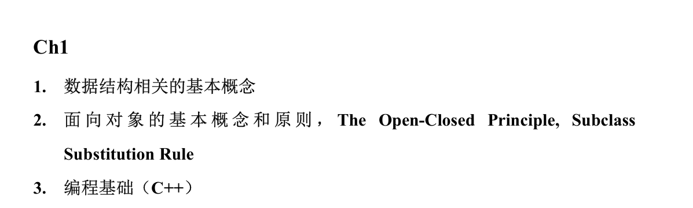
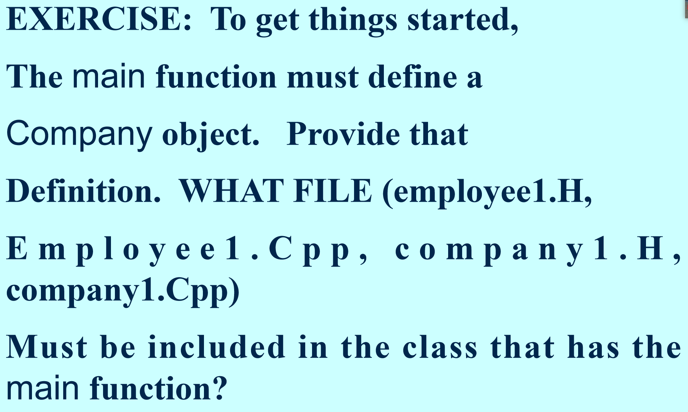
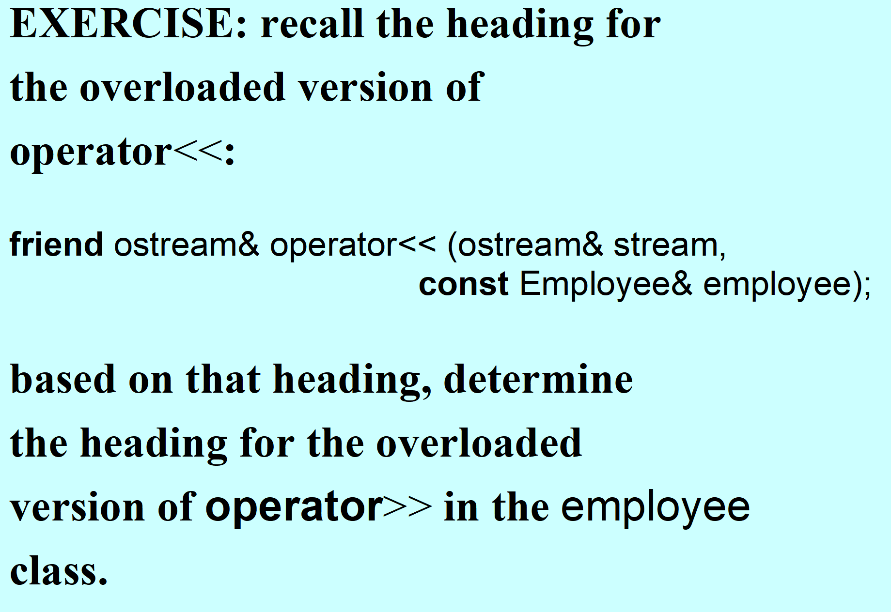

# 数据结构与面向对象基础



## 数据结构相关基本概念

### 数据结构

数据结构是信息的组织方式，对于相同的算法，使用不同的数据结构来表示其抽象的数据类型，会直接导致不同的执行效率

**容器（Container）**：容器是一个变量，由许多项（items）的集合    组成。数据结构本质上就是用户眼中的变量容器

## 面向对象基本概念：
+ 类：由变量（字段）和操作这些变量的函数（方法）组成的用户自定义类型
+ **对象**：类的一个变量，也称为类的**实例**
+ **方法接口 method interface：**提供了用户调用方法所需的全部信息，包括方法头、前置条件、后置条件
+ 继承 inheritance：**在一个已有类的基础上定义一个新类，新类会自动包含原有类的所有字段（Fields），并包含其部分或全部方法**
        * 子类不仅可以扩展声明新的字段和方法，还可以通过覆盖（Override）基类的方法来提供不同的行为定义
        * 为了让子类能够访问超类的字段，超类通常将这些字段的保护级别设置为 `protected`
+ 运算符重载：
        * 类内成员函数
        * 类外友元函数

【<<运算符重载只能用类外友元函数】

```cpp
#include<iostream>
using namespace std;

//输出运算符<<重载案例：【只能作为友元函数重载】

class Person{
public:
    Person(const int& aa1 = 0, const int& aa2 = 0):a1(aa1),a2(aa2){};
    Person(const Person& other);
    friend ostream& operator<<(ostream& cout, const Person& P1);
private:
    int a1,a2;
};

Person::Person(const Person& other){
    a1 = other.a1;
    a2 = other.a2;
}

ostream& operator<<(ostream& cout, const Person& P1){
    cout << "此人的属性为：\na1: " << P1.a1 << "\na2: " << P1.a2 << endl;
    return cout;
}

int main(){
    Person P1(10,419);
    Person P2(1,1);
    Person P3(P1);
    cout << P1 << endl << P2 << endl << P3;
    return 0;
}
```

## 面向对象编程的原则：
+ **数据抽象原则（Data Abstraction）**：要求用户的代码**不应访问其所使用的类的实现细节**。这通过将字段设置为 `private`（私有）或 `protected`（受保护）来实现
+ **开放-封闭原则（Open-Closed Principle）**：类应当对扩展开放（可以通过**继承**增加功能），对修改封闭（在现有应用中保持稳定性）
+ **子类替换原则（Subclass Substitution Rule）**：在任何需要基类对象的地方，都可以使用子类对象进行替换

## 课堂习题：





<!-- learning-journey:update-history:start -->
## 更新记录

| 日期 | 类型 | 说明 |
| --- | --- | --- |
| 2026-07-27 | 首次发布 | 从语雀整理并发布到学习记录仓库 |
<!-- learning-journey:update-history:end -->
