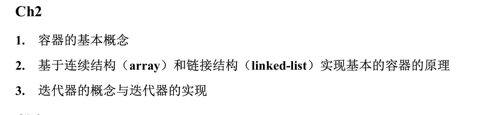
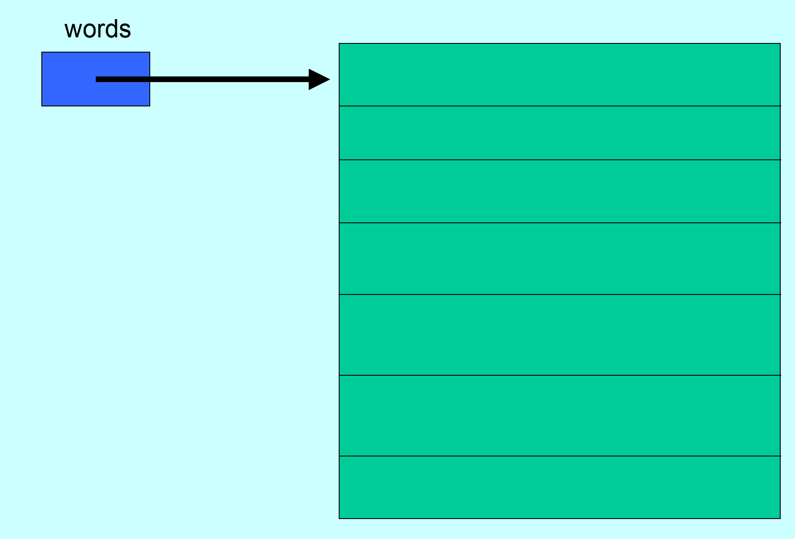
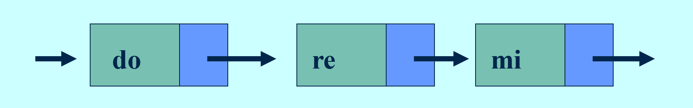
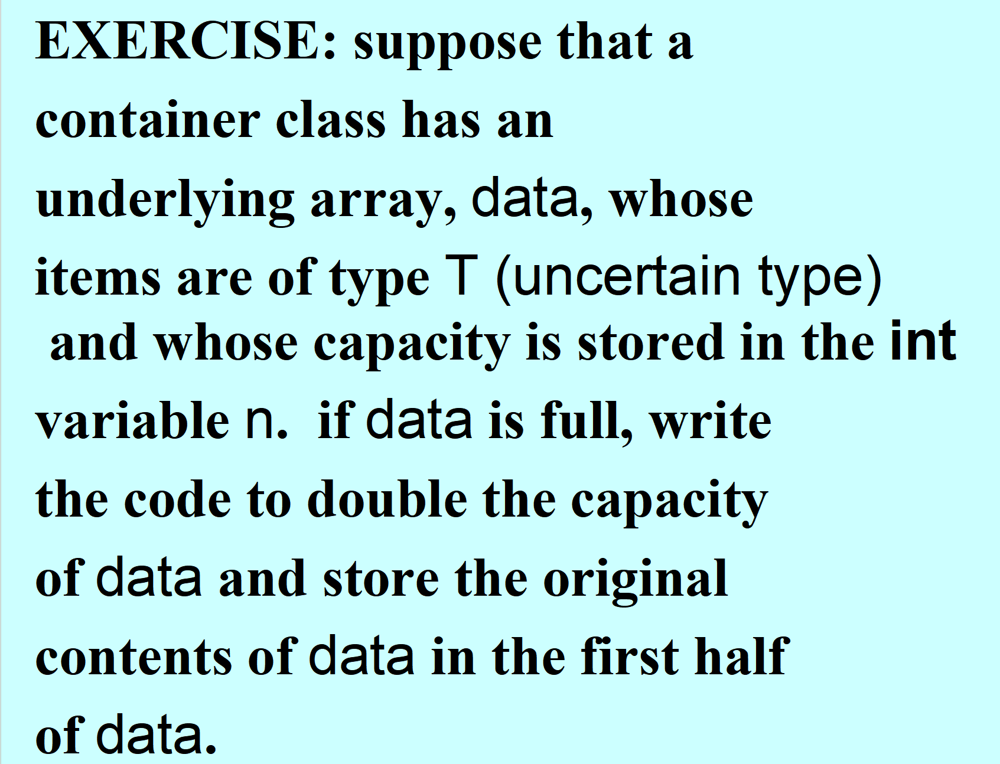
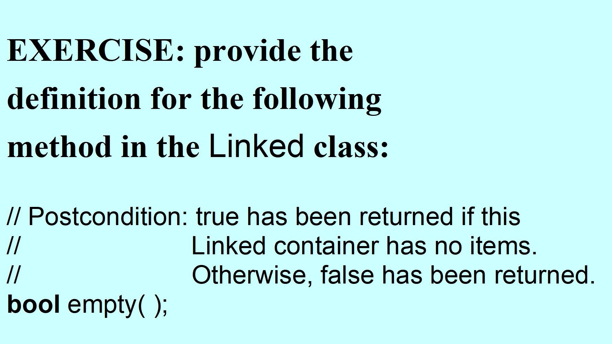
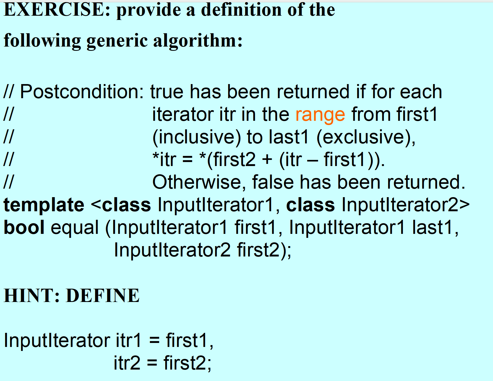

# 容器类的存储结构与迭代器



## 自动变量&动态变量

### Automatic Variable（自动变量）

+ 生命周期由作用域决定的局部变量，在进入作用域时被创建，离开作用域时被销毁
+ 存储于**stack栈内存**中

### Dynamic Variable（动态变量）

+ 生命周期由程序员通过动态内存分配决定的，显式分配内存时创建，显式释放内存（deallocate）时销毁
+ 动态变量的定义与使用都是通过**指针**实现的
+ 存储于**heap堆内存**中

```cpp
string* sPtr;        //sPtr 是尚未初始化的指针
sPtr = new string;    //new string：创建了一个存储字符串的存储空间
*sPtr = "word";        //将字符串存储进创建的存储空间内
delete sPtr;        //删除sPtr指向的动态变量，释放该块动态内存
```

+ **dereference** 析取运算符：`*`
+ **dereference-and-select** 析取并选择运算符：`->`
+ `sPtr -> length();`等同于`(*sPtr).length();`

## Stack & Heap 栈 & 堆

### 栈

+ 用于存储自动变量
+ 存储空间受限，容易产生栈的溢出

### 堆

+ 用于存储动态变量
+ 存储空间不受限制

## allocate 动态内存分配关键字：`new`

### 数组的动态内存分配（动态数组）

+ 动态数组一旦创建，其容量不能再直接改变，

```cpp
//创建动态数组
string* words;
words = new string[7];    //words指针指向的是string数组中第一个string元素的地址
words[1] = "Pinkman";
*(words + 2) = "Richard";    //这两种写法是等价的

//删除动态数组
delete[] words;
```



## deallocate 动态内存释放关键字：`delete`
```cpp
//释放单一变量的空间
delete sPtr;

//释放动态数组的空间
delete[] words;        //new[] 分配的数组必须使用 delete[] 释放；改用 delete 会导致未定义行为
```

## 容器类

### 基本概念

容器是一个包含元素项（Items）集合的变量，例如数组就是一个容器

容器类的实例化对象是存储数据的容器，容器类通过特定的存储结构来组织数据并提供方法接口供给用户操作

数据结构本质上就是用户眼中的容器

+ **parameter**：形参
+ **argument**：实参

### Array Structure（连续结构）

+ 原理：容器内的所有项都存储在连续的内存空间中
+ 优点：允许元素的随机访问
+ 缺点：长度固定，插入、删除元素和改变数组长度效率较低

+ **random-access**：随机访问。基于连续结构数组的数据结构的优点

### Linked Structure（链式结构）

+ 原理：容器内的所有元素都离散地分布存储在内存空间中，通过节点和指针的结构实现链接
+ 优点：每个元素使用指针与下一个元素相连接
+ 缺点：元素的访问只能从头遍历



```cpp
#include<iostream>
using namespace std;

template <typename T>
class Linked{
private:
    struct Node{
        T item;
        Node* next;
    };
    long length;
    Node* head;
public:
    Linked():head(nullptr),length(0){};
    long size ()const{
        return length;
    }
    void push_front(const T& data){
        Node* newNode = new Node;
        newNode -> item = data;
        newNode -> next = head;
        head = newNode;
        length++;
    }

    void pop_front()
    {
        Node* oldHead = head;
        head = head -> next;
        delete oldHead;   // deallocates *oldHead
        --length;
    } // pop_front

    void clear(){
        Node* newNode = head;
        while(newNode != nullptr){
            Node* temp = newNode;
            newNode = newNode -> next;
            delete temp;
        }
        head = nullptr;
        length = 0;
    }
    bool empty() const{
        return (length == 0);
    }

    ~Linked()
    {
        while (head != NULL)
            pop_front( );
    } // destructor
};
```

> 链式结构开头的插入：`worstTime` 为常数。

## Iterator(迭代器)

### 迭代器的概念

+ 迭代器的实质就是存在于容器类中的一个嵌入类，**允许用户代码循环通过一个容器且不访问容器类的实现细节（不违反数据抽象原则）**
+ 迭代器的功能类似于指针，容器类会有`begin()`、`end()`方法，分别会返回容器内第一项的迭代器和最后一项的下一项迭代器


### 迭代器的实现（依托一个简单的链表结构）

#### 迭代器类的组成

+ `operator++(int)`、`operator++()`：用于将迭代器前进到下一项
+ `operator*`：对迭代器当前项解引用
+ `operator=`&`operator!=`：运算相等或不相等

#### 代码实现

```cpp
template<class T>
class Linked
{
      protected:
            struct Node  { T item; Node* next; };
        Node* head;
        long length;
    public:
        class Iterator
        {
            friend class Linked<T>;
            protected:
                Node* nodePtr;
                Iterator(Node* newPtr){
                    nodePtr = newPtr;
                };
            public:
                Iterator() : nodePtr(nullptr) {};
                bool operator== (const Iterator& itr) const
                    {
                        return nodePtr == itr.nodePtr;
                    } // operator==

                bool operator!= (const Iterator& itr) const
                {
                    return nodePtr != itr.nodePtr;
                } // operator!=

                T& operator*( ) const
                {
                    return nodePtr -> item;
                } // operator*

                //后置自增：
                Iterator operator++ (int)
                {
                    Iterator itr (nodePtr);
                    nodePtr = nodePtr -> next;
                    return itr;
                } // operator++ (int)
            }; // class Iterator

        Iterator begin()
        {
            return Iterator (head);
         } // begin
        Iterator end()
        {
            return Iterator (NULL);
         } // end

}; // class Linked

```

### 迭代器的使用

```cpp
Linked<string> words;

// Read in the values for words from the input:
// ...
int count = 0;
Linked<string>::Iterator itr;
for (itr = words.begin( ); itr != words.end( ); itr++)
    if ((*itr).length( ) == 4)
        count++;
cout << "There are " << count << " 4-letter words.";
```

```cpp
Linked<string> words;

words.push_front ("mellow");
words.push_front ("placid");
words.push_front ("serene");
Linked<string>::Iterator itr;
itr = find (words.begin( ), words.end( ), "placid");
if (itr == words.end( ))
    cout << "word not found" << endl;
else
    cout << "word found" << endl;

```

## 本节课实践：


完成一个`Linked.h`容器类，实现一个简单的链接结构


有以下方法：构造函数、析构函数、`pop_front()`、`push_front`、`size()`、迭代器`Iterator`类、`begin()`、`end()`、赋值运算符重载

## 课堂练习：


```cpp
// 1. 分配一个新的数组，大小为当前容量的 2 倍
T* new_data = new T[2 * n];

// 2. 将原数组(data)中的内容复制到新数组的前半部分
for (int i = 0; i < n; i++) {
    new_data[i] = data[i];
}

// 3. 释放旧数组占用的内存 (非常重要，防止内存泄漏)
delete[] data;

// 4. 更新成员变量 data，让它指向新的数组
data = new_data;

// 5. 更新容量变量 n，将其变为原来的 2 倍
n = 2 * n;
```








```cpp
template <class InputIterator1, class InputIterator2>
bool equal(InputIterator1 first1, InputIterator1 last1, InputIterator2 first2) {
    // 根据 Hint 定义迭代器变量 (虽然直接用参数也可以，这里遵照提示)
    InputIterator1 itr1 = first1;
    InputIterator2 itr2 = first2;

    // 当 itr1 还没有走到尽头 (last1) 时，循环继续
    while (itr1 != last1) {
        // 检查当前两个迭代器指向的值是否相等
        if (*itr1 != *itr2) {
            return false; // 只要发现这一对不相等，整个序列就不相等
        }

        // 两个迭代器同时向后移动
        ++itr1;
        ++itr2;
    }

    // 如果循环结束都没有返回 false，说明全部匹配
    return true;
}
```

<!-- learning-journey:update-history:start -->
## 更新记录

| 日期 | 类型 | 说明 |
| --- | --- | --- |
| 2026-07-27 | 首次发布 | 从语雀整理并发布到学习记录仓库 |
<!-- learning-journey:update-history:end -->
