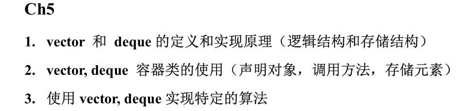

# Vector 向量
## 定义：
vector 是项的有限连续序列，是一个支持随机访问的，能够自动调整大小的智能数组，属于顺序容器；

索引随机访问为常数时间，但任意位置插入删除元素为线性时间

## 特性：
1. 属于顺序容器，支持使用索引随机访问**（常数时间）**
2. `size()`方法可以返回所存储元素个数，而不是容量
3. 可以自动扩充大小，无需担心容量不够
4. 提供在任意位置插入和删除元素的方法**（**$ O(n) $**时间）**
5. 可以用赋值运算符`=`将一个向量赋值给另一个向量
6. 模板化，限制元素类型

## 方法：
```cpp
//1.构造器：

vector<double> weights;

//2.复制构造函数：

vector(const vector<T>& x);
vector<double> weights(oldWeights);

//3.指定初始容量构造：

vector<unsigned n>;
vector<double> weights(1000);

//4.赋值运算符重载:

vector<T>& operator= (const vector<T>& other);
weights = oldWeights;

//5.后端插入元素函数：
    //averageTime(n)是常数，worstTime(n)是O(n)，即需要扩容，拷贝全部项
    //但对n次连续的push_back调用，worstTime只是O(n)
push_back(const T& x);
weights.push_back(77.2);

//6.随机插入元素函数：
    //每个大于等于该位置下标的位置依次向后移动，返回的是位于新插入元素位置的迭代器
    //worstTime(n)为 O(n)
    //Important!:如果插入导致容器元素重新分配，旧迭代器和引用会失效；如果不发生重新分配，
    //只有插入点上及之后的迭代器和引用失效
iterator insert(iterator pos, const T& x);
weights.insert(weights.begin() + 10, 68.2);

//7.后端删除元素函数：
void pop_back();
weights.pop_back();

//8.随机删除元素函数：
    //位于迭代器位置上的项会被删除，之后的项依次向前移动，worstTime为O(n)
    //Important!:删除元素会使删除之后的所有迭代器和引用都失效
void erase(iterator pos);
weights.erase(weights.begin() + 10);

//9.随机删除区间元素函数：
void erase(iterator fir, iterator las);
weights.erase(weights.begin(),weights.begin() + 10);

//10.返回元素个数函数：
size_t size() const;
size_t len = weights.size();

//11.判空函数：
    //空返回1，非空返回0
bool empty() const;
bool check = weights.empty();

//12.下标运算符[]重载：
T& operator[] (unsigned n);
double e = weights[2];

//13.头尾迭代器：
iterator begin();
iterator end();
double fir = *weights.begin();

//14.头尾元素函数：
T& front();
T& back();
double fir = weights.front();
double last = weights.back();
```

## 操作：
### 输出全部项：
```cpp
//方法一：使用迭代器
vector<double>::iterator itr;
for(itr = weights.begin(); itr != weights.end(); itr++){
    cout << *itr << endl;
}

//方法二：使用下标
for(unsigned i = 0; i < weights.size(); i++){
    cout << weights[i] << endl;
}

```

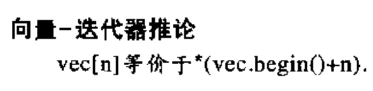

### 自身扩容操作：
+ 如果一个向量对象对应的容量已满且又加入新的项时，该向量的容量将自动翻倍，步骤如下：
        * 创建新的数组，分配原数组 2 倍的空间
        * 旧数组的项被完全拷贝到新的数组中
        * 旧数组的空间和项被回收
        * 将新的要加入的项插入到新数组中

:::warning
## 平摊时间 amortizedTime(n)：
在任意 n 次调用该方法的序列中执行的语句总数除以 n

+ averageTime(n)计算考虑每次调用情况都与其他调用几率相等
+ amortizedTime(n)计算考虑的则是实际情况
+ push_back()的平摊时间为常数

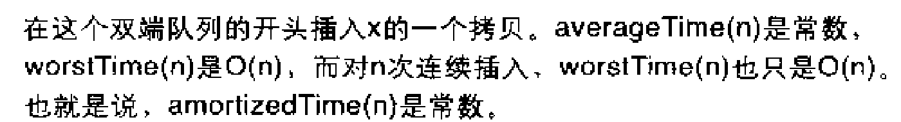

:::

## 实现原理：
### 存储结构：
字段包括：

+ 指向向量第 0 个位置的指针：`T* start;`
+ 指向向量最后一项之后一个位置的指针：`T* finish;`
+ 指向向量分配的最后一个空间的下一个	位置的指针：`T* end_of_storage;`

当 finish == end_of_storage（空间已满）时，插入新元素会触发扩容。

步骤：

分配一块两倍于当前容量的新内存

将旧元素复制到新内存

销毁旧内存

# Deque 双端队列
> Double ended queue
>
> 设计意图：融合 vector 和 list 的特性（提供能够高效头部操作的 vector 随机访问顺序容器）
>
> deque 也支持随机访问！！！
>
> 是栈 stack，队列 queue 的默认底层实现容器
>

## 定义：
<font style="color:rgb(48, 48, 48);">deque 也是支持随机访问的项的有限序列，随机访问为常数时间，</font>**<font style="color:rgb(48, 48, 48);">在序列两端</font>**<font style="color:rgb(48, 48, 48);">的插入和删除操作也均为常数时间</font>

## 特征：
1. 常数时间访问和修改下标上的项
2. 在序列头或尾插入元素 averageTime(n)为常数，worstTime(n)为$ O(n) $
3. 序列尾部插入或删除 worstTime(n)都为常数
4. 任意位置插入或删除，worstTime(n)和 averageTime(n)都为线性

## 与向量的区别
+ 双端队列在首尾都能快速插入删除，向量只有在尾部才能快速插入删除
+ 双端队列没有向量的 capacity 和 reserve()，多了 push_front() 和 pop_front()

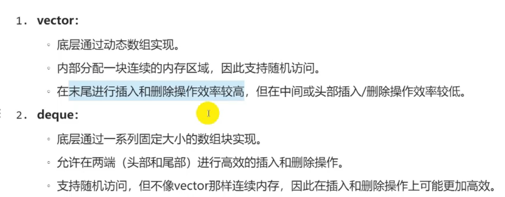

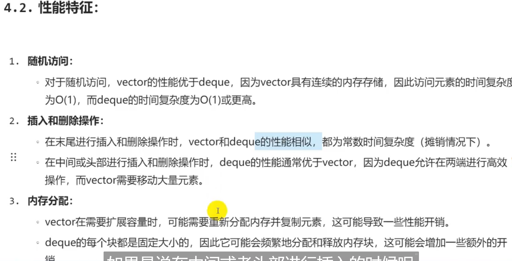

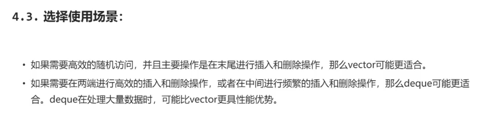

## 方法
```cpp
//1.前端插入函数：
    //averageTime(n)为常数，worstTime(n)为n
    //对于连续n次插入，worstTime(n)也为n，因此amortizedTime(n)是常数
void push_front(const T& x);

//2.前端删除函数：
    //worstTime(n)都为常数
void pop_front();

//其余方法与vector无差别
```

## 使用：
```cpp
deque<string>words;
    string word;

    for (int i = 0; i < 5; i++)
    {
        cin >> word;
        words.push_back (word);
    } // for
    words.pop_front( );
    words.pop_back( );
    for (unsigned i = 0; i < words.size(); i++)
        cout << words [i] << endl;
```

## 实现原理：
[B站 deque 底层原理视频](https://www.bilibili.com/video/BV1qyp4z2EE7)

[从零手撕 STL 源码——deque](https://www.bilibili.com/video/BV1ZB4y1t7Vk)

### 逻辑结构：
逻辑结构是连续的，呈现线性序列，支持随机访问

### 存储结构：
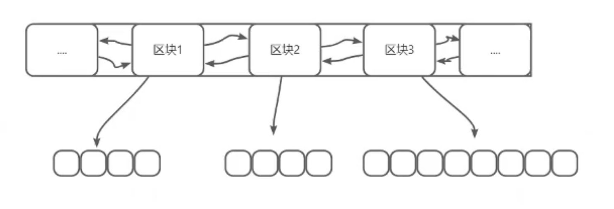

deque 的具体结构是一个连续的存储块，所有存储块的大小都是固定且相等的，每个存储块存储若干个元素（每个存储块都是一个定长数组），存储块以双向链接的形式组织在一起，包含指向前一个和后一个存储块的指针，形成一个双向链表，如下：

采用的是 map 结构，map 字段是一个指向数组的指针，该数组存储的是指向多个存储块（Blocks）的指针，实际的数据项存储在这些块中

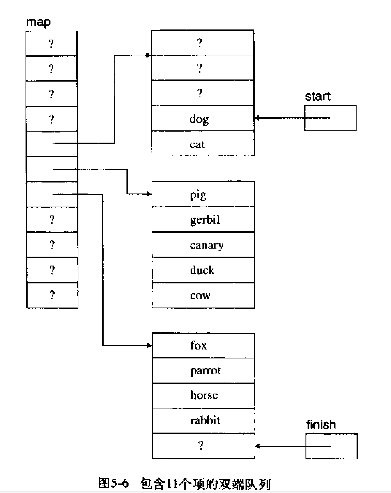

+ 实现头部尾部快速操作的方式： 其存储元素时，会从中间开始存储
+ 实现随机访问的方式：先定位到元素所在存储块，再根据偏移量寻找元素位置

deque 的迭代器都有 first、current、last、node 四个字段

+ start 迭代器：
        * first：当前迭代器块的第一个位置
        * current：	deque 内第一个元素的位置
        * last：当前迭代器块的最后一个位置的下一个位置
        * Node：当前块
+ finish 迭代器：
        * first：当前迭代器块的第一个位置
        * current：	deque 内最后一个元素的位置的下一个位置
        * last：当前迭代器块的最后一个位置的下一个位置
        * Node：当前块

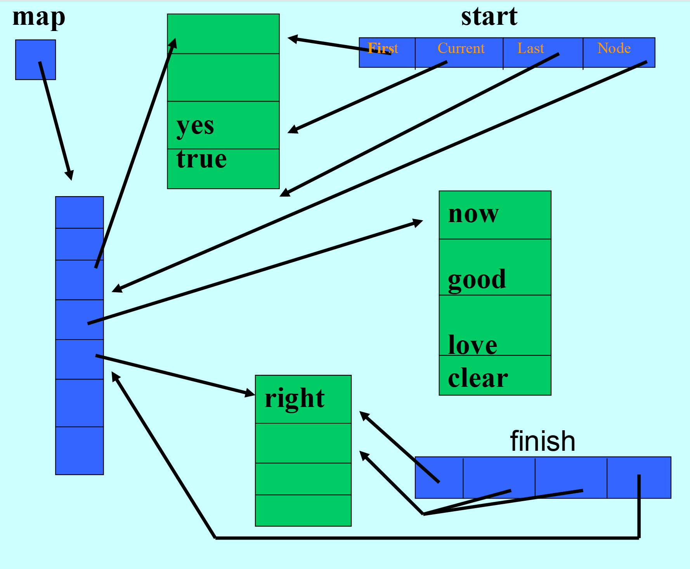

+ 随机访问的实现（假设需要访问 words[5]）：
        * 计算第几块：$ =\frac{start.current - start.first+ index(下标)}{block\_size} $
        * 计算偏移量：$ = （start.current - start.first+ index(下标)） \% \ block\_size $
+ 插入和删除的实现：
        * 在 deque内部索引i处进行插入或删除操作时，移动的项目数量为i与长度–i中的较小值（可能前面的项移动，也可能后面的项移动，哪个花的少哪个来）


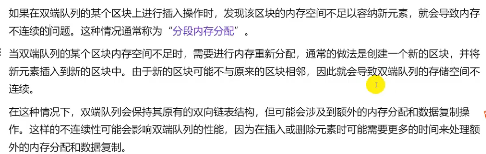

# 使用`vector`、`deque`实现特定算法：
使用 vector、deque 去实现 stack、queue 的特定算法

# 课后练习题：
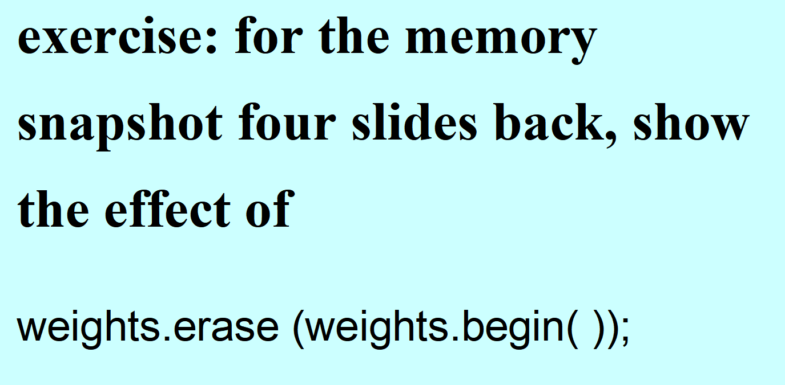

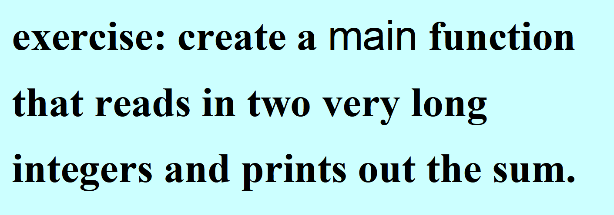

```cpp
#include<iostream>
#include<vector>
#include<string>
#include<algorithm>
using namespace std;

int main(){
	string s1,s2;
	cin >> s1 >> s2;


	//逆序存储：
	vector<int> add1, add2, ans;

	int size1 = s1.size();
	int size2 = s2.size();

	for(int i = size1 - 1; i >= 0; i--)
		add1.push_back(s1[i] - '0');

	for(int i = size2 - 1; i >= 0; i--)
		add2.push_back(s2[i] - '0');


	//开始模拟竖式加法：
	int out = 0;

	int loop_time = max(size1, size2);
	for(int i = 0; i < loop_time; i++){
		int in1{0}, in2{0};
		if(i <= size1 - 1)
			in1 = add1[i];

		if(i <= size2 - 1)
			in2 = add2[i];

		int sum = in1 + in2 + out;
		ans.push_back(sum % 10);
		out = sum / 10;
	}

	if(out > 0)
		ans.push_back(out);

	int size = ans.size();
	for(int i = size - 1; i >= 0; i--)
		cout << ans[i];

	return 0;
}
```

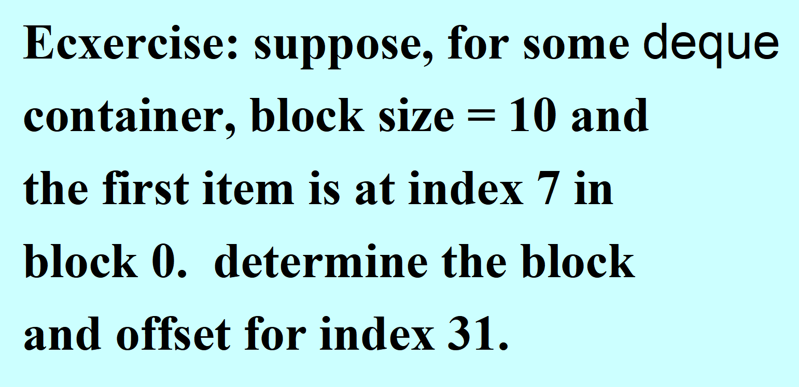

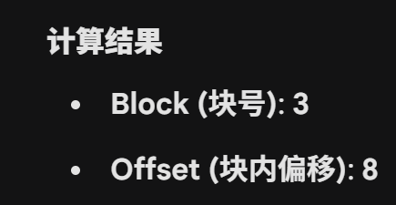

<!-- learning-journey:update-history:start -->
## 更新记录

| 日期 | 类型 | 说明 |
| --- | --- | --- |
| 2026-07-27 | 首次发布 | 从语雀整理并发布到学习记录仓库 |
<!-- learning-journey:update-history:end -->
