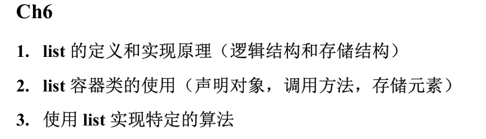
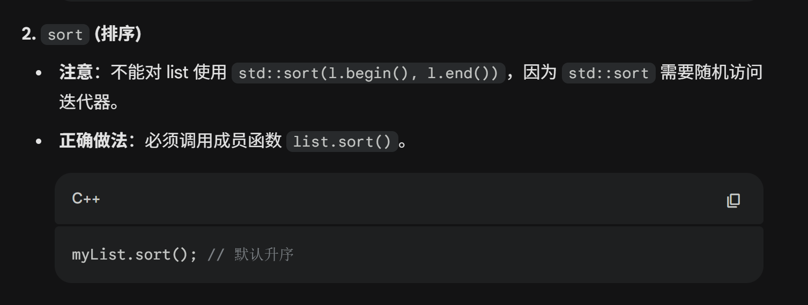
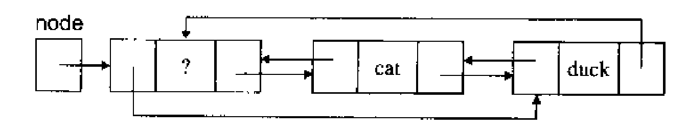
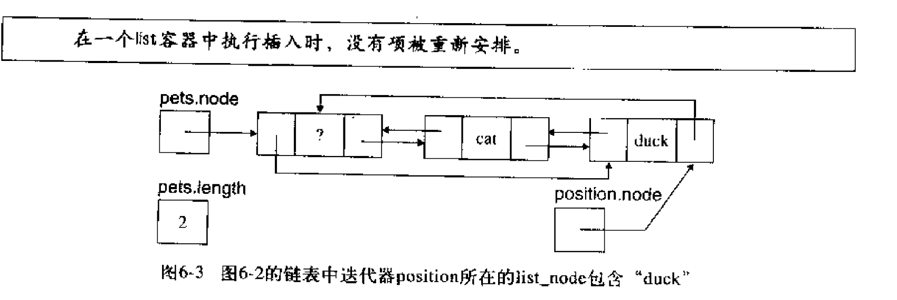
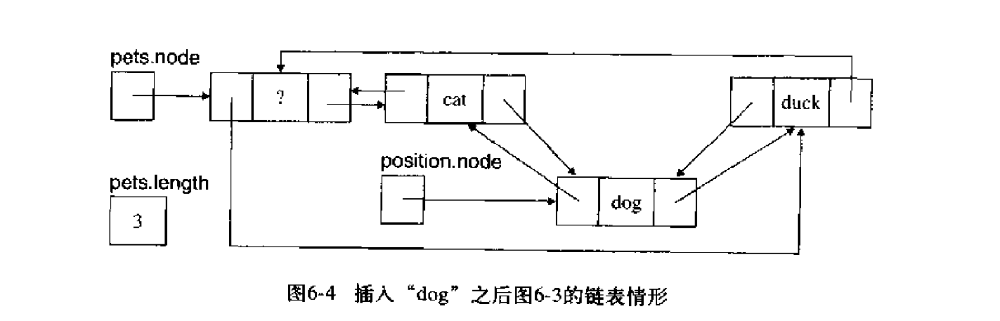
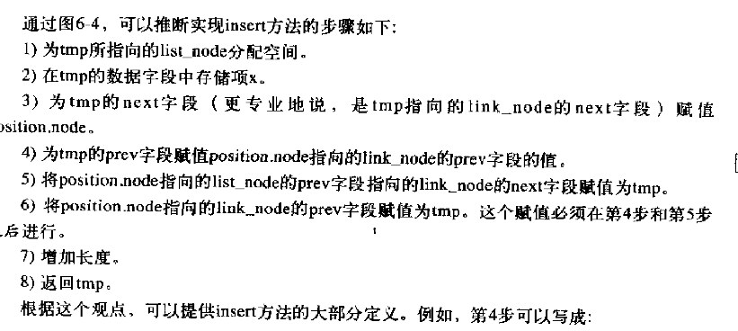
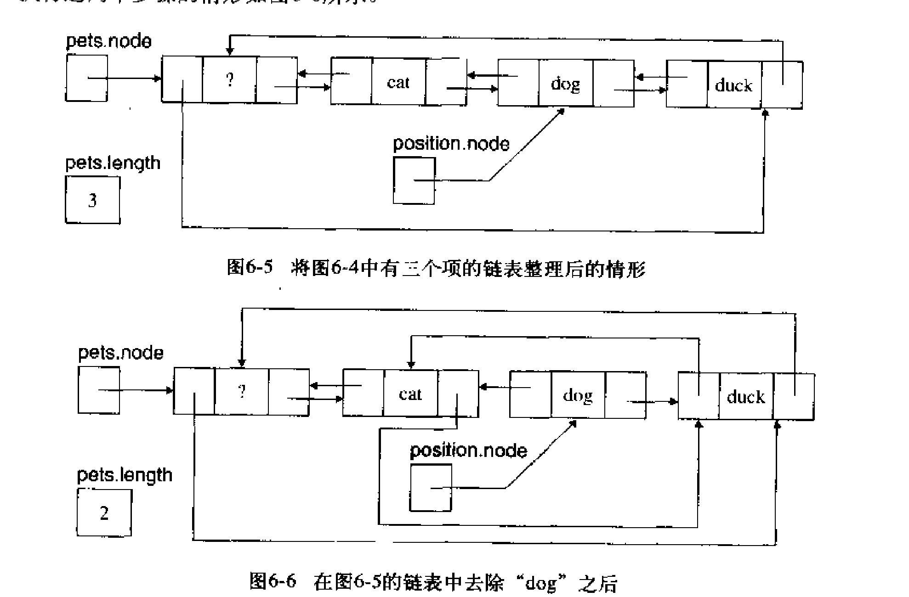
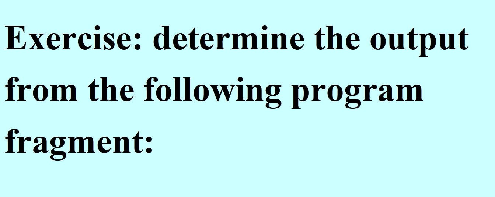
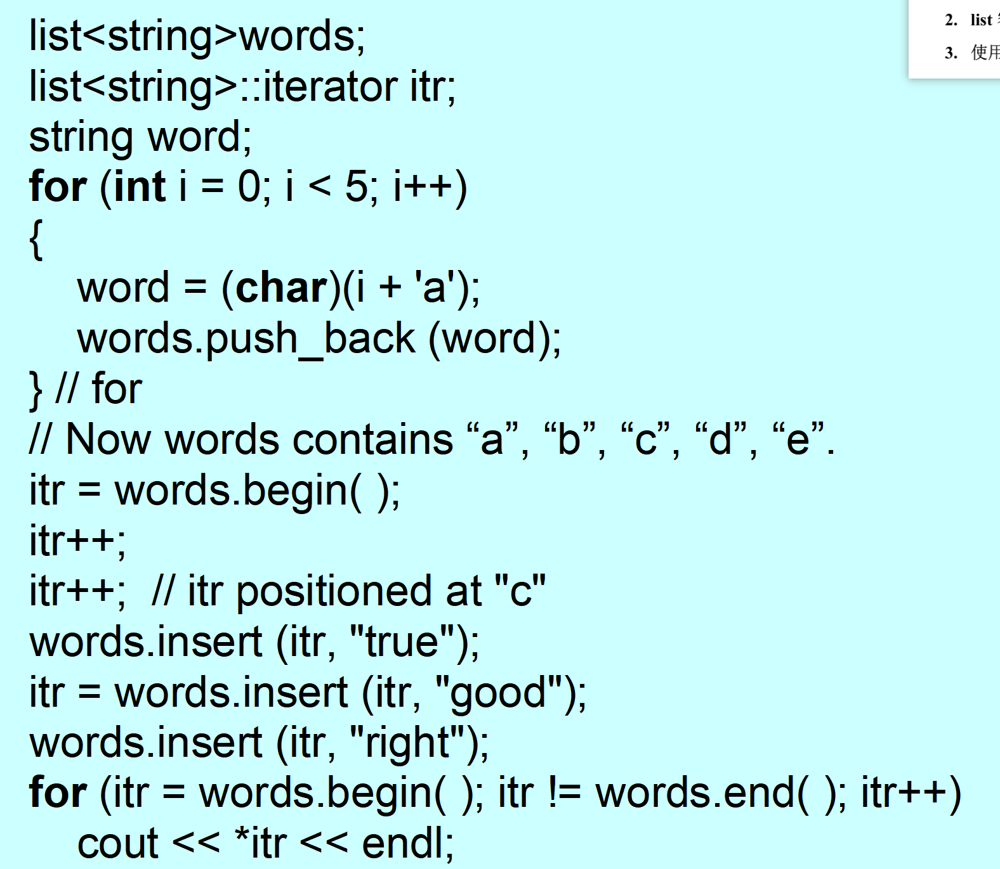

> 区别于 vector，list 中的元素不是存储在连续的内存空间中，而是分散存储的，通过指针链接在一起，每个元素都包括指向前一个和后一个元素的指针，因此 list 为**双向链表**数据结构
>

# 定义
list 是项的有限序列，满足

1. 访问和修改元素需要线性时间
2. 给定迭代器任意位置插入和删除元素只需要常数时间

# 实现原理
逻辑结构：顺序容器，按次序排列

存储结构：**双向，循环，带头节点的环状结构。由一系列节点组成，节点在内存中离散分布，节点之间通过指针链接，元素存储在节点之中**

# 特征：
:::warning
# 随机访问迭代器&双向迭代器
+ 随机访问迭代器：可以直接前进或退后任意个位置，可以使用下标运算符` [] `实现随机访问
+ 双向迭代器：只能前进或后退 1 个位置

:::

+ 访问、修改序列中的元素都需要 O(n)时间
+ 给定迭代器插入或删除某一元素只需要 O(1)时间
+ 不具备下标运算符 []
+ 迭代器的失效程度：删除时只会对当前操作元素的迭代器失效，而不是之后的全失效

# 方法：
```cpp
//1，构造函数
list<int> myList;
list<int> myNewList(myOldList);

//2.前插尾插函数：（常数时间）
myList.push_front(1);
myList.push_back(2);

//3.随机插入函数：（常数时间）
myList.insert(itr,3);

//4.前删尾删函数：（常数时间）
myList.pop_front();
myList.pop_back();

//5.随机元素删除函数：（常数时间）
myList.erase(itr);

//6.随机范围删除函数：（时间与删除的项成正比）
myList.erase(itrBegin, itrEnd);

//7.获长函数：
myList.size();

//8.判空函数：
myList.empty();

//9.头尾迭代器：
myList.begin();
myList.end();

//10.合并链表函数：（常数时间）
myList.splice(itr, otherList); //合并进的链表中的元素会在原链表中被删除

//11.升序排序函数：
myList.sort();		//worstTime(n)为O(nlogn)

//12.迭代器接口：前置自增，后置自增，前置自减，后置自减，解析，不等于
```



# 实现
+ 借助一个 node 结构体来实现，代码和结构如下：

```cpp
template<class T>
class list{
protected:
    unsigned length;
    struct list_node{
        list_node* next;	//指向后一个节点
        list_node* prev;	//指向前一个节点
        T data;				//保存该节点数据
    };
    list_node* node;		//node指向的节点是头节点，头节点的data是未使用的
};
```



+ node 头节点的 data 未使用，next 指向链表第一项，prev 指向链表最后一项
+ **<font style="color:#DF2A3F;background-color:#FBDE28;">迭代器 end()指向的是头节点 node 指针，begin()指向的是第一个元素所在结点指针【必考！！！】</font>**

## 插入操作：






**<font style="color:#DF2A3F;background-color:#FBDE28;">List 插入并不会使任何迭代器失效，该指向谁指向的还是谁</font>**

## 删除操作：


# 应用：行编辑器：
```cpp

/**
 * ============================================================================
 * Line Editor (基于 C++ STL list 实现)
 * * 【考试核心考点】
 * 1. 为什么用 list 而不是 vector？
 * - 编辑器需要频繁在中间插入(insert)和删除(delete)行。
 * - List 的插入/删除复杂度为 O(1)（前提是已知位置），只需修改指针。
 * - Vector 的插入/删除复杂度为 O(N)，需要移动大量后续元素，效率低。
 * * 2. 迭代器 (Iterator) 的使用：
 * - List 不支持随机访问 (没有 operator[])。
 * - 必须使用迭代器 current 来模拟光标位置。
 * - 只能使用 ++ 或 -- 移动，不能使用 current + n。
 * * 3. 迭代器失效问题：
 * - List 的 erase 操作只会使被删除元素的迭代器失效，其他不受影响。
 * ============================================================================
 */

#include <iostream>
#include <string>
#include <list>
#include <iterator>
#include <cstdlib> // 用于 atoi (字符串转整数)

using namespace std;

// --- 常量定义 (避免魔术数字/字符串) ---
const string BLANK = " ";
const string EMPTY_STRING = "";
const string COMMAND_START = "$"; // 命令行的起始标记
const string INSERT_COMMAND = "$Insert";
const string DELETE_COMMAND = "$Delete";
const string LINE_COMMAND = "$Line";
const string DONE_COMMAND = "$Done";
const int MAX_LINE_LENGTH = 75;

// --- 错误提示信息 ---
const string MISSING_COMMAND_ERROR = "Error: a command must start with $";
const string MISSING_NUMBER_ERROR = "Error: the line entered is missing a line number.";
const string TWO_NUMBERS_ERROR = "Error: the line entered is missing both line numbers.";
const string ILLEGAL_COMMAND_ERROR = "Error: not one of the given commands";
const string LINE_TOO_LONG_ERROR = "Error: the number of characters in the line is more than the max allowed";
const string FIRST_TOO_SMALL_ERROR = "Error: the first line number given is less than -1.";
const string SECOND_TOO_LARGE_ERROR = "Error: the second line number > the last line number in the text.";
const string FIRST_GREATER_THAN_SECOND_ERROR = "Error: the first line number > the second line number.";

// =========================================================
// Editor 类定义
// =========================================================
class Editor {
public:
    Editor();
    // 核心对外接口：解析用户输入的一行
    string parse(const string& line);

protected:
    // 【考点】核心数据结构：双向链表
    // 每一个节点存储一行文本 (string)
    list<string> text;

    // 【考点】光标位置
    // 因为 list[i] 不可用，必须维护一个 iterator 指向当前行
    list<string>::iterator current;

    // 辅助变量：记录 current 指向的是第几行 (用于 $Line 命令计算距离)
    int currentLineNumber;

    // 状态标志：true 表示正在输入文本，false 表示等待命令
    bool inserting;

    // 内部功能函数
    string command_check(const string& line);
    string insert_command(const string& line);
    string delete_command(int k, int m);
    string line_command(int m);
    string done_command();
};

// =========================================================
// 成员函数实现
// =========================================================

/**
 * 构造函数
 * 初始化编辑器状态
 */
Editor::Editor() {
    current = text.begin(); // 初始指向 begin
    currentLineNumber = -1; // -1 表示空文档或光标在起始前
    inserting = false;      // 默认为命令模式
}

/**
 * Parse: 总控函数
 * 逻辑：判断输入是命令($开头)还是普通文本
 */
string Editor::parse(const string& line) {
    // 情况1：输入以 $ 开头 -> 这是一个命令，去检查是哪个命令
    if (line.substr(0, 1) == COMMAND_START) {
        return command_check(line);
    }

    // 情况2：输入不是 $ 开头
    if (inserting) {
        // 如果当前是“插入模式”，这行字就是文本，直接插入
        return insert_command(line);
    } else {
        // 如果不是“插入模式”又没输 $，那就是非法操作
        return COMMAND_START + MISSING_COMMAND_ERROR + COMMAND_START;
    }
}

/**
 * Command Check: 命令解析器
 * 作用：解析字符串，提取参数(如行号)，分发给对应的处理函数
 */
string Editor::command_check(const string& line) {
    int blank_pos1 = line.find(BLANK); // 找第一个空格的位置
    int blank_pos2;
    string command;

    // 提取命令动词 (例如 "$Insert")
    if (blank_pos1 >= 0)
        command = line.substr(0, blank_pos1);
    else
        command = line; // 只有命令没有参数，如 "$Done"

    // --- 分发逻辑 ---

    if (command == INSERT_COMMAND) {
        inserting = true; // 切换到插入模式
        return BLANK;
    }

    // 只要不是 Insert 命令，都视为退出插入模式
    inserting = false;

    if (command == DELETE_COMMAND) {
        // 需要解析两个参数: $Delete k m
        int k, m;
        if (blank_pos1 >= 0) {
            blank_pos2 = line.find(BLANK, blank_pos1 + 1);
            if (blank_pos2 >= 0) {
                // atoi: ASCII to Integer
                k = atoi(line.substr(blank_pos1 + 1, blank_pos2 - blank_pos1 - 1).c_str());
                m = atoi(line.substr(blank_pos2 + 1).c_str());
                return delete_command(k, m);
            }
            return COMMAND_START + TWO_NUMBERS_ERROR;
        }
        return COMMAND_START + MISSING_NUMBER_ERROR;

    } else if (command == LINE_COMMAND) {
        // 需要解析一个参数: $Line m
        if (blank_pos1 >= 0) {
            int m = atoi(line.substr(blank_pos1 + 1).c_str());
            return line_command(m);
        }
        return COMMAND_START + MISSING_NUMBER_ERROR;

    } else if (command == DONE_COMMAND) {
        return done_command();
    }

    return COMMAND_START + ILLEGAL_COMMAND_ERROR;
}

/**
 * Insert Command: 插入文本
 * 【考点】List 的 insert 方法与迭代器操作
 */
string Editor::insert_command(const string& line) {
    if (line.length() > MAX_LINE_LENGTH)
        return COMMAND_START + LINE_TOO_LONG_ERROR;

    // STL list.insert(pos, val) 的定义是：在 pos 之前插入。
    // 编辑器需求：在当前行 *之后* 插入新内容。

    // 空文档或 $Line -1 时，插入位置是 begin()；否则插入到当前行之后。
    // insert 返回指向新插入元素的迭代器，我们更新 current 指向新行。
    auto pos = (currentLineNumber == -1) ? text.begin() : next(current);
    current = text.insert(pos, line);

    currentLineNumber++; // 更新行号计数器
    return BLANK;
}

/**
 * Line Command: 跳转光标
 * 【考点】List 不支持随机访问，必须循环移动迭代器
 */
string Editor::line_command(int m) {
    // 边界检查
    if (m < -1 || m >= (int)text.size())
        return "Error: Line number out of range.";

    // -1 表示光标在首行之前；其余位置从 begin() 顺序定位。
    if (m == -1)
        current = text.end();
    else
        current = next(text.begin(), m);

    // 更新当前行号记录
    currentLineNumber = m;
    return BLANK;
}

/**
 * Delete Command: 删除指定范围的行
 * 【考点】erase 的使用与迭代器防失效
 */
string Editor::delete_command(int k, int m) {
    // 1. 边界检查
    if (k < 0) return COMMAND_START + FIRST_TOO_SMALL_ERROR;
    if (m >= (int)text.size()) return COMMAND_START + SECOND_TOO_LARGE_ERROR;
    if (k > m) return COMMAND_START + FIRST_GREATER_THAN_SECOND_ERROR;

    // 2. 首先将光标移动到起始删除位置 k
    current = next(text.begin(), k);
    // 此时 current 指向第 k 行

    // 3. 循环删除从 k 到 m 的行 (共 m - k + 1 行)
    int count = m - k + 1;
    for (int i = 0; i < count; i++) {
        // 【关键考点】 text.erase(current)
        // 1. 删除 current 指向的节点。
        // 2. 返回被删除节点 *之后* 的那个节点的迭代器。
        // 3. 这样保证了 current 始终有效，链表不会断链。
        current = text.erase(current);
    }

    // 4. 状态修正
    // 删除后，current 指向的是 m 后面的那一行。
    // 编辑器逻辑通常希望光标停留在被删除区域的前一行，或者新的第 k 行。
    // 这里我们更新 currentLineNumber。
    currentLineNumber = k;

    // 特殊情况处理：如果删除了末尾，current 变成了 text.end()
    // 我们需要让它退回到最后一个有效行
    if (current == text.end()) {
        if (!text.empty()) {
            current--;
            currentLineNumber--;
        } else {
            // 如果删光了，重置状态
            currentLineNumber = -1;
        }
    }

    // 为了符合题目逻辑，这里让行号指向删除动作开始的位置 k（或者调整后的位置）
    // 此时 current 已经指向了原 m+1 行 (现在变成了第 k 行)
    // 除非 m 是最后一行，已经在上面 if 处理了。

    return BLANK;
}

/**
 * Done Command: 结束编辑并打印
 * 【考点】List 的全量遍历
 */
string Editor::done_command() {
    const string FINAL_MESSAGE = "Here is the final text:\n";
    string text_string = FINAL_MESSAGE;

    list<string>::iterator itr;

    // 特殊处理：如果是空文档或初始状态
    if (currentLineNumber == -1 && text.empty())
        return text_string + "(Empty Text)\n";

    // 遍历整个 list
    for (itr = text.begin(); itr != text.end(); itr++) {
        // 如果遍历到的行是光标当前行，加上 "> " 标记
        if (itr == current)
            text_string += "> " + *itr + "\n";
        else
            text_string += "  " + *itr + "\n";
    }

    return text_string;
}

// =========================================================
// Main 函数
// =========================================================
int main() {
    Editor editor;
    string line;
    string result;
    const string PROMPT = ">> ";

    cout << "Welcome to the Line Editor." << endl;
    cout << "Commands: $Insert, $Line m, $Delete k m, $Done" << endl;

    // 主循环：读取用户输入直到完成
    do {
        cout << PROMPT;
        getline(cin, line); // 读取整行，包括空格

        result = editor.parse(line);

        // 如果 result 不是 BLANK，说明有信息需要打印（报错或Done的输出）
        if (result != BLANK) {
            cout << result << endl;
        }

        // 检查是否结束 (Done 命令返回的字符串包含 "Here is the final text")
        if (result.find("Here is the final text") != string::npos) {
            break;
        }

    } while (true);

    return 0;
}

```

# 课堂练习：




<!-- learning-journey:update-history:start -->
## 更新记录

| 日期 | 类型 | 说明 |
| --- | --- | --- |
| 2026-07-28 | 首次发布 | 从语雀整理并发布到学习记录仓库 |
<!-- learning-journey:update-history:end -->
