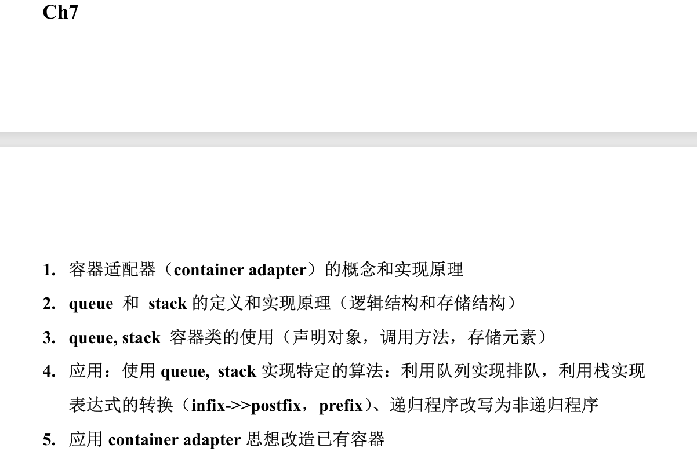

> 二者都是容器适配器
>
> 通常用于需要维护元素顺序的场合，如任务调度，消息队列等等
>
> queue & stack 都没有迭代器！！
>
> queue 有`front()`,`back()`访问元素，stack 只有`top()`访问元素
>
> **<font style="color:#DF2A3F;background-color:#FBDE28;">队列和栈的存储结构都不确定！！因为是容器适配器</font>**
>

# 容器适配器 container adapter
## 概念：
容器适配器是通过调用其它类的方法去定义自己的方法的类

容器适配器包含一个已有容器类的对象作为成员，把已有的底层容器按一定的规则来进行封装，进而更好地实现一些功能。

## 实现原理：
+ 适配器内部包含一个受保护的成员字段，用于存储底层容器对象：
`protected: Container c;`
+ <font style="color:rgb(48, 48, 48);">适配器的方法定义是预设好的。例如，</font>`<font style="color:rgb(40, 42, 44);">stack</font>`<font style="color:rgb(48, 48, 48);"> 的 </font>`<font style="color:rgb(40, 42, 44);">push</font>`<font style="color:rgb(48, 48, 48);"> 操作实际上是调用底层容器的 </font>`<font style="color:rgb(40, 42, 44);">push_back</font>`<font style="color:rgb(48, 48, 48);">；</font>`<font style="color:rgb(40, 42, 44);">queue</font>`<font style="color:rgb(48, 48, 48);"> 的 </font>`<font style="color:rgb(40, 42, 44);">pop</font>`<font style="color:rgb(48, 48, 48);"> 实际上是调用底层容器的 </font>`<font style="color:rgb(40, 42, 44);">pop_front</font>`

# queue 队列
> 按照时间顺序排序的先入先出序列
>
> `**template** <**class** T, **class** container = deque<T> >`
>

## 定义：
+ 是一个容器适配器，遵循先进先出的逻辑结构，以 deque 或 list 为底层容器实现，默认底层容器为 deque【vector 没有 pop_front 方法，不能作为底层容器】
+ 插入只允许从尾部进行
+ 删除只允许从队头进行；可以通过 `front()` 和 `back()` 访问或修改队头、队尾元素

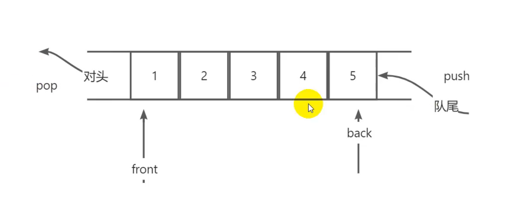

## 方法：
```cpp
//1.构造函数
queue<string> q1;

queue<string,deque<string>> q2;


//2.入队函数：
q1.push("shit");	//averageTime(n)是常数,worstTime(n)是O(n),amortizedTime(n)是常数

//3.队头函数：
q1.front();			//返回的是对头项的引用，因此可以修改

//4.出队函数：
q1.pop();			//averageTime(n)、worstTime(n)都为常数
//注：pop()函数原型为void，不返回弹出的项，因此如果想获取弹出前必须top()一下

//5.队尾函数：
q1.back();

//6.判空获长等等
```

+ 对`queue`的全部方法而言，averageTime(n)都是常数
+ `**queue**`**没有迭代器**，想要输出队列，可以将队列作为形参，输出队列的拷贝：

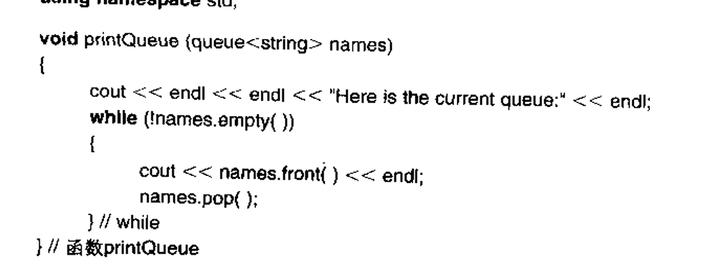

# stack 栈
> 按照空间顺序排序的 后入先出序列
>

## 定义：
+ stack 是一个容器适配器，遵循后进后出的逻辑结构，底层容器可以为 vector、list、deque
+ 只能在栈顶（容器尾部）进行所有操作：插入，删除，访问，修改

## 方法：
```cpp
//1.构造函数：
stack<string> s1;
stack<string, deque<string>> s2;

//2.入栈函数：
s1.push("good");	//averageTime(n)是常数,worstTime(n)是O(n),amortizedTime(n)是常数

//3.栈顶函数：
s1.top();			//返回的是引用

//4.出栈函数：
s1.pop();			//averageTime(n)、worstTime(n)都为常数
//注：pop()函数原型为void，不返回弹出的项，因此如果想获取弹出前必须front()一下

//5.获长、判空函数等
```

+ 栈也是容器适配器，需要底层容器具有`push_back()`、`pop_back()`、`back()`方法；因此 vector、deque、list 都可作为 stack 的底层容器，默认为 deque
+ 栈也没有迭代器，因为只有栈顶是可以访问的

## 应用：中缀表达式（infix）转化为后缀（postfix）前缀表达式（prefix）
### 中缀——>后缀 步骤：
    1. 操作项直接搞出来，操作符往上叠
    2. 比较操作符优先级：比栈顶高——>入栈
    3. 不比栈顶高——>把栈顶搞出来，再与新栈顶比较
    4. 遇到左括号：左括号无条件入栈，具有最低优先级
    5. 遇到右括号：左括号之后全部运算符出栈，丢弃左括号

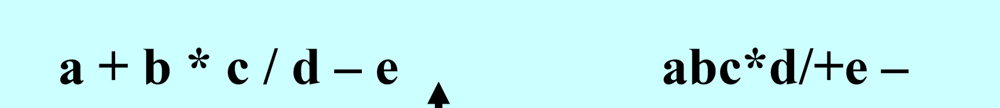

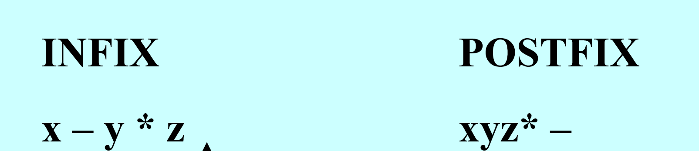

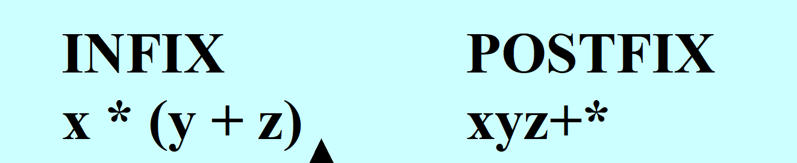

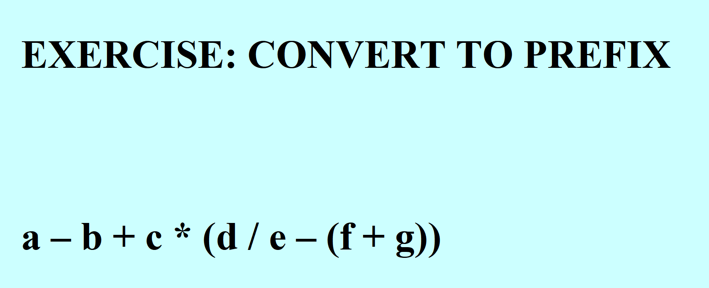

（此题变后缀）

答案：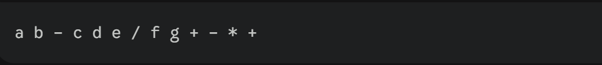

### 中缀——>前缀 步骤：
    1. 中缀表达式从后往前操作进栈，规则同上
    2. 转换来的前缀表达式出栈也是从右往左写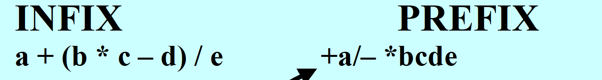


### 根据后缀表达式计算结果：
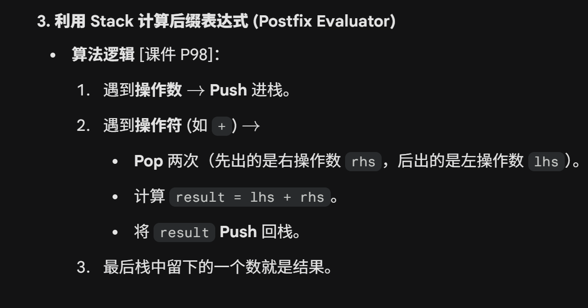

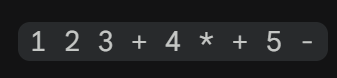

答案：16

# 洗车排队程序：
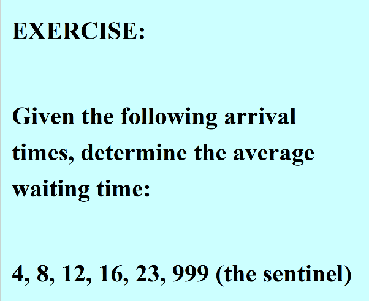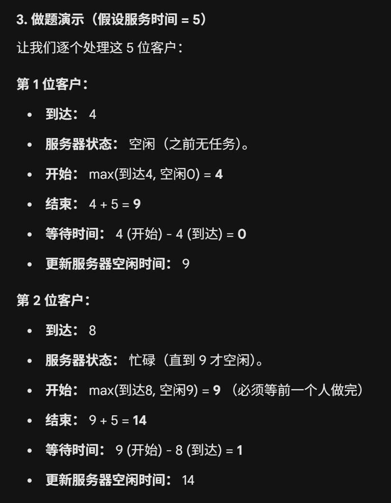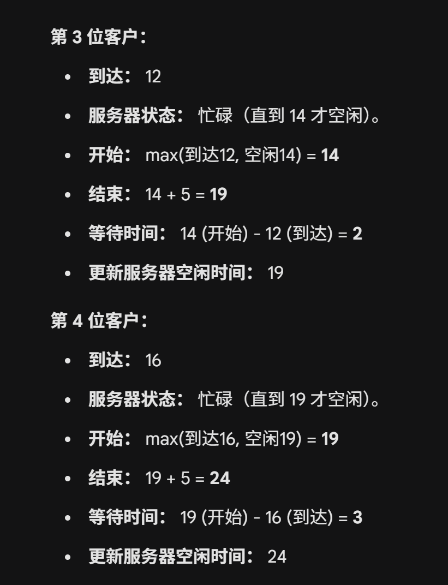

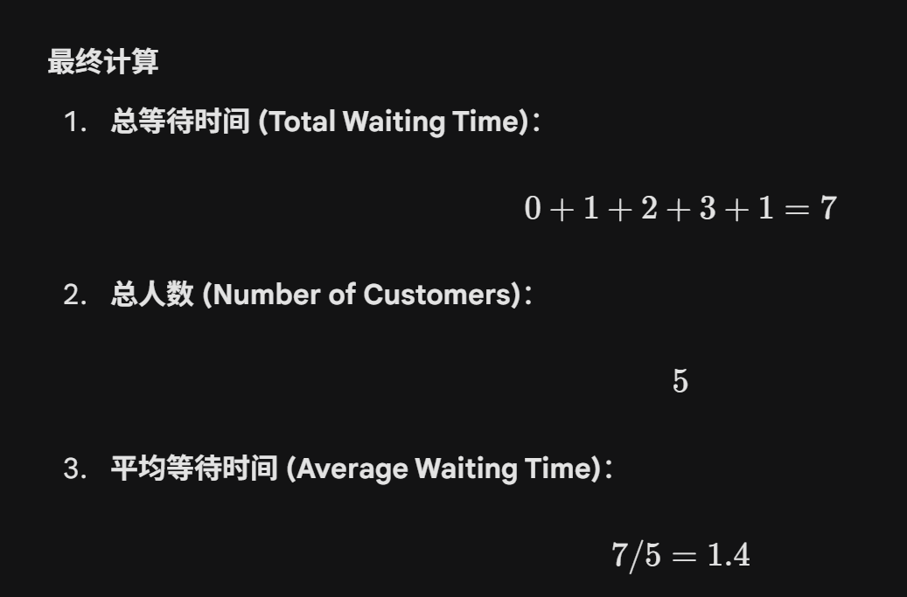

# 递归程序改写非递归
+ 思想：用栈来模拟递归

## 递归版本：转换二进制
```cpp
void writeBinary (int n)
{
     if (n == 0 || n == 1)
           cout << n;
     else
     {
           writeBinary (n / 2);
           cout << n % 2;
     } // else
} // writeBinary
```

## 栈模拟版本：
```cpp
void writeBinary (int n)
{
    stack<int> myStack;
    myStack.push(n);
    while (n > 1)
    {
        n = n / 2;
        myStack.push(n);
    } // pushing
    while (!myStack.empty())
    {
        n = myStack.top();
        myStack.pop();
        cout << (n % 2);
    } // popping
    cout << endl << endl;
} // method writeBinary
```

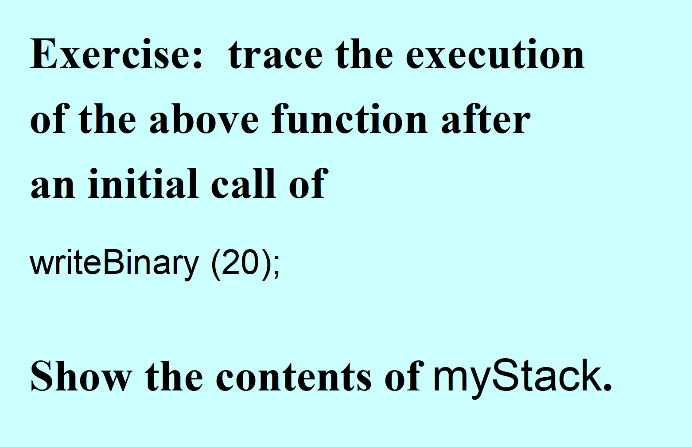

# 容器适配器思想改造已有容器
考法：protected 一个已有容器的对象

方法都是用调用该对象的方法来实现

+ 模板：

```cpp
template <class T>
class SearchableContainer {
protected:
    // 1. 包含一个底层容器 (Composition)
    vector<T> c;
public:
    // 2. 暴露你想要的方法 (Delegation)
    void insert(const T& x) {
        c.push_back(x); // 委托给 vector
    }

    // 3. 增加新功能
    bool isPresent(const T& target) {
        // 调用 STL 算法或手写循环
        return find(c.begin(), c.end(), target) != c.end();
    }

    // 4. 隐藏不想要的方法 (比如不提供 operator[]，用户就无法随机访问)
};
```

```cpp
#include <iostream>
#include <vector>
#include <list>
#include <algorithm> // 用于 std::find

using namespace std;

// 1. 模板定义
// T: 存储的数据类型
// Container: 底层使用的容器类型，默认为 vector<T>
template <class T, class Container = vector<T> >
class SearchableContainer {
protected:
    // 【核心】组合 (Composition)
    // 适配器 "拥有" 一个底层容器，而不是 "是" 一个容器
    Container c;

public:
    // --- 构造函数 ---
    SearchableContainer() {}

    // --- 核心功能 1: 插入 (Delegation/委托) ---
    // 我们将 insert 请求 "委托" 给底层容器的 push_back 方法
    void insert(const T& value) {
        c.push_back(value);
    }

    // --- 核心功能 2: 搜索 (新功能) ---
    // 这是底层容器可能没有直接封装好的方法，我们在适配器层实现它
    bool isPresent(const T& target) const {
        // 使用 STL 的通用算法 find
        // 注意：这里需要底层容器支持 begin() 和 end() 迭代器
        typename Container::const_iterator itr;
        itr = find(c.begin(), c.end(), target);

        // 如果迭代器没有走到末尾，说明找到了
        return itr != c.end();
    }

    // --- 辅助功能 (Delegation) ---
    bool empty() const {
        return c.empty();
    }

    int size() const {
        return c.size();
    }

    // 【注意】我们故意不提供 operator[]
    // 用户无法使用 container[0] 来访问元素，从而保证了访问的安全性/限制性
};

int main() {
    // 案例 1: 使用默认的 vector 作为底层
    SearchableContainer<int> myWrapper;

    myWrapper.insert(10);
    myWrapper.insert(20);
    myWrapper.insert(30);

    // 测试搜索功能
    if (myWrapper.isPresent(20)) {
        cout << "Found 20!" << endl;
    } else {
        cout << "20 not found." << endl;
    }

    // myWrapper[0]; // 错误！这行代码编译不通过，因为适配器屏蔽了下标访问

    // 案例 2: 使用 list 作为底层 (展示适配器的灵活性)
    // 只要 list 支持 push_back 和迭代器，适配器就能工作
    SearchableContainer<string, list<string> > stringWrapper;
    stringWrapper.insert("Hello");
    stringWrapper.insert("World");

    if (stringWrapper.isPresent("Hello")) {
        cout << "Found Hello in list!" << endl;
    }

    return 0;
}
```

<!-- learning-journey:update-history:start -->
## 更新记录

| 日期 | 类型 | 说明 |
| --- | --- | --- |
| 2026-07-28 | 首次发布 | 从语雀整理并发布到学习记录仓库 |
<!-- learning-journey:update-history:end -->
