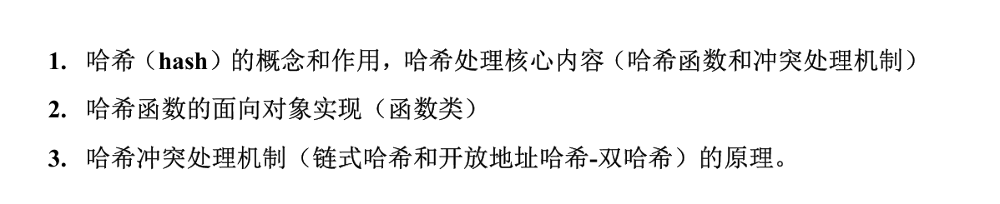
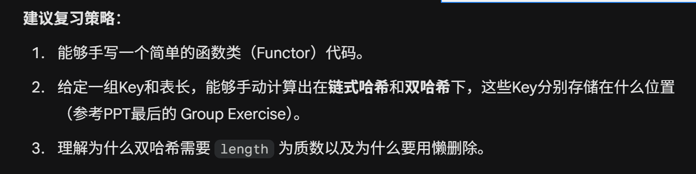
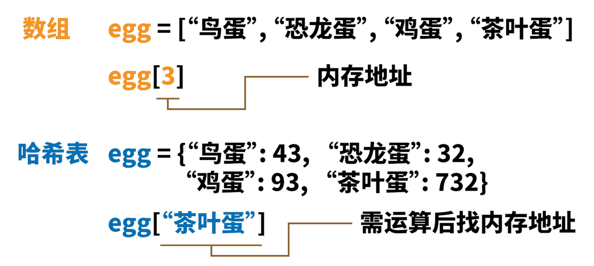
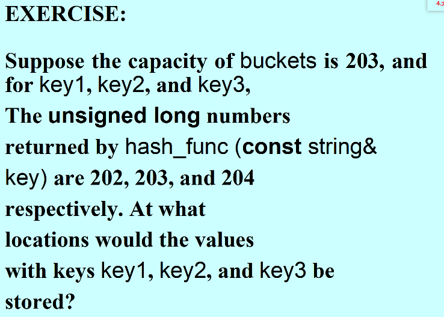
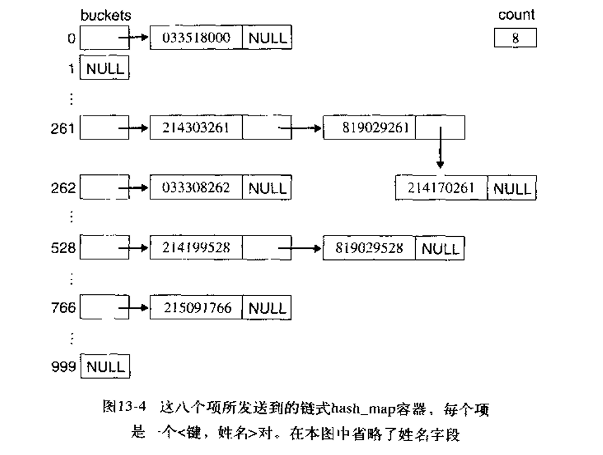
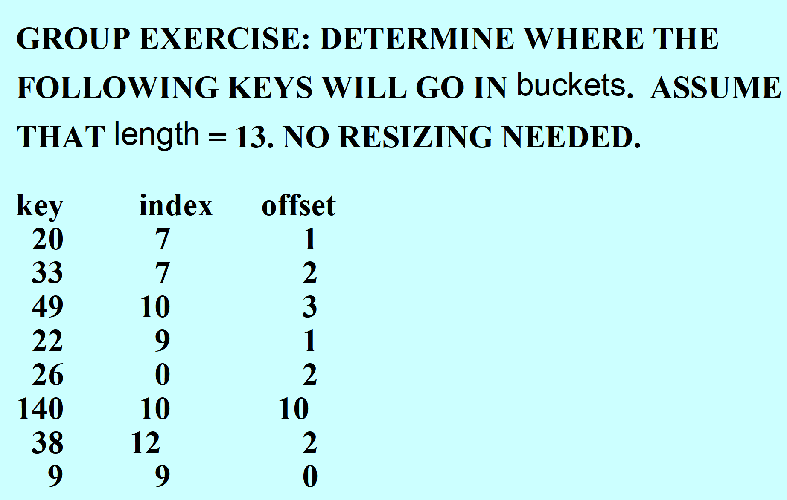
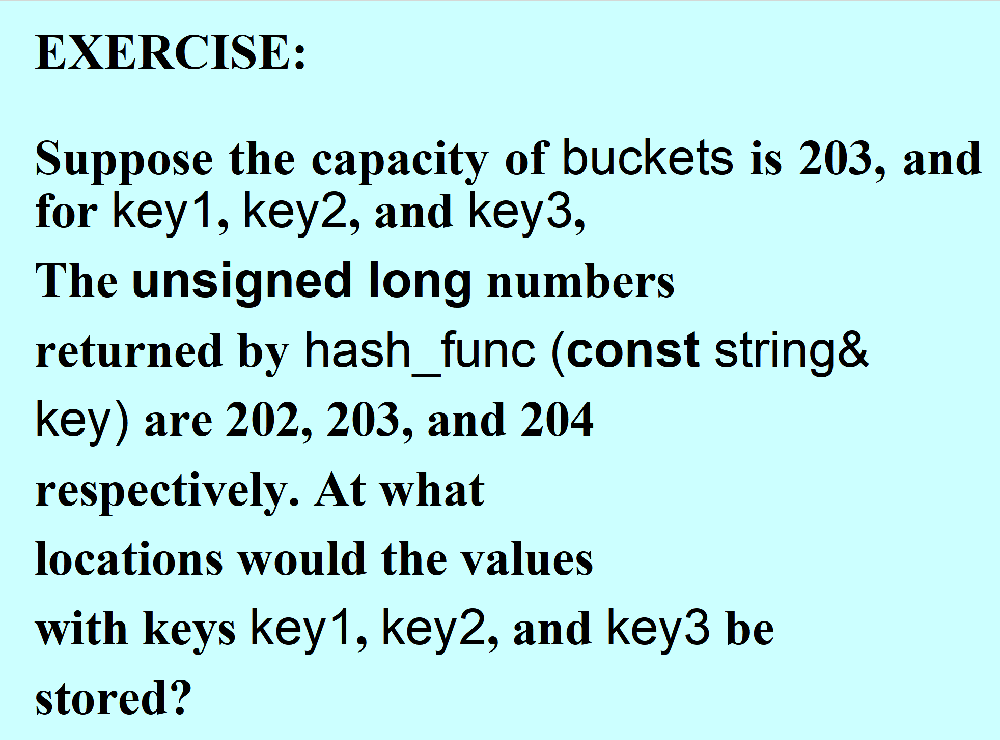
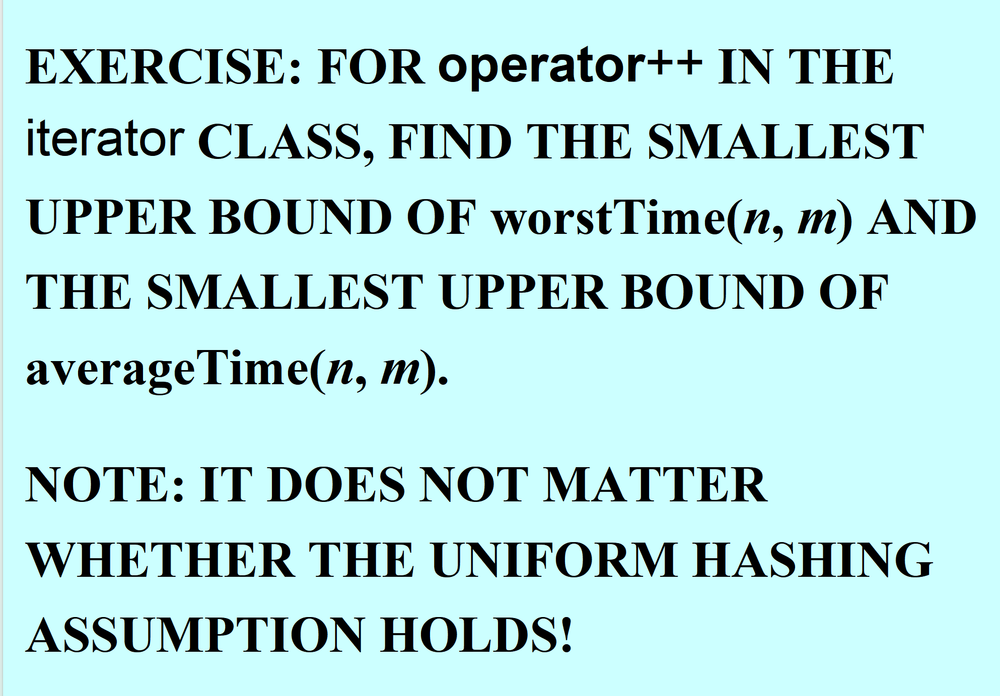

# 查找
## 顺序查找：
```cpp
template<class InputIterator, class T>
InputIterator find(InputIterator first, InputIterator last, const T& value){
    while(first != last && *first != value)
        ++first;
    return first;
}
```

# hash 哈希
> hash_map 的插入、查找、删除 averageTime(n)都为常数
>

## 概念：
**Hashing哈希是一种将键（key）转换为数组索引（array index）的算法**



哈希算法包括两部分：哈希函数 & 冲突处理

### **<font style="color:rgb(0,0,255);">THE UNIFORM HASHING ASSUMPTION </font>**均匀哈希假设思想
 假设每个键都以相同的概率、独立地映射到表中的任何一个地址

### load factor 负载因子
$ load\ factor = \frac{元素总数}{桶的数量} $


## 作用：
实现平均时间复杂度为 $ O(1) $ 的查找、插入和删除操作。

+ _对比_：顺序查找是 $ O(n) $，二分查找/树查找是 $ O(\log n) $。哈希的目标是常数时间

## 哈希函数：
+ 在键上执行一些处理操作， 将键转换为一个`unsigned long`值，以便于将该值转化为数组`buckets`里的一个索引
+ 值转索引的具体操作是将`unsigned long`值 % buckets 桶的容量



### 哈希函数的面向对象实现【函数类】：
+ 在 C++STL 中，哈希函数不是一个全局函数，而是一个函数类（重载函数调用运算符`operator()`的类，本质上是一个类，但使用时更像一个函数）
+ 针对`int`类型的哈希函数类：

```cpp
class hash_func {
public:
    unsigned long operator() (const int& key) {
        return (unsigned long)key; // 直接返回键值作为哈希值
    }
};
```

+ 针对`string`类型的哈希函数类：

```cpp
#include <string>
using namespace std;

// 定义哈希函数类
class hash_func
{
public:
    // 重载 () 运算符，接收 string 类型的 key，返回 unsigned long 类型的哈希值
    unsigned long operator() (const string& key)
    {
        // 定义一个大质数，用于最后混淆结果，减少冲突
        const unsigned long BIG_PRIME = 4294967291;

        unsigned long total = 0; // 初始化总和

        // 遍历字符串的每一个字符
        for (unsigned i = 0; i < key.length(); i++)
        {
            // 核心算法：将当前总和乘以权重（13），再加上当前字符的ASCII值
            // 课件文字描述："partial totals are multiplied by 13"
            total = total * 13 + key[i];
        }

        // 最后乘以大质数返回
        return total * BIG_PRIME;
    }
};
```

+ 哈希函数类的使用：

```cpp
hash_func myHasher; // 创建一个对象
unsigned long index = myHasher(123); // 调用对象，实际上执行的是 operator() 代码
```

## 冲突处理机制：
+ 冲突：两个不同的键产生相同的索引，互相冲突的键称为同义词

### chained hashing 链式哈希：
在哈希表数组（buckets）的每个索引处，存储一个**链表（Linked List）**，包含所有冲突的元素



```cpp
list <value_type< const key_type, T> >* buckets;

int count;        // number of items in this hash_map
int length;      // number of buckets in this hash_map
hash_func hash;       // hash is a function object

int index = hash(key) % length;
```

+ **插入**：计算索引 -> 将新项添加到该索引对应的链表末尾（`push_back`）
+ **查找**：计算索引 -> 在该索引对应的链表中线性查找
+ **重哈希（Re-hashing / Resizing）**：
    - **负载因子 (Load Factor)**：`count / length`（元素总数 / 数组长度）
    - **触发条件**：当负载因子超过 **0.75** 时
    - **扩容策略**：新容量通常是 `2 * 旧容量 + 1`。扩容后，所有旧元素需要重新计算哈希值并插入新表
+ **时间复杂度**：
    - 平均情况：$ O(1) $
    - 最坏情况：$ O(n) $（所有键都哈希到同一个桶，退化为链表）

### open-address hashing 开放地址哈希：
> 具体方法： offset-1-hashing  & double-hashing
>

如果 buckets 桶中出现冲突，则会按照 1 偏移量一直往下寻找，找到最后一个又会从头开始找，直到找到一个空的位置

```cpp
//不能直接物理删除元素，否则会中断探测链，因此引入以下标记变量：

bool occupied = false;	//用来标记一个位置是否被占用

//但这样删除一个元素后，会导致寻找后面偏移的元素时找不到，故引入了一个新的标记变量：
bool marked_for_removal = false;

//删除元素会使该位置的 marked_for_removal 变量变为true
```

### open-address-double hashing 开放地址-双哈希：
在开放地址的基础上，解决开放地址哈希的成簇问题

+ **通过哈希同时获取索引和偏移量**

```cpp
unsigned long hash_int = hash (key);

//一般会让length必须为质数（题中会给出），防止有多个因子从而导致探测序列无法覆盖整个表
int index = hash_int % length,
offset = hash_int / length;

//放置冲突偏移后依旧冲突：哈希修正，否则会陷入死循环
if (offset % length == 0)
    offset = 1;


//如果冲突就使用下面这个标注新的index：（不冲突用原来的）
index = (index + offset) % length;
```



## `hash_map`类
### 模板样式
```cpp
template<class Key, class T, class HashFunc>
class hash_map { ... }
```

### 完全实现
```cpp
#include <list>
#include <algorithm> // for std::find
#include <iostream>
#include <vector>

using namespace std;

// 1. 定义 value_type 结构体 [课件 P.83]
// 用于在链表中存储键值对，并重载 == 以仅比较 Key
template<class Key, class T>
struct value_type {
    Key first;
    T second;

    value_type(const Key& key, const T& t) : first(key), second(t) {}

    // 默认构造函数
    value_type() {}

    // 拷贝构造
    value_type(const value_type& p) : first(p.first), second(p.second) {}

    // 重载 == 运算符，只比较键 (Key)，用于 std::find
    bool operator== (const value_type& x) const {
        return first == x.first;
    }
};

// 前置声明
template<class Key, class T, class HashFunc> class hash_map;

// 2. 定义迭代器类 iterator [课件 P.72-75]
template<class Key, class T, class HashFunc>
class hash_map_iterator {
    // 友元声明，让 hash_map 可以访问私有成员
    friend class hash_map<Key, T, HashFunc>;

protected:
    unsigned index;     // 当前在 buckets 数组的哪个索引
    unsigned length;    // buckets 数组的总长度
    // 指向具体链表中节点的迭代器
    typename list<value_type<const Key, T> >::iterator list_itr;
    // 指向哈希表 buckets 数组的指针
    list<value_type<const Key, T> >* buckets;

public:
    // 重载 ==
    bool operator== (const hash_map_iterator& other) const {
        return (index == other.index) &&
               (list_itr == other.list_itr) &&
               (buckets == other.buckets);
               // length 比较通常可以省略，这里简化
    }

    // 重载 !=
    bool operator!= (const hash_map_iterator& other) const {
        return !(*this == other);
    }

    // 重载 * (解引用)
    value_type<const Key, T>& operator* () {
        return *list_itr;
    }

    // 重载 ++ (后置，即 itr++) [课件 P.75]
    hash_map_iterator operator++ (int) {
        hash_map_iterator old_itr = *this;

        // 尝试在当前链表中前进一步
        if (++list_itr != buckets[index].end()) {
            return old_itr;
        }

        // 如果当前链表走完了，寻找下一个非空桶
        while (index < length - 1) {
            index++;
            if (!buckets[index].empty()) {
                list_itr = buckets[index].begin();
                return old_itr;
            }
        }

        // 如果后面都没有了，设为 end 状态
        list_itr = buckets[index].end();
        return old_itr;
    }
};

// 3. 定义 hash_map 类 [课件 P.38, P.55]
template<class Key, class T, class HashFunc>
class hash_map {
public:
    // 类型定义
    typedef Key key_type;
    typedef hash_map_iterator<Key, T, HashFunc> iterator;

protected:
    // 成员变量 [课件 P.55]
    list<value_type<const Key, T> >* buckets; // 桶数组（数组的每个元素是一个链表）
    int count;  // 元素总数
    int length; // 桶数组长度
    HashFunc hash; // 哈希函数对象
    const float MAX_RATIO = 0.75; // 负载因子阈值

public:
    // 构造函数 [课件 P.63]
    hash_map(int size = 203) {
        count = 0;
        length = size;
        buckets = new list<value_type<const Key, T> >[length];
    }

    // 析构函数
    ~hash_map() {
        delete[] buckets;
    }

    int size() { return count; }

    // 查找方法 find [课件 P.80]
    iterator find(const Key& key) {
        int index = hash(key) % length; // 计算哈希并取模
        iterator itr;

        // 在对应的链表中线性查找
        // 使用 std::find，依赖 value_type 重载的 ==
        itr.list_itr = std::find(buckets[index].begin(),
                                 buckets[index].end(),
                                 value_type<const Key, T>(key, T()));

        // 如果没找到
        if (itr.list_itr == buckets[index].end()) {
            return end();
        }

        // 找到了，填充迭代器信息
        itr.buckets = buckets;
        itr.index = index;
        itr.length = length;
        return itr;
    }

    // 插入方法 insert [课件 P.66]
    pair<iterator, bool> insert(const value_type<const Key, T>& x) {
        Key key = x.first;
        iterator old_itr = find(key);

        // 如果已经存在，返回旧的位置和 false
        if (old_itr != end()) {
            return pair<iterator, bool>(old_itr, false);
        }

        // 插入新元素
        int address = hash(key) % length;
        buckets[address].push_back(x);
        count++;

        // 检查是否需要扩容 [课件 P.67]
        check_for_expansion();

        // 重新查找并返回（因为扩容可能改变位置）
        return pair<iterator, bool>(find(key), true);
    }

    // begin 方法 [课件 P.77]
    iterator begin() {
        int i = 0;
        iterator itr;
        itr.buckets = buckets;
        itr.length = length;

        // 找到第一个非空的桶
        while (i < length) {
            if (!buckets[i].empty()) {
                itr.list_itr = buckets[i].begin();
                itr.index = i;
                return itr;
            }
            i++;
        }

        // 全是空的，返回 end
        return end();
    }

    // end 方法 [课件 P.78]
    iterator end() {
        iterator itr;
        itr.buckets = buckets;
        itr.length = length;
        itr.index = length - 1;
        itr.list_itr = buckets[length - 1].end(); // 指向最后一个桶的末尾
        return itr;
    }

    // 下标运算符重载 [课件 P.20 提及接口]
    T& operator[] (const Key& key) {
        iterator itr = find(key);
        if (itr != end()) {
            return (*itr).second;
        }
        // 如果不存在，插入一个默认值
        T default_val = T();
        pair<iterator, bool> result = insert(value_type<const Key, T>(key, default_val));
        return (*result.first).second;
    }

protected:
    // 扩容/重哈希 check_for_expansion [课件 P.67-69]
    void check_for_expansion() {
        // 如果负载因子超过 0.75
        if (count > int(MAX_RATIO * length)) {
            list<value_type<const Key, T> >* temp_buckets = buckets;
            int old_length = length;

            // 新长度：两倍 + 1
            length = 2 * length + 1;
            buckets = new list<value_type<const Key, T> >[length];

            // 重新哈希旧数据
            for (int i = 0; i < old_length; i++) {
                if (!temp_buckets[i].empty()) {
                    typename list<value_type<const Key, T> >::iterator list_itr;
                    for (list_itr = temp_buckets[i].begin(); list_itr != temp_buckets[i].end(); list_itr++) {
                        Key new_key = (*list_itr).first;
                        int index = hash(new_key) % length;
                        buckets[index].push_back(*list_itr);
                    }
                }
            }
            // 删除旧数组
            delete[] temp_buckets;
        }
    }
};
```

# 课堂练习：


<!-- learning-journey:update-history:start -->
## 更新记录

| 日期 | 类型 | 说明 |
| --- | --- | --- |
| 2026-07-28 | 首次发布 | 从语雀整理并发布到学习记录仓库 |
<!-- learning-journey:update-history:end -->
