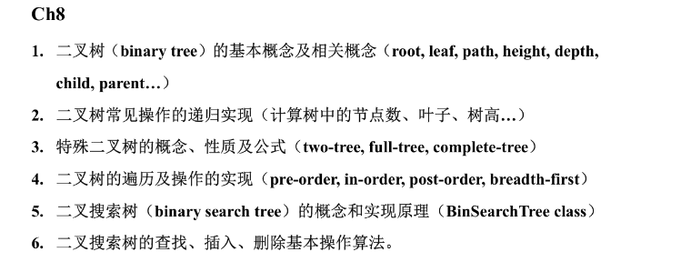

[二叉树视频](https://www.bilibili.com/video/BV1eQ3RzxEoS)

+ 树形结构是不同于顺序结构的数据结构，二叉树就是最基本的树形结构
+ 什么都没有（空）也是二叉树

# 二叉树
## 定义：
<font style="color:rgb(19, 19, 20);">二叉树 </font>_<font style="color:rgb(19, 19, 20);">t</font>_<font style="color:rgb(19, 19, 20);"> 要么为空，要么由一个项（</font>**<font style="color:rgb(19, 19, 20);">根 root</font>**<font style="color:rgb(19, 19, 20);">）和两棵不相交的二叉树（</font>**<font style="color:rgb(19, 19, 20);">左子树 left subtree</font>**<font style="color:rgb(19, 19, 20);"> 和 </font>**<font style="color:rgb(19, 19, 20);">右子树 right subtree</font>**<font style="color:rgb(19, 19, 20);">）组成</font>

## 叶子数的计算：
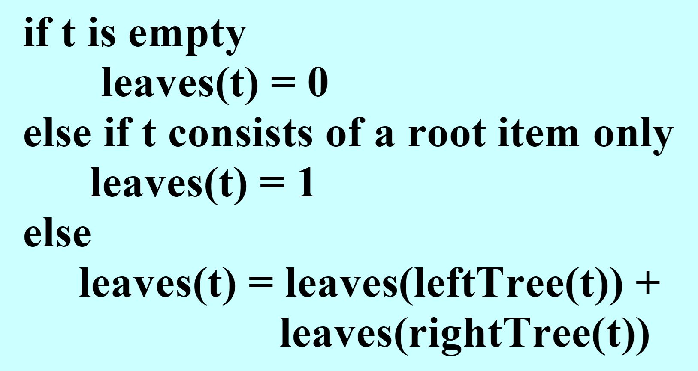

+ 性质：叶节点数 = 双分支节点数 + 1

## 元素数计算/项数 n(t)：
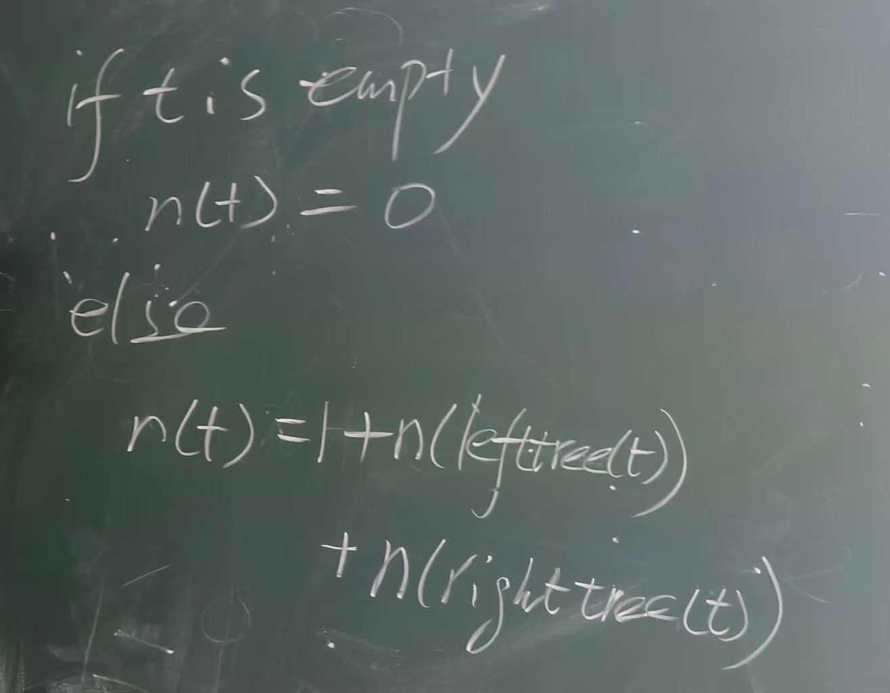

+ 性质：项数 = 边数 + 1

## 路径path：
在二叉树中，path是指一系列节点的序列，除最后一个外，其中每一个节点都是下一个节点的父节点

## 高度height(t)：
在二叉树中，height(n)是指从根到最远的叶节点之间枝干的数量；空二叉树高度为-1，只有一个节点的二叉树高度为0

### height(t) 递归求法：
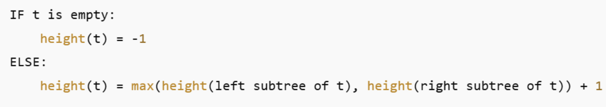

## 深度depth(t)/层数level(t)：
在二叉树中，节点x的depth(t)是指从根节点到节点x的枝干数量，只有一个节点的二叉树深度为0

### depth(t)递归求法：
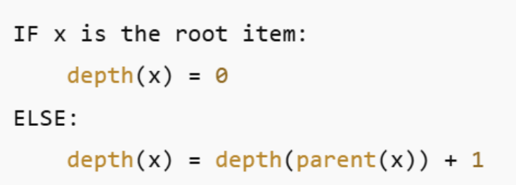

## two-tree 二树：
二叉树要么为空，要么所有非叶节点都有两个子节点

## full-tree 满树：
二叉树是two-tree且所有叶节点（最远子节点）的深度都相同（都在同一层上）

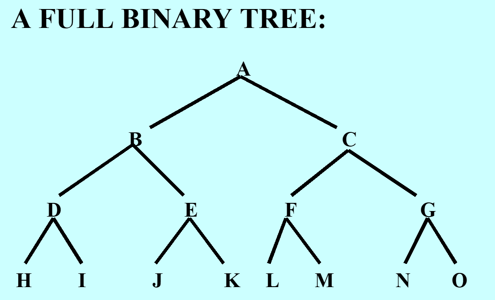

满二叉树的高度和树的项数成对数关系

+ 性质：高度为 h 的满树有 $ 2^{h+1} - 1 $个节点

## complete-tree 完全二叉树
（完全二叉树）：二叉树除最后一层外，其他层都是满的二叉树；在最后一层，叶节点应尽量靠左

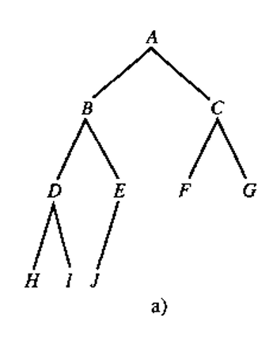

+ 性质：具有 n 个节点的完全二叉树的高度 等同于 具有 n 个节点的二叉树的最小高度

## 完全二叉树的索引——父节点与子节点之间的关系：
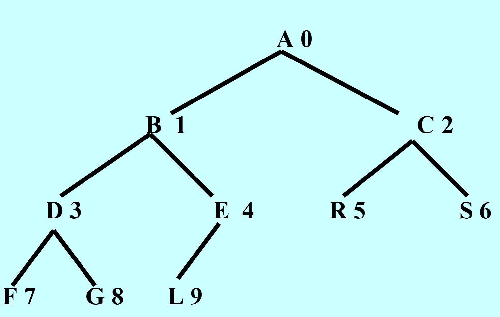

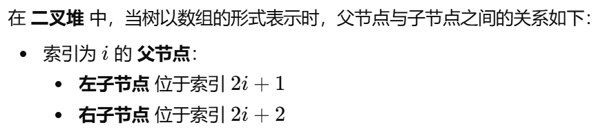

$ 父节点索引 = \frac{(子节点索引j - 1)}{2} $【下取整】

+ 性质：最后一个分支节点的编号【并非索引】为$ \frac{项数 n - 1}{2} $，后面的都是叶节点

> 例题：
>
> 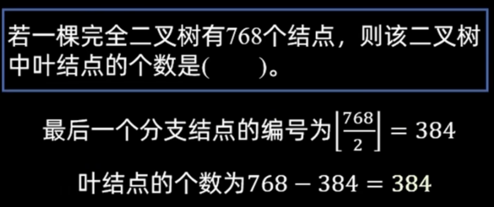
>

因此：所有数组都是二叉树

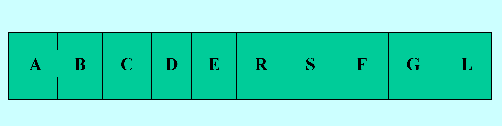

## 叶子数 leaves(t) 和项数 n(t) 的关系：
+ $ leaves(t) \leq \frac{n(t) + 1}{2.0} $
+ $ leaves(t) = \frac{n(t) + 1}{2.0} \iff t为二树 $

## 项数 n(t) 和高度 height(t)的关系：
+ $ \frac{n(t) + 1}{2.0} \leq 2^{height} $
+ $ \frac{n(t) + 1}{2.0} = 2^{height} \iff t为满树 $

## 二叉树定理
+ $ leaves(t) \leq \frac{n(t) + 1}{2.0} \leq 2^{height} $

## average height 平均高度
值为二叉树的节点数取对数，即$ \log{n} $

+ 因此：在二叉树中插入、删除、搜索的平均时间也是$ \log{n} $
+ **<font style="color:#DF2A3F;background-color:#FBDE28;">但若二叉树对象是链式结构，插入、删除、搜索平均时间则为</font>**$ n $

## external path length 外部路径长度
值为所有叶节点的深度depth()之和

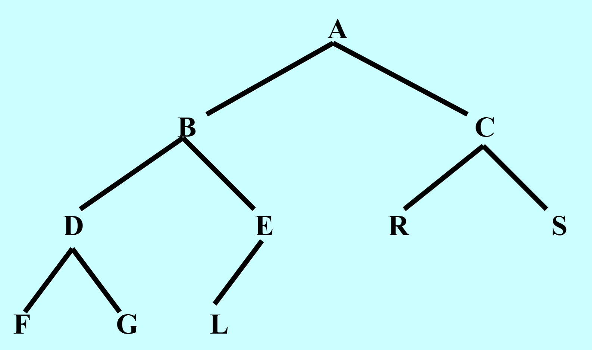


### 外部路径长度定理：
设二叉树t有k个叶节点：

$ E(t) \geq \frac{k}{2} \ floor(\log_2{k}) $

# 二叉树的遍历
[最牛逼前中后序遍历解法](https://www.bilibili.com/video/BV1Ub4y147Zv)

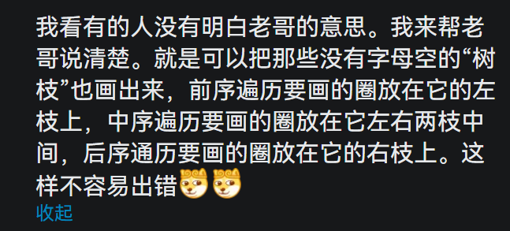

分为深度优先【不断向前走，不对再往回退】（栈） & 广度优先【尽量把周边的先访问完】（队列）

## 中序遍历（inorder）：左-根-右
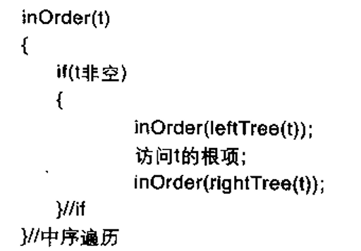

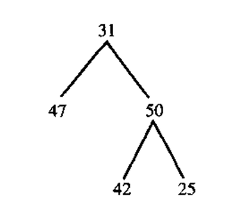

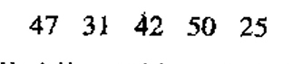

## 后序遍历（postorder）：左-右-根
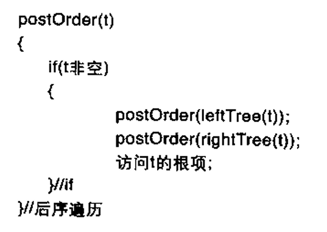

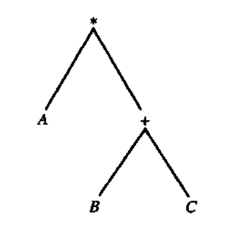

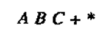

## 前序遍历（preorder）/深度优先：根-左-右
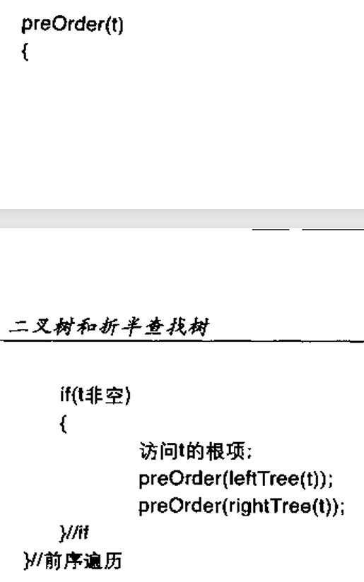

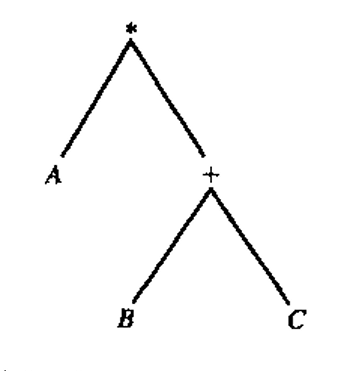

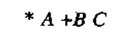

## 前后中序遍历代码实现：
```cpp
struct BinaryNode {
    int element;
    BinaryNode *left, *right;
};

// 1. 前序遍历 (Pre-order): Root -> Left -> Right
void preOrder(BinaryNode* t) {
    if (t != nullptr) {
        cout << t->element << " "; // 访问根
        preOrder(t->left);         // 递归左
        preOrder(t->right);        // 递归右
    }
}

// 2. 中序遍历 (In-order): Left -> Root -> Right
void inOrder(BinaryNode* t) {
    if (t != nullptr) {
        inOrder(t->left);          // 递归左
        cout << t->element << " "; // 访问根
        inOrder(t->right);         // 递归右
    }
}

// 3. 后序遍历 (Post-order): Left -> Right -> Root
void postOrder(BinaryNode* t) {
    if (t != nullptr) {
        postOrder(t->left);        // 递归左
        postOrder(t->right);       // 递归右
        cout << t->element << " "; // 访问根
    }
}
```

## 广度优先（breadthFirst）遍历：逐层
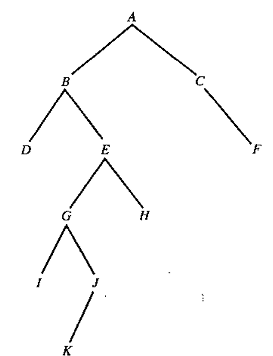

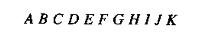

+ **<u><font style="color:#DF2A3F;background-color:#FBDE28;">使用队列实现宽度（广度）优先遍历：</font></u>**

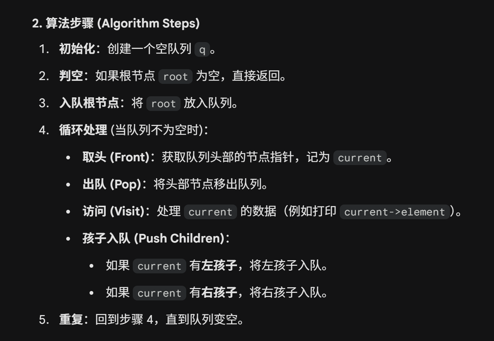

```cpp
#include <iostream>
#include <queue> // 必须引入 queue 头文件

using namespace std;

struct BinaryNode {
    int element;
    BinaryNode* left;
    BinaryNode* right;

    BinaryNode(int val) : element(val), left(nullptr), right(nullptr) {}
};

// 广度优先遍历函数
void breadthFirst(BinaryNode* root) {
    // 1. 边界条件检查 (非常重要，考试漏写扣分)
    if (root == nullptr) {
        return;
    }

    // 2. 创建队列，注意里面存的是节点指针 <BinaryNode*>
    queue<BinaryNode*> q;

    // 3. 根节点入队
    q.push(root);

    // 4. 循环直到队列为空
    while (!q.empty()) {
        // Step A: 获取队头元素
        BinaryNode* current = q.front();

        // Step B: 弹出队头
        q.pop();

        // Step C: 访问/处理该节点
        cout << current->element << " ";

        // Step D: 将左右孩子入队 (如果存在的话)
        // 注意：顺序必须是 先左 后 右
        if (current->left != nullptr) {
            q.push(current->left);
        }
        if (current->right != nullptr) {
            q.push(current->right);
        }
    }
}
```

# 二叉树的构造：
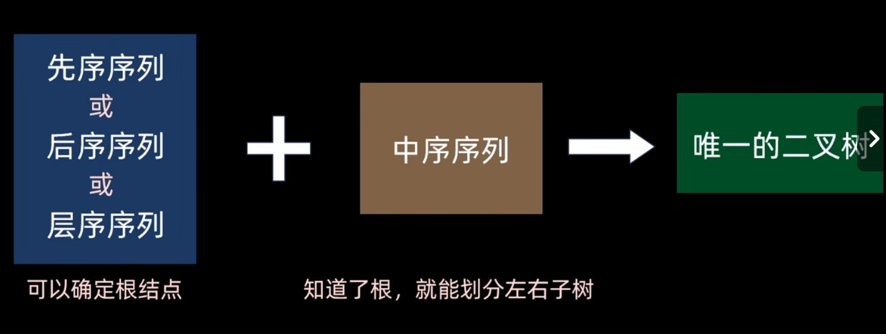

[构造教程视频](https://www.bilibili.com/video/BV1RtezzTEz9)

# 二叉树的存储
## 用连续容器存储（vector）
+ 完全二叉树——>直接用索引在数组中存，使用规律寻找父母子女

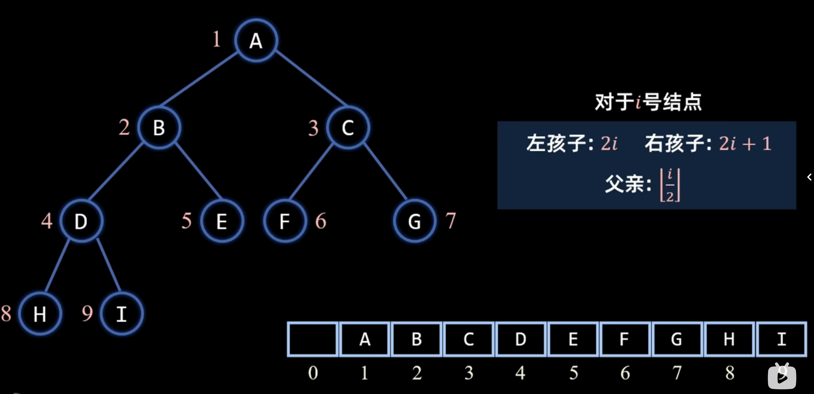

+ 一般二叉树——>补充空节点变成完全二叉树——>用索引在数组中存

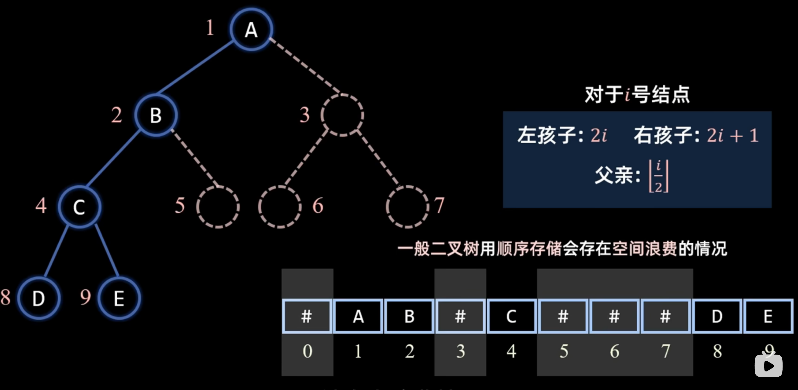

+ 特点：适合存完全二叉树，越远离完全二叉树，越浪费空间（指数级浪费）

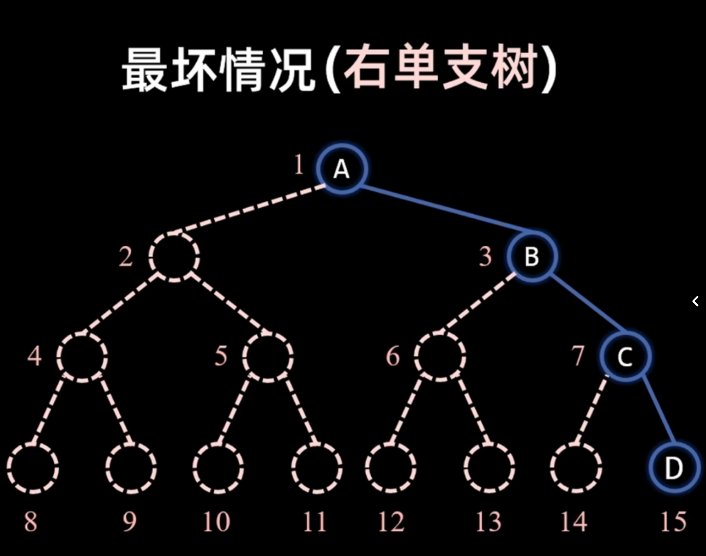

## 用链式容器存（list）
【具体见下】

# binary search tree 二叉搜索树
二叉搜索树是一种元素特殊（能够比较）的二叉树

每个节点的左子树的节点值都小于等于该节点值，右子树的节点值都大于等于该节点值

二叉搜索树不同于顺序容器，是关联容器

+ **<font style="color:#DF2A3F;background-color:#FBDE28;">优势：二叉搜索树的 find,insert,erase 方法 worstTime(n)为 O(n)，averageTime(n)为 O（logn）</font>**
+ **<font style="color:#DF2A3F;background-color:#FBDE28;">当二叉搜索树为一条链表时，查找插入删除时间会退化为 O(n),此时即为 worstTime(n)</font>**

## 递归定义：
+ leftTree(t)的每一项都小于等于 t 的根项
+ rightTree(t)的每一项都大于等于 t 的根项
+ leftTree(t)和 rightTree(t)都是二叉搜索树

## 方法：
```cpp

//1.构造函数：
BinSearchTree<int> bt;

//2.获长（项的数量）函数：
bt.size();

//3.查找函数：
bt.find(1);		//找到返回该项迭代器，找不到返回end()迭代器
                //从根部下降，通过比较来折半查找，大了往右找，小了往左找
                //averageTime(n)为O(logn),worstTime(n)为O(n)

//4.插项函数：
bt.insert(2);	//将项插入二叉树中，返回新插入项的迭代器
                //averageTime(n)为O(logn),worstTime(n)为O(n)

//5.删项函数：
bt.erase(itr);	//删除itr位置上的项
                //worstTime(n)为O(n),amoritizedTime(n)为常数,averageTime(n)为常数

bt.erase(bt.find(2));	//删除任一项

//6.头尾迭代器
bt.begin();
bt.end();

//7.迭代器类：

//由于迭代器是双向的，所以和list类的迭代器是相同的
```

## 二叉搜索树删除算法的实现：
        * 先找到要删除的元素
            + 如果为叶节点，直接删除
            + 如果为单分支节点，让子树代替其位置即可
            + 如果为双分支节点，找左子树中最大的（中序遍历中的直接前驱），或右子树中最小的（中序遍历中的直接后继），代替其即可，再删除去代替的前驱/后继，即又转换为前两种情况


## <font style="color:#DF2A3F;background-color:#FBDE28;">实现：</font>
[二叉搜索树的存储结构与节点设计.pdf](assets/243213700/二叉搜索树存储结构与节点设计.pdf)

> 相似于 List 实现
>

```cpp
struct tree_node{
    T item;
    tree_node* parent, *left, *right;		//子节点为空时，right/left指向的是NULL
    bool isHeader;
};

tree_node* header;

unsigned node_count;
```

+ header 的节点结构中：
        * `item`始终未使用
        * 空树时，`parent`指向 `NULL`；非空指向根节点
        * 空树时，`left`和`right`指回 header；非空时，`left`指向最小的项，`right`指向最大的项
        * `isHeader`为 True

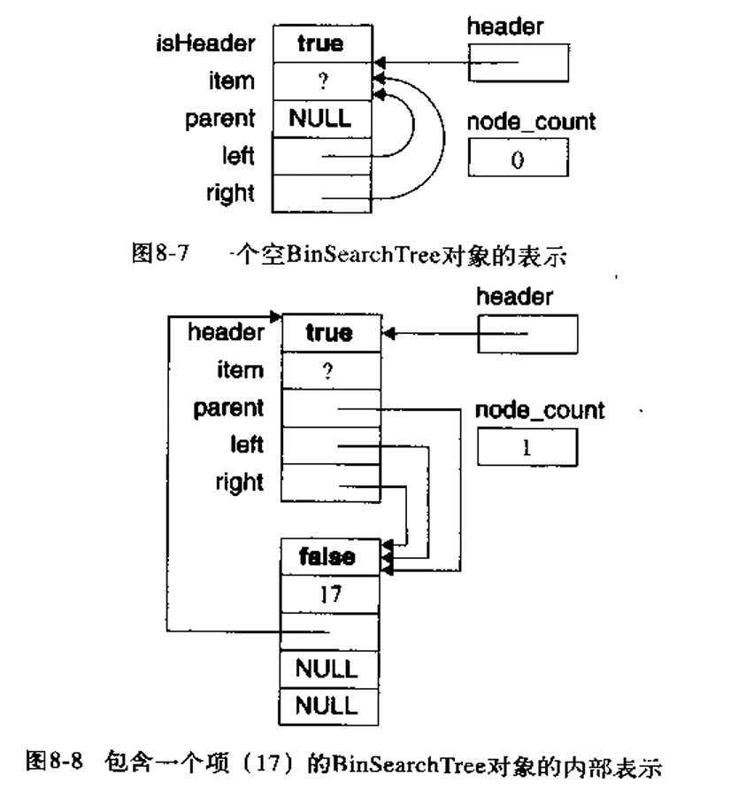

+ <font style="color:#DF2A3F;background-color:#FBDE28;">项数为 n 的二叉链表中一定有 n+1 个空指针</font>

# 自增运算操作：


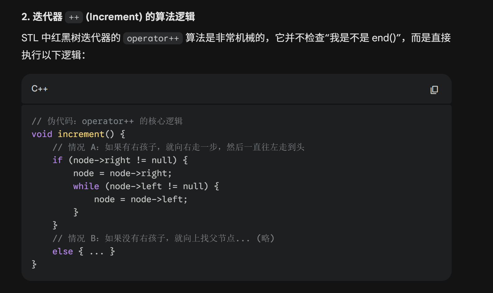

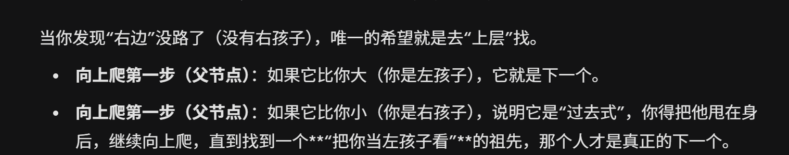

# 课堂练习：
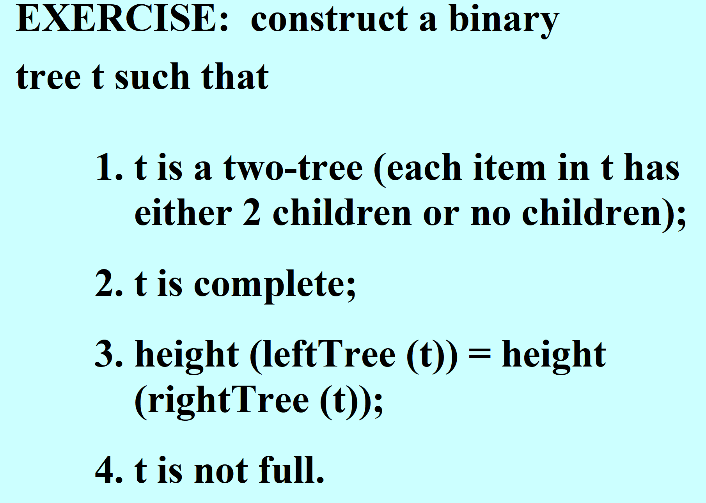

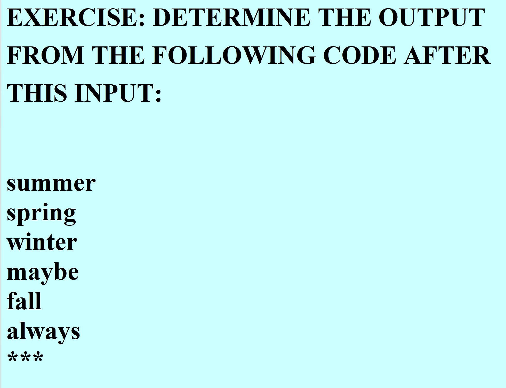

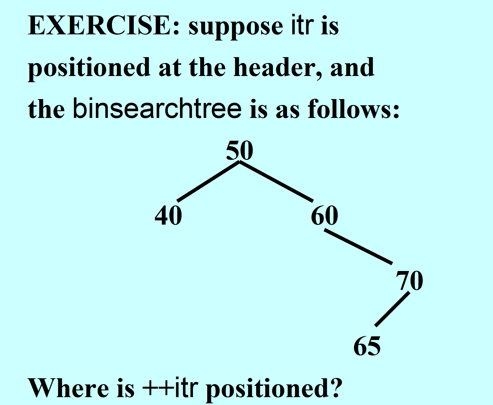

<!-- learning-journey:update-history:start -->
## 更新记录

| 日期 | 类型 | 说明 |
| --- | --- | --- |
| 2026-07-28 | 首次发布 | 从语雀整理并发布到学习记录仓库 |
<!-- learning-journey:update-history:end -->
