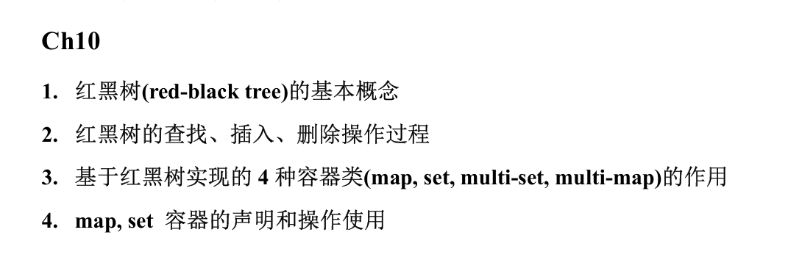

> 红黑树是 set、map 等关联容器的基础
>

# 定义：
红黑树是：**根是黑色**的，满足**红色规则**和**路径规则**的二叉搜索树

+ **红色规则**：红色元素不能连在一起
+ **路径规则**：从根到没有孩子或只有一个孩子的任何元素的路径上**（补上 NULL 节点，则是根到全部叶节点）**，黑节点的数量应当相同

> 红黑树的 NULL 节点为黑色
>
> 红黑树的 header node 头节点是红色
>

# 性质：
+ 最长路径不超过最短路径的两倍，即任意节点的左右子树高度相差不超过两倍

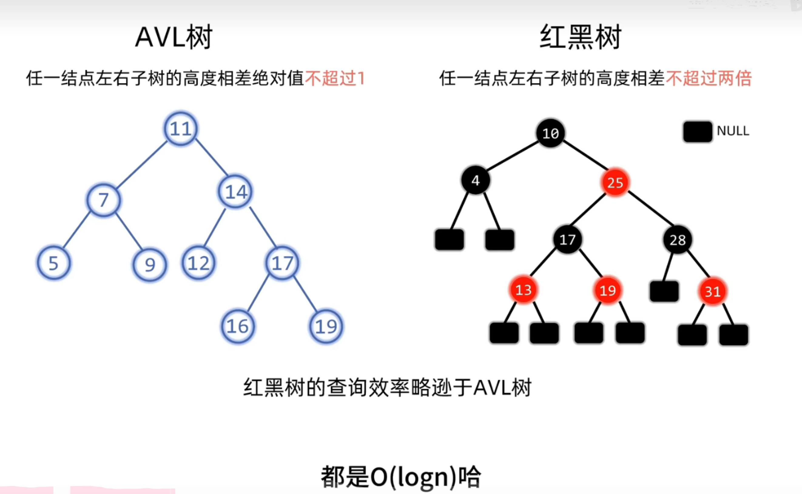

平衡树对于平衡的要求高于红黑树

**因此平衡树查询效率高**，但都是 O(logn)

而红黑树插入删除的旋转调整次数少于平衡树，**因此红黑树插入删除效率高，**故而被作为 set，map 等的底层容器

+ 如果一个元素只有一个孩子，这个项必定是黑色的，孩子一定是红色的

## 黑色高度 bh(y):
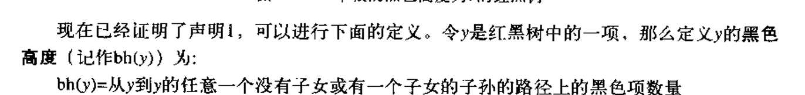

## 项数和黑色高度的关系：
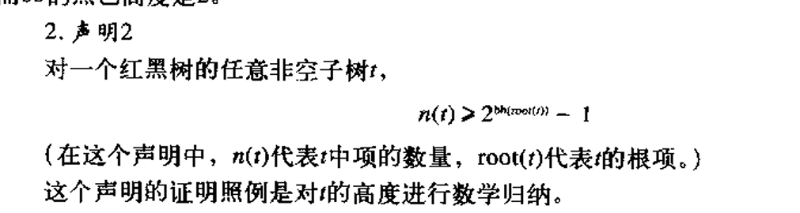

> 出题：
>
> 1. 给定红黑树元素，求最小高度、最大高度
> + 最小高度：全黑节点（只有最下面一层为红）：$ \approx \log_2 n $
>
> 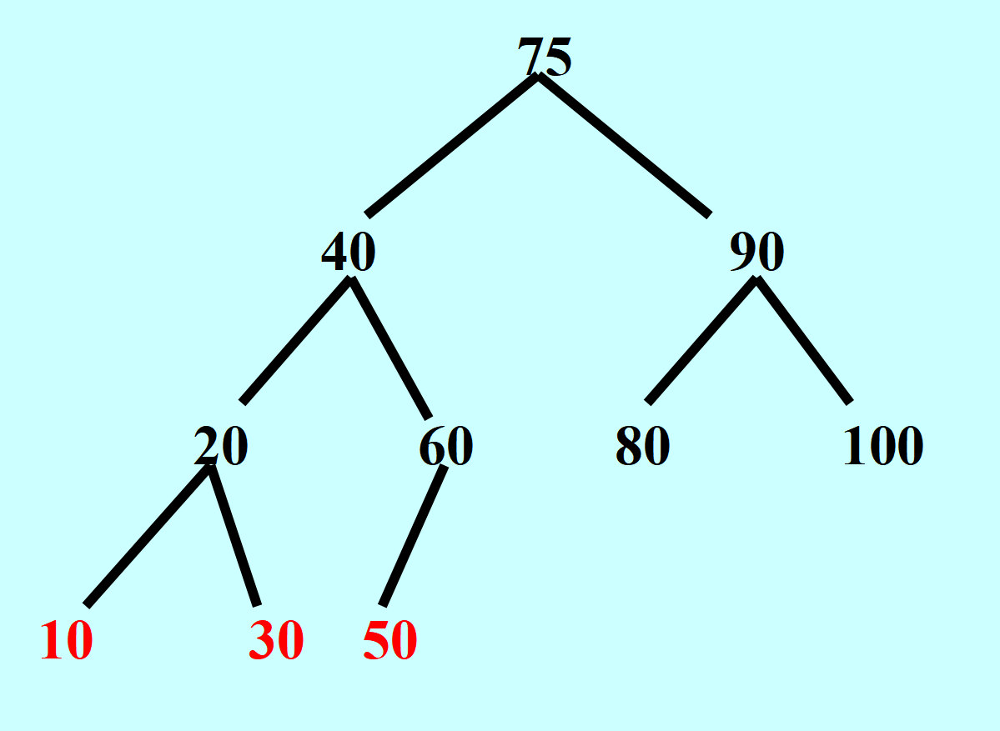
>
> + 最大高度：黑红相间： $ \approx 2 \log_2 n $
>
> 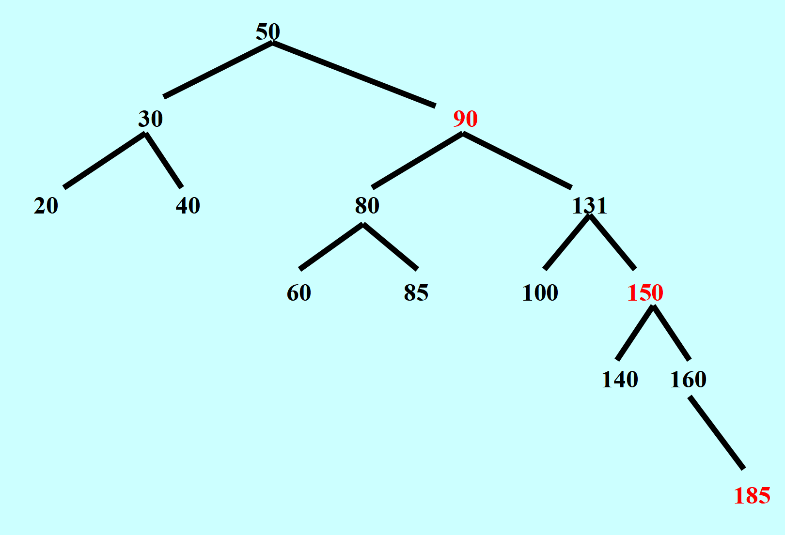
>

# 红黑树的插入：
+ 默认插入的节点为红色，如果没有违反规则，不需要调整；若违反红色或路径规则，则需要进行旋转或变色调整

## 三种违反规则时的情况及对策：
### 插入的节点是根节点
+ 对策：直接变黑即可

### 插入节点的叔叔节点是红色
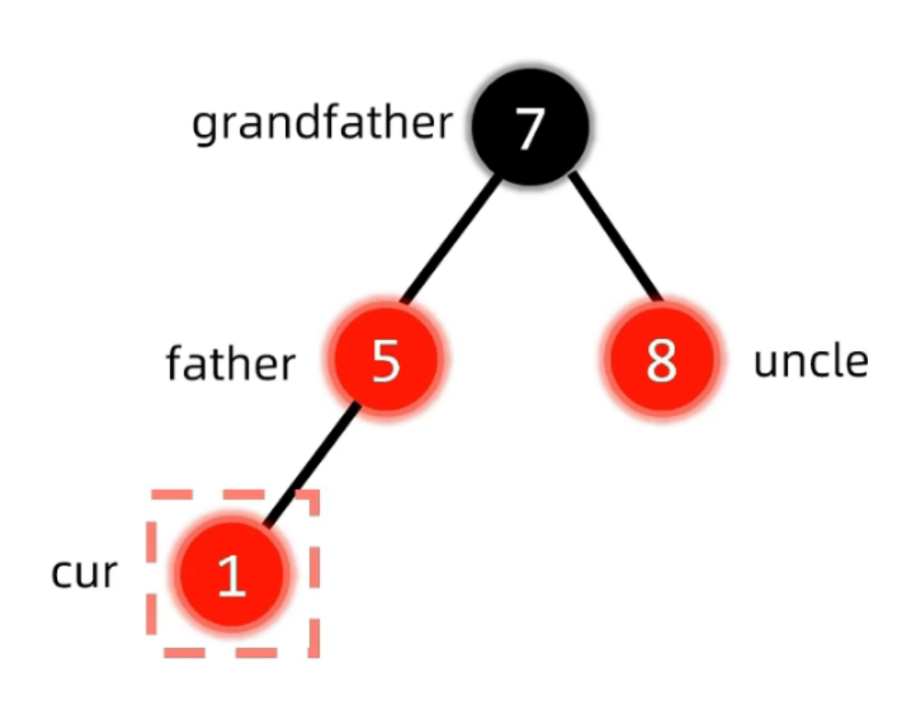  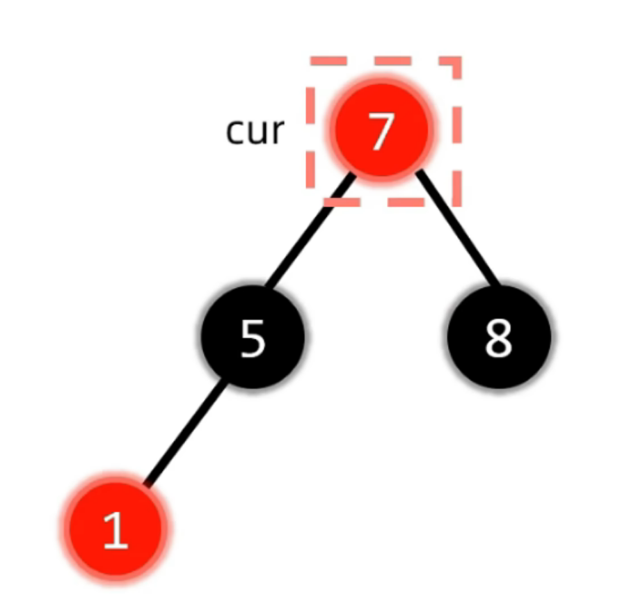  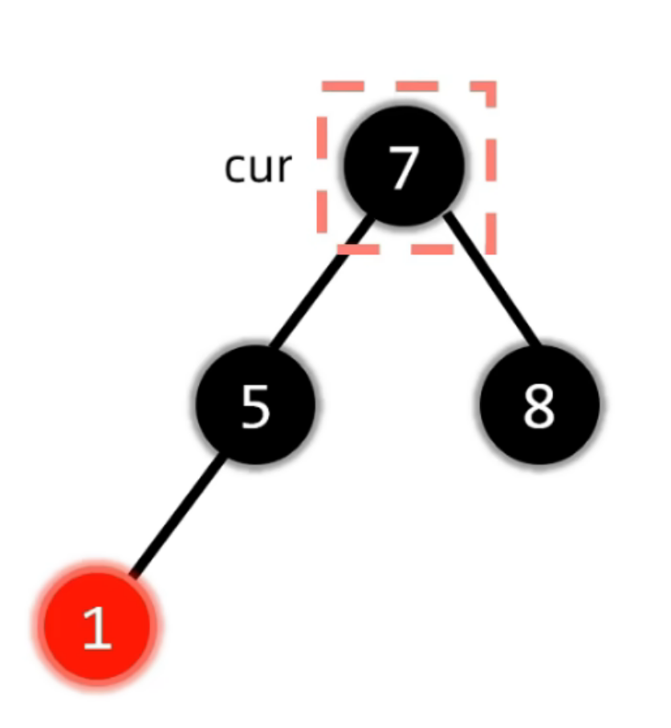

+ 对策：叔父爷变色，让爷爷变成插入节点，继续循环判断三种情况

### 插入节点的叔叔节点是黑色
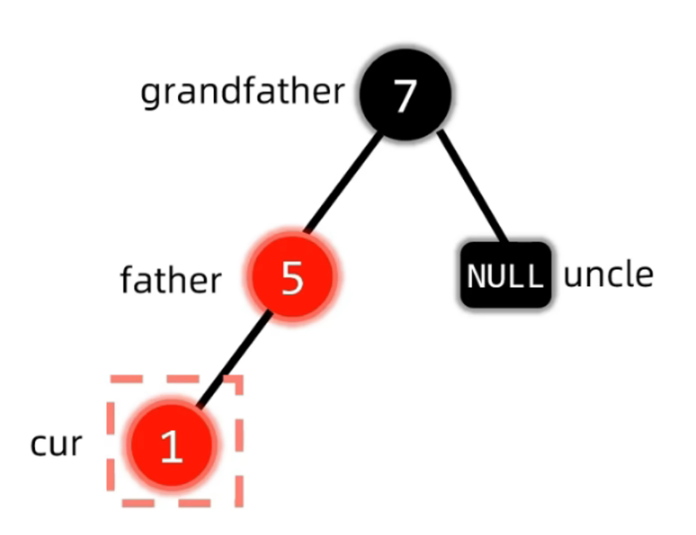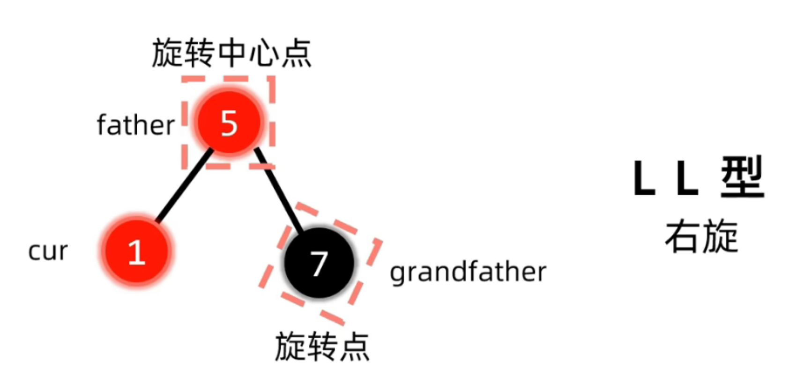

+ 对策：观察 cur父爷（爷爷到 cur 是左左？左右？），判断并以爷爷为旋转点进行（LL、RR、LR、RL）旋转，然后旋转点和旋转中心点变色

# 红黑树的删除
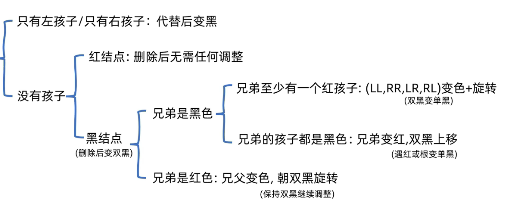

左右孩子都有，直接前驱或后继替代，转化为前两种情况

## 兄弟至少有一个红孩子的情况：
根据 p，s，r（p 到 r 是左左？左右？）去判断旋转

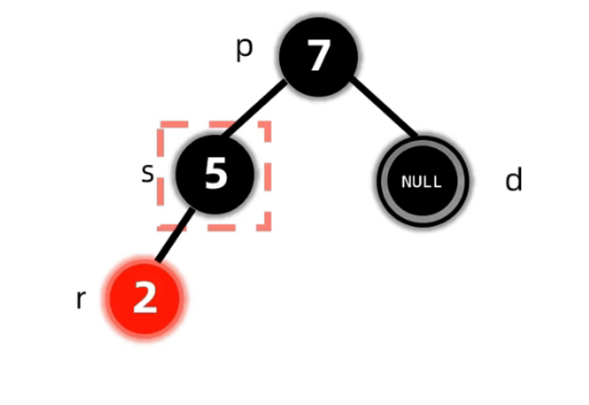

d：deletion

s：sibling

r：red

p：parent

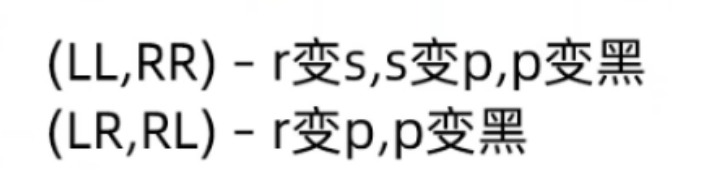

+ 如果有两个红色 r，看作 LL 或 RR 处理即可

## 兄弟的孩子都是黑色的情况：
双黑上移：遇黑变双黑，遇红变单黑，遇根节点变单黑

## 兄弟是红色的情况：
父节点向双黑侧旋转，保持双黑继续判断调整

# 红黑树方法：
```cpp
//1.插入项函数
rbt1.insert(1);

//2.删除项函数
rbt1.erase(itr);


```

# 四种关联容器
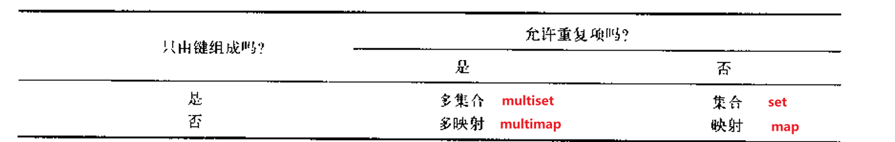

# `map`、`set`的声明 & 操作使用
```cpp
//map：

//声明，默认升序
map<string, int> population;
// 声明一个按 Key 降序排列的 map
map<string, int, greater<string> > myMap;

//插入元素：
population.insert (pair<string, int>("Easton", 35000));
population.insert (pair<string, int> ("Bethlehem", 47000));
population.insert (pair<string, int> ("Allentown", 61000));

//遍历元素：
map<string, int>::iterator itr;
for (itr = population.begin(); itr != population.end(); itr++)
    cout << itr -> first << " " << itr -> second << endl;

//修改元素：
population ["Easton"] = 44000;
population ["Coopersburg"] = 7000;

//查找元素：
map<string, int>::iterator it = population.find("Easton");
if (it != population.end()) {
    // 访问 Key: it->first
    // 访问 Value: it->second
    cout << "Population: " << it->second << endl;
}

//删除元素：
population.erase("Allentown"); // 按 Key 删除


//set:

// 声明：默认升序: 1, 2, 3...
set<int> mySet;
// 等同于显式写法: set<int, less<int>> mySet;
// 声明一个降序排列的 set (从大到小)
set<int, greater<int> > mySetDesc;

//插入元素：
mySet.insert(20);
mySet.insert(10);
// mySet 现在包含: 10, 20 (自动排序)

//遍历元素：
// 遍历输出
for (set<int>::iterator it = mySet.begin(); it != mySet.end(); ++it) {
    cout << *it << " ";
}

//修改元素：
//先删除再插入

//查找元素：
set<int>::iterator it = mySet.find(20);
if (it != mySet.end()) {
    // 找到了
}

//删除元素：
mySet.erase(10); // 删除值为10的元素
```

```cpp
set<long> ids;
long num;

cout << "Please enter a Social Security Number: ";
cin >> num;
while (num != -1)
{
    pair<set<long>::iterator, bool> p = ids.insert (num);
    if (p.second)
        cout << "Number inserted" << endl;
    else
        cout << "Error: duplicate number; not inserted" << endl;
    cout << "Please enter a Social Security Number: ";
    cin >> num;
} // while

```

# 课堂练习：
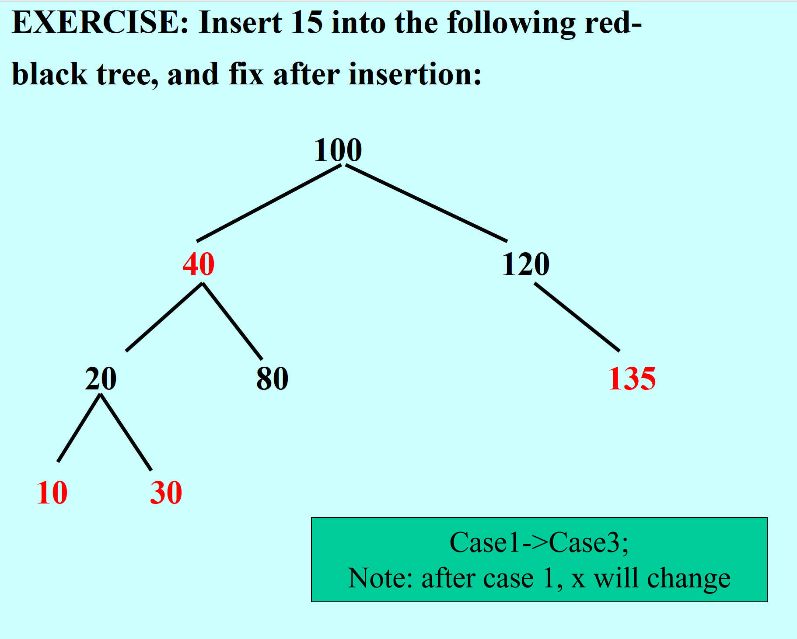

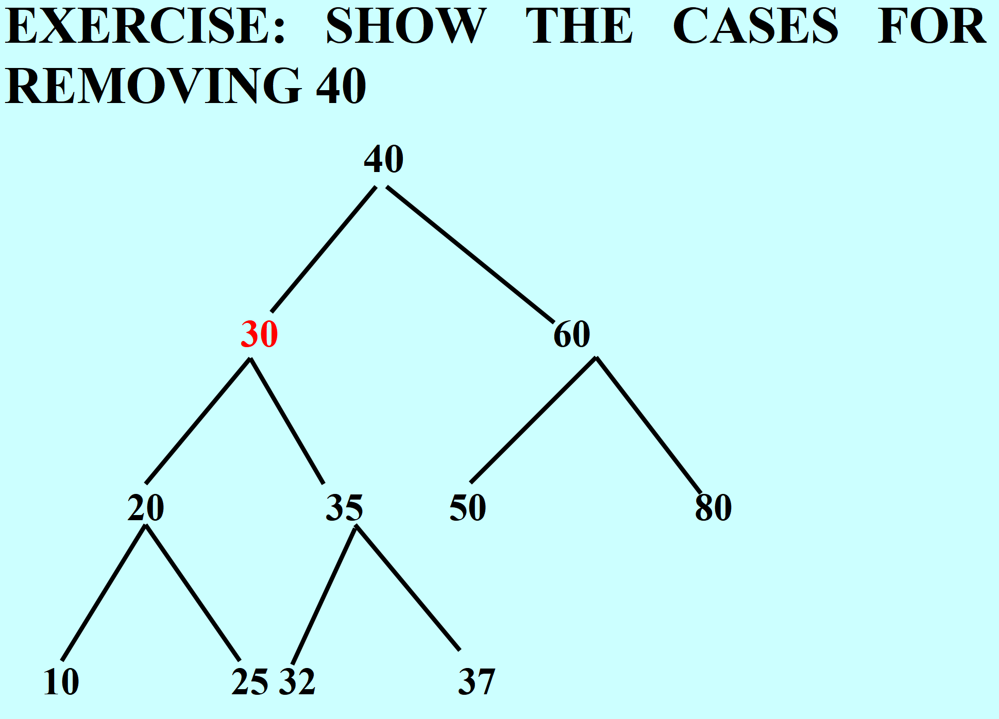

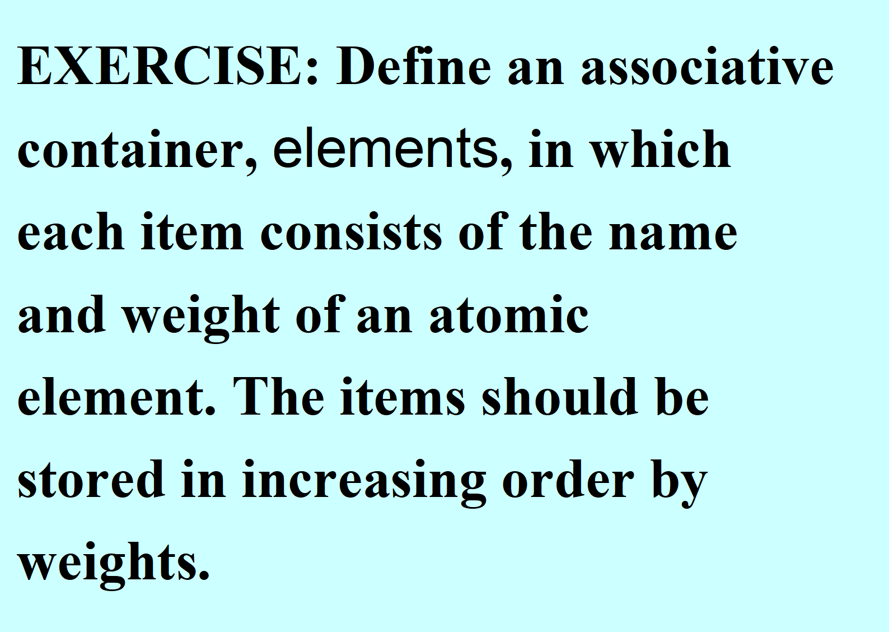

<!-- learning-journey:update-history:start -->
## 更新记录

| 日期 | 类型 | 说明 |
| --- | --- | --- |
| 2026-07-28 | 首次发布 | 从语雀整理并发布到学习记录仓库 |
<!-- learning-journey:update-history:end -->
