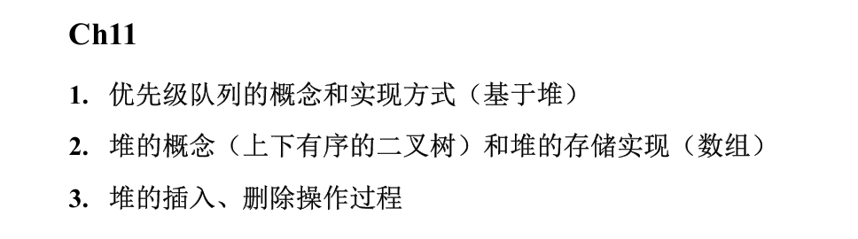
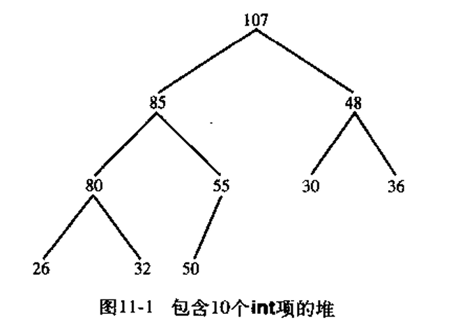
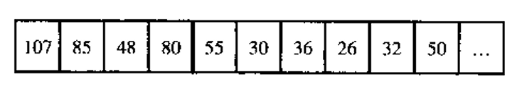
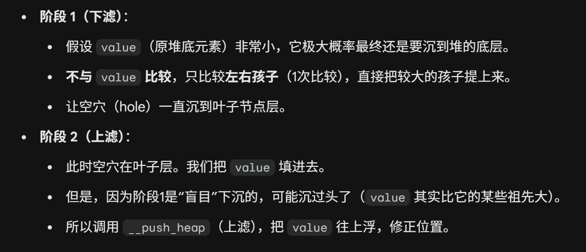
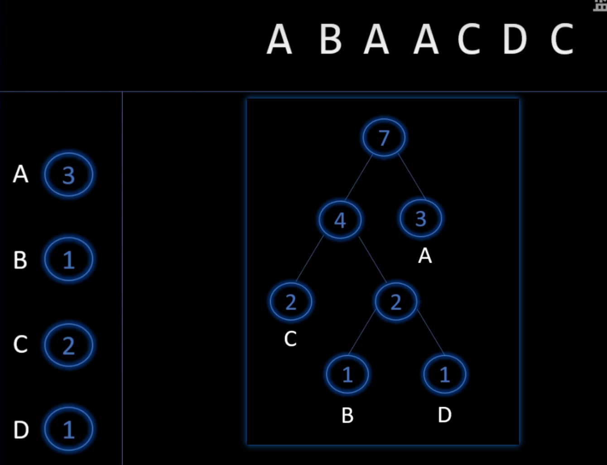
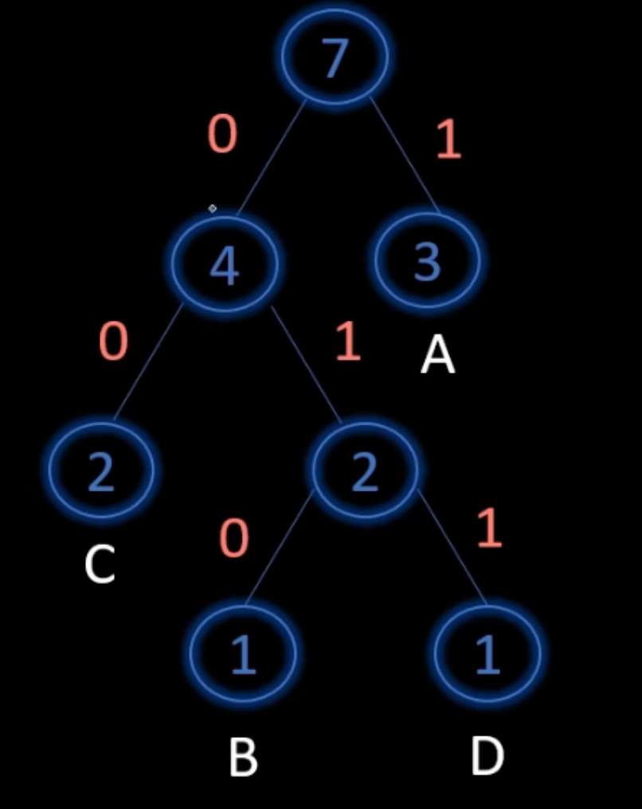
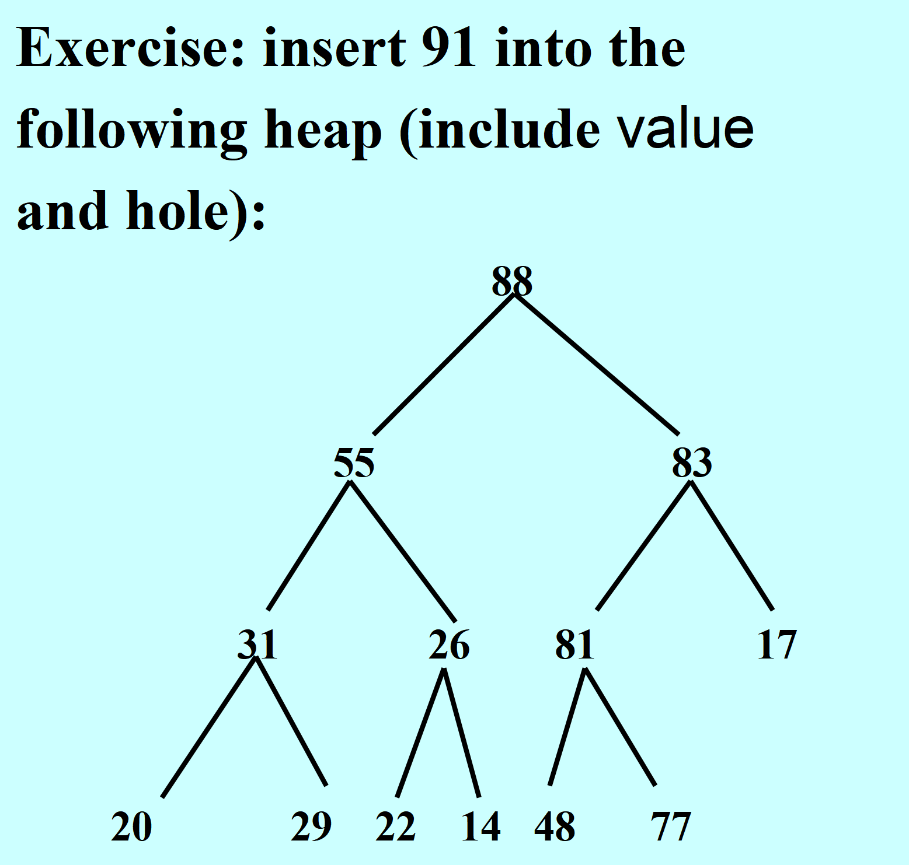
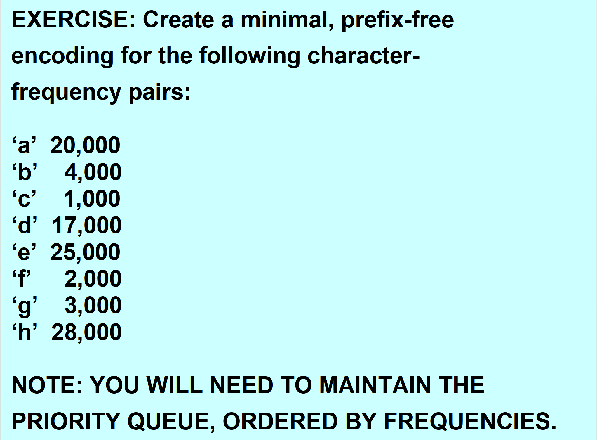
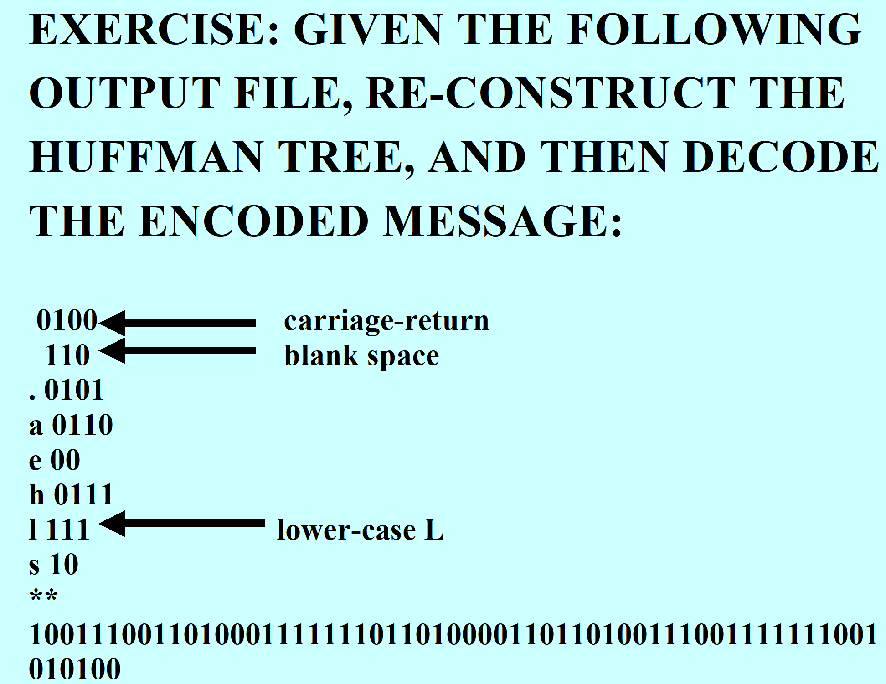

# heap 堆
## 定义：
堆首先是一个完全二叉树【逻辑存储结构】，要么为空，要么满足以下条件：

+ 树的根元素是最大的项
+ 左子树和右子树都是堆



+ 堆的数组表示【物理存储结构】：

> 根据：完全二叉树的子女索引与父索引可以相互计算，可以利用随机访问容器访问给定索引上的元素
>



+ **<u>任何支持随机访问的容器都可以充当一个堆：数组、向量、双端队列</u>**
+ 索引 i 的左右孩子：2i+1, 2i+2
+ 索引 j 的父亲：$ \frac{j-1}{2} $
+ 则堆的规则可表示为：`a[i] >= a[2i + 1] && a[i] >= a[2i + 2]`

## 堆的操作：
### 进堆`push_heap()`：
> 前提：在调用 `push_heap` 之前，**已经把新元素放到了容器的最后一位（采用**`**push_back**`**等方法）**
>

+ 思路（自底向上【上滤】）：
        * 字段`holeindex`空穴索引：初始化为`last - 1`（新元素所在位置）
        * 不断将要插入的元素与空穴父亲相比较，待插入元素更大则互换，循环比较，直到到达堆的顶部或者找到一个待插入元素 $ \leq $空穴父亲元素的位置，将待插入元素插入空穴所在位置
+ 代码实现：

```cpp
template<class RandomAccessIterator, class Distance, class T, class Compare>
inline void __push_heap(RandomAccessIterator first, Distance holeIndex, Distance topIndex, T value, Compare comp) {
    // 步骤 1：计算当前空穴的父节点下标
    Distance parentIndex = (holeIndex - 1) / 2;

    // 步骤 2：上滤循环 (Percolate Up)
    // 循环条件：空穴未到堆顶 且 违反堆序（如：父节点值 < 新值）
    while (holeIndex > topIndex && comp(*(first + parentIndex), value)) {

        // 步骤 3：父节点下移，填补当前空穴
        *(first + holeIndex) = *(first + parentIndex);

        // 步骤 4：空穴上浮，移动到父节点的位置
        holeIndex = parentIndex;

        // 步骤 5：更新父节点下标，为下一轮判断做准备
        parentIndex = (holeIndex - 1) / 2;
    }

    // 步骤 6：落位，将新元素填入最终找到的合适空穴中
    *(first + holeIndex) = value;
}

template<class RandomAccessIterator, class Compare>
inline void push_heap(RandomAccessIterator first, RandomAccessIterator last, Compare comp) {
    // [前提] value = 新插入元素; holeIndex = 初始空穴(末尾); topIndex = 0;
    auto value = *(last - 1);  // 取出容器最末尾的元素作为“新插入元素”
    auto holeIndex = last - first - 1;
    auto topIndex = decltype(holeIndex){0};

    __push_heap(first, holeIndex, topIndex, value, comp);
}
```

+ 时间复杂度分析：

算法本身 worstTime(n) 为 O(logn);	averageTime(n) 为常数级别

若底层容器为需要重新分配内存的 vector，worstTime(n)即为 O(n)

### 出堆`pop_heap()`：
+ 思路（自顶向下【下滤】）：
        * 将 last-1 位置上的元素（最后一个元素）存到`value`里，顶部的元素则存储到 last-1 的位置上，顶部变为空穴
        * 不断将`value`与子女元素进行比较，若`value`小于任一子女，则替换空穴与子女，然后循环，直到空穴到树叶，或 $ \geq $全部子女，将`value`插到空穴位置
        * 实际是在辅助函数`__adjust_heap()`中完成的，如下
+ 代码实现：

```cpp
template<class RandomAccessIterator, class Compare>
inline void pop_heap(RandomAccessIterator first, RandomAccessIterator last, Compare comp) {
    // 1. 暂存新插入到末尾的那个值（原本在堆顶的值 result，以及原本在末尾的值 value）
    // 注意：pop_heap 操作后，最大值会被放到容器的最后一位 (last - 1)

    // 取出堆尾的值 (这个值通常比较小，原本在底层)
    auto value = *(last - 1);

    // 2. 将堆顶元素 (最大值) 移动到容器末尾
    *(last - 1) = *first;

    // 3. 此时，堆顶 (first) 变成了一个“空穴” (holeIndex = 0)
    //    我们需要调整剩余的堆 (大小减 1)
    //    我们将 'value' 传进去，试图找个地方把它安顿好
    __adjust_heap(first, 0, (last - first) - 1, value, comp);
}
```

+ 时间复杂度分析：下移对数，push_heap 调用常数到对数（不需要扩充容量）
+ 故 worstTime(n)与 averageTime(n)都为 O(logn)

### 调节堆（helper 函数）`__adjust_heap()`：
+ 思路：




+ 代码实现：

```cpp
template<class RandomAccessIterator, class Distance, class T, class Compare>
void __adjust_heap(RandomAccessIterator first, Distance holeIndex, Distance len, T value, Compare comp) {

    // 阶段 1：下滤 (Percolate Down)
    // 将空穴一直往下推，直到叶子节点。
    // 这一步不进行比较判断（不检查 value 是否比子节点大），直接把较大的孩子提上来。

    Distance topIndex = holeIndex; // 记录最初的空穴位置
    Distance secondChild = 2 * holeIndex + 2; // 右孩子下标

    while (secondChild < len) {
        // 比较左右孩子，找出较大的那个
        // 如果 comp(右, 左) 为真，说明 左 > 右 (大顶堆逻辑)，或者根据 comp 规则选大的
        // 这里假设 comp 是 less (大顶堆)，如果 *(first + secondChild) < *(first + (secondChild - 1))
        // 则 secondChild 减 1 变为左孩子
        if (comp(*(first + secondChild), *(first + (secondChild - 1)))) {
            secondChild--;
        }

        // 将较大的孩子上移，填补空穴
        *(first + holeIndex) = *(first + secondChild);

        // 空穴下移
        holeIndex = secondChild;
        secondChild = 2 * (secondChild + 1); // 计算新的右孩子
    }

    // 处理特殊情况：如果没有右孩子，只有左孩子 (偶数长度时)
    if (secondChild == len) {
        *(first + holeIndex) = *(first + (secondChild - 1));
        holeIndex = secondChild - 1;
    }

    // 阶段 2：上滤 (Push Heap) - 对应 PPT Slide 54
    // 此时 holeIndex 位于叶子节点层。
    // 我们把之前暂存的 'value' 填入这个空穴，但 'value' 可能比它的父节点大。
    // 所以调用 push_heap 的逻辑（上滤），把 value 调整到正确位置。

    // 注意：这里调用的是内部的 __push_heap，逻辑同你之前复习的 push_heap
    __push_heap(first, holeIndex, topIndex, value, comp);
}
```

### 创建堆`make_heap()`：
+ 作用： 将一个无序数组转换为堆
+ 代码实现：

```cpp
template<class RandomAccessIterator, class Compare>
void make_heap(RandomAccessIterator first, RandomAccessIterator last, Compare comp) {
    if (last - first < 2) return; // 0或1个元素不用建堆

    auto len = last - first;

    // 1. 找到最后一个非叶子节点
    // 最后一个元素的下标是 len - 1，其父节点为 (len - 2) / 2
    auto parent = (len - 2) / 2;

    while (true) {
        // 2. 对每个非叶子节点，执行下滤操作
        // 这会确保以 parent 为根的子树满足堆序

        // 提取当前父节点的值
        auto value = *(first + parent);

        // 调用 adjust_heap 对该子树进行调整
        __adjust_heap(first, parent, len, value, comp);

        if (parent == 0) return; // 处理完根节点后结束
        parent--; // 向前移动到下一个非叶子节点
    }
}
```

+ 时间复杂度分析：worstTime(n)和 averageTime(n)都为 n

# 堆的插入与删除操作梳理
## <font style="color:rgb(48, 48, 48);">插入操作（</font><font style="color:rgb(40, 42, 44);">push_heap</font><font style="color:rgb(48, 48, 48);">）：</font>
<font style="color:rgb(48, 48, 48);">1. </font>**<font style="color:rgb(48, 48, 48);">初始放置</font>**<font style="color:rgb(48, 48, 48);">：将新项放在数组末尾（即完全二叉树的最后一个叶子位置），该位置称为“空穴”（Hole）</font><font style="color:rgb(48, 48, 48);">。</font>

<font style="color:rgb(48, 48, 48);">2. </font>**<font style="color:rgb(48, 48, 48);">向上过滤（Up-heap）</font>**<font style="color:rgb(48, 48, 48);">：将新项的值与其父节点进行比较。</font>

<font style="color:rgb(48, 48, 48);">3. </font>**<font style="color:rgb(48, 48, 48);">循环调整</font>**<font style="color:rgb(48, 48, 48);">：只要新项的值</font>**<font style="color:rgb(48, 48, 48);">大于</font>**<font style="color:rgb(48, 48, 48);">父节点且未到达根部，就将父节点移入空穴，并将空穴向上移动到父节点的位置</font><font style="color:rgb(48, 48, 48);">。</font>

<font style="color:rgb(48, 48, 48);">4. </font>**<font style="color:rgb(48, 48, 48);">安置</font>**<font style="color:rgb(48, 48, 48);">：当新项不再大于其父节点时，将新项存入当前的空穴中</font><font style="color:rgb(48, 48, 48);">。</font>

<font style="color:rgb(48, 48, 48);">5. </font>**<font style="color:rgb(48, 48, 48);">复杂度</font>**<font style="color:rgb(48, 48, 48);">：最坏时间复杂度为 </font>_<font style="color:rgb(48, 48, 48);">O</font>_<font style="color:rgb(48, 48, 48);">(</font><font style="color:rgb(48, 48, 48);">lo</font><font style="color:rgb(48, 48, 48);">g</font>_<font style="color:rgb(48, 48, 48);">n</font>_<font style="color:rgb(48, 48, 48);">)</font><font style="color:rgb(48, 48, 48);">，平均时间为常数级</font><font style="color:rgb(48, 48, 48);">。</font>

## <font style="color:rgb(48, 48, 48);">删除操作（</font><font style="color:rgb(40, 42, 44);">pop_heap</font><font style="color:rgb(48, 48, 48);">）：</font>
<font style="color:rgb(48, 48, 48);">1. </font>**<font style="color:rgb(48, 48, 48);">准备</font>**<font style="color:rgb(48, 48, 48);">：优先级最高（值最大）的项位于根部。首先将最末尾的项存入变量 </font>`<font style="color:rgb(40, 42, 44);">value</font>`<font style="color:rgb(48, 48, 48);"> 中，并腾出根部位置作为“空穴”</font><font style="color:rgb(48, 48, 48);">。</font>

<font style="color:rgb(48, 48, 48);">2. </font>**<font style="color:rgb(48, 48, 48);">向下过滤（Down-heap）</font>**<font style="color:rgb(48, 48, 48);">：</font>

<font style="color:rgb(48, 48, 48);">    ◦ </font><font style="color:rgb(48, 48, 48);">比较空穴的两个孩子，将</font>**<font style="color:rgb(48, 48, 48);">较大</font>**<font style="color:rgb(48, 48, 48);">的孩子移入空穴</font><font style="color:rgb(48, 48, 48);">。</font>

<font style="color:rgb(48, 48, 48);">    ◦ </font><font style="color:rgb(48, 48, 48);">空穴向下移动到被移出孩子的位置</font><font style="color:rgb(48, 48, 48);">。</font>

<font style="color:rgb(48, 48, 48);">3. </font>**<font style="color:rgb(48, 48, 48);">循环</font>**<font style="color:rgb(48, 48, 48);">：重复上述过程，直到空穴到达叶子层</font><font style="color:rgb(48, 48, 48);">。</font>

<font style="color:rgb(48, 48, 48);">4. </font>**<font style="color:rgb(48, 48, 48);">重新平衡</font>**<font style="color:rgb(48, 48, 48);">：将之前保存的 </font>`<font style="color:rgb(40, 42, 44);">value</font>`<font style="color:rgb(48, 48, 48);"> 放入空穴，并可能再次调用 </font>`<font style="color:rgb(40, 42, 44);">push_heap</font>`<font style="color:rgb(48, 48, 48);"> 逻辑进行微调，以确保堆的性质</font><font style="color:rgb(48, 48, 48);">。</font>

<font style="color:rgb(48, 48, 48);">5. </font>**<font style="color:rgb(48, 48, 48);">复杂度</font>**<font style="color:rgb(48, 48, 48);">：由于需要从根部一直循环到叶子层，最坏和平均时间复杂度均为 </font>_<font style="color:rgb(48, 48, 48);">O</font>_<font style="color:rgb(48, 48, 48);">(log</font>_<font style="color:rgb(48, 48, 48);">n</font>_<font style="color:rgb(48, 48, 48);">)</font>

# priority queue 优先队列
> 优先队列为堆数据结构的一个具体应用
>
> 优先队列也是一个容器适配器
>

## 性质：
优先级队列是一种特殊的容器，其中各项都被分配了优先级。在该容器中，访问或删除操作始终针对的是优先级最高的项

+ 访问的 worstTime(n)是常数
+ 删除的 worstTime(n)是 O(logn)
+ 插入的 worstTime(n)是 O(n)；averageTime(n)是常数

<font style="color:rgb(19, 19, 20);">默认使用 </font>`<font style="color:rgb(40, 42, 44);">less</font>`<font style="color:rgb(19, 19, 20);"> 比较函数类，此时</font>**<font style="color:rgb(19, 19, 20);">最大项</font>**<font style="color:rgb(19, 19, 20);">具有最高优先级，位于队列顶部</font>

## 结构与实现：
```cpp
protected:
    Container c;
    Compare comp;

public:
    void pop(){
        pop_heap(c.begin(), c.end(), comp);
        c.pop_back();
    }

    void push(const value_type& x){
        c.push_back(x);
        push_heap(c.begin(),c.end(),comp);
    }
```

## 应用：霍夫曼编码
# 霍夫曼编码
## 背景：
编码解码（字符<——>二进制）问题中，如果出现前缀问题，则在解码时会出现歧义

而如果使用定长编码，没有歧义但编码很长

+ 霍夫曼编码：绝对不会出现歧义且还是最短的编码，起到最好的压缩效果

## 核心思想：
先统计每个字符的出现次数，再尽可能地让出现次数最多的字符的编码最短

## 步骤：
1. 每次都取合并最小的两个字符（合并：出现次数相加）作为两个节点
2. 两个节点合并，增加为两个节点的父节点
3. 父节点也作为一个考虑节点，在待合并节点中循环合并最小的两个
4. 最后会构造出一棵树来，叫做哈夫曼树



5. 将左边的边标为 0，右边的边标为 1



6. 从根节点到字符所经过的码即为对应编码

## 特点
哈夫曼编码结果不唯一，但长度一定唯一，且为所有无歧义编码情况中最短的

所有字符在哈夫曼树中的位置都是叶节点

带权路径长度：每个叶节点的数值 $ \times $从根节点到该叶节点经过的边的个数（编码长度）的和

# 课堂练习：




<!-- learning-journey:update-history:start -->
## 更新记录

| 日期 | 类型 | 说明 |
| --- | --- | --- |
| 2026-07-28 | 首次发布 | 从语雀整理并发布到学习记录仓库 |
<!-- learning-journey:update-history:end -->
