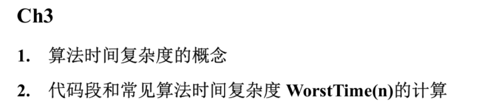
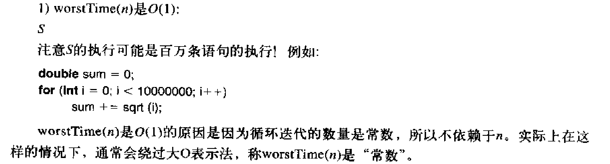
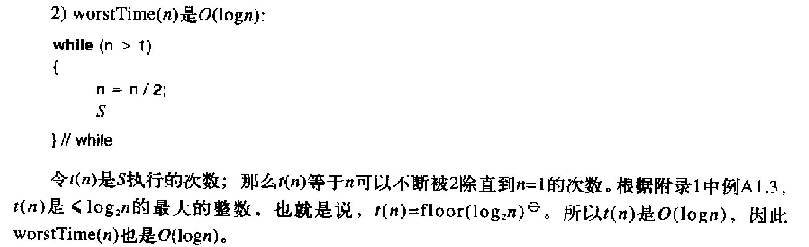
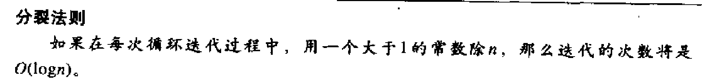
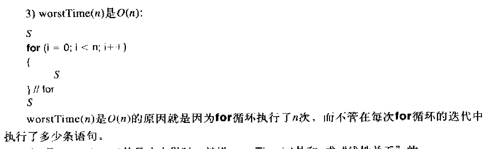
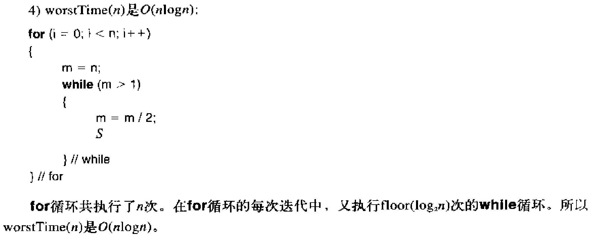
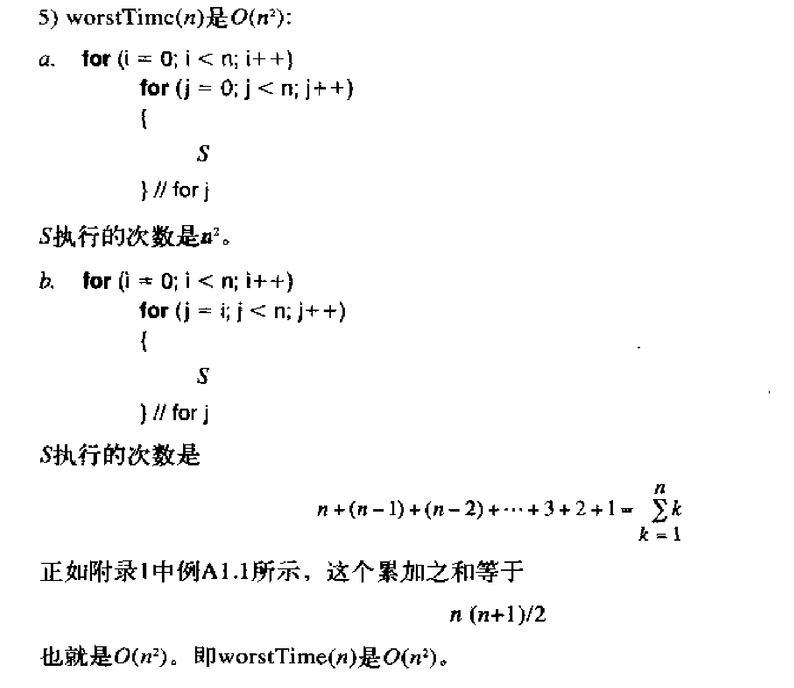
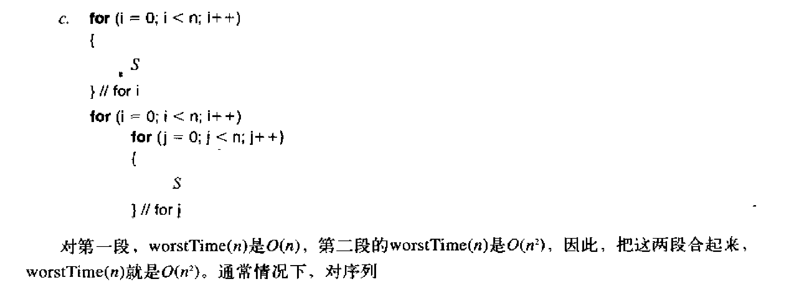
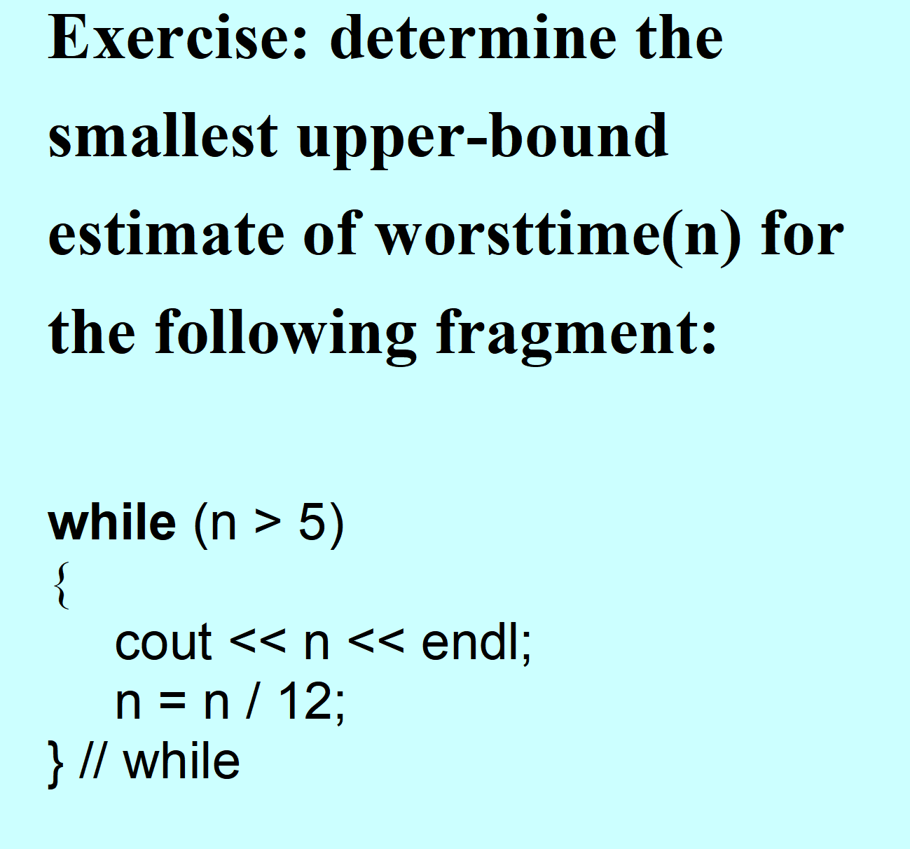
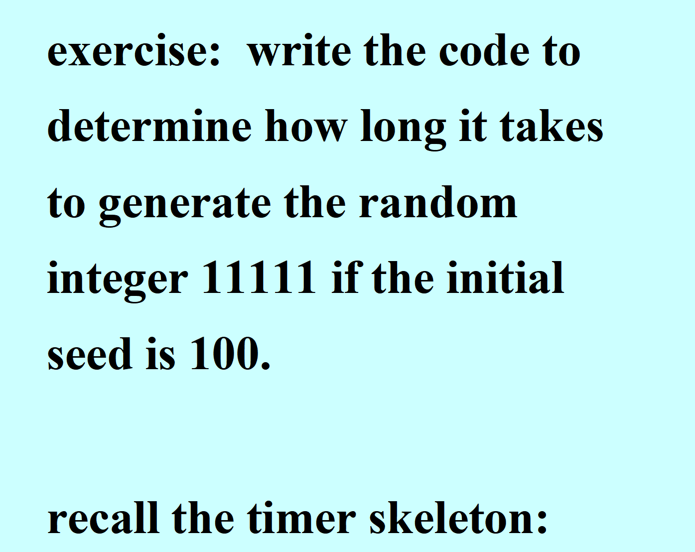

# 复杂度分析



## 时间复杂度

- 任何算法都可以分析时间复杂度，循环和递归只是较常见的分析对象

:::warning
# Problem size 问题规模：
$ 执行时间需求 \approx 执行期间的指令语句数量 $

:::

## 算法时间复杂度概念：
<font style="color:rgb(48, 48, 48);">算法的时间复杂度是评估方法执行效率的一种指标，它</font>**<font style="color:rgb(48, 48, 48);">独立于所使用的计算机性能；表示的是操作次数与输入规模 </font>**$ n $**<font style="color:rgb(48, 48, 48);"> 之间的关系</font>**

**<font style="color:rgb(48, 48, 48);"></font>**

**渐近同阶**的定义是：若存在辅助函数 \(g(n)\)，使得当 \(n\) 趋向于无穷大时，\(f(n)/g(n)\) 的极限值为一个不等于零的常数，则称 \(f(n)\) 与 \(g(n)\) 渐近同阶，记作 \(\Theta(g(n))\)。

**<font style="color:rgb(48, 48, 48);"></font>**

我们通常使用 **大 O 表示法**（Big-O Notation）描述渐近上界，记作 \(f(n)=O(g(n))\)。

<font style="color:rgb(48, 48, 48);">• </font>**<font style="color:rgb(48, 48, 48);">数学定义</font>**<font style="color:rgb(48, 48, 48);">：对于函数 </font>_<font style="color:rgb(48, 48, 48);">f</font>_<font style="color:rgb(48, 48, 48);">(</font>_<font style="color:rgb(48, 48, 48);">n</font>_<font style="color:rgb(48, 48, 48);">)</font><font style="color:rgb(48, 48, 48);">，如果存在非负常数 </font>_<font style="color:rgb(48, 48, 48);">c</font>_<font style="color:rgb(48, 48, 48);"> 和 </font>_<font style="color:rgb(48, 48, 48);">k</font>_<font style="color:rgb(48, 48, 48);">，使得对于所有的 </font>_<font style="color:rgb(48, 48, 48);">n</font>_<font style="color:rgb(48, 48, 48);">≥</font>_<font style="color:rgb(48, 48, 48);">k</font>_<font style="color:rgb(48, 48, 48);">，都有 </font>_<font style="color:rgb(48, 48, 48);">f</font>_<font style="color:rgb(48, 48, 48);">(</font>_<font style="color:rgb(48, 48, 48);">n</font>_<font style="color:rgb(48, 48, 48);">)</font><font style="color:rgb(48, 48, 48);">≤</font>_<font style="color:rgb(48, 48, 48);">c</font>_<font style="color:rgb(48, 48, 48);">⋅</font>_<font style="color:rgb(48, 48, 48);">g</font>_<font style="color:rgb(48, 48, 48);">(</font>_<font style="color:rgb(48, 48, 48);">n</font>_<font style="color:rgb(48, 48, 48);">)</font><font style="color:rgb(48, 48, 48);">，那么我们就说 </font>_<font style="color:rgb(48, 48, 48);">f</font>_<font style="color:rgb(48, 48, 48);"> 的量级是 </font>_<font style="color:rgb(48, 48, 48);">O</font>_<font style="color:rgb(48, 48, 48);">(</font>_<font style="color:rgb(48, 48, 48);">g</font>_<font style="color:rgb(48, 48, 48);">)</font><font style="color:rgb(48, 48, 48);">。</font>

<font style="color:rgb(48, 48, 48);">• </font>**<font style="color:rgb(48, 48, 48);">意义</font>**<font style="color:rgb(48, 48, 48);">：</font>_<font style="color:rgb(48, 48, 48);">g</font>_<font style="color:rgb(48, 48, 48);">(</font>_<font style="color:rgb(48, 48, 48);">n</font>_<font style="color:rgb(48, 48, 48);">) 被视为 </font>_<font style="color:rgb(48, 48, 48);">f</font>_<font style="color:rgb(48, 48, 48);">(</font>_<font style="color:rgb(48, 48, 48);">n</font>_<font style="color:rgb(48, 48, 48);">) 的一个</font>**<font style="color:rgb(48, 48, 48);">上界</font>**<font style="color:rgb(48, 48, 48);">（Upper Bound），它描述了算法执行时间随问题规模 </font>_<font style="color:rgb(48, 48, 48);">n</font>_<font style="color:rgb(48, 48, 48);"> 增长的</font>**<font style="color:rgb(48, 48, 48);">最快增长率</font>**

**<font style="color:rgb(48, 48, 48);"></font>**

## WorstTime(n)：算法在最坏情况下的时间需求
+ 即算法的最坏时间复杂度，计算的是最多语句情况的语句数量

## AverageTime(n)：算法在平均情况下的时间需求
+ 即算法的平均时间复杂度，计算的是

$ \frac{最多语句情况的语句数量 + 最少语句情况的语句数量}{2} $

## big-O 大O标记：
+ <font style="color:rgb(48, 48, 48);">描述函数增长率的</font>**<font style="color:rgb(48, 48, 48);">上界</font>**
+ The Order of g——$ O(g) $：g的数量级
+ $ f(n) = O(g(n)) $，$ O(g(n)) $为算法$ f(n) $的**时间复杂度**，记作$ O(n) $

## 案例：






# Runtime analysis 运行时分析
运行时测试程序：

```cpp
#include<iostream>
#include<ctime>
#include<string>
using namespace std;

int main(){
	const string TIME_MESSAGE_1 = "花费的时间是：";
	const string TIME_MESSAGE_2 = "秒";

	long start_time,finish_time,elapsed_time;

	start_time = time(NULL);

		//在此处运行任务
		long long cnt = 0;
	for(int i = 0; i < 100000; i++){
		for(int j = 0; j < i; j++){
			cnt++;
		}
	}
	cout << "cnt:" << cnt << endl;
	//任务运行结束


	finish_time = time(NULL);
	elapsed_time = finish_time - start_time;
	cout << TIME_MESSAGE_1 << elapsed_time << TIME_MESSAGE_2 << endl;
	return 0;
}
```

# 随机数生成
```cpp
#include<iostream>
#include<stdlib.h>
using namespace std;

int main(){
	srand(time(NULL));
	for(int i = 0; i < 20; i++){
		cout << rand() % 10 << endl;
	}
	return 0;
}
```

# 本章实践：
P57 大 O 表示法的证明

P64 运行时测试程序

p85 随机数程序

# 课堂练习：






```cpp
long start_time, finish_time, elapsed_time;

    start_time = time (NULL);

    // Perform the task:
    ...

    // Calculate elapsed time for the task:
    finish_time = time (NULL);
    elapsed_time = finish_time - start_time;
    cout << elapsed_time << endl;

```

<!-- learning-journey:update-history:start -->
## 更新记录

| 日期 | 类型 | 说明 |
| --- | --- | --- |
| 2026-07-27 | 首次发布 | 从语雀整理并发布到学习记录仓库 |
<!-- learning-journey:update-history:end -->
