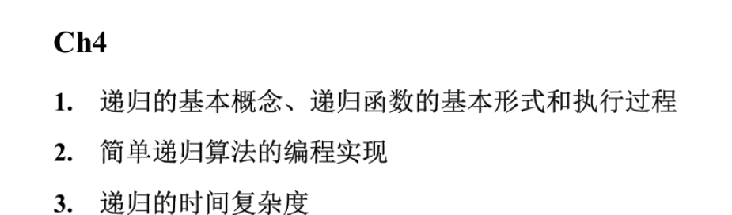
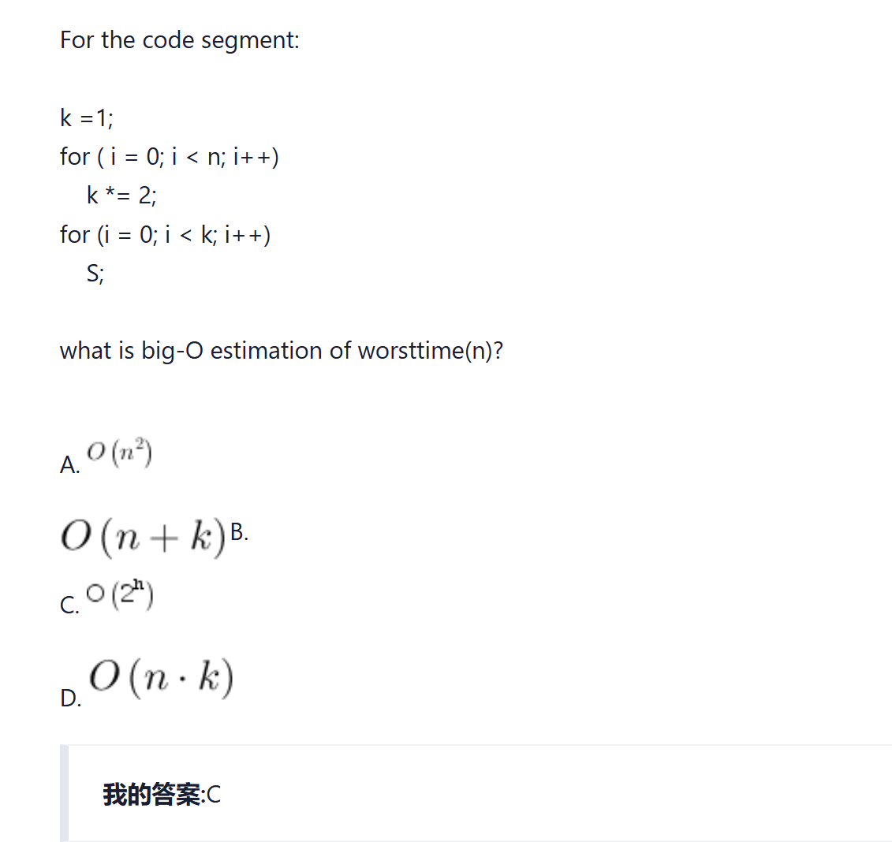
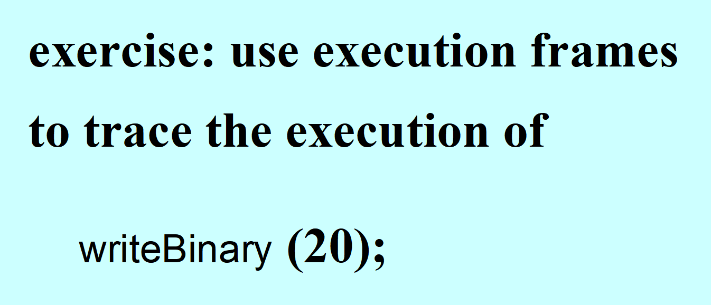
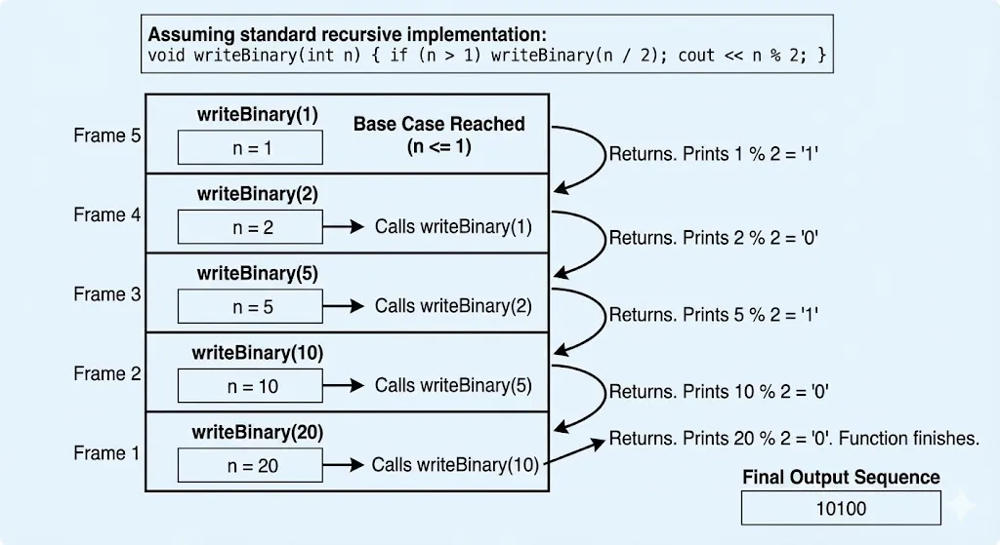
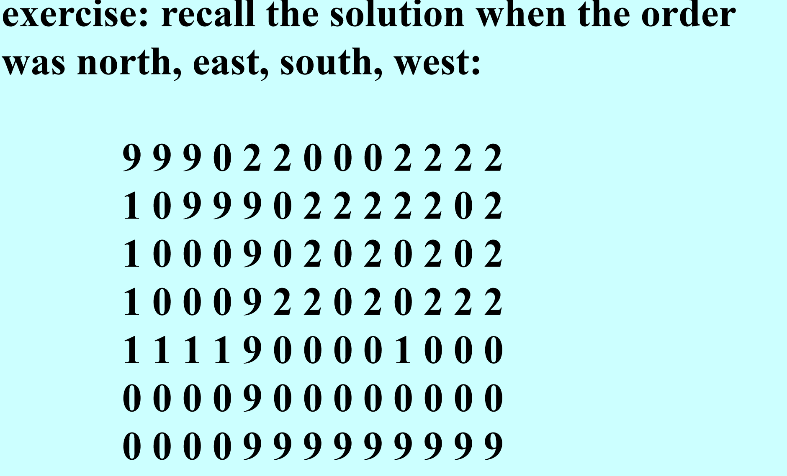
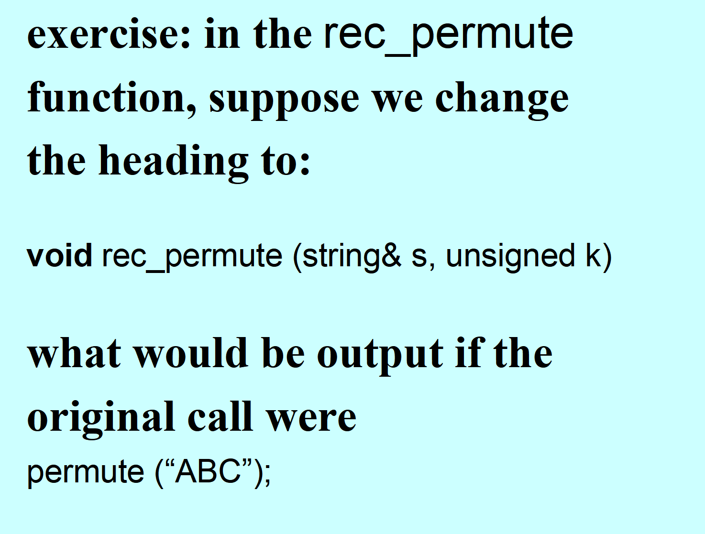

# 递归与回溯



## 定义

- 递归函数：包含对它自身调用的函数
- 核心思想：将复杂问题分解为同类更简单的问题，直到问题简单到可以直接解决
- 递归的时间复杂度等同于循环，执行时间取决于递归调用的次数，空间复杂度大于循环
- 适合采用递归处理的问题具有的特征：
  - 复杂情况可以简化为形式相同的较简单情况
  - 最简单的情况可以直接处理

## 优点（同迭代函数{循环}相比）

else 部分的语句顺序可以推迟所有的输出等操作，只需要调换语句顺序就可以实现正向或反向操作。

## 递归函数的基本形式

```cpp
if 最简形式
    问题解决
else
    递归调用一个更简单的形式
```

案例：

```cpp
long fact(int n) {
    if (n == 0 || n == 1)
        return 1;
    else
        return n * fact(n - 1);
}
```

## 课堂案例



### 十进制转换二进制

```cpp
#include <iostream>
using namespace std;

void ten_to_two(int num) {
    if (num == 1 || num == 0)
        cout << num;
    else {
        ten_to_two(num / 2);
        cout << num % 2;
    }
}

int main() {
    int num;
    cin >> num;
    ten_to_two(num);
}
```

### 斐波那契数列

```cpp
#include <iostream>

long long fib(int num) {
    if (num == 0 || num == 1)
        return (long long)num;
    else {
        return fib(num - 1) + fib(num - 2);
    }
}

int main() {
    int num;
    std::cin >> num;
    std::cout << fib(num);
    return 0;
}
```

### 二分查找

```cpp
// 递归函数通常需要传递 low 和 high 索引
int binarySearch(const int a[], int low, int high, int target) {
    if (low > high)       // Base Case 1: 没找到
        return -1;

    int mid = (low + high) / 2;
    if (a[mid] == target) // Base Case 2: 找到了
        return mid;
    else if (a[mid] > target)
        return binarySearch(a, low, mid - 1, target); // 左半边递归
    else
        return binarySearch(a, mid + 1, high, target); // 右半边递归
}
```

### 汉诺塔

```cpp
#include <iostream>
using namespace std;

void hanohelper(int num, char ori, char des, char temp, int& cnt) {
    // Important: int& cnt
    if (num == 1) {
        cout << "将盘 " << 1 << " 从 " << ori << " 移动到 " << des << endl;
        cnt++;
    } else {
        hanohelper(num - 1, ori, temp, des, cnt);
        cout << "将盘 " << num << " 从 " << ori << " 移动到 " << des << endl;
        cnt++;
        hanohelper(num - 1, temp, des, ori, cnt);
    }
}

void hano(int num) {
    int cnt = 0;
    hanohelper(num, 'A', 'B', 'C', cnt);
    cout << "共执行了" << cnt << "次操作" << endl;
}

int main() {
    hano(3);
    return 0;
}
```

## Backtracking Method 回溯法

### 方法解释

- 回溯法通过逐步尝试每一个可能的解，并在发现当前解不可行时标记并回退，尝试其他可能的选择
- 回溯法是一种深度优先的算法

### 解决回溯问题类模板

- Backtrack 类【通用】
- Application 类【通用】
- Position 类【针对实际问题进行开发】
- main 函数
- 所含方法：
  - 判断有效 `valid()`
  - 标记路径 `record()`
  - 判断到达终点 `done()`
  - 标记死路 `undo()`

### 伪代码

```cpp
bool tryToSolve(Position pos) {
    // 1. Base Case: 成功到达目标
    if (app.done(pos)) {
        return true;
    }

    // 2. 遍历所有可能的下一步（使用迭代器）
    Iterator itr(pos);
    while (!itr.atEnd()) {
        Position nextPos = itr.next(); // 获取下一个可能的位置

        if (app.valid(nextPos)) {      // 如果位置有效（不是墙，没走过）
            app.record(nextPos);       // 【关键】标记该位置已走过（Mark）

            // 3. 递归调用
            if (tryToSolve(nextPos)) {
                return true;           // 如果找到路，向上传递成功信号
            }

            // 4. 回溯（Backtracking Step）——【必考点】
            // 如果上面的 tryToSolve 返回 false，说明这条路走不通
            // 必须取消标记，以便该位置在其他路径中能被再次访问
            app.undo(nextPos);         // (Unmark)
        }
    }

    return false; // 所有方向都试过了，无路可走
}
```

### 需完成题型

- 八皇后问题
- 走马问题
- 迷宫问题

## 课堂练习









<!-- learning-journey:update-history:start -->
## 更新记录

| 日期 | 类型 | 说明 |
| --- | --- | --- |
| 2026-07-27 | 首次发布 | 从语雀整理并发布到学习记录仓库 |
<!-- learning-journey:update-history:end -->
