# 第一章：算法引论——算法基础与复杂度分析

> 本章主要内容：算法的概念与性质、输入输出数量、算法的渐进复杂性、四种渐进记号，以及评价算法好坏的主要维度。

## 算法的概念

### 算法的定义

算法（Algorithm）是指解决问题的一种方法或一个过程，是若干指令的有穷序列，规定了解决某一特定类型问题的运算序列。

### 算法的四大核心特性

- **输入（Input）**：有外部提供的 **0 个或多个**量作为算法的输入。
- **输出（Output）**：算法产生 **1 个或多个**量作为输出。
- **确定性（Definiteness）**：组成算法的每条指令清晰、无歧义。
- **有限性（Finiteness）**：算法中每条指令的执行次数有限，执行每条指令的时间也有限。

### 描述算法的方式

自然语言、图形（流程图等）、算法语言（程序设计语言、伪代码等）和形式语言（数学语言，可以避免自然语言的二义性）。

### 算法与程序的区别与联系

- 算法 + 数据结构 = 程序。
- 程序是算法用某种程序设计语言的具体实现。
- 算法必须严格满足**有限性**，程序可以不满足算法的性质。例如，操作系统是在无限循环中持续执行的程序，因而操作系统整体不是一个算法。

### 算法设计的过程

算法设计的一般过程：

理解问题 → 选择数据结构与算法设计策略（确定精确解或近似解）→ 设计算法 → 证明正确性 → 分析算法复杂性 → 实现程序（不断修正迭代）

### 分析评价算法的五大维度

- **正确性（Correctness）**：对合法输入均能得出满足要求的正确解答。
- **健壮性（Robustness）**：对非法或异常输入能够作出合理处理。
- **简明性（Simplicity）**：算法结构清晰，易于理解和维护。
- **效率（Efficiency）**：执行时间短，资源占用少。
- **最优性（Optimality）**：达到解决该问题计算时间的下界。

## 算法的复杂度分析·理论部分

### 算法分析的概念与意义

> 算法的核心与灵魂是算法的效率（速度）。

算法分析是对已设计的算法评价或评判其优劣，进而与算法设计之间相互检验评估并指导改进。

### 算法分析的一般步骤

1. 计算基本操作、基本存储占用的数量。
2. 求出累计和函数 $T(n)$、$S(n)$，即时间复杂性和空间复杂性。
3. 给出渐近表示。

### 算法复杂性的概念

算法复杂性是算法运行所需要的计算机资源的量，分为时间复杂性和空间复杂性。该资源量仅依赖于问题规模 $n$、算法的输入和算法本身的函数。

算法复杂性的实质是：问题规模变化与资源消耗的关系。

### 渐近复杂性

- 渐近复杂性是在问题规模 $n$ 充分大时，分析算法复杂性的极限趋势。
- 算法的比较是根据复杂度的渐近性质来进行的。

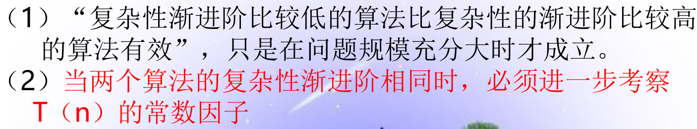

### 渐近分析的记号

#### 大 $O$ 记号（渐近上界）

- 数学定义：若存在正常数 $C$ 和自然数 $n_0$，使得当 $n \ge n_0$ 时，有 $f(n) \le Cg(n)$，则记为 $f(n)=O(g(n))$。
- 示例：
  - 对于 $f(n)=2n^2+11n-10$，当 $n_0=10$、$C=3$ 时有 $f(n)\le 3n^2$，故 $f(n)=O(n^2)$。
  - 对于 $5n^3+3n+12$，当 $n\ge 1$ 时，$5n^3+3n+12\le 20n^3$，故取 $C=20$ 得 $O(n^3)$。

#### 大 $\Omega$ 记号（渐近下界）

- 数学定义：若存在正常数 $C$ 和自然数 $n_0$，使得当 $n\ge n_0$ 时，有 $f(n)\ge Cg(n)$，则记为 $f(n)=\Omega(g(n))$。
- **最坏情况用大 $O$，最好情况用大 $\Omega$。**

#### $\Theta$ 记号（渐近紧确界/同阶）

$f(n)=\Theta(g(n))$，当且仅当 $f(n)=O(g(n))$ 且 $f(n)=\Omega(g(n))$。

#### 小 $o$ 记号（严格低阶）

表示阶严格低于 $g(n)$ 的上界。

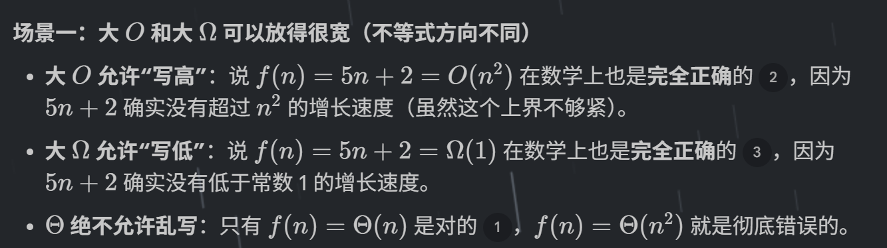

### 大 $O$ 的基本运算规则

- $O(f)+O(g)=O(\max(f,g))$
- $O(f)+O(g)=O(f+g)$
- $O(f)\cdot O(g)=O(f\cdot g)$
- 若 $g(n)=O(f(n))$，则 $O(f)+O(g)=O(f)$。
- $O(C\cdot f(n))=O(f(n))$，其中 $C$ 为正常数。
- $f=O(f)$。

### 常见复杂性函数排序

$$
O(1)<O(\log n)<O(n)<O(n\log n)<O(n^2)<O(n^3)<O(2^n)<O(n!)<O(n^n)
$$

### 常见求和函数的渐进表示

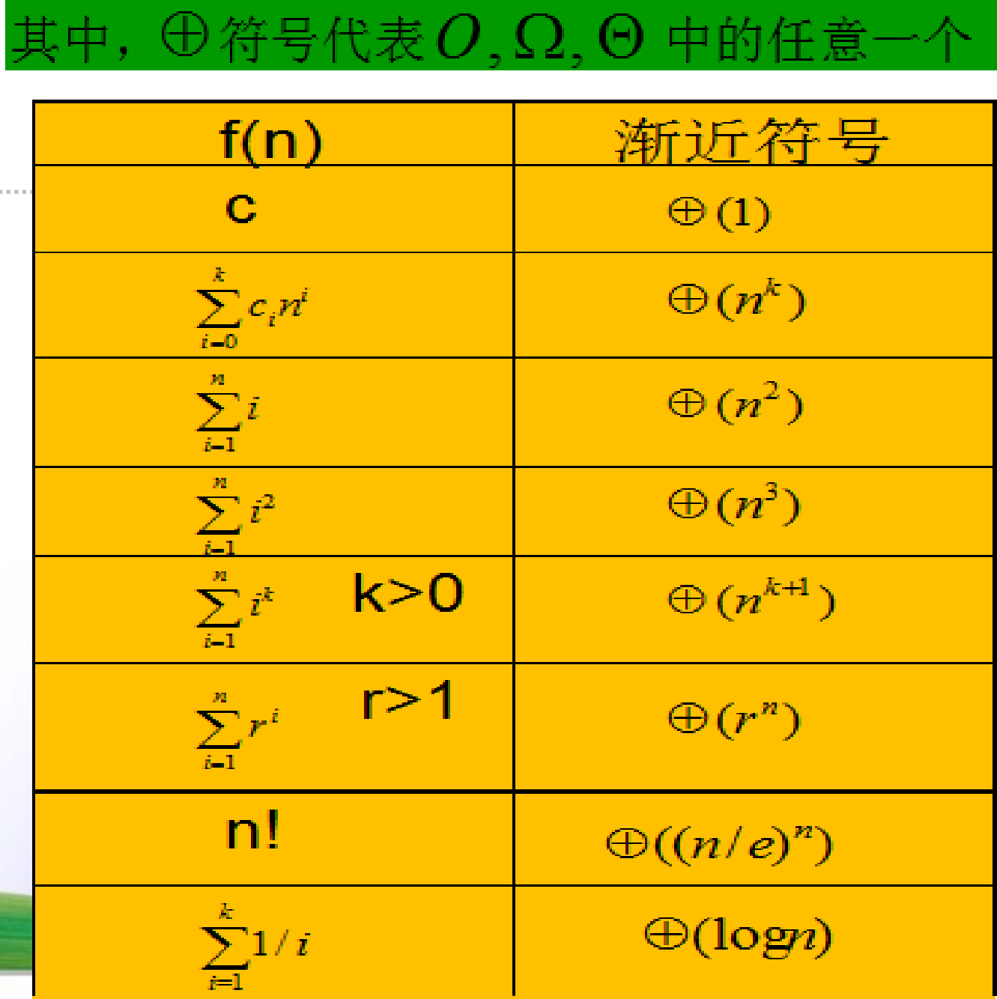

### 最优算法

- 若问题的计算时间下界为 $\Omega(f(n))$，而某个算法的计算时间复杂性达到了 $O(f(n))$，则称该算法为解决该问题的最优算法。
- 例如，**基于比较的排序问题，其最坏情况下的时间下界为 $\Omega(n\log n)$**；堆排序的最坏时间复杂度为 $O(n\log n)$，因此堆排序在该计算模型下是渐近最优的排序算法。

## 算法复杂度分析·实践部分

### 比较两个算法时间复杂性函数的阶

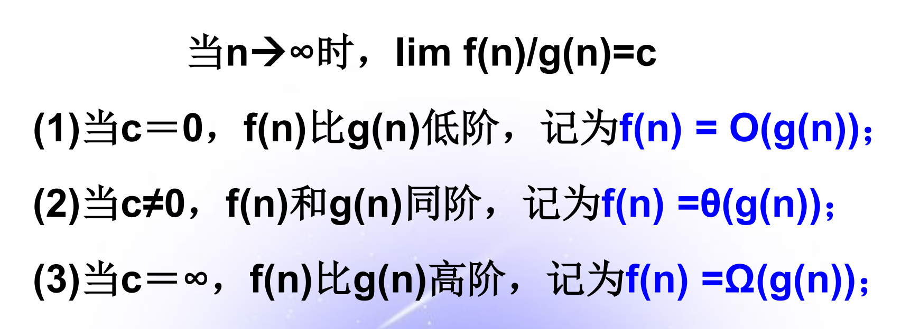

- $f(n)=O(g(n))$，近似于 $f(n)\le g(n)$。
- $f(n)=\Theta(g(n))$，近似于 $f(n)=g(n)$。
- $f(n)=\Omega(g(n))$，近似于 $f(n)\ge g(n)$。

### 一般算法（非递归算法）的复杂性分析

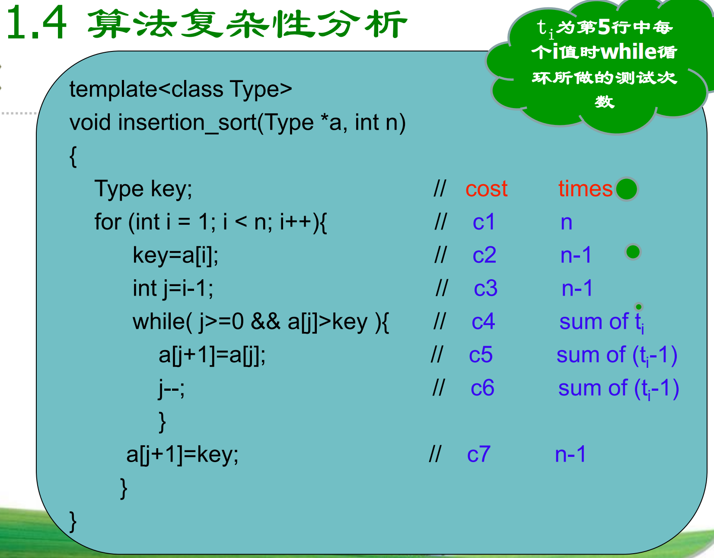

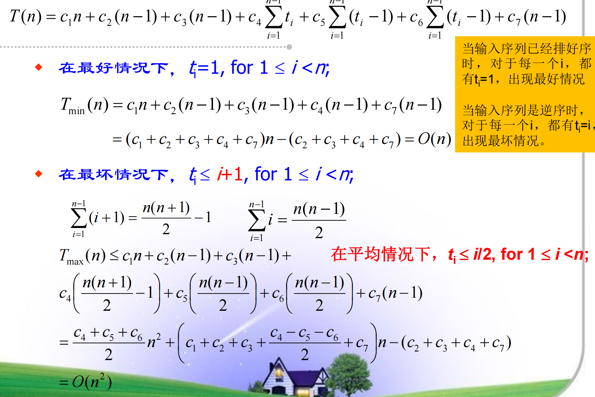

### 递归算法的复杂性分析

一般分析步骤如下：

1. 分析递归算法，写出递归方程。
2. 求解递归方程。
3. 给出递归方程解的渐进表示。

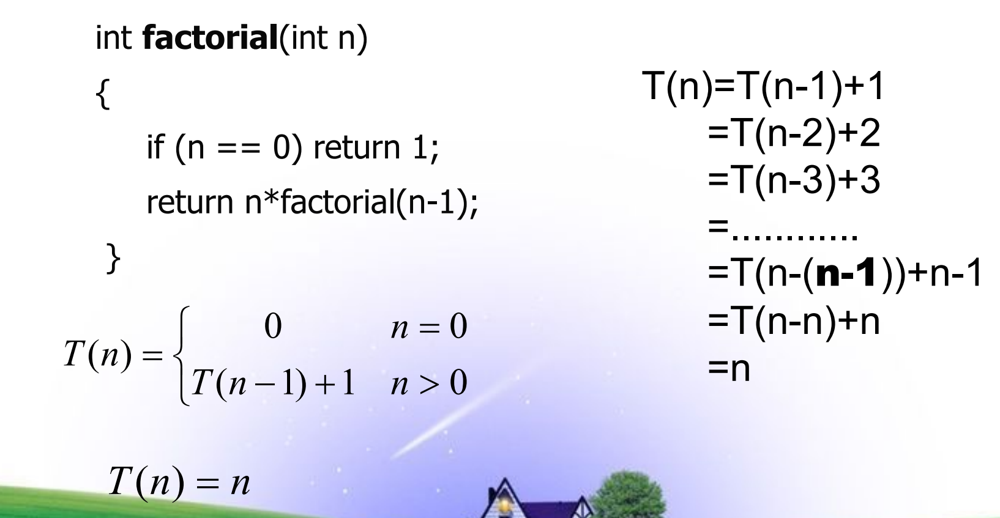

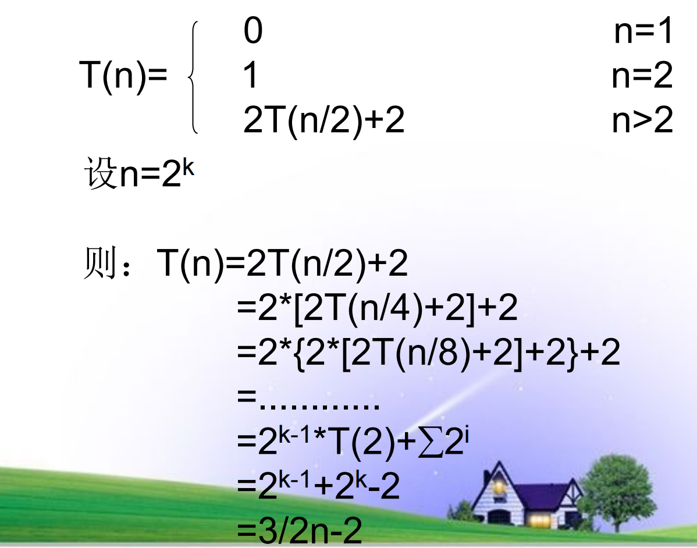

## 代码优化技巧

具体案例可看：[第 1 章 算法引论.pdf](https://www.yuque.com/attachments/yuque/0/2026/pdf/50155819/1789388713387-92c151a8-3028-4459-86b4-c98c331f276c.pdf)

1. **常量计算**：尽量在常量说明语句中赋值。
2. **算术计算**：用加和减来代替乘和除，高次整幂采取降阶操作。
3. **用位运算代替除法、取模。**
4. **避免重复计算。**
5. **写有利于编译优化的语句：**

   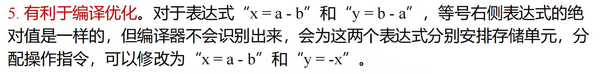

6. **优化逻辑运算**：善用短路计算。

   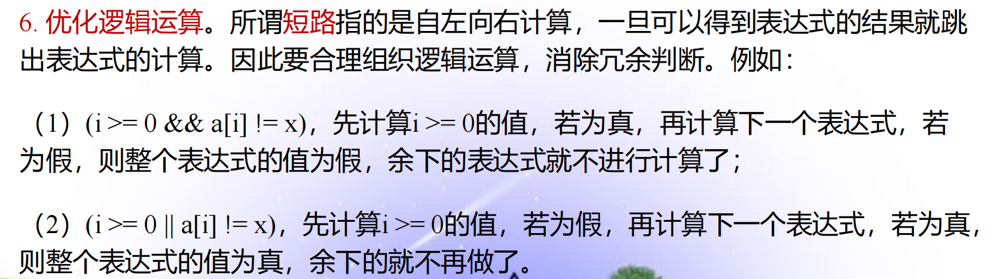

7. **合理安排条件表达式的顺序**：把概率大的分支的条件表达式放在前面。
8. **改善循环结构：**
   1. 不滥用循环。
   2. 嵌套循环——小循环套大循环。
   3. 合并循环。
   4. 循环不变式外提。

## Homework

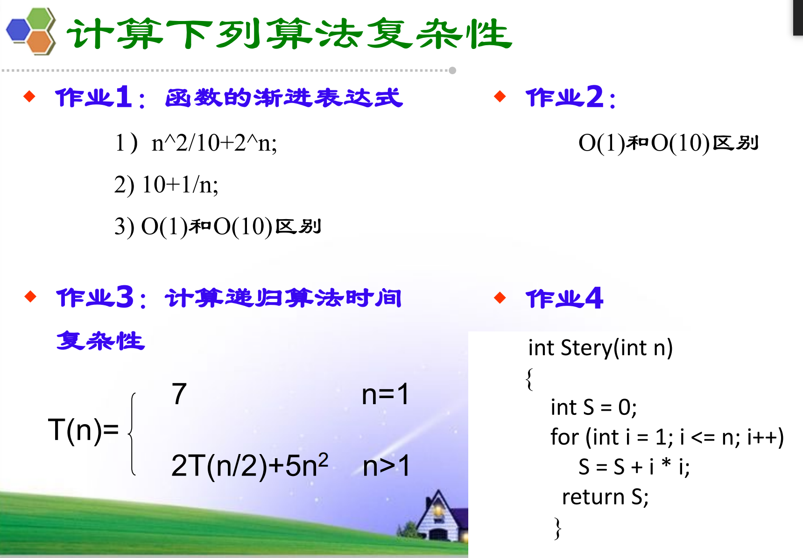

<!-- learning-journey:update-history:start -->
## 更新记录

| 日期 | 类型 | 说明 |
| --- | --- | --- |
| 2026-09-01 | 首次发布 | 从语雀整理并发布到学习记录仓库 |
<!-- learning-journey:update-history:end -->
