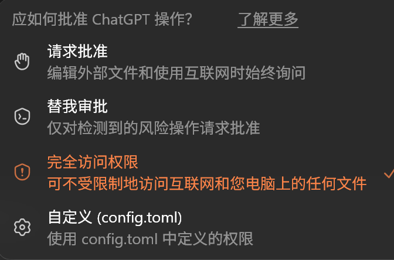

# 【1】何为 Harness——Harness Engineering 概念与架构

> 学习资料
>
> - [x] [简单地告诉你，何为harness](https://linux.do/t/topic/2654170)
> - [x] [近期兴起的 AI 领域热词“harness”](https://linux.do/t/topic/1907010/7)
> - [x] [【Harness Engineering】怎么都在说 Harness Engineering, 什么是 Harness Engineering？](https://linux.do/t/topic/1909881)
> - [x] [〖万字长文〗什么是 Harness Engineering](https://linux.do/t/topic/1941407)
>

## 概念起源与发展
 清晰表述于《My AI Adoption Journey》 个人博客中的一句话：

>  Engineer the harness
>

其没有进行严格定义，核心思想较为朴素： 每次发现 Agent 犯了⼀个错，就花时间设计⼀个解决方案，补齐外围的基础设施（而不仅仅依靠提示词），让模型在犯错的路径上撞墙

---

随后，将这个概念带入大众视野的是 OpenAI 的技术博客：

[_《Harness Engineering: Leveraging Codex in an Agent-First World》| OpenAI  _](https://openai.com/zh-Hans-CN/index/harness-engineering/)

其总结了使用 agent 的经验，包括但不限于：如何撰写 AGENTS.md、如何组织 plan 目录、如何暴露工具、如何使用 Git Worktree 等；强调了真正起到作用的是模型之外的框架的严谨设计

---

然后 Anthropic 发布了自己版本的 Harness 构建经验

[_Effective Harnesses for Long-running Agents | Anthropic_](https://www.anthropic.com/engineering/effective-harnesses-for-long-running-agents)

其主要探讨了如何设计 Harness 才能让一个以复杂任务为目标的长久执行的 agent 保持高效

---

Claude Code 源码泄露事件，让技术社区看到被视为"harness 设计典范" 的 CC 系统全貌 ，使得 Harness Engineering的概念在大众中深入讨论

## 基本概念
$ \text{Harness} = \text{Agent} - \text{Model} $

个人对于 Harness 的理解，类似于 Codex 环境之于 gpt 模型、Claude Code 环境之于 Claude 模型的相对关系

即：Harness 是为使大模型完成既定业务目标，所设计的一系列约束、架构、环境而构成的一整套系统；其核心目的在于保证 Model 在任务实现中发挥其能力，并稳定完成任务的执行与交付全过程

注：Harness 不仅仅是开发者开发 Agent 系统时的设计，用户在使用 Agent 完成项目或任务时进行的约束与配置也属于 Harness

> Claude Code 之所以强，不仅因为 Claude 模型本身实力强，更在于 Claude Code 系统的设计强大
>

$ \text{Harness} = \text{业务流程} + \text{具体实现} $

## Harness Engineering
**Harness Engineering** 可以看作继** Prompt Engineering（提示词工程）** 、**Context Engineering（上下文工程）**之后， AI 工程领域第三次迁移的工程重心

+ PE 时期，由于模型能力较弱，人们通过构建、打磨提示词，帮助模型更准确地理解身份和任务，使得输出更符合预期结果
+ CE 时期，模型能力增强，模型对于自然语言的理解能力已经够强，工程的重心转移到了执行阶段，即如何在有限的上下文窗口中，更高效地利用模型的记忆和能力；其本质是在有限注意力的机制下追求最优表现
+ HE 时期，LLM 本身能力已经很强，人们开始认识到通过优化提示词、上下文带来的收益已经微乎其微，当前更具有性价比的优化是针对于模型外部的工具、流程、执行框架、反馈闭环等进行的系统性设计；这也是 Claude Code 泄露事件带来的观念变化

## 一个系统 Harness 的构成
对于 Harness 具体构成，没有一个完整的公认定义，本文讨论的是实现一个 Agent 应当考虑的全部设计；这些全都在 Harness 组件的讨论范畴中！🤓

### System Prompt & 指令分层
Prompt 通常是最基础的 Harness 组件；现如今的 Prompt 在系统中应是一个运行时的分层架构：身份与总设定、工具使用与权限说明、工程约束分层配置，各司其职，且在运行时需要按照优先级排列组装

### Agent Loop
正如智能体笔记[第一章：智能体基础与 Agent Loop](../Hello-Agents%20《从零开始构建智能体》/2026-07-23-第一章：智能体基础与Agent-Loop.md)所言：Agent Loop 是智能体的核心运行机制；Agent 在目标实现之前是持续运行循环，这个循环的设计同样是 Agent Harness 设计的核心

### Tool System
工具包括但不限于：本地函数调用、MCP、Skills、外部 API 等。对于工具的判断和使用逻辑设计对于发散与延伸模型能力具有重要作用

### Context
上下文治理对象包括工作记忆、长期记忆、上下文压缩策略等，Agent 应设计明确的上下文管理策略来控制模型的记忆机制，是决定 Agent 在复杂任务中持久运行的关键设计

### 权限与沙箱策略
Agent 的权限和运行位置决定了宿主机的安全保障问题。Sandbox 沙箱策略、高危命令弹出确认、执行权限设置等都属于这方面的讨论。一个 Agent 应当在设计时就考虑如果模型犯错如何控制后果的产生

### 错误处理策略
对于 Agent 系统，失败是日常事件，因此不能像传统软件把失败当作异常处理交给操作系统。请求超时、用户打断、权限拒绝、状态阻塞等失败路径都应纳入设计范围内，预先设定好错误的处理策略

### 多智能体编排策略
多智能体编排既是通用系统设计，也是具体的项目或者任务设计应考虑的。Agent 系统应当考虑多智能体之间的组织与编排机制

### 本地规则与 Hook
这一部分的目的在于让习惯能够被写入系统，包括`AGENTS.md`等自定义项目级配置文件、生命周期 Hook 等设计

## Harness 层级架构
> 注：Harness 不仅仅是开发者开发 Agent 系统时的设计，用户在使用 Agent 完成项目或任务时进行的约束与配置也属于 Harness
>
> 要设计一个 Agent，就必有Harness Engineering，这种 Harness 为通用级 HE；做一个项目可以考虑是否需要进行项目级 Harness Engineering；完成一个任务可以进行临时的任务级 HE 来帮助完成任务
>

### 通用级 Harness
通用级 Harness 通常是由 Agent 系统的设计者所考虑、设计并提供的，与具体的项目弱相关，是整个 Agent 系统的框架和通用能力设计；Agent 工具开发者根据具体的 Agent 类型与目标进行业务级设计

而对于绝大多数使用 Agent 的用户而言，这一层只需要选择一个合适的工具即可（Codex 等业务工具或 Pi-agent 等开源工具）

### 项目级 Harness
项目级 Harness 与具体项目强相关，由用户对于`AGENTS.md`、文档索引、知识库布局等进行配置与规定

这一层级是项目开发者需要考虑的内容，也是一个项目是否需要 Harness Engineering 的主战场

### 任务级 Harness
任务级 Harness 与本次要完成的具体任务强相关。包括针对特定任务的一次性 Prompt 或专门编写的可复用 skill 等。这一层 Harness 往往是为了任务临时搭建起来的，任务完成后会丢弃或者作为 skill 留存，便于后续任务执行

<!-- learning-journey:update-history:start -->
## 更新记录

| 日期 | 类型 | 说明 |
| --- | --- | --- |
| 2026-07-28 | 首次发布 | 从语雀整理并发布到学习记录仓库 |
<!-- learning-journey:update-history:end -->
