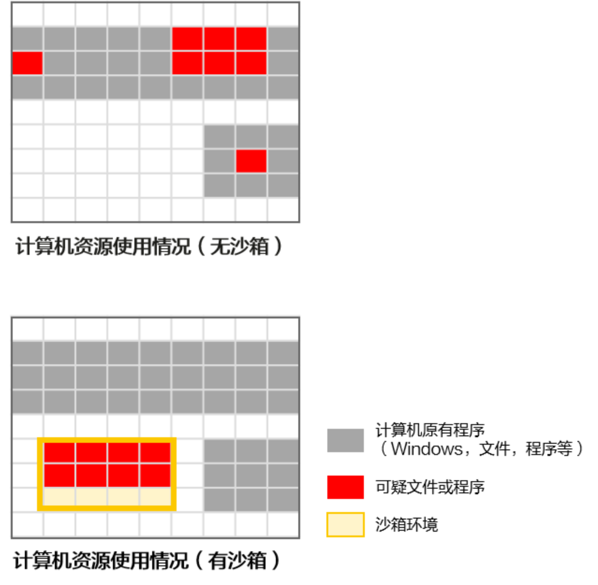
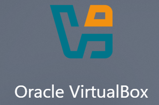
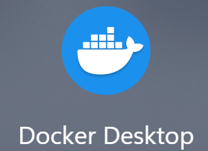

# Sandbox 沙箱技术

> 学习资源：
>
> - [ ] [What is a sandbox — and why it's safe to let an AI agent run code — KODiQ News](https://kodiq.ai/article/what-is-a-sandbox/)
> - [ ] [什么是沙箱技术？沙箱技术的原理是什么？ - 华为](https://info.support.huawei.com/info-finder/encyclopedia/zh/%E6%B2%99%E7%AE%B1%E6%8A%80%E6%9C%AF.html)
> - [ ] [说一下我对 Codex 沙盒以及权限的理解 - 开发调优 - LINUX DO](https://linux.do/t/topic/2303303)

## 沙箱技术是什么？

### 基础概念

沙箱技术是一种用于为程序建立受约束的执行环境或边界的安全机制，避免不可信程序影响真实系统。

传统的沙箱技术广义上指的是在电脑本地中隔离出一个独立的空间（虚拟环境），以供代码运行；在该空间中全部的命令只能访问沙箱给它加载的资源，而无法触及沙箱外部的电脑真实物理空间。

沙箱通常控制的内容包括：

- 文件访问与操作
- 网络访问
- 时间与资源限制

根据隔离层级的不同，沙箱技术由高到低可以分为：系统级沙箱、容器级沙箱、进程级沙箱。

### 沙箱的常用原理技术

#### 虚拟化技术 Virtualization

虚拟化技术是一种资源管理技术，可以将操作系统的各类资源进行逻辑上的分割与重新组合。

多数沙箱技术（主要是系统级沙箱，即各类虚拟机）中，便是依赖虚拟化技术，为不可信的资源构建了封闭的运行环境。



#### 访问控制技术

当沙箱环境中的程序需要去访问一些沙箱外的必要资源时，就需要通过访问控制技术来进行约束和限制。

访问控制技术通常由程序监控器和访问控制规则组成：

- 程序监控器监控沙箱内程序的运行，并将监控到的行为提交给访问规则控制引擎。
- 访问规则引擎再根据具体的规则进行允许或拒绝，或者交由人工处理。

#### 防躲避技术 Anti-Evasion

当 malware 在运行时检测到自己处于沙箱环境中，会采取一系列措施来规避沙箱的检测和分析；防躲避技术即为将沙箱伪装为真实电脑，防止 malware 采取各种措施进行规避的策略。

常见躲避技术和防躲避技术如下：

| 恶意代码躲避手段 | 沙箱防躲避对抗策略 | 核心目标 |
| --- | --- | --- |
| **超长休眠**：代码运行后先故意休眠一段时间，以耗尽沙箱的分析时间限制 | 虚拟时钟快进 | 强制恶意软件快速暴露后续恶意行为逻辑 |
| **检查系统硬件和驱动**（单核处理器、极少内存、暴露虚拟机特性的硬件设计等） | 硬件参数伪装、去虚拟化标识 | 营造真实生产主机假象 |
| **检测无人交互行为**（鼠标移动、键盘输入、窗口滚动等） | 注入非线性的仿真人类操作 | 伪装人机交互环境 |

## 沙箱的类别

沙箱根据隔离层级的不同，可以粗略分为不同层级的沙箱技术。现代本地桌面端 Agent 常用的属于进程级沙箱；云端 Agent 大多采用 MicroVM 微虚拟机。

### 系统级沙箱

- 概念：系统级别沙箱的典型实现为虚拟机（Virtual Machine），往往会虚拟化一个完整的计算机软件架构，即在沙箱内部有完整的一套 VM 虚拟机配置（虚拟硬件设备和操作系统），与真实的系统不进行内核共享。
- 特性：隔离效果最强大，资源耗费也最大，启动最重、最慢。
- 举例：VirtualBox、KVM。



### 容器级沙箱

- 概念：容器级别的沙箱是一个部署在某个应用程序周围的容器，容器内包括了被隔离的文件和程序及这些文件或程序可能会使用到的资源，与真实系统共享内核。
- 特性：较为轻量，启动快，且有独立的文件系统。
- 举例：Docker。



### 进程级沙箱

- 概念：进程级沙箱不创建一个完整的操作系统或完整容器，而是通过安全机制直接对某个进程及其子进程的行为进行限制；程序在真实系统中运行，且与真实系统共享内核。
- 特性：非常轻量，启动极快、开销极小，隔离强度弱。
- 举例：Sandboxie-Plus、现代本地 Agent 沙箱行为（Codex、WorkBuddy 等）。


## Sandbox 与 Agent Harness

沙箱技术是 Agent Harness 的一个重要设计部分（[（五）权限与沙箱策略](2026-07-27-【1】何为Harness——Harness-Engineering概念与架构.md#权限与沙箱策略)）。

因此，对于具备代码执行和工具调用能力的 Agent，Sandbox 通常是 Agent Harness 中执行层的重要安全组件。它通过操作系统或虚拟化机制，对 Agent 所启动进程能够访问的文件、网络和系统资源进行强制限制，通常与审批策略直接结合。

不同 Agent Harness 可以采用不同层级的沙箱实现，例如进程级沙箱、容器或虚拟机。

## Codex 安全执行设计（Sandbox + Approval）

Codex 的安全执行设计由 Sandbox 沙箱和 Approval 审批策略共同组成。

- Sandbox 负责控制 Codex 的访问范围与执行。
- Approval策略 决定当 Codex 试图发起 Sandbox 之外的操作时，是否以及如何进行审批。

> 以下为 Windows 系统上的 Codex 安全执行设计。

### `sandbox`——沙箱实现方式选择

```toml
[windows]
sandbox = "elevated" # or "unelevated"
```

这是设置 Windows 中 Codex 使用沙箱的具体底层实现方式，与是否使用沙箱无关。

- `unelevated`：较为基础简单的实现方式，无需管理员权限。Codex 仍然以当前 Windows 用户的身份运行，但在进程运行时会套上一层受限的程序令牌（Restricted Token），Codex 可以直接给自己的子进程创建 Restricted Token。
- `elevated`：首选的 Windows 原生沙箱实现方式，需要管理员权限。会创建专门用于 Codex 的 Windows 用户，只让 Codex 程序以这个低权限用户运行，还可以真正从 Windows 操作系统防火墙层面进行网络访问设置。

### `sandbox_mode`——沙箱模式选择

```toml
sandbox_mode = "read-only" # or "workspace-write" "danger-full-access"
```

设置 Codex 沙箱模式的具体行为模式。

- `read-only`：文件系统只允许读取，不允许写入；需要写文件等操作时会进入审批（具体的审批策略由其他参数配置，见下）。
- `workspace-write`：可以读取文件，也可以修改 `cwd`（当前工作目录）和 `writable_roots`（额外允许的工作目录列表）中的文件，修改其他目录的文件会进入审批（具体的审批策略由其他参数配置，见下）；是日常 Coding Agent 最典型的模式。
  - 默认不允许访问网络，网络层可以进行单独设置：

```toml
[sandbox_workspace_write]
network_access = true # or false
```

- `danger-full-access`：完全不进行沙箱控制。

### `approval_policy`——审批策略选择

```toml
approval_policy = "never" # or "on-request" "untrusted"
```

用于决定 Codex 是否执行 Sandbox 之外的操作以及如何申请审批。

- `never`：Codex 永远不向用户请求审批，超出 Sandbox 的行为会直接拒绝或失败。
- `on-request`：将超出 Sandbox 的行为交由 AI 或用户（由 `approvals_reviewer` 单独决定）进行审批。
- `untrusted`：除了明确的安全操作（只读等），Codex 默认不相信其他全部操作，即使某些命令没有超出 Sandbox，也可能要求审批。

### `approvals_reviewer`——审批请求对象

```toml
approvals_reviewer = "user" # or "auto_review"
```

- `user`：交给用户进行审批决策。
- `auto_review`：交给一个专门的 subagent，它会收集相关上下文，并根据风险框架进行审批决策（注：该模式需要进入 Token 计费）。

<!-- learning-journey:update-history:start -->
## 更新记录

| 日期 | 类型 | 说明 |
| --- | --- | --- |
| 2026-08-23 | 首次发布 | 从语雀整理并发布到学习记录仓库 |
<!-- learning-journey:update-history:end -->
