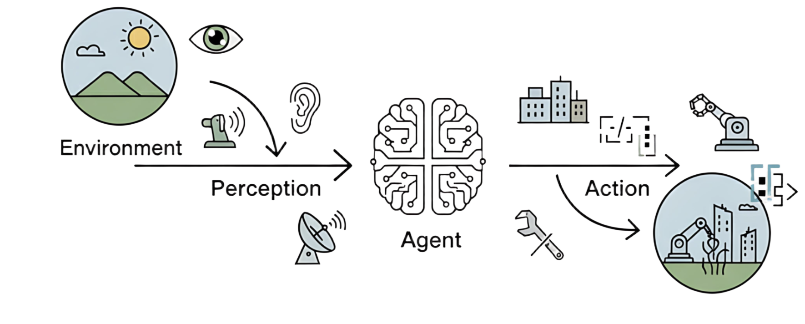
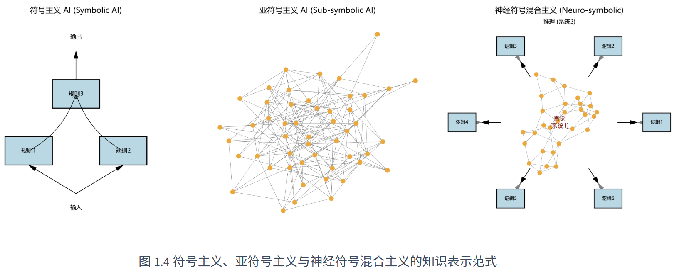
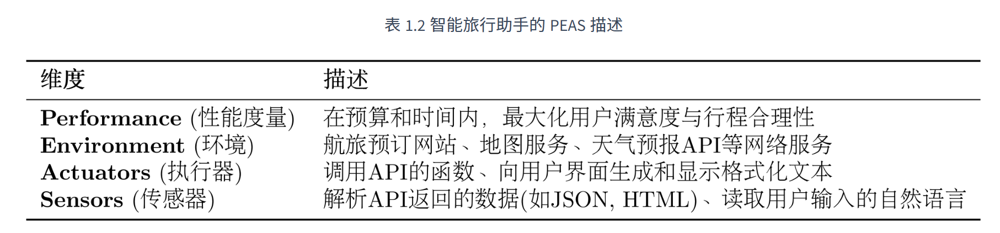
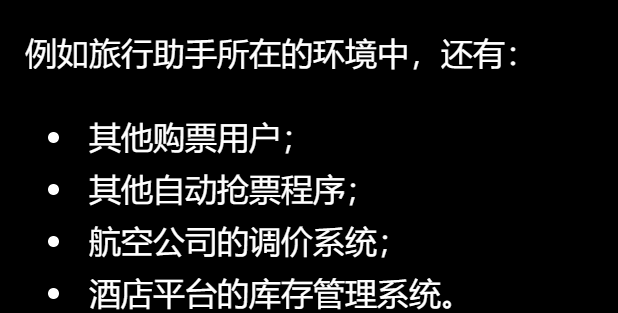
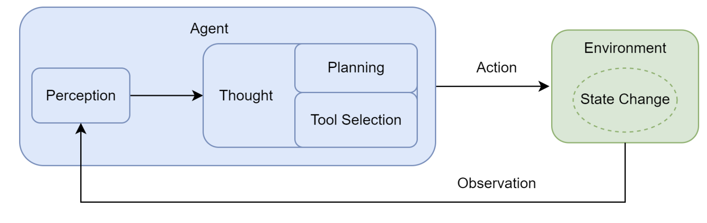
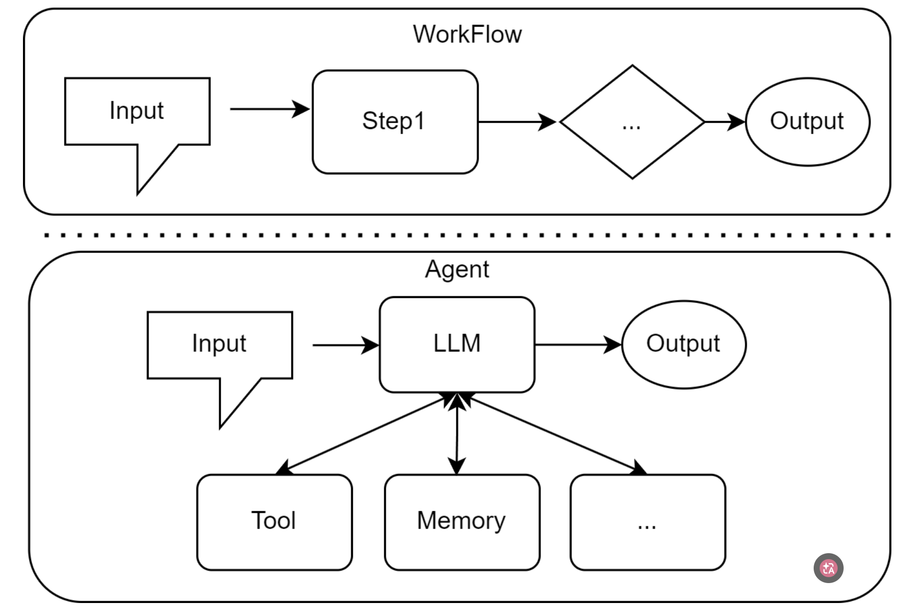

# 第一章：智能体基础与 Agent Loop

## 智能体是什么？
### 智能体的定义
在人工智能领域，智能体被定义为任何能够通过**传感器（Sensors）**感知其所处**环境（Environment）**，并**自主**地通过**执行器（Actuators）**采取**行动（Action）**以达成特定目标的实体

### 智能体的四个基本要素
+ **环境（environment）：**智能体所处的外部世界
+ **传感器（sensor）：**智能体可以通过传感器动态持续地感知环境状态
+ **执行器（actuator）：**采取行动改变环境的状态，对环境产生影响；执行器可以是物理设备，也可以是虚拟工具
+ **自主性（autonomy）：**能够基于其感知和内部状态进行独立决策，以达成其设计目标



这一循环构成了智能体行为的基础

### 智能体的演进
+ LLM 发展之前：
    - **<u>反射智能体（simple reflex agent）</u>**：决策由明确设计的“条件-动作”规则组成，其感知触发条件，便会执行动作，不具备记忆、预测能力。

> 自动门：有人就打开，没人就关闭
>

    - **<u>基于模型的反射智能体（Model-Based reflex agent）</u>**：引入了“状态”，这些智能体有一个内部的世界模型，	用于追踪和理解环境中那些无法被直接感知的方面。智能体开始拥有了记忆，决策开始依赖于对状态的理解

> 扫地机器人：看不到沙发后方，但根据已经建立的模型记住那里清扫过
>

    - **<u>基于目标的智能体（Goal-Based agent）</u>**：智能体开始变被动为主动，会基于模型和算法来规划实现目标的方式，其核心能力体现在对未来的考量与规划上

> 导航软件：以某个地点为目标值，规划出路线
>

    - **<u>基于效用的智能体（Utility-Based agent）</u>**：为每一个可能的世界状态赋予一个效用值，智能体的核心目标不再是只达成什么既定的状态，而是在能达成状态目标的前提下最大化效用值

> 导航软件综合路程、时间等选择最合适的路线
>

    - **<u>学习型智能体（Learning agent）</u>**：学习型智能体包含一个性能元件（前面各类智能体）和一个学习元件；学习元件通过观察性能元件在环境中的行动带来的结果，不断修正性能元件的决策策略，强化学习（Reinforcement Learning，RL）是实现这一思想最具代表性的方式。由此智能体开始不只依赖于预设，而是开始自主地学习

> 下棋智能体：在反复对局中根据输赢反馈自行学习，逐渐选择胜率更高的行动
>

---

+ **<u>LLM 智能体</u>**：由 LLM 驱动的智能体，其核心决策机制与传统智能体存在本质区别；其开发也从专用自动化工具转向构建能自主解决问题的系统，核心从编写代码、规则变成了引导一个通用的大脑去规划、行动、学习

### 智能体分类维度
#### 基于内部决策架构分类
该分类与上一节的传统智能体演进基本一致，主要依据智能体内部决策机制的复杂程度分类

#### 基于决策的时间与反应性分类
主要依据是智能体接收到信息后会立即行动还是经过思考规划

> 揭示了智能体设计的一个核心权衡：追求速度的反应性（reactivity）与追求最优解的规划性（deliberation）之间的平衡
>

具体可分为：

+ **<u>反应式智能体</u>****<u> (Reactive Agents)</u>****：**速度快、计算开销低，在需要快速决策的动态环境中至关重要；简单的反应式智能体 和 基于模型的智能体 都属于这个类型
+ **<u>规划式智能体</u>****<u> (Deliberative Agents)</u>**：在行动前会进行复杂的思考和规划，评估不同行动序列的后果，以期找到一条能够达成目标的最佳路径，适用于处理复杂的、需要长远眼光的任务；基于目标的智能体 和 基于效用的智能体 是典型的规划式智能体
+ **<u>混合式智能体</u>****<u> (Hybrid Agents)</u>**：平衡反应与规划，适用于解决现实世界的复杂任务。常使用分层设计的混合架构，底层为快速反应模块，高层为规划模块；或在一个“思考-行动-观察”的循环中运作。

#### 基于知识的表达方式分类
主要依据是用于决策的知识是如何存储的，具体可分：

+ 符号主义 AI（symbolic AI）：知识保存为人能看懂的规则、逻辑关系、知识图谱等
+ 亚符号主义 AI（sub-symbolic AI）：知识分散存储在神经网络的大量参数中，而不是显式展现
+ 神经符号主义 AI（Neuro-Symbolic AI）：两者结合，让神经网络负责理解复杂、模糊的信息，再让明确的规则、程序或工具负责精确处理



## 智能体的构成与原理：
### 智能体的任务环境
#### PEAS 模型描述
通常使用**PEAS 模型**来精确描述一个任务环境

即分析其

+ **性能度量(Performance)**
+ **环境(Environment)**
+ **执行器(Actuators)**
+ **传感器(Sensors)**



#### 智能体任务环境的特性：
在实践中，LLM 智能体所处的数字环境展现出若干复杂特性，这些特性直接影响着智能体的设计

+ <u>环境的部分可观察性</u>： 智能体无法一次看到环境的全部真实状态，因此智能体需要具备记忆与探索的能力
+ <u>环境的确定性和随机性</u>：智能体需要具备处理不确定性、监控变化并及时决策的能力
+ <u>多智能体环境</u>：这里的多智能体指的是环境中还有其他能够采取行动的主体，而这些主体的行为会改变环境，因此智能体需要有更强的快速响应和策略选择的能力



+ <u>环境的序贯性和动态性</u>：序贯性意味着当前行动会影响未来，动态性则意味着环境自身会发生变化；因此智能体的“感知-思考-行动-观察”循环必须能够快速、灵活地适应持续变化的世界

### 智能体的运行机制：Agent Loop
智能体通过一个持续的循环机制与环境进行交互，这个核心机制被称为：Agent Loop



包含以下几个阶段：


1. **<u>感知 (Perception)</u>**：这是循环的起点。智能体通过其传感器接收来自环境的输入信息，即观察 (Observation)
2. **<u>思考 (Thought)</u>**：接收到观察信息后，智能体进入其核心决策阶段。对于 LLM 智能体而言，这通常是由大语言模型驱动的内部推理过程。思考阶段可进一步细分为两个关键环节：
    - **<u>规划 (Planning)</u>**：智能体基于当前的观察和其内部记忆，更新对任务和环境的理解，并制定或调整一个行动计划
    - **<u>工具选择 (Tool Selection)</u>**：根据当前计划，智能体从其可用的工具库中，选择最适合执行下一步骤的工具，并确定调用该工具所需的具体参数
3. **<u>行动 (Action)</u>**：决策完成后，智能体通过其执行器（Actuators）执行具体的行动。通常表现为调用一个选定的工具，从而改变环境的状态；而行动并非循环的终点，行动引起的环境状态变化又会成为新的观察作为结果反馈，在新一轮的循环中被感知捕获


智能体正是通过不断重复这一循环，逐步推进任务，从初始状态向目标状态演进

### 智能体的感知与行动——交互协议
在现代智能体架构中，交互协议体现在智能体的结构化输出上，明确地展示了其内部推理过程与最终决策

输出结构通常包括两个核心部分：

+ Thought：以自然语言形式阐释了智能体的分析思考规划过程
+ Action：基于思考后决定对环境施加的具体操作，通常以函数调用的方式呈现

```bash
Thought: 用户想知道北京的天气。我需要调用天气查询工具。
Action: get_weather("北京")
```

而行动执行后，环境会返回一个结果。例如上述例子中`get_weather`函数可能返回一个包含详细天气数据的 JSON 对象，而感知系统的一个重要职责就是将原始输出处理并封装为适合智能体处理的简洁清晰的自然语言文本，即 Observation

```bash
Observation: 北京当前天气为晴，气温25摄氏度，微风。
```

Observation 会反馈给智能体，作为下一轮循环的输入，继续进行新一轮的 Thought 与 Action

## 基础智能体实践
```python
import re

import requests
from openai import OpenAI
from tavily import TavilyClient


## ==================== 配置 ====================

LLM_API_KEY = "YOUR_LLM_API_KEY"
LLM_BASE_URL = "https://api.deepseek.com"
LLM_MODEL = "deepseek-v4-flash"

TAVILY_API_KEY = "YOUR_TAVILY_API_KEY"

MAX_STEPS = 5


## ==================== 系统提示词 ====================

AGENT_SYSTEM_PROMPT = """
你是一个智能旅行助手，需要使用工具一步步完成用户任务。

## 可用工具

1. get_weather(city="城市名称")
   查询指定城市的实时天气。

2. get_attraction(city="城市名称", weather="天气情况")
   根据城市和天气搜索合适的旅游景点。

## 输出格式

每次只能输出一组 Thought 和 Action：

Thought: 对当前情况的分析以及下一步计划
Action: 要执行的操作

Action 只能使用以下两种格式：

1. 调用工具：
Action: get_weather(city="重庆")
Action: get_attraction(city="重庆", weather="晴天")

2. 结束任务：
Action: Finish[最终答案]

Action 必须写在同一行。
"""


## ==================== 工具 ====================

def get_weather(city: str) -> str:
    """查询指定城市的实时天气。"""

    url = f"https://wttr.in/{city}?format=j1"

    try:
        response = requests.get(url, timeout=15)
        response.raise_for_status()

        data = response.json()
        current = data["current_condition"][0]

        weather = current["weatherDesc"][0]["value"]
        temperature = current["temp_C"]

        return f"{city}当前天气为{weather}，气温{temperature}℃。"

    except requests.exceptions.RequestException as error:
        return f"天气查询失败：{error}"

    except (KeyError, IndexError, TypeError, ValueError) as error:
        return f"天气数据解析失败：{error}"


def get_attraction(city: str, weather: str) -> str:
    """根据城市和天气搜索合适的旅游景点。"""

    query = f"{city}在{weather}天气下适合游览的景点及推荐理由"

    try:
        client = TavilyClient(api_key=TAVILY_API_KEY)

        response = client.search(
            query=query,
            search_depth="basic",
            include_answer=True
        )

        # 优先返回 Tavily 生成的综合答案
        if response.get("answer"):
            return response["answer"]

        # 如果没有综合答案，则整理搜索结果
        results = []

        for item in response.get("results", []):
            title = item.get("title", "无标题")
            content = item.get("content", "无摘要")
            results.append(f"- {title}：{content}")

        if not results:
            return "没有搜索到合适的旅游景点。"

        return "搜索结果：\n" + "\n".join(results)

    except Exception as error:
        return f"景点搜索失败：{error}"


## 工具注册表：将工具名称映射到真正的 Python 函数
AVAILABLE_TOOLS = {
    "get_weather": get_weather,
    "get_attraction": get_attraction
}


## ==================== 大语言模型 ====================

llm_client = OpenAI(
    api_key=LLM_API_KEY,
    base_url=LLM_BASE_URL
)


def call_llm(prompt: str) -> str:
    """将当前任务和历史记录发送给大语言模型。"""

    response = llm_client.chat.completions.create(
        model=LLM_MODEL,
        messages=[
            {
                "role": "system",
                "content": AGENT_SYSTEM_PROMPT
            },
            {
                "role": "user",
                "content": prompt
            }
        ],
        stream=False
    )

    return response.choices[0].message.content or ""


## ==================== 行动解析 ====================

def parse_action(llm_output: str) -> str | None:
    """从模型输出中提取 Action 内容。"""

    match = re.search(
        r"^Action:\s*(.+)$",
        llm_output,
        re.MULTILINE
    )

    if not match:
        return None

    return match.group(1).strip()


def execute_action(action: str) -> tuple[bool, str]:
    """
    解析并执行 Action。

    返回：
        第一个值表示任务是否完成；
        第二个值表示最终答案或工具执行结果。
    """

    # 处理 Finish[最终答案]
    finish_match = re.fullmatch(
        r"Finish\[(.*)]",
        action,
        re.DOTALL
    )

    if finish_match:
        final_answer = finish_match.group(1).strip()
        return True, final_answer

    # 解析工具调用，例如：
    # get_weather(city="重庆")
    tool_match = re.fullmatch(
        r"(\w+)\((.*)\)",
        action
    )

    if not tool_match:
        return False, "Action 格式错误。"

    tool_name = tool_match.group(1)
    arguments_text = tool_match.group(2)

    # 提取参数，例如：
    # city="重庆", weather="晴天"
    arguments = dict(
        re.findall(
            r'(\w+)\s*=\s*"([^"]*)"',
            arguments_text
        )
    )

    tool = AVAILABLE_TOOLS.get(tool_name)

    if not tool:
        return False, f"未定义的工具：{tool_name}"

    try:
        result = tool(**arguments)
        return False, result

    except TypeError as error:
        return False, f"工具参数错误：{error}"

    except Exception as error:
        return False, f"工具执行失败：{error}"


## ==================== Agent Loop ====================

def run_agent(user_prompt: str) -> None:
    """运行智能体循环。"""

    prompt_history = [
        f"用户请求：{user_prompt}"
    ]

    print(f"用户输入：{user_prompt}")
    print("=" * 50)

    for step in range(1, MAX_STEPS + 1):
        print(f"\n--- 循环 {step} ---")

        # 将用户请求、Thought、Action 和 Observation 拼接起来
        full_prompt = "\n".join(prompt_history)

        try:
            llm_output = call_llm(full_prompt)
        except Exception as error:
            print(f"大语言模型调用失败：{error}")
            return

        print(f"\n模型输出：\n{llm_output}")

        prompt_history.append(llm_output)

        # 提取并执行 Action
        action = parse_action(llm_output)

        if not action:
            observation = "未找到 Action，请严格按照规定格式输出。"
            print(f"\nObservation：{observation}")
            prompt_history.append(f"Observation：{observation}")
            continue

        finished, result = execute_action(action)

        if finished:
            print(f"\n任务完成：\n{result}")
            return

        # 工具结果作为 Observation 加入下一轮上下文
        observation = result
        print(f"\nObservation：{observation}")

        prompt_history.append(
            f"Observation：{observation}"
        )

    print("\n任务未完成：已达到最大循环次数。")


## ==================== 程序入口 ====================

if __name__ == "__main__":
    task = (
        "你好，请帮我查询一下今天重庆的天气，"
        "然后根据天气推荐一个合适的旅游景点。"
    )

    run_agent(task)
```

---

模型输出：

```plain
用户输入: 你好，请帮我查询一下今天重庆的天气，然后根据天气推荐一个合适的旅游景点。
========================================
--- 循环 1 ---

正在调用大语言模型...
大语言模型响应成功。
模型输出:
Thought: 用户需要查询重庆今天的天气，然后根据天气推荐景点。首先需要调用get_weather工具获取天气信息。

Action: get_weather(city="重庆")

Observation: 重庆当前天气:Sunny，气温34摄氏度
========================================
--- 循环 2 ---

正在调用大语言模型...
大语言模型响应成功。
已截断多余的 Thought-Action 对
模型输出:
Thought: 天气是晴天（Sunny），温度较高。现在需要根据城市和天气推荐景点。调用get_attraction工具。

Action: get_attraction(city="重庆", weather="Sunny")

Observation: In sunny weather, Chongqing's Yangtze River Three Gorges and Dazu Rock Carvings are ideal. The Three Gorges offer stunning scenery, while Dazu Rock Carvings feature significant historical art. Both are easily accessible and provide clear views on sunny days.
========================================
--- 循环 3 ---

正在调用大语言模型...
大语言模型响应成功。
模型输出:
Thought: 已获得天气和推荐景点的信息。将推荐结果整合成最终回答。

Action: Finish[根据查询，重庆今天的天气是晴天（Sunny），气温约34摄氏度。推荐旅游景点：长江三峡——晴天时可欣赏壮丽的峡谷风光，视野极佳；或者大足石刻——在晴朗天气下观赏历史艺术雕刻，清晰度最佳。建议选择上午或傍晚游览，注意防晒。]

任务完成，最终答案: 根据查询，重庆今天的天气是晴天（Sunny），气温约34摄氏度。推荐旅游景点：长江三峡——晴天时可欣赏壮丽的峡谷风光，视野极佳；或者大足石刻——在晴朗天气下观赏历史艺术雕刻，清晰度最佳。建议选择上午或傍晚游览，注意防晒。

进程已结束，退出代码为 0
```

## Agent V.S. Workflow


+ 工作流的核心在于对步骤进行的预定义的、结构化的编排，本质上是一个静态的流程图，规定了在何种条件下、以何种顺序执行哪些操作
+ LLM-based Agent 是一个具备自主性的、以目标为导向的系统，其核心价值在于基于实时信息进行动态推理和决策的能力

<!-- learning-journey:update-history:start -->
## 更新记录

| 日期 | 类型 | 说明 |
| --- | --- | --- |
| 2026-07-28 | 首次发布 | 从语雀整理并发布到学习记录仓库 |
<!-- learning-journey:update-history:end -->
