# 第三章第一节：语言模型的发展

## N-gram 模型
### 概念
在传统的统计语言模型（概率的链式法则）中引入了马尔可夫假设

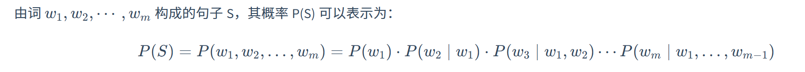

核心思想：近似地认为一个词的出现概率只与它前面出现的有限的 N-1 个词有关；在语料库中进行最大似然估计（MLE）计算即可（使用计数来估算概率）

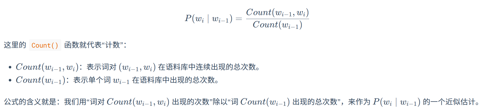

+ Bigram（N=2）：最基础，一个词的出现概率只与前一个有关；因此链式法则可以表示为：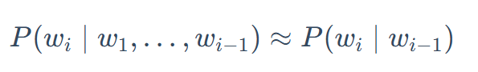
+ Trigram（N=3）：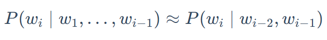

### 例：Bigram 模式下的句子出现概率
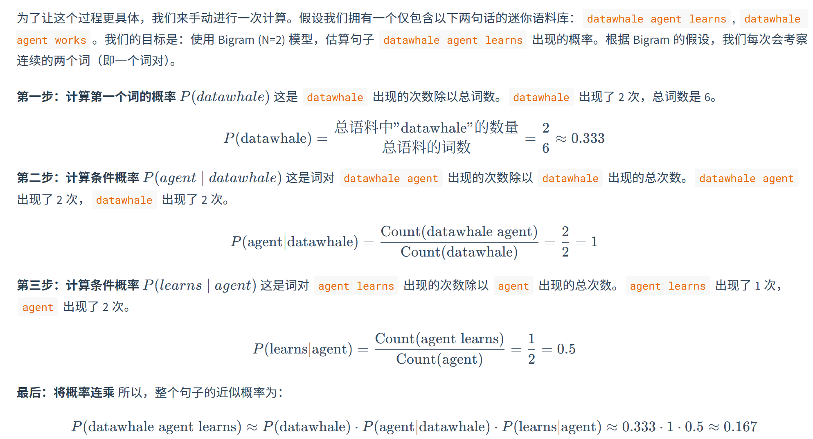

### 缺陷：
将词视为孤立的离散的信号

+ 数据具有稀疏性：如果一个词序列从未在语料库出现过，概率就为 0
+ 泛化能力差：无法做到理解词与词之类的相似性（`我是城市人` 即使出现过很多次，`俺是城里人`没出现过的话，概率仍为 0）

## 神经网络语言模型
### 前馈神经网络语言模型（Feedforward Neural Network，FNN）
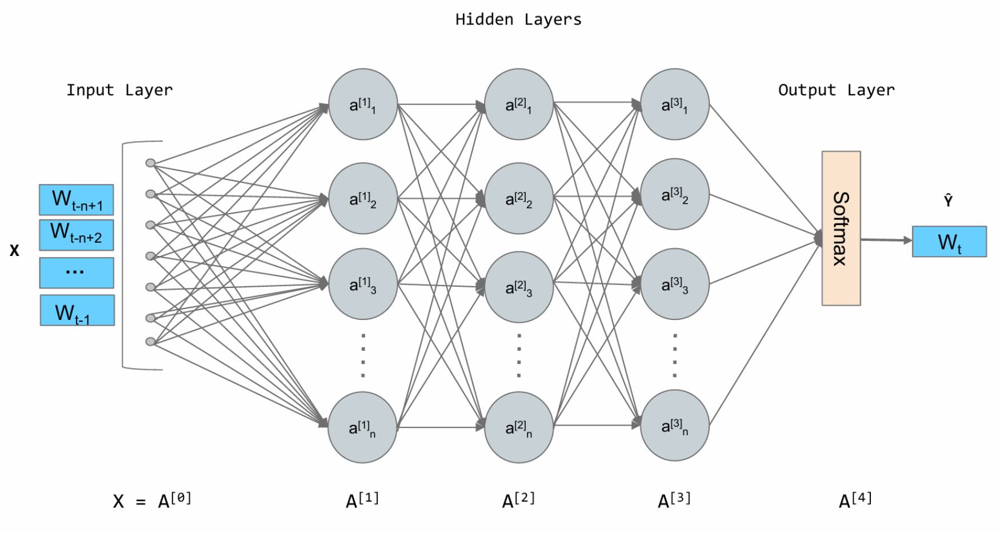

#### 核心思想：
+ 在训练过程中学习到的语义空间为一个高维的连续向量空间，词汇表的每一词都是空间中的一个点（一个向量）：词嵌入向量（Word Embedding），语义越相近的词对应的词嵌入向量在空间中位置就越相近
+ 利用神经网络强大的拟合能力来学习一个函数，其输入是前 N-1 个词的词嵌入向量，输出为词汇表中**每一个**词在当前情况下的概率分布
+ 词向量具有位置、方向等特性，使得其不仅能够捕捉同义的关系，还可以捕捉类比等复杂关系（使用余弦值来表示相似性：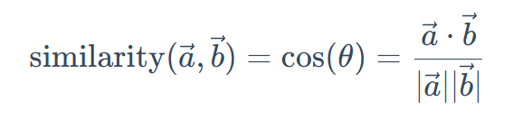）

> 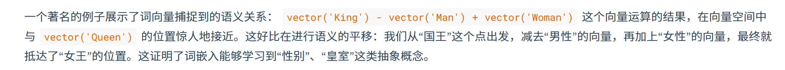
>

---

缺陷：只能考虑固定的前 N 个词

### 循环神经网络（Recurrent Neural Network, RNN）
> 循环神经网络 RNN 擅长顺序信息，用于文本序列处理
>
> 卷积神经网络 CNN 更擅长空间局部特征，用于图像处理
>

#### 核心思想：为神经网络增加记忆能力
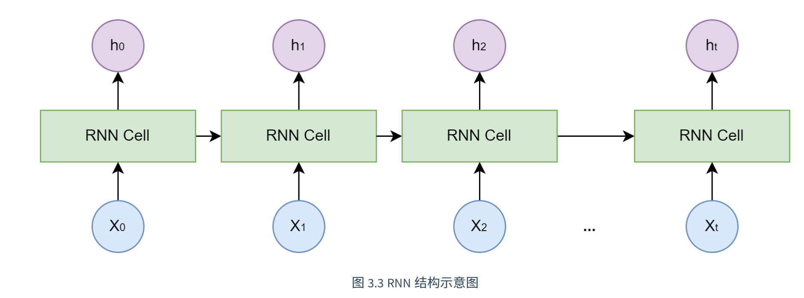

+ 引入一个隐藏状态向量，用作网络的短期记忆；每一步处理都会将输入词与上一刻的记忆（隐藏状态向量）相结合，生成输出和新的记忆传递给下一个节点

---

#### 严重缺陷：长期依赖问题
+ 序列较长时，早期信息在传递中会逐渐减弱
+ 而且在神经网络模型训练时，需要通过反向传播算法，根据输出的误差来调整网络的深处的权重，RNN 网络深度就是序列的长度，在反向传播中经过多次连乘会导致梯度消失（梯度值因连乘一个小的数趋近于 0）或者梯度爆炸（梯度值因连乘一个大的数变得极其大）

### 长短时记忆网络（Long Short-Term Memory, LSTM）
LSTM 是一种特殊的 RNN，增加了两个创新点：

+ 细胞状态（cell state）：独立于隐藏状态的一个信息通路，相当于一个长期的记忆状态
+ 一套门控机制（由小型神经网络组成）：
    - 遗忘门：决定从上一时刻的细胞状态中丢弃哪些信息
    - 输入门：决定将当前输入中的哪些新信息存入细胞状态
    - 输出门：决定根据当前的细胞状态，输出哪些信息到隐藏状态

## Transformer 架构
> 2017 年，Google 团队发表《Attention Is All You Need》，提出 Transformer
>

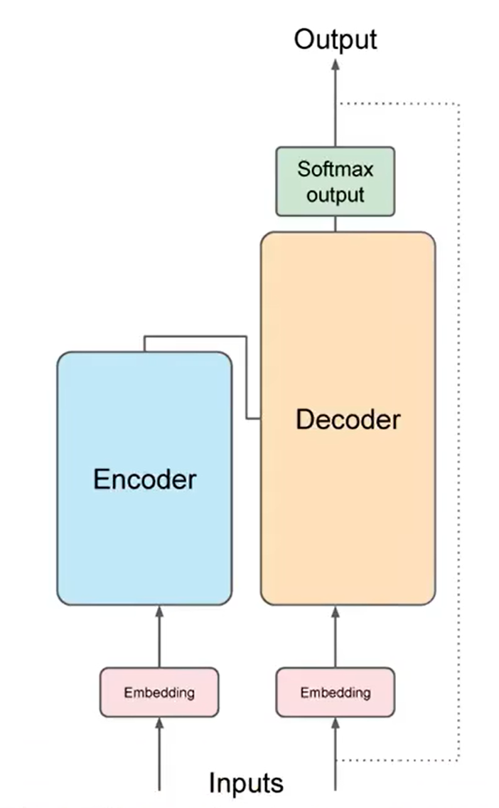

Transformer架构被分成两个独立的部分：**编码器、解码器**

> 单独用编码器或解码器也可作为架构的变体，应用于具体场景
>

+ 编码器的任务是“理解”输入的整个句子，编码器的输出是输入序列结构和含义的深层表达，会提供给解码器的**交叉注意力机制**，以影响目标序列的生成
+ 解码器的任务是“生成”目标句子，会根据一个输入的**序列开始Token**依次循环输出，每次输出一个**预测Token**，然后将输出Token再反馈到解码器输入中，开始新的下一个Token的预测，直到模型预测到**序列结束Token**，完成全部输出

### Tokenize 分词
#### 原因：
+ 模型是大规模的**统计计算模型**，实质真正处理的是**数字**

#### 作用原理：
+ 将单词转化为**数字（Token ID）**，每个数字代表字典中所有可能单词的位置

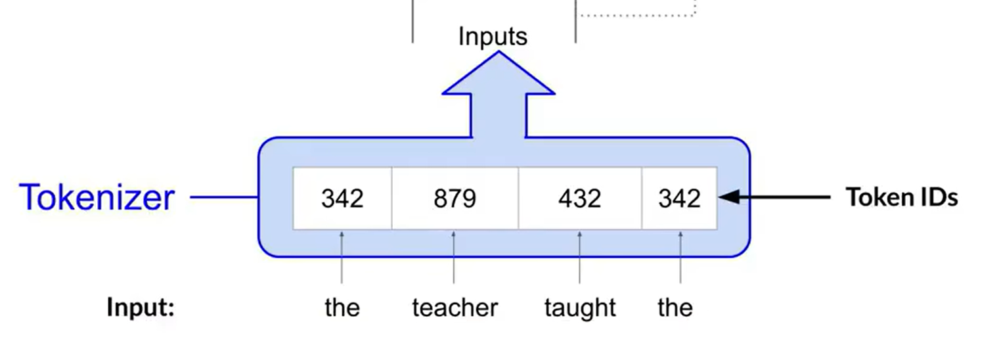

#### 分词器（tokenizer）：
+ 不同的分词器具有不同的分词方法，如用一个Token ID只是表示单词的一部分（见下图）。但一旦使用了一种分词器来训练模型，在生成文本时必须使用相同的分词器。

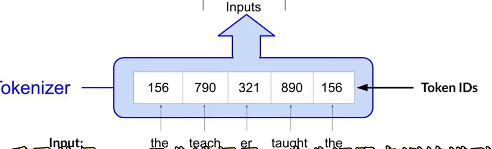

### embedding space 嵌入层
#### 作用原理：
        * 嵌入层是一个可训练的向量嵌入空间，在这里每个 Token 都会根据**嵌入矩阵**被映射为一个多维向量，并在该空间中占据特定的位置
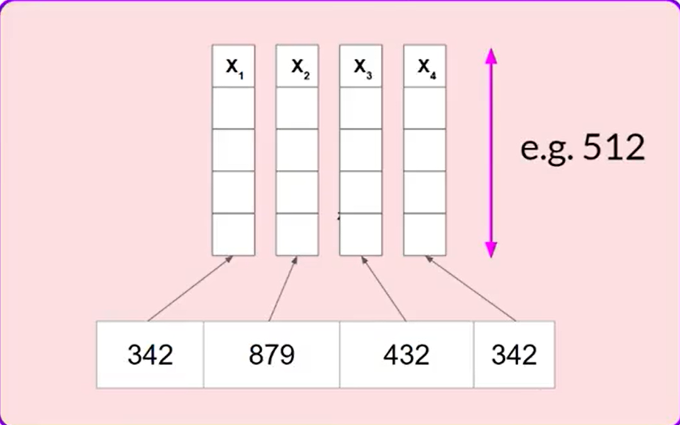

#### 嵌入矩阵：
+ 包含**Token ID** 与 其在多维空间中对应的**具体多维向量**
+ 嵌入矩阵是在模型训练中确定并优化的，开始训练时嵌入矩阵中的向量的值为**随机初始化**的，在训练过程中随着**反向传播算法**的执行而不断调整

        * 模型会根据Token对应向量之间的**距离、角度**等数据来确定Token之间关系的紧密程度，并以此来在数学角度上实现对自然语言的理解
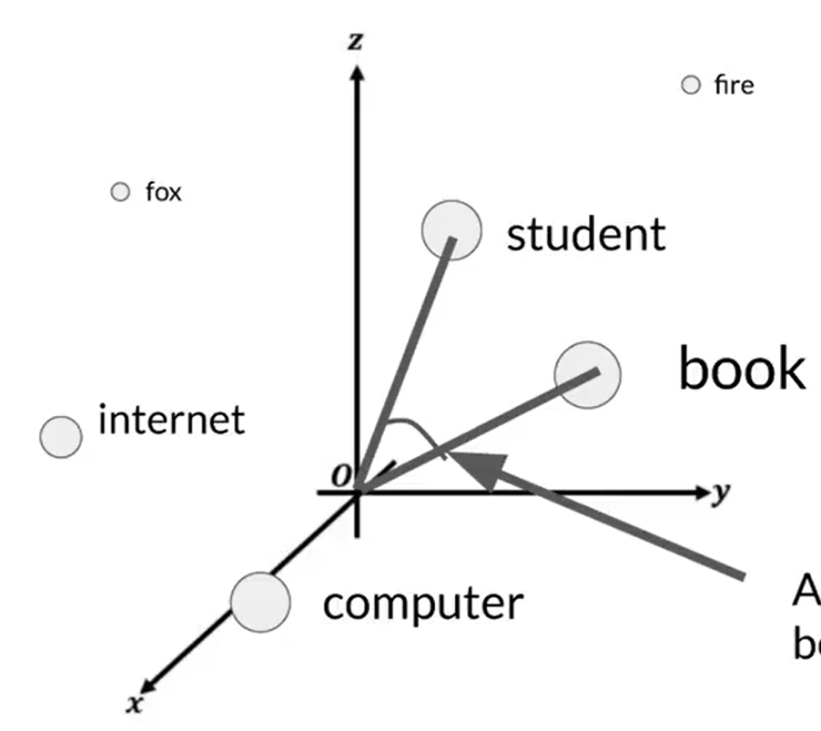

### Positional Encoding （位置编码）
+ 将Token 向量添加到编码器和解码器之前，需要给其添加位置编码

#### 作用：
+ 通过添加位置编码，保留单词在句子中的**位置顺序关系（绝对位置&相对位置）**

#### 步骤原理：
+ 为Token向量添加位置编码，其形式也是**向量**，维度与Token向量一致，原文使用弦函数生成：

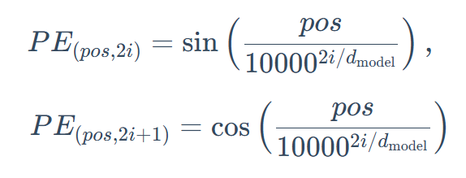

+ 将**位置编码向量**与**Token向量**求和，作为**自注意力层**的输入
$ Input=Token Embedding+Positional Encoding $

### self-attention layer（自注意层）

#### 作用：
> 想象一下我们阅读这个句子：“The agent learns because **it** is intelligent.”。当我们读到加粗的 "**it**" 时，为了理解它的指代，我们的大脑会不自觉地将更多的注意力放在前面的 "agent" 这个词上。**自注意力 (Self-Attention)** 机制就是对这种现象的数学建模
>

在训练中学习到的**注意力权重**存储在自注意力层中，注意力权重反映了**任何一个Token对于其他任何一个Token的重要性**，通过学习输入序列中Token之间的注意力权重，模型能够更好地关注输入序列各个Token之间的依赖关系

####  单头注意力计算：Query、Key、Value
自注意力机制中， 每个 Token 的向量会经过三个不同的可训练矩阵（$ W^Q、W^K、W^V $），生成三个向量：

+ 查询向量 (Query, Q)：代表当前 Token 想寻找什么信息
+ 键向量 (Key, K)：代表当前 Token 可以通过什么特征被查询匹配
+ 值向量 (Value, V)：代表当前 Token 实际携带的信息

---

自注意力权重计算过程（计算一个 Token 的新向量表示为例）：

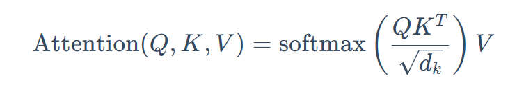

1. 将当前 Token 的 Q 与全部 Token 的 K 相运算比较，得分表示了其他词对于当前词的重要性
2. 将得到的分数稳定化与归一化
3. 加权求和：将上一步得到的每个 Token 的分数乘其 V，最终相加得到的向量就是该 Token融合了全局上下文信息后的新表示

#### 多头自注意力机制（multi-headed self-attention）：
+ 多组自注意力机制将 Q、K、V 划分为多个部分，各个部分被多个注意力头分别**并行且独立**地学习，每个注意力头对于输入语言学到的关系方面都是不一样的角度
+ 自注意力层中自**注意力头的数量**因模型而异
+ 自注意力层的输出是通过一个线性变换进行整合的多头自注意力输出向量，作为输入传递给FNN层

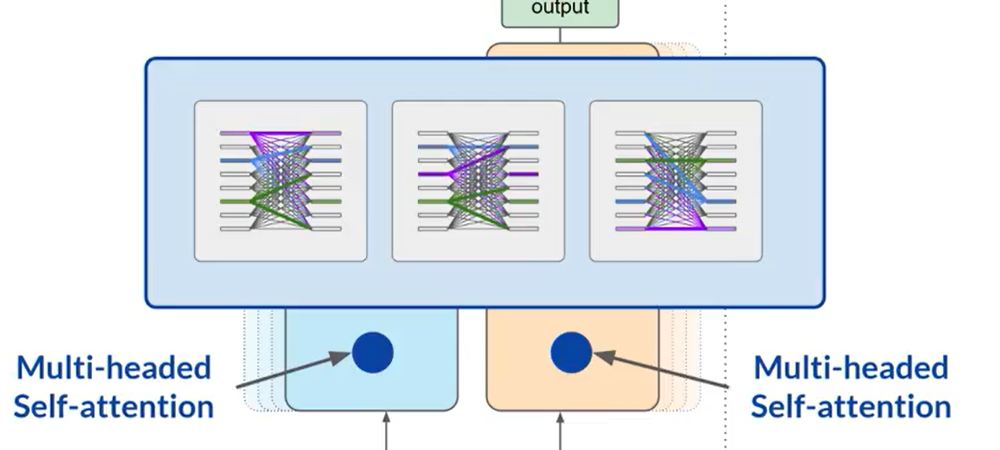
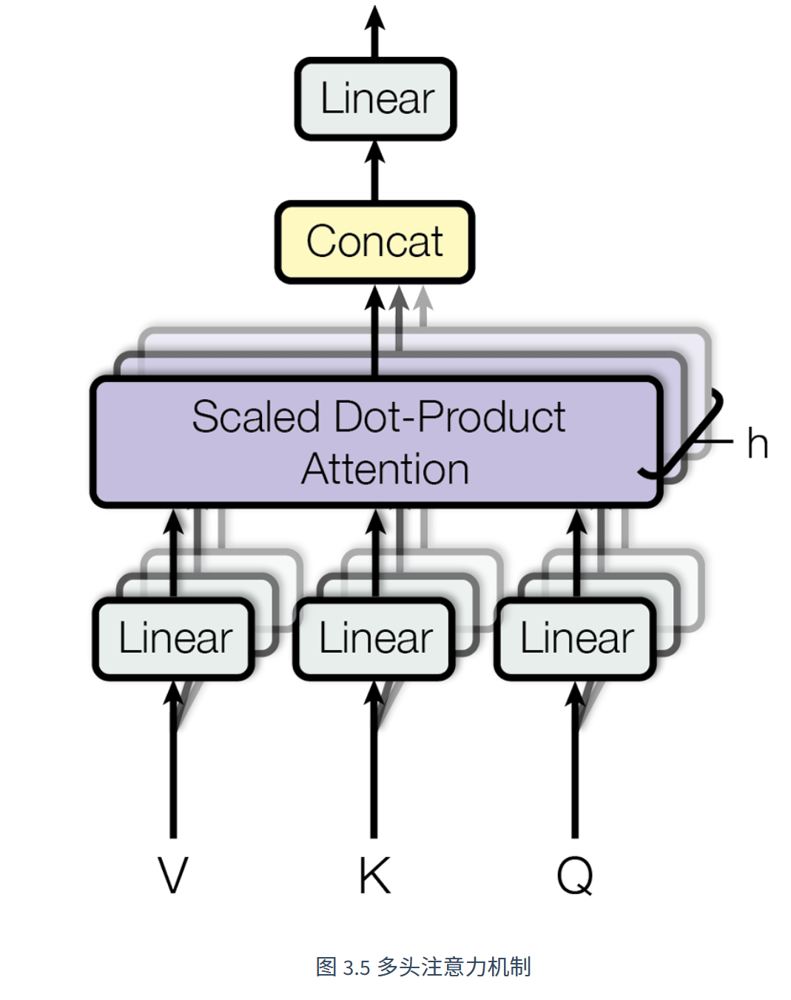

### feed-forward network（前馈神经网络，FFN）
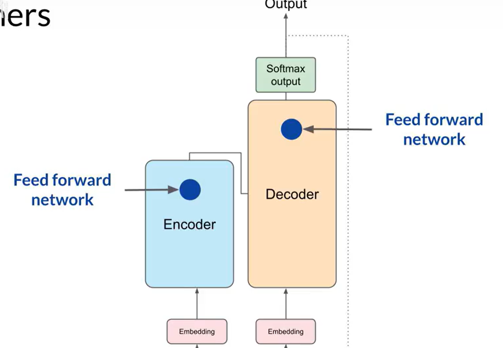

#### 作用：
对于Token 向量进行进一步的**非线性变换**，聚合信息，进一步提取和加工特征

通常结构为：先扩大维度，经过激活函数后缩小回原维度，输出新的隐藏向量

### Add & Norm 层（残差连接与层归一化）
在 Transformer 的每个编码器和解码器层中，所有子模块（如多头注意力和前馈网络）都被一个 `Add & Norm` 操作包裹； Transformer 每经过一个模块，都做“Add 保留原信息 + Norm 整理数值”  作用是保证 Transformer 的稳定训练能力

+ **残差连接（Add）**：将 Transformer 每一个模块的输入都直接加到输出上去，既保留了原始信息，又加入了新学到的信息

$ Output=x+Sublayer(x) $

    - 这样即使某一层加工得不好，原始信息也不会完全丢失；同时，反向传播时梯度可以通过这条快捷通道向前传，缓解梯度消失的问题
+ **层归一化（Norm）：**用于整理数值，将数值调整到更稳定的范围，让训练更稳定

### Softmax layer
#### 作用：
+ Softmax layer是架构的**输出层**

#### 原理：
+ 将Token的最终向量表示归一化为每个单词的概率分数
+ 输出中包括词汇表中所有单词的概率分数， 解码策略再从中选择下一个 Token；大部分模型选择最大概率的词作为预测结果进行输出**（greedy decoding 贪婪解码）**，也可以进行随机采样

## Decoder-Only 架构
### 基本概念
1. Decoder-Only 是 Transformer 架构的一种变体，取消了 Encoder，只以 Decoder 为基础的结构构建模型，在 Decoder 中既理解输入，又同时理解模型输出

> 原始 Transformer 架构的 Decoder 具有两种注意力：
>
> 1. 掩码注意力：关注已经生成的前文
> 2. 交叉注意力：关注 Encoder 的输出
>
> Decoder-Only 就是去掉了编码器，取消了交叉注意力机制
>

### 自回归生成 Autoregressive Generation
 Decoder-Only 通过自回归方式生成文本，其主要过程为：

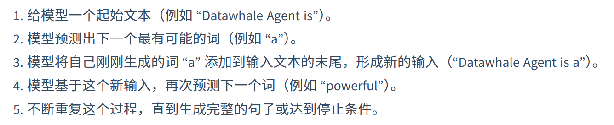

### 掩码自注意力机制
为确保 Decoder-Only 模型在训练时拿到完整文本的情况下，学习预测下一词的时候不偷看答案，整个架构最核心的掩码自注意力机制发挥了作用：

1. 在自注意力机制计算出注意力分数矩阵（即每个词对其他所有词的关注度得分）之后，进行 Softmax 归一化处理之前，模型会应用一个因果掩码，将当前位置词之后的词的分数全部替换为一个极大负数
2. 经过 Softmax 函数时，这些极大负数的位置概率会变成 0，相当于对当前预测完的全部词都不相关
3. 模型便不会去关注当前词后面的信息

### 优势
+ 训练目标统一：核心任务只为根据已有的预测下一个词
+ 结构简单，易于拓展
+ 自回归工作模式适合生成类任务

## MoE 架构
（见单独笔记）

<!-- learning-journey:update-history:start -->
## 更新记录

| 日期 | 类型 | 说明 |
| --- | --- | --- |
| 2026-08-04 | 首次发布 | 从语雀整理第三章第一节，记录语言模型从 N-gram、神经网络到 Transformer 与 Decoder-Only 的发展 |
<!-- learning-journey:update-history:end -->
