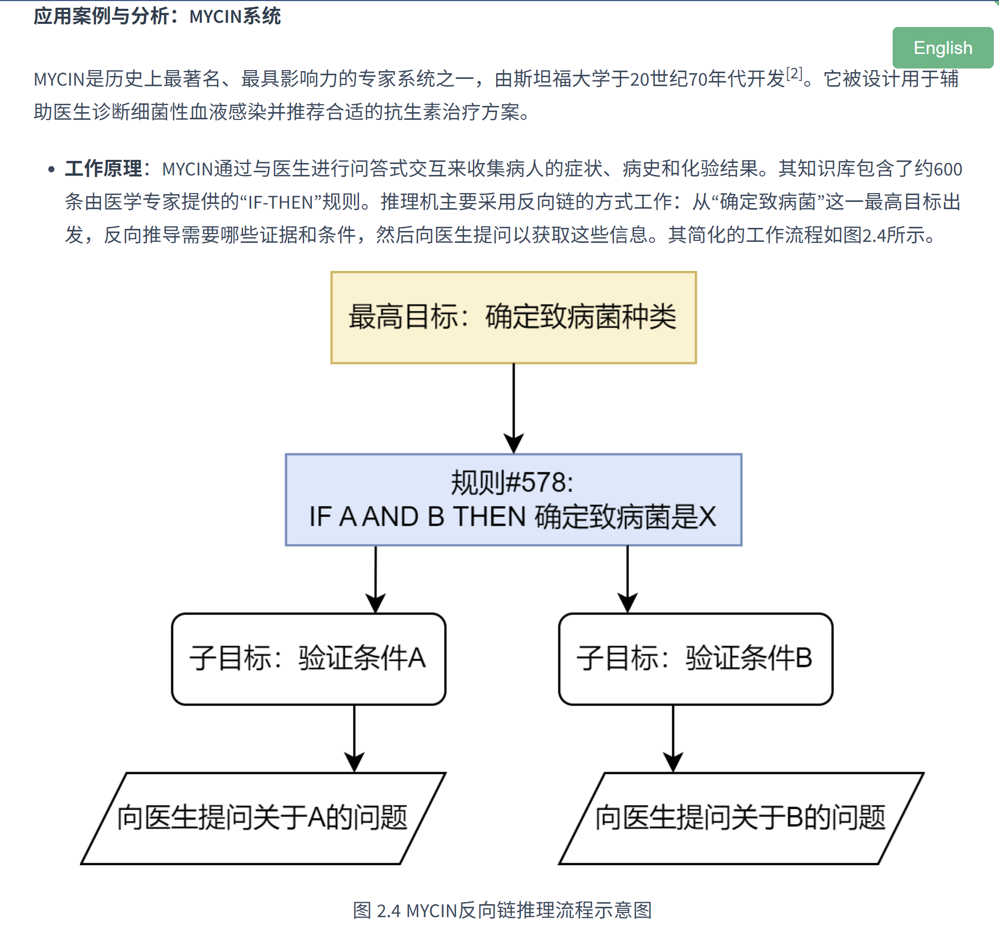
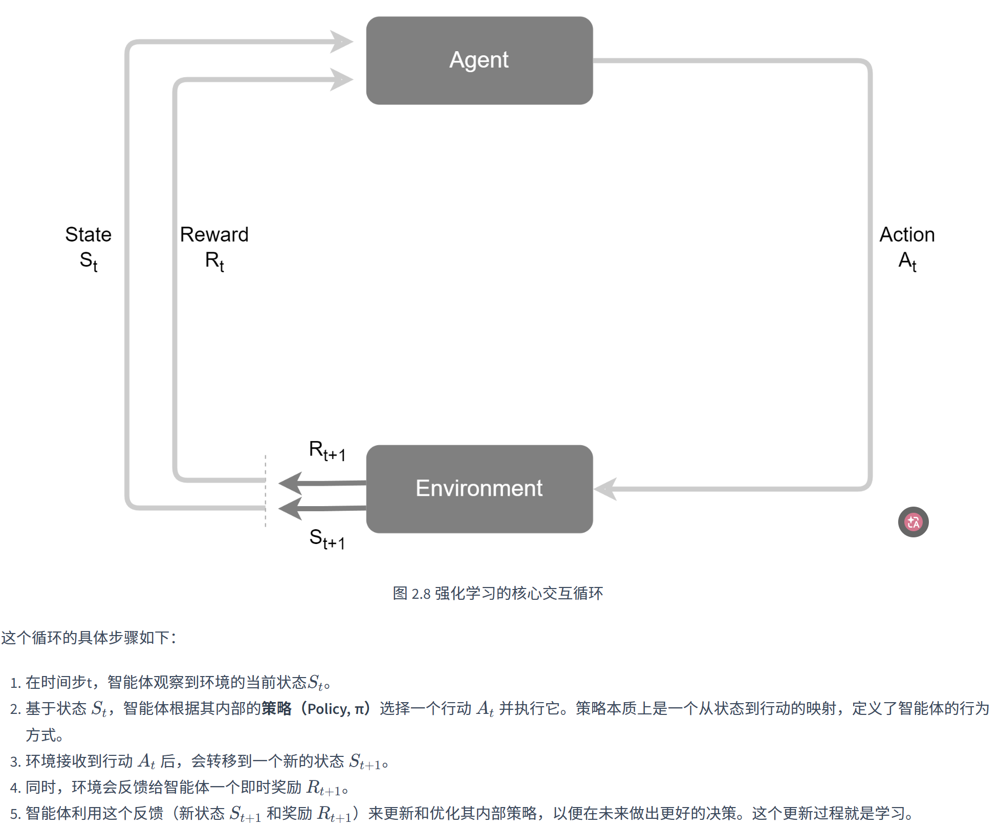
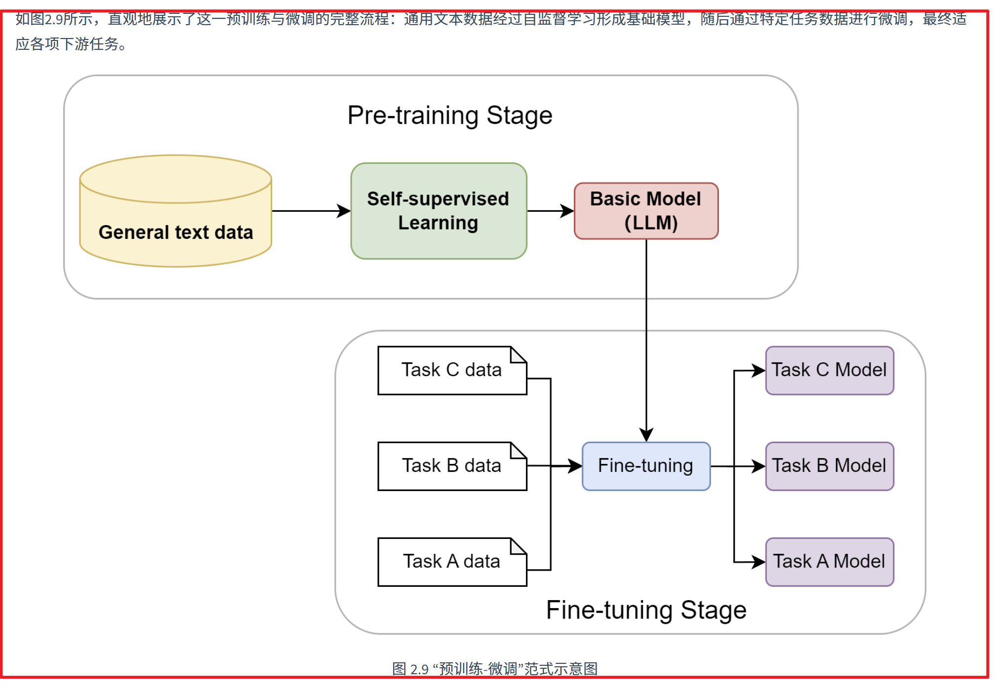

# 第二章：智能体发展史

## 第一阶段：符号主义的探索
+ 符号主义（Symbolicism）是人工智能的第一个重要范式，又被称为 逻辑 AI、传统 AI
+ 当时人们相信人类的全部智能都能被形式化的符号体系所实现（if……，then……）；因此这个时代的智能体是由设计者预先使用规则硬编码实现的，而非自主学习，**其核心是基于一套明确规则的物理符号系统**，并不具有真正的“智能”

### 重要成就：专家系统（Expert System）
+ 基于知识库（大量 if-then 规则）与推理机（匹配规则，推导结论）实现的专用领域辅助智能体

### 局限
知识库由人工编写大量规则、现实世界鲁棒性差，覆盖性窄

## 第二阶段：心智社会的启发式思考
+ 直接针对符号主义用一种统一的表示和推理机制来解决所有问题的弊端，提出不应把多样化的心智活动强行塞入一个僵化的逻辑框架中，由此衍生出了心智社会

### 机构 Agency
在心智社会的理论框架中，智能体不是传统意义上的智能体，而是一个极其简单基础的心智过程，比如 SEE Agent、FIND Agent 等；多个智能体组织起来构成一个机构 Agency，旨在完成一个完整的目标

### 关键概念：涌现 Emergence
核心思想： 系统整体表现出了某种复杂能力，但组成系统的任何一个局部都没有单独拥有这种能力，而是由许多简单的部分共同作用最终表现出来的

> 找到高效路线 不是某一只蚂蚁的能力，而是蚁群整体涌现出的能力
>

> 一个水分子没有“湿润”这种宏观感觉；大量水分子组合后，水才表现出湿润、流动等整体性质
>

### 对现代 DAI 与 MAS 的启发
心智社会的思想为分布式人工智能（DAI）和多智能体系统（MAS）提供了概念基础，研究焦点从如何构建一个全能的单一智能体转向了如何设计一个高效协作的智能体群体；启发了：分布式、涌现式计算、社会性等特性研究

## 第三阶段：人工智能的学习时代
### 联结主义（Connectionism）
+ 对于符号主义的直接否认
+ 模仿人类大脑的神经网络构建，具有以下特点
    - 知识**分布式存储**，以权重的形式表现在神经元的连接之间，**隐式展现**

    - **极其简单的处理单元：神经元**；只负责接收“接收加权输入-激活函数处理-输出”
    - **根据学习算法自动调整权重**

### 行为主义（强化学习）
+ 联结主义解决了感知能力、而强化学习则注重于决策能力，具有以下核心要素
    - **智能体 Agent**
    - **环境 Environment**
    - **状态 State，S**
    - **行动 Action，A**
    - **奖励 Reward，R**

+ 智能体的核心目标在于持续最大化长期积累 Reward；在不断的探索反馈中优化自身策略，智能体真正地具备了“远见”（可能会为了更大的长期利益牺牲即时利益）

### 模型预训练 Pre-training 与微调 Fine-tuning
+ 使得 Agent 在学习之前，就具备了一定对世界的理解，由此模型从特定任务开始转向通用模型
+ **<u>核心思想：预训练+微调</u>**
    - **预训练阶段**：对海量数据语料进行自监督学习，训练一个超大规模的，具有通用能力的神经网络模型
    - **微调阶段：**针对特定的下游任务，进行少量标注数据的微调，使模型更好地适应任务

+ **大语言模型阶段的涌现**：当模型规模跨过某个阈值后，展现出显式训练之外能力：上下文学习、思维链推理等

---

## 第四阶段：基于 LLM 的智能体
至此，符号主义提供了逻辑推理的框架，联结主义和强化学习提供了学习与决策的能力，而大型语言模型则提供了前所未有的、通过预训练获得的世界知识和通用推理能力，共同推动了现代 LLM-Agent 的诞生与发展

现代 LLM 智能体的基本概念、构成与运行机制详见第一章：

[第一章：智能体基础与 Agent Loop](2026-07-23-第一章：智能体基础与Agent-Loop.md)

<!-- learning-journey:update-history:start -->
## 更新记录

| 日期 | 类型 | 说明 |
| --- | --- | --- |
| 2026-07-28 | 首次发布 | 从语雀整理智能体从符号主义、心智社会到 LLM 智能体的发展脉络 |
<!-- learning-journey:update-history:end -->
